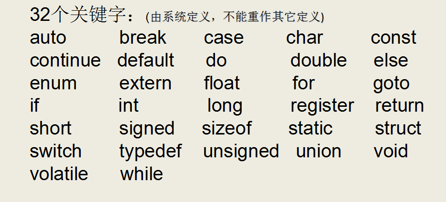
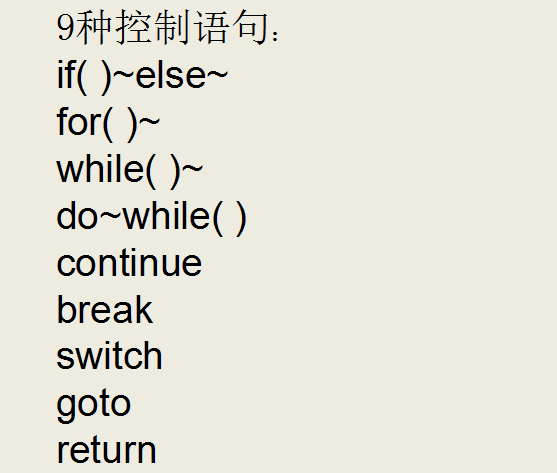

### C语言应用领域

C语言的应用极其广泛，从网站后台，到底层操作系统，从多媒体应用到大型网络游戏，均可使用C语言来开发：

- C语言可以写网站后台程序
- C语言可以专门针对某个主题写出功能强大的程序库
- C语言可以写出大型游戏的引擎
- C语言可以写出另一个语言来
- C语言可以写操作系统和驱动程序，并且只能用C语言编写
- 任何设备只要配置了微处理器，就都支持C语言。从微波炉到手机，都是由C语言技术来推动的


### C语言的简洁

C语言仅有32个关键字，9种控制语句，34种运算符，却能完成无数的功能






### C语言标准

- ANSI/ISO C 标准，通常叫 C89 或 C90 标准，ANSI 美国国家标准协会
- C99 标准
- C11 标准

### 通过gcc编译C代码

#### gcc编译器介绍

编辑器(如vi、记事本)是指我用它来写程序的（编辑代码），而我们写的代码语句，电脑是不懂的，我们需要把它转成电脑能懂的语句，编译器就是这样的转化工具。就是说，我们用编辑器编写程序，由编译器编译后才可以运行！

编译器是将易于编写、阅读和维护的高级计算机语言翻译为计算机能解读、运行的低级机器语言的程序。

gcc（GNU Compiler Collection，GNU 编译器套件），是由 GNU 开发的编程语言编译器。gcc原本作为GNU操作系统的官方编译器，现已被大多数类Unix操作系统（如Linux、BSD、Mac OS X等）采纳为标准的编译器，gcc同样适用于微软的Windows。

gcc最初用于编译C语言，随着项目的发展gcc已经成为了能够编译C、C++、Java、Ada、fortran、Object C、Object C++、Go语言的编译器大家族。

#### 编译命令格式
```
gcc [-option1] ... <filename>
g++ [-option1] ... <filename>
```

- 命令、选项和源文件之间使用空格分隔
- 一行命令中可以有零个、一个或多个选项
- 文件名可以包含文件的绝对路径，也可以使用相对路径
- 如果命令中不包含输出可执行文件的文件名，可执行文件的文件名会自动生成一个默认名，Linux平台为a.out，Windows平台为a.exe

#### gcc、g++编译常用选项说明

| 选项      | 含义              |
| ------- | --------------- |
| -o file | 指定生成的输出文件名为file |
| -E      | 只进行预处理          |
| -S(大写)  | 只进行预处理和编译       |
| -c(小写)  | 只进行预处理、编译和汇编    |

#### Linux平台下编译代码


- gcc warning的意思是警告，是有问题，但不影响编译
- error是错误，如果遇到error，那么就不能编译了

### 注意事项

Linux编译后的可执行程序只能在Linux运行，Windows编译后的程序只能在Windows下运行。

64位的Linux编译后的程序只能在64位Linux下运行，32位Linux编译后的程序只能在32位的Linux运行。

64位的Windows编译后的程序只能在64位Windows下运行，32位Windows编译后的程序可以在64位的Windows运行。

### C语言编译过程

#### C程序编译步骤

C代码编译成可执行程序经过4步：

1）预处理：宏定义展开、头文件展开、条件编译等，同时将代码中的注释删除，这里并不会检查语法
2）编译：检查语法，将预处理后文件编译生成汇编文件
3）汇编：将汇编文件生成目标文件(二进制文件)
4）链接：C语言写的程序是需要依赖各种库的，所以编译之后还需要把库链接到最终的可执行程序中去


#### gcc编译过程

分步编译

```
预处理：gcc -E hello.c -o hello.i
编  译：gcc -S hello.i -o hello.s
汇  编：gcc -c hello.s -o hello.o
链  接：gcc    hello.o -o hello_elf
```

| 选项      | 含义               |
| ------- | ---------------- |
| -E      | 只进行预处理           |
| -S(大写)  | 只进行预处理和编译        |
| -c(小写)  | 只进行预处理、编译和汇编     |
| -o file | 指定生成的输出文件名为 file |

| 文件后缀 | 含义           |
| ---- | ------------ |
| .c   | C 语言文件       |
| .i   | 预处理后的 C 语言文件 |
| .s   | 编译后的汇编文件     |
| .o   | 编译后的目标文件     |


一步编译

```bash
# 还是经过：预处理、编译、汇编、链接的过程
gcc hello.c -o demo
```


#### 查找程序所依赖的动态库

1）Linux平台下，ldd(“l”为字母) 可执行程序


2）Windows平台下，需要相应软件(Depends.exe)


### C/C++与Java的区别

- C/C++可以在栈上分配内存
- 内存管理的不同：Java语言是自动管理内存，C/C++堆区申请的内存需要手动管理（malloc/free，new/delete）
- C/C++有指针，Java没有；C++有引用，C语言没有
- C++可以重载运算符，C和Java不可以
- C语言是面向过程的编程语言，C++和Java是面向对象的编程语言
- C/C++语言偏底层，偏硬件，Java偏上层。要想熟悉整个架构，必须熟悉C/C++和Java等语言。
- C语言存在很多“灰色地带”，C编译器的语法检查没有C++那么严格
- C语言中的const是个冒牌货，可以通过指针修改const修饰的变量
- C语言的目标是高效，最终程序执行效率的高效
- C/C++中用回调函数（函数指针）实现类似Java中的接口回调的功能
- C/C++通过汇编实现反射机制较难（提供了友元），Java因为.java文件会编译成.class字节码文件，可以较容易的实现反射机制（AOP）