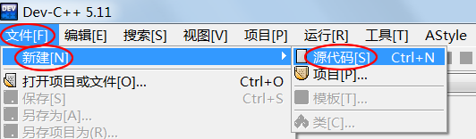
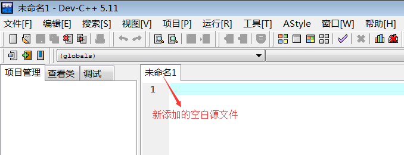
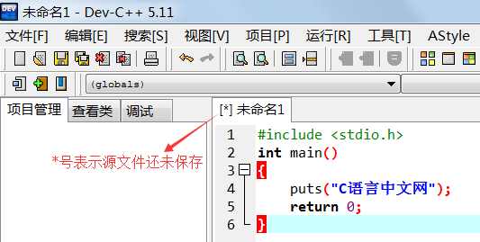
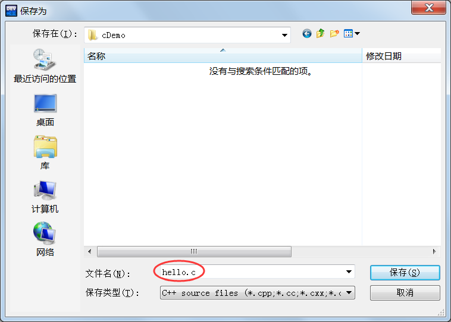
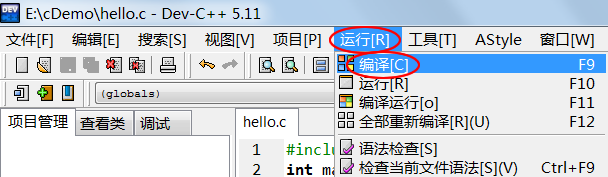
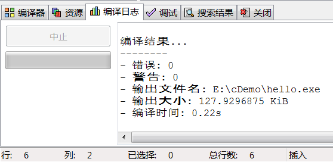
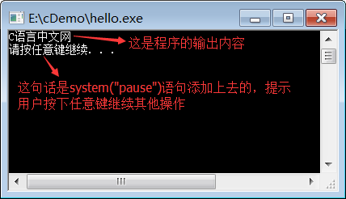
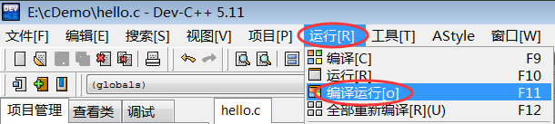
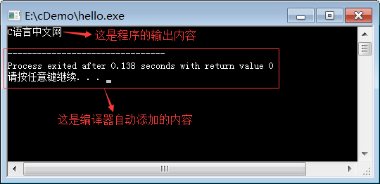

前面我们给出了一段完整的C语言代码，就是在显示器上输出“C语言中文网”，如下所示：

```c
#include <stdio.h>
int main()
{
    puts("C语言中文网");
    return 0;
}
```

本节我们就来看看如何通过 Dev C++ 来运行这段代码。

Dev C++ 支持单个源文件的编译，如果你的程序只有一个源文件（初学者基本都是在单个源文件下编写代码），那么不用创建项目，直接运行就可以；如果有多个源文件，才需要创建项目。1) 新建源文件打开 Dev C++，在上方菜单栏中选择“文件 --> 新建 --> 源代码”：



或者按下`Ctrl+N`组合键，都会新建一个空白的源文件，如下图所示：



在空白文件中输入本文开头的代码：



在上方菜单栏中选择“文件 --> 保存”，或者按下`Ctrl+S`组合键，都可以保存源文件。



注意将源文件后缀改为`.c`。

小小的提示：C++是在C语言的基础上进行的扩展，C++已经包含了C语言的全部内容，所以大部分 IDE 默认创建的是C++文件。但是这并不影响使用，我们在填写源文件名称时把后缀改为`.c`即可，编译器会根据源文件的后缀来判断代码的种类。上图中，我们将源文件命名为`hello.c`。2) 生成可执行程序在上方菜单栏中选择“运行 --> 编译”，就可以完成 hello.c 源文件的编译工作。



或者直接按下`F9`键，也能够完成编译工作，这样更加便捷。

如果代码没有错误，会在下方的“编译日志”窗口中看到编译成功的提示：



编译完成后，打开源文件所在的目录（本教程中是 E:\cDemo\），会看到多了一个名为`hello.exe`的文件，这就是最终生成的可执行文件。

之所以没有看到目标文件，是因为 Dev C++ 将编译和链接这两个步骤合二为一了，将它们统称为“编译”，并且在链接完成后删除了目标文件，所以我们看不到。

双击 hello.exe 运行，并没有输出“C语言中文网”几个字，而是会看到一个黑色窗口一闪而过。这是因为，程序输出“C语言中文网”后就运行结束了，窗口会自动关闭，时间非常短暂，所以看不到输出结果，只能看到一个“黑影”。

对上面的代码稍作修改，让程序输出“C语言中文网”后暂停下来：

```c
#include <stdio.h>
#include <stdlib.h>
int main()
{
    puts("C语言中文网");
    system("pause");
    return 0;
}
```

`system("pause");`语句的作用就是让程序暂停一下。注意代码开头部分还添加了`#include <stdlib.h>`语句，否则`system("pause");`无效。

再次编译，运行生成的 hello.exe，终于如愿以偿，看到输出结果了，如下图所示：



按下键盘上的任意一个键，程序就会关闭。更加快捷的方式实际开发中我们一般使用菜单中的“编译 --> 编译运行”选项：



或者直接按下`F11`键，这样能够一键完成“编译 --> 链接 --> 运行”的全过程，不用再到文件夹中找到可执行程序再运行。这样做的另外一个好处是，编译器会让程序自动暂停，我们也不用再添加`system("pause");`语句了。

删除上面代码中的`system("pause");`语句，按下F11键再次运行程序，结果如下：



4) 总结现在，你就可以将 hello.exe 分享给你的朋友了，告诉他们这是你编写的第一个C语言程序。虽然这个程序非常简单，但是你已经越过了第一道障碍，学会了如何编写代码，如何将代码生成可执行程序，这是一个完整的体验。

在本教程的基础部分，教大家编写的程序都是这样的“黑窗口”，与我们平时使用的软件不同，它们没有漂亮的界面，没有复杂的功能，只能看到一些文字，这就是控制台程序（Console Application），它与DOS非常相似，早期的计算机程序都是这样的。

控制台程序虽然看起来枯燥无趣，但是它非常简单，适合入门，能够让大家学会编程的基本知识；只有夯实基本功，才能开发出健壮的GUI（Graphical User Interface，图形用户界面）程序，也就是带界面的程序。