前面我们给出了一段完整的C语言代码，就是在显示器上输出“C语言中文网”，如下所示：

```c
#include <stdio.h>

int main(){    
    puts("C语言中文网");    
    return 0;
}
```

本节我们就来看看如何通过 VS2015 来运行这段代码。 

1) 创建项目（Project）在 VS2015 下开发程序首先要创建项目，不同类型的程序对应不同类型的项目，初学者应该从控制台程序学起。

打开 VS2015，在上方菜单栏中选择“文件 --> 新建 --> 项目”：

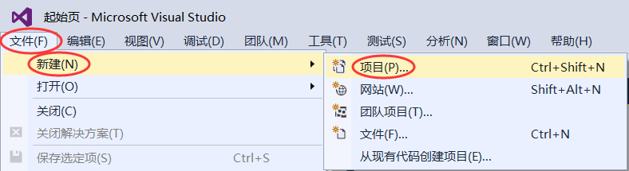

或者按下`Ctrl+Shift+N`组合键，都会弹出下面的对话框：

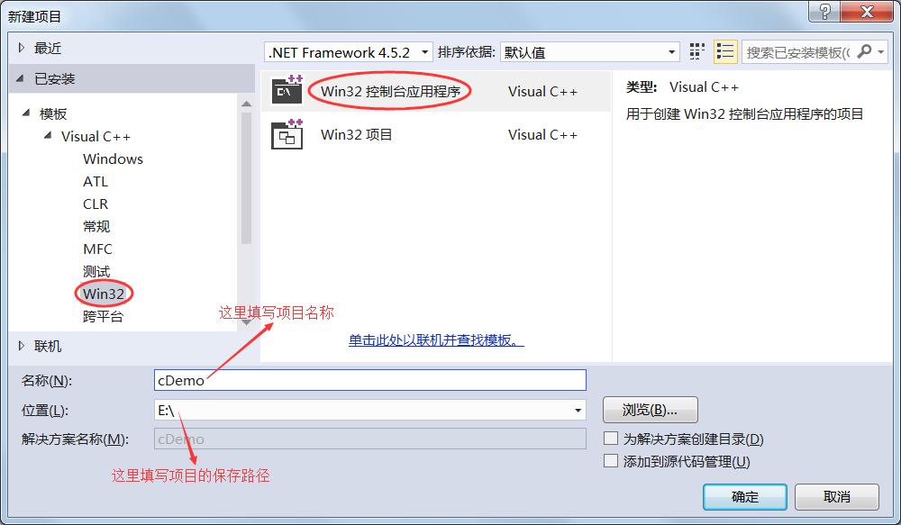

选择“Win32控制台应用程序”，填写好项目名称，选择好存储路径，点击“确定”按钮即可。

如果你安装的是英文版的 VS2015，那么对应的项目类型是“Win32 Console Application”。另外还要注意，项目名称和存储路径最好不要包含中文。

点击“确定”按钮后会弹出向导对话框：

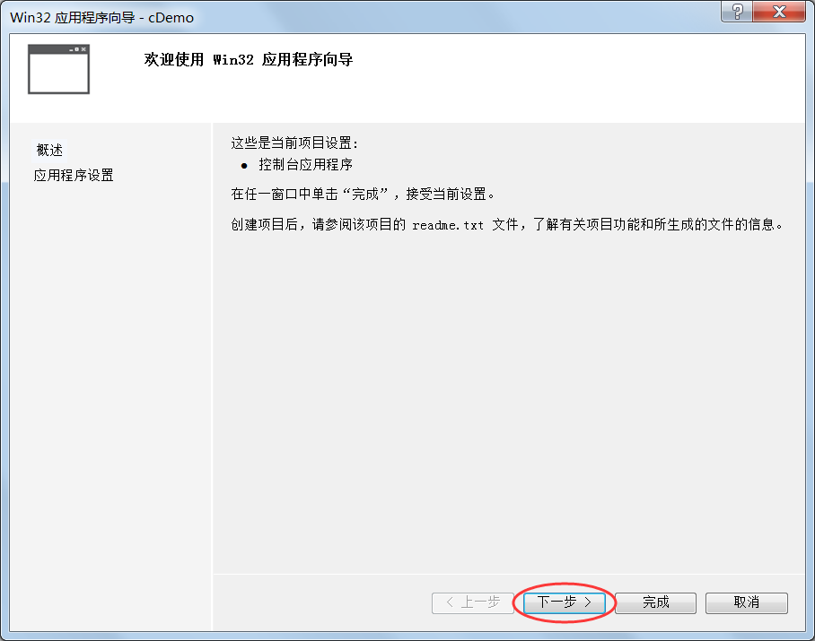

点击“下一步”按钮，弹出新的对话框：

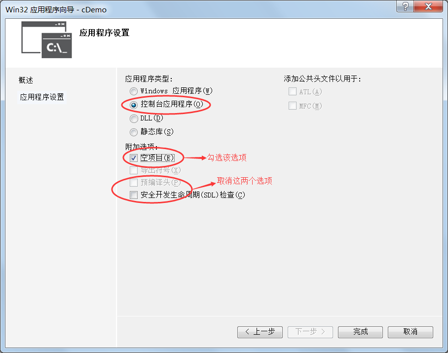

先取消“预编译头”和“安全开发生命周期检查”这两个选项，再勾选“空项目”，然后点击“完成”按钮就创建了一个新的项目。

感兴趣的读者可以打开 E 盘，会发现多了一个cDemo文件夹，这就是整个项目所在的文件夹。

2) 添加源文件在“源文件”处右击鼠标，在弹出菜单中选择“添加 -> 新建项”，如下图所示：

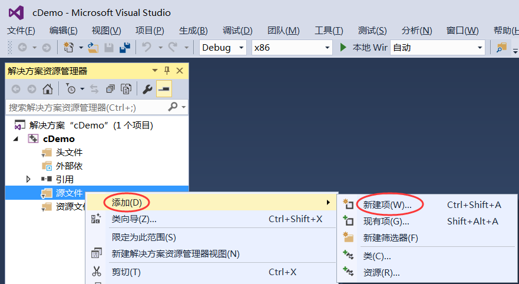

或者按下`Ctrl+Shift+A`组合键，都会弹出添加源文件的对话框。如下图所示：

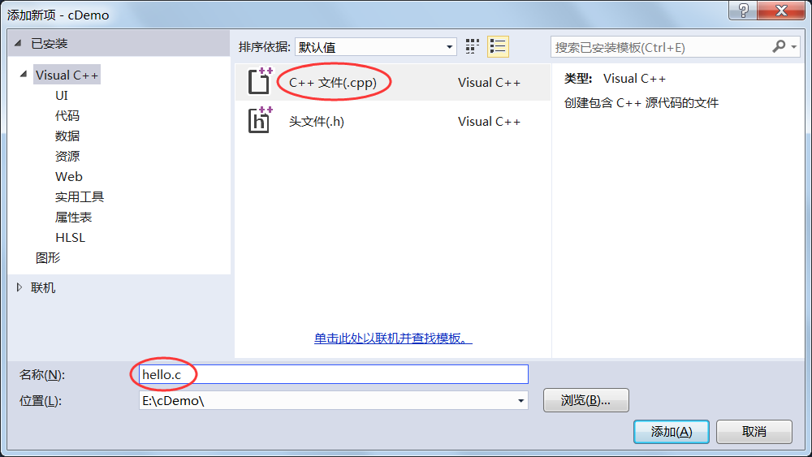

在“代码”分类中选择C++文件(.cpp)，填写文件名，点击“添加”按钮就添加了一个新的源文件。

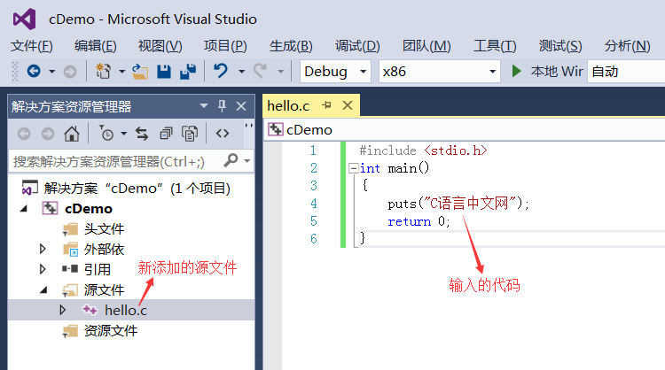

小小的提示：C++是在C语言的基础上进行的扩展，C++已经包含了C语言的所有内容，所以大部分的 IDE 只有创建C++文件的选项，没有创建C语言文件的选项。但是这并不影响使用，我们在填写源文件名称时把后缀改为`.c`即可，编译器会根据源文件的后缀来判断代码的种类。上图中，我们将源文件命名为`hello.c`。

3) 编写代码并生成程序打开 hello.c，将本节开头的代码输入到 hello.c 中，上图是输入完成以后的效果。注意：虽然可以将整段代码复制到编辑器，但是我还是强烈建议你手动输入，我敢保证你第一次输入代码会有各种各样的错误，只有把这些错误都纠正了，你才会进步。本教程后续章节还会给出很多示例代码，这些代码一定要手动输入，不要复制后运行成功了就万事大吉。编译（Compile）在上方菜单栏中选择“生成 --> 编译”，就完成了 hello.c 源文件的编译工作。

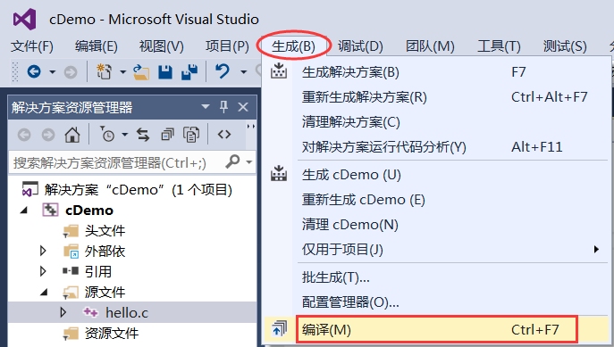

或者直接按下`Ctrl+F7`组合键，也能够完成编译工作，这样更加便捷。

如果代码没有错误，会在下方的“输出窗口”中看到编译成功的提示：

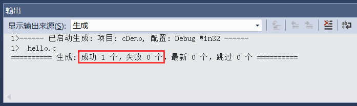

编译完成后，打开项目目录（本教程中是 E:\cDemo\）下的 Debug 文件夹，会看到一个名为`hello.obj`的文件，这就是经过编译产生的中间文件，这种中间文件的专业称呼是目标文件（Object File）。在 VS 和 VC 下，目标文件的后缀都是`.obj`。链接（Link）在菜单栏中选择“项目 --> 仅用于项目 --> 仅链接 cDemo”，就完成了 hello.obj 的链接工作，如下图所示：

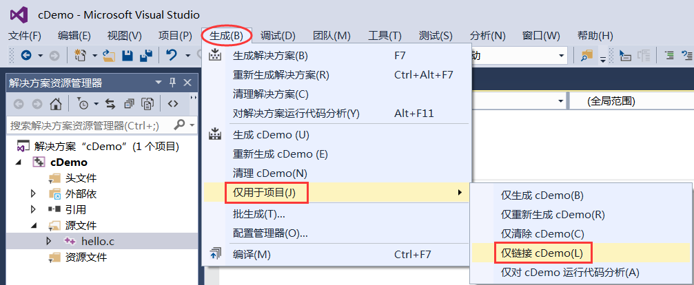

如果代码没有错误，会在下方的“输出窗口”中看到链接成功的提示：


本项目中只有一个目标文件，链接的作用是将 hello.obj 和系统组件（专业讲是静态链接库）结合起来，形成可执行文件。如果有多个目标文件，这些目标文件之间还要相互结合。再次打开项目目录（本教程中是 E:\cDemo\）下的 Debug 文件夹，会看到一个名为`cDemo.exe`的文件，这就是最终生成的可执行文件，就是我们想要的结果。

双击 cDemo.exe 运行，并没有输出“C语言中文网”几个字，而是会看到一个黑色窗口一闪而过。这是因为，程序输出“C语言中文网”后就运行结束了，窗口会自动关闭，时间非常短暂，所以看不到输出结果，只能看到一个“黑影”。

对上面的代码稍作修改，让程序输出“C语言中文网”后暂停下来：

```c
#include <stdio.h>
#include <stdlib.h>
int main(){    
    puts("C语言中文网");    
    system("pause");    
    return 0;
}
system("pause");
```
语句的作用就是让程序暂停一下。注意代码开头部分还添加了`#include <stdlib.h>`语句，否则`system("pause");`无效。

再次编译并链接，运行生成的 cDemo.exe，终于如愿以偿，看到输出结果了，如下图所示：

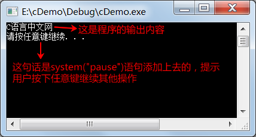

按下键盘上的任意一个键，程序就会关闭。更加快捷的办法我们把上面的步骤总结一下，可以发现一个完整的编程过程是：编写源文件：这是编程的主要工作，我们要保证代码的语法100%正确，不能有任何差错；编译：将源文件转换为目标文件；链接：将目标文件和系统库组合在一起，转换为可执行文件；运行：可以检验代码的正确性。

不过 VS 提供了一种更加快捷的方式，可以一键完成编译、链接、运行三个动作，点击菜单栏中的“运行”按钮，或者按下`F5`键就能做到这一点。

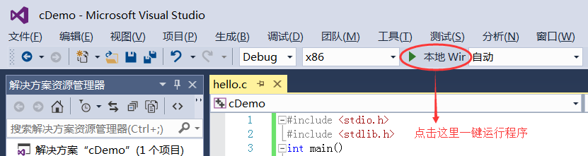

还有更实用的技巧如果我们的代码中没有添加`system("pause");`暂停语句，点击“运行”按钮，或者按下`F5`键后程序依然会一闪而过，只能看到一个“黑影”。

如果想让程序自动暂停，可以按下`Ctrl+F5`组合键，这样程序就不会一闪而过了；换句话说，按下`Ctrl+F5`键，VS 会自动在程序的最后添加暂停语句。

现在我们已经了解了从编写代码到生成程序的整个过程，在以后的学习中，可以直接使用`Ctrl+F5`组合键了，不用再分步骤完成了，这样会更加方便和实用。

4) 总结现在，你就可以将 cDemo.exe 分享给你的朋友了，告诉他们这是你编写的第一个C语言程序。虽然这个程序非常简单，但是你已经越过了第一道障碍，学会了如何编写代码，如何将代码生成可执行程序，这是一个完整的体验。

在本教程的基础部分，教大家编写的程序都是这样的“黑窗口”，与我们平时使用的软件不同，它们没有漂亮的界面，没有复杂的功能，只能看到一些文字，这就是控制台程序（Console Application），它与DOS非常相似，早期的计算机程序都是这样的。

控制台程序虽然看起来枯燥无趣，但是它非常简单，适合入门，能够让大家学会编程的基本知识；只有夯实基本功，才能开发出健壮的GUI（Graphical User Interface，图形用户界面）程序，也就是带界面的程序。