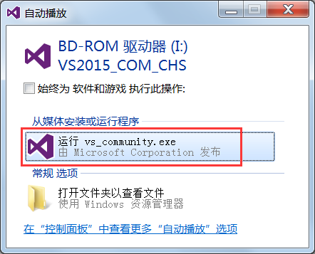
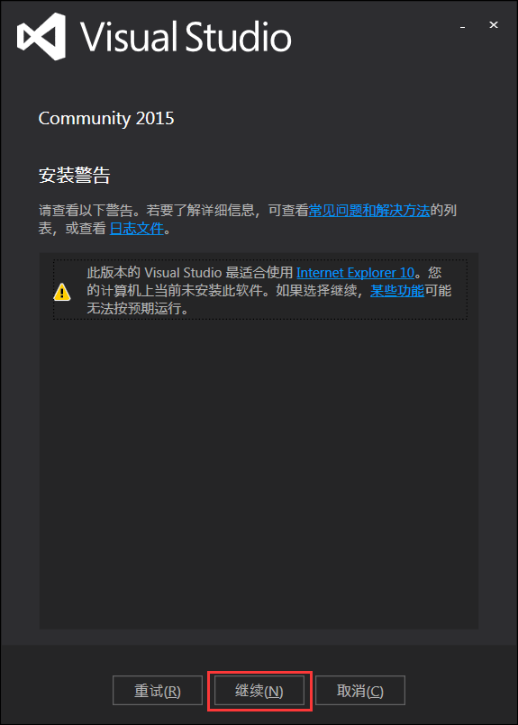
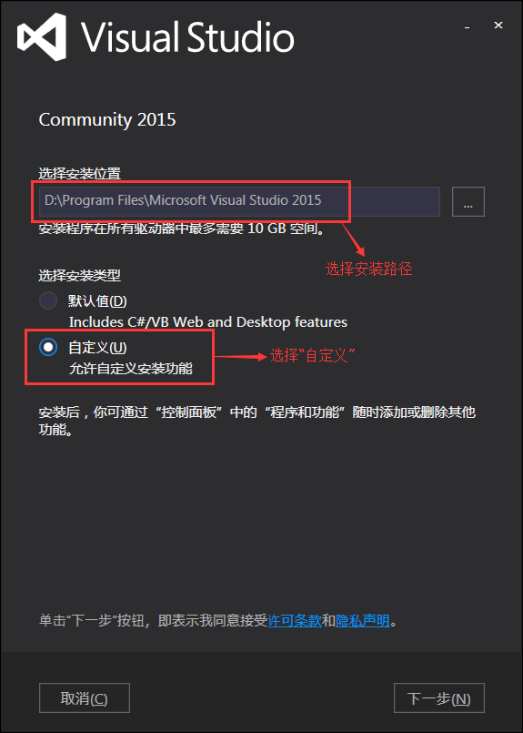
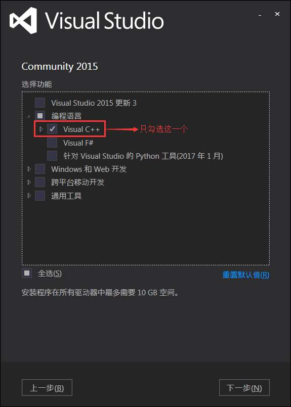
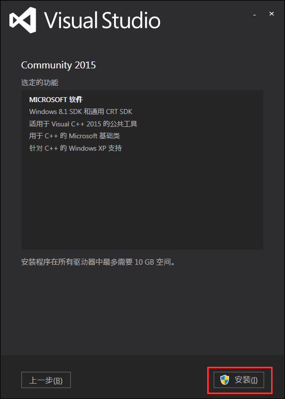
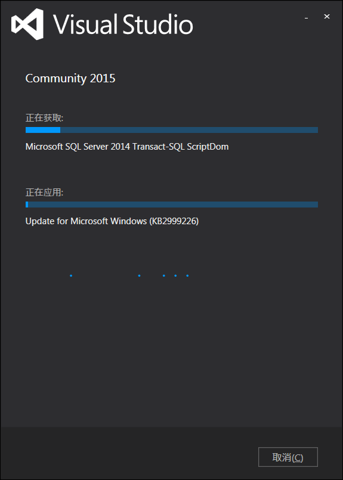
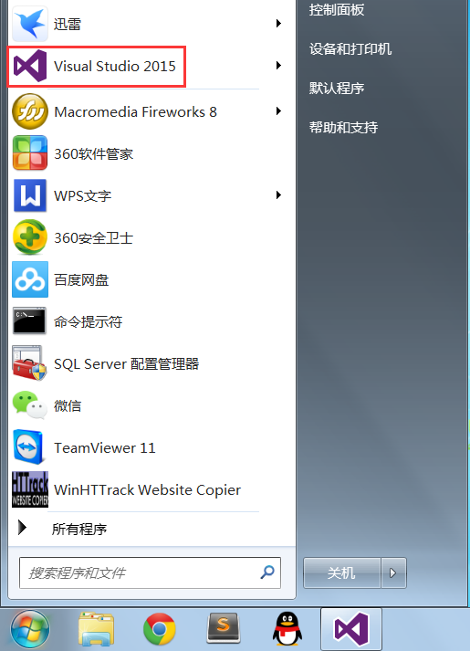
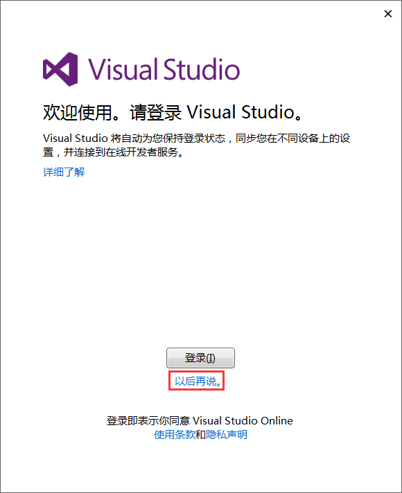
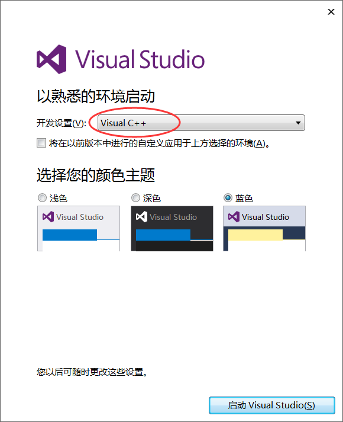

为了更好地支持 Win10 程序的开发，微软发布了 VS2015。VS2015 支持开发人员编写跨平台的应用程序，从 Windows 到 Mac、Linux、甚至是编写 iOS 和 Android 代码！

VS2015 共有三个版本，分别是：社区版（Community）：免费提供给单个开发人员、 开放源代码项目、科研、教育以及小型专业团队！大部分程序员（包括初学者）可以无任何经济负担、合法地使用 VS2015 了。专业版（Professional）：售价 1199 美元。企业版（Enterprise）：售价 5599 美元。

对于大部分程序开发，这三个版本的区别不大，免费的社区版一样可以满足需求，所以我推荐大家使用社区版，既省去了破解的麻烦，也尊重微软的版权。

虚拟光驱的安装正版的 VS 安装程序是刻录在光盘里面的，我们从互联网上下载的都是`.iso`格式的镜像文件。所谓镜像文件，就是将光盘上的全部内容复制到电脑上后形成的文件。镜像文件不能直接打开，需要借助虚拟光驱才能使用。

虚拟光驱软件用来模拟真实的光盘驱动，用虚拟光驱打开镜像文件，就相当于把光盘插入到电脑中。

常见的虚拟光驱软件有很多，这里我们推荐使用 DVDFab，它是一款国人开发的、简单易用的、免费的虚拟光驱。

DVDFab 下载地址：官网下载地址为：http://zh.dvdfab.cn/download.htm?trackID=navmenu

百度网盘下载地址：https://pan.baidu.com/s/1kVRyk8R  提取密码：2eap

DVDFab 的安装非常简单，这里不再赘述，大家只需要注意一点，安装过程中 Windows 安全中心会发出警告，询问我们是否确定安装，如下图所示：

毋庸置疑，选择“安装”即可。下载VS2015VS2015 社区版（Community）

下载地址：[迅雷下载（较快）](ed2k://|file|cn_visual_studio_community2015x86dvd6847368.iso|4013920256|EB7F6605EDE67509E218E29173AC6574|/)

百度网盘（较慢）：[http://pan.baidu.com/s/1nuClygp](http://pan.baidu.com/s/1nuClygp)    提取密码：377q

以上是 Visual Studio 2015 Community 简体中文版下载地址。VS2015 比较大，有 3.73GB，建议用迅雷下载。安装 VS2015VS2015 下载完成后会得到一个镜像文件（.iso 文件），双击该文件即可开始安装。提示：必须安装虚拟光驱才能打开该镜像文件。1) 双击镜像文件后会弹出如下的对话框

选择“运行 vs_community.exe”即可进入安装程序。

2) 开始安装后，会出现等待界面（可能需要几分钟）。

3) 初始化安装程序

4) 如果你的计算机配置不恰当，VS 安装程序会给出警告。

出现该警告是由于我的电脑没有安装 IE10。忽略该警告，点击“继续”按钮。

5) 接下来选择安装位置以及安装方式

这里我将 VS2015 安装在 D:\Program Files\ 目录下，你也可以安装在别的目录。

VS2015 除了支持 C/C++ 开发，还支持 C#、F#、VB 等其他语言，我们没必要安装所有的组件，只需要安装与 C/C++ 相关的组件即可，所以这里选择“自定义”。

6) 选择要安装的组件

我们不需要 VS2015 的全部组件，只需要与 C/C++ 相关的组件，所以这里只选择了“Visual C++”，将其它用不到的组件全部取消勾选了。

点击“下一步”按钮，弹出如下的确认对话框：

点击“安装”按钮开始安装。

7) 接下来进入漫长的等待过程，可能需要半个小时左右。

安装完成后，VS2015 会要求重启计算机。嗯，那就重启吧。

8) 重启完成后，打开“开始菜单”，发现多了一个叫“Visual Studio 2015”的图标，就证明安装成功了。

设置 VS2015首次使用 VS2015 还需要简单的配置，主要包括开发环境和主题风格。

启动 VS2015，会提示登录：

如果你不希望登录，可以点击“以后再说”。

接下来选择环境配置：

我们将使用 VS2015 进行 C/C++ 程序开发，所以选择“Visual C++”这个选项。至于颜色主题，大家自己看着办。

等待几分钟的准备过程，VS2015 就启动成功了。

