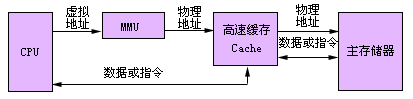
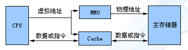

## 三级存储系统

- cache-主存
- 主存-磁盘
- cache-主存-磁盘

### 物理地址Cache存储系统

当CPU要访问存储器时，给出一个虚拟地址。由存储管理部件（MMU：Memory Managent Unit）中的地址变换部件把CPU发出的虚拟地址变换成主存物理地址。然后用主存物理地址访问Cache。如果要访问的数据或指令在Cache被找到，则Cache命中，否则，发出Cache块失效，用这个物理地址访问主存储器，取出一块数据或指令装入Cache，同时，也把CPU所需要的数据或指令送往CPU。

### 虚拟地址Cache存储系统

当CPU要访问存储器时，把虚拟地址直接送往存储管理部件MMU和Cache。Cache能够直接接受虚拟地址的访问，把CPU所需要的数据或指令找出来。如果Cache发生块失效，则用经过MMU变换得到的主存物理地址访问主存储器，把读出的一块数据或指令装入到Cache中。同时，也把CPU所需要的数据或指令送入CPU。如Intel公司的i860等处理机采用这种组织方式。

##  存储器

按存储元件分类

- 半导体存储器
- 磁性材料存储器：磁盘和磁带
- 光介质存储器：光盘

按存取方式分类

- 随机存储器RAM（Random Access Memory）
- 只读存储器ROM