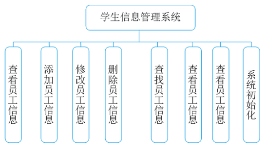

## 系统功能设计



## 代码实现

```c
#include<stdio.h>
#include<stdlib.h>
#include<conio.h>
#include<dos.h>
#include<string.h>
#define LEN sizeof(struct student)
#define FORMAT "%-8d%-15s%-12.1lf%-12.1lf%-12.1lf%-12.1lf\n"
#define DATA stu[i].num,stu[i].name,stu[i].elec,stu[i].expe,stu[i].requ,stu[i].sum

struct student//定义学生成绩结构体
{ 
	int num;		//学号
  	char name[15];	//姓名
  	double elec;	//选修课
  	double expe;	//实验课
  	double requ;	//必修课
  	double sum;		//总分
};

struct student stu[50];	//定义结构体数组
void in();				//录入学生成绩信息
void show();			//显示学生信息
void order();			//按总分排序
void del();				//删除学生成绩信息
void modify();			//修改学生成绩信息
void menu();			//主菜单
void insert();			//插入学生信息
void total();			//计算总人数
void search();			//查找学生信息

void main()				//主函数
{ 
	system("color f0\n");	//白底黑字
	int n;
  	menu();
  	scanf("%d",&n);//输入选择功能的编号
  	while(n)
  	{ 
	  	switch(n)
     	{ 
		 	case 1: in();break;
       		case 2: search();break;
       		case 3: del();break;
       		case 4: modify();break;
       		case 5: insert();break;
       		case 6: order();break;
       		case 7: total();break;
	   		case 8: show();break;
       		default:break;
     	}
    getch();
    menu();//执行完功能再次显示菜单界面
    scanf("%d",&n);
  	}
}

void in()//录入学生信息
{ 
	int i,m=0;//m是记录的条数
  	char ch[2];
  	FILE *fp;//定义文件指针
  	if((fp=fopen("data.txt","a+"))==NULL)//打开指定文件
  	{ 
	  	printf("文件不存在！\n");
	  	return;
  	}
  	while(!feof(fp))
  	{
	  	if(fread(&stu[m] ,LEN,1,fp)==1)
	  	{
		  	m++;//统计当前记录条数
		}
  	}
  	fclose(fp);
  	if(m==0)
  	{
	  	printf("文件中没有记录!\n");
	}
  	else
  	{	  	
        show();//调用show函数，显示原有信息
  	}
  	if((fp=fopen("data.txt","wb"))==NULL)
  	{
	  	printf("文件不存在！\n");
	  	return;
 	 }

  	printf("输入学生信息(y/n):");
  	scanf("%s",ch);
	while(strcmp(ch,"Y")==0||strcmp(ch,"y")==0)//判断是否要录入新信息
	{
    	printf("number:");
		scanf("%d",&stu[m].num);//输入学生学号
    	for(i=0;i<m;i++)
	    	if(stu[i].num==stu[m].num)
	    	{
	   			printf("number已经存在了，按任意键继续!");
	    		getch();
	    		fclose(fp);
	    		return;
	    	}
     	printf("name:");
	 	scanf("%s",stu[m].name);//输入学生姓名
     	printf("elective:");
    	scanf("%lf",&stu[m].elec);//输入选修课成绩
     	printf("experiment:");
	 	scanf("%lf",&stu[m].expe);//输入实验课成绩
     	printf("required course:");
	 	scanf("%lf",&stu[m].requ);//输入必修课成绩
     	stu[m].sum=stu[m].elec+stu[m].expe+stu[m].requ;//计算出总成绩
     	if(fwrite(&stu[m],LEN,1,fp)!=1)//将新录入的信息写入指定的磁盘文件
     	{
		 	printf("不能保存!");
		 	getch();
	 	}
     	else
	 	{
		 	printf("%s 被保存!\n",stu[m].name);
		 	m++;
	 	}
     	printf("继续?(y/n):");//询问是否继续
     	scanf("%s",ch);
  	}
  	fclose(fp);
  	printf("OK!\n");
}

void show()	//增加data.txt文件不存在或者文件内容为空时的显示 
 { 
	FILE *fp;
  	int i,m=0;
  	fp=fopen("data.txt","rb");
  	 
//  	if((fp=fopen("data.txt","a+"))==NULL)//打开指定文件
//  	{ 
//	  	printf("文件不存在！\n");
//	  	return;
//  	}
//  	fclose(fp);
//  	if(m==0)
//	  	printf("文件中没有记录!\n");
//		return;	  	
  	while(!feof(fp))
  	{
  		if(fread(&stu[m] ,LEN,1,fp)==1) 
   		m++;
   	}  
   	fclose(fp);
   	printf("number name elective experiment required sum\t\n");
   	for(i=0;i<m;i++)
    { 
	   printf(FORMAT,DATA);//将信息按指定格式打印
    }
}
 
void menu()//自定义函数实现菜单功能
{
  	system("cls");
  	printf("\n\n\n\n");
  	printf("\t\t|---------------学生信息管理系统---------------|\n");
  	printf("\t\t|\t\t\t\t\t       |\n");
  	printf("\t\t|\t\t 1. 录入学生信息\t       |\n");
  	printf("\t\t|\t\t 2. 查找学生信息\t       |\n");
  	printf("\t\t|\t\t 3. 删除学生信息\t       |\n");
  	printf("\t\t|\t\t 4. 修改学生信息\t       |\n");
 	printf("\t\t|\t\t 5. 插入学生信息\t       |\n");
 	printf("\t\t|\t\t 6. 排序\t\t       |\n");
  	printf("\t\t|\t\t 7. 统计学生总数\t       |\n");
  	printf("\t\t|\t\t 8. 显示所有学生信息\t       |\n");
    printf("\t\t|\t\t 0. 退出系统\t\t       |\n");
    printf("\t\t|\t\t\t\t\t       |\n");
  	printf("\t\t|----------------------------------------------|\n\n");
  	printf("\t\t\t请选择(0-8):");
}

void order()//自定义排序函数
{ 
	FILE *fp;
  	struct student t;
  	int i=0,j=0,m=0;
  	if((fp=fopen("data.txt","r+"))==NULL)
    { 
		printf("文件不存在！\n");
        return;
  	}
  	while(!feof(fp)) 
 	if(fread(&stu[m] ,LEN,1,fp)==1) 
	  	m++;
  	fclose(fp);
  	if(m==0) 
  	{
	  	printf("文件中没有记录!\n");
	  	return;
  	}
  	if((fp=fopen("data.txt","wb"))==NULL)
    {
	  	printf("文件不存在！\n");
	  	return;
	}
  	for(i=0;i<m-1;i++)
      for(j=i+1;j<m;j++)//双重循环实现成绩比较并交换
        if(stu[i].sum<stu[j].sum)
        { 
		  	t=stu[i];
          	stu[i]=stu[j];
          	stu[j]=t;
		}
	if((fp=fopen("data.txt","wb"))==NULL)
    { 
		printf("文件不存在！\n");
		return;
	}
  	for(i=0;i<m;i++)//将重新排好序的内容重新写入指定的磁盘文件中
      	if(fwrite(&stu[i] ,LEN,1,fp)!=1)
       	{ 
        	printf("%s 不能保存文件!\n"); 
        	getch();
      	}
  	fclose(fp);
  	printf("保存成功\n");
}

void del()//自定义删除函数   
/*
逻辑：首先判断data.txt文件是否存在，
如果存在，继续操作，判断文件是否为空，不为空，则输入要删除的学生学号；
如果文件不存在，返回“文件不存在”，文件内容为空则返回“文件中没有记录”
输入学号----判断是否有这个学号。
有：询问是否删除，y删除；n不删除 ，“找到了记录，选择不删除！” 
没有：“没有找到这名学生!” 
*/ 
{	
	FILE *fp;
  	int snum,i,j,m=0;
  	char ch[2];
  	if((fp=fopen("data.txt","r+"))==NULL)	//data.txt文件不存在 
    { 
		printf("文件不存在！\n");
		return;
	}
  	while(!feof(fp))  if(fread(&stu[m],LEN,1,fp)==1) m++;
  	fclose(fp);
  	if(m==0) 
  	{
	  	printf("文件中没有记录！\n");//data.txt文件存在，但里面没有内容 
	  	return;
  	}
  
  	printf("请输入学生学号");
  	scanf("%d",&snum); 
    for(i=0;i<m;i++)        	
	 	if(snum==stu[i].num)
	   	{		   
     		printf("找到了这条记录，是否删除?(y/n)");
     		scanf("%s",ch);
      		if(strcmp(ch,"Y")==0||strcmp(ch,"y")==0)//判断是否要进行删除
      		{
	  			for(j=i;j<m;j++)
	      		stu[j]=stu[j+1];//将后一个记录移到前一个记录的位置
	       		m--;//记录的总个数减1
      			if((fp=fopen("data.txt","wb"))==NULL)
     			{ 
				 	printf("文件不存在\n");
					return;
				}
  				for(j=0;j<m;j++)//将更改后的记录重新写入指定的磁盘文件中
      			if(fwrite(&stu[j] ,LEN,1,fp)!=1)
       			{ 
				   	printf("can not save!\n");
      				getch();
				}
  				fclose(fp);
  				printf("删除成功!\n");
      		}else{
      			printf("找到了记录，选择不删除！"); 
	  		}
  				break;
  		}
		else
		{
		  	printf("没有找到这名学生!\n");//未找到要查找的信息  
		}
}

void search()//自定义查找函数，新增：搜索文件中没有的学号时的情况 
{ 
	FILE *fp;
  	int snum,i,m=0;
  	if((fp=fopen("data.txt","rb"))==NULL)
     { 
	 	printf("文件不存在！\n");
		return;
	}
  	while(!feof(fp))  
	  if(fread(&stu[m],LEN,1,fp)==1) 
	  m++;
  	fclose(fp);
  	if(m==0) 
	{
	  	printf("文件中没有记录！\n");
	  	return;
	}
  	printf("请输入number:");
  	scanf("%d",&snum);
  	for(i=0;i<m;i++)
    if(snum==stu[i].num)//查找输入的学号是否在记录中
    { 
          printf("number name elective experiment required sum\t\n");
          printf(FORMAT,DATA);//将查找出的结果按指定格式输出
	  break;
    }   
  	if(i==m) printf("没有找到这名学生!\n");//未找到要查找的信息
}

void modify()//自定义修改函数，修正：要修改文件中没有记录的学号时，还是说“找到了...” 
{
  	FILE *fp;
  	struct student t;
  	int i=0,j=0,m=0,snum;     	
  	if((fp=fopen("data.txt","r+"))==NULL)
    { 
		printf("文件不存在！\n");
        return;
  	}
  	while(!feof(fp)) 
  		if(fread(&stu[m] ,LEN,1,fp)==1) 
			m++;  	
  	if(m==0) 
  	{
	  	printf("文件中没有记录！\n");
		fclose(fp);
	  	return;
  	}
  	show();
  	printf("请输入要修改的学生number： ");
  	scanf("%d",&snum);
  	for(i=0;i<m;i++)		  
	  	if(snum==stu[i].num)//检索记录中是否有要修改的信息
		  {
	  		printf("找到了这名学生,可以修改他的信息!\n");	 
	  		printf("name:");
	  		scanf("%s",stu[i].name);//输入名字
       	   	printf("elective:");
	  		scanf("%lf",&stu[i].elec);//输入选修课成绩
      	    printf("experiment:");
	  		scanf("%lf",&stu[i].expe);//输入实验课成绩
      	    printf("required course:");
	  		scanf("%lf",&stu[i].requ);//输入必修课成绩
	  		printf("修改成功!");
	  		stu[i].sum=stu[i].elec+stu[i].expe+stu[i].requ;
	
			if((fp=fopen("data.txt","wb"))==NULL)
     		{ 
		 		printf("can not open\n");
			 	return;
			}
	  		for(j=0;j<m;j++)//将新修改的信息写入指定的磁盘文件中
	  		if(fwrite(&stu[j] ,LEN,1,fp)!=1)
       		{ 
		   		printf("can not save!"); 
		   		getch(); 
			}
	 		fclose(fp);  
	 		break;
  		}
  		if(i==m) 	
		  	printf("没有找到这名学生!\n");//未找到要查找的信息	
}

void insert()//自定义插入函数
{ 
	FILE *fp;
  	int i,j,k,m=0,snum;
  	if((fp=fopen("data.txt","r+"))==NULL)
    { 
		printf("文件不存在！\n");
		return;
	}
  	while(!feof(fp))  
 		if(fread(&stu[m],LEN,1,fp)==1) 
		 m++;
  	if(m==0) 
	{
	  	printf("文件中没有记录!\n");
  		fclose(fp);
  		return;
  	}
  	printf("请输入要插入的位置(number)：\n");
  	scanf("%d",&snum);//输入要插入的位置
  	for(i=0;i<m;i++)
	  	if(snum==stu[i].num)
		  	break;
	  	for(j=m-1;j>i;j--)
           	stu[j+1]=stu[j];//从最后一条记录开始均向后移一位
	  	printf("现在请输入要插入的学生信息.\n");
          	printf("number:");
	  	scanf("%d",&stu[i+1].num);
	  	for(k=0;k<m;k++)
	    	if(stu[k].num==stu[m].num)
	    	{
	    		printf("number已经存在，按任意键继续!");
	    		getch();
	    		fclose(fp);
	    		return;
	    	}
	  	printf("name:");
	  	scanf("%s",stu[i+1].name);
         	 printf("elective:");
	  	scanf("%lf",&stu[i+1].elec);
          	printf("experiment:");
	  	scanf("%lf",&stu[i+1].expe);
          	printf("required course:");
	  	scanf("%lf",&stu[i+1].requ);
	 	 stu[i+1].sum=stu[i+1].elec+stu[i+1].expe+stu[i+1].requ;
	 	 printf("插入成功！按任意键返回主界面！"); 
	 	 if((fp=fopen("data.txt","wb"))==NULL)
    	{ 
	 		printf("不能打开！\n");
			 return;
		}
	  	for(k=0;k<=m;k++)
	  	if(fwrite(&stu[k] ,LEN,1,fp)!=1)//将修改后的记录写入磁盘文件中
       	{ 
		   printf("不能保存!"); 
		   getch(); 
		}
  	fclose(fp);
}

void total()
{ 
	FILE *fp;
  	int m=0;
  	if((fp=fopen("data.txt","r+"))==NULL)
     { 
	 	printf("文件不存在！\n");
		 return;
	}
  	while(!feof(fp))  
	  	if(fread(&stu[m],LEN,1,fp)==1) 
		  	m++;			//统计记录个数即学生个数
  	if(m==0) {printf("no record!\n");fclose(fp);return;}
  	printf("这个班级一共有 %d 名学生!\n",m);//将统计的个数输出
  	fclose(fp);
}
```