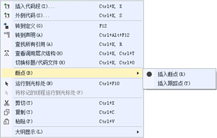
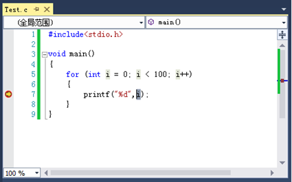
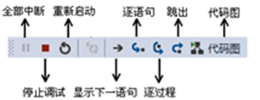
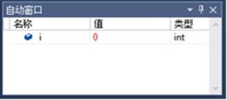
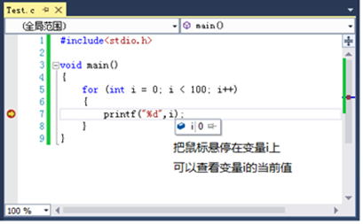
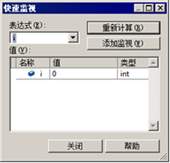
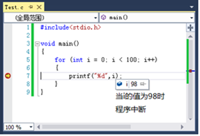

### 设置断点

在程序的调试过程中，为了分析出程序出错的原因，往往需要观察程序中某些数据的变化情况，这时就需要为程序设置断点。断点可以让正在运行的程序在需要的地方中断，当再次运行程序时，程序会在断点处暂停，方便观察程序中的数据。在VS开发工具中，如果要给代码添加断点，可以左键单击代码左边的灰色区域即可，断点插入成功后左侧会有彩色圆点出现，如图所示。


上述方式可以在程序中插入断点，另外，也可以在某行代码处右击鼠标，在弹出的快捷菜单中，选择“断点”选项，然后选择“插入断点”即可，如图所示。



为程序设置断点了以后，就可以对程序进行调试了。调试完毕要删除断点也是非常简单的，只需再次左键单击代码左侧已插入的彩色圆点，即可删除断点。另外，也可以在断点上点击鼠标右击选择【删除断点】选项，如图所示。


### 单步调试

- 逐语句（F11，进入方法的内部）
- 逐过程（F10，不进入方法的内部）

当程序出现Bug时，为了找出错误的原因，通常会采用一步一步跟踪程序执行流程的方式，这种调试方式称为单步调试。单步调试分为逐语句(快捷键F11)和逐过程(快捷建F10)，逐语句调试就是会进入方法内部调试，单步执行方法体的每条语句，逐过程调试就是不会进入方法体内部，而是把方法当做一步来执行。

接下来开启调试功能对for循环程序进行单步调试，首先通过鼠标点击工具栏中的Debug按钮 ，开启程序调试功能，调试界面如图所示。



从上图可以看出，当程序开启调试时会暂停在断点处，并且会出现一个箭头指向程序执行的位置，这时就可以通过工具栏上的调试按钮执行相应的调试操作，如继续、停止等，调试按钮如图所示。



上图所标注的按钮都是在调试程序时经常使用的，下面针对每个按钮的作用分别介绍：

- 全部中断：该按钮可以将正在执行的程序全部中断，快捷键Ctrl+Alt+Break。
- 停止调试：该按钮用于停止调试程序，快捷键Shift+F5。
- 重新启动：该按钮用于重新启动程序调试，快捷键Ctrl+Shift+F5。
- 显示下一条语句：该按钮用于显示下一条执行的语句，快捷键Alt+数字键*。
- 逐语句：该按钮可以让程序按照逐语句进行调试，快捷键F11。
- 逐过程：该按钮可以让程序按照逐过程进行调试，快捷键F10。
- 跳出：该按钮用于跳出正在执行的程序，快捷键Shift+F11。

### 观察变量

在程序调试过程中，最主要的就是观察当前变量的值来尽快找到程序出错的原因，接下来介绍几种常用的观察变量值的方法，具体如下：

**1、使用局部变量窗口查看变量的值**

在程序调试过程中，可以在菜单栏中选择【调试】→【窗口】→【局部变量】打开局部变量窗口查看变量的值，在该窗口中可以看到当前运行代码之前所有变量的名称、当前值和类型，如图所示。



从图中可以看出，在【局部变量】窗口中，变量i即为for循环语句中的局部变量i。

**2、使用鼠标悬停的办法监视变量的值**

在程序调试的过程中，需要查看变量的当前值，还可以把鼠标移动到当前变量所在的位置，来观察变量的值，这种方法更加便捷而且在调试过程中最常用，鼠标悬停的效果如图所示。



**3、使用快速监视窗口查看变量的值**

程序调试过程中，在代码区单击鼠标右键选择【快速监视】窗口也可以观察变量的值，如图所示。



在上图所示的“快速监视”窗口中，可以在“表达式”选项下的文本框中输入变量或者表达式，然后点击“重新计算”获取变量或表达式的当前值。点击“添加监视”会将当前变量或者表达式添加到监视窗口中，就可以观察变量的值。

**4、使用即时窗口查看变量的值**

在菜单栏选择【调试】→【窗口】→【即时】打开即时窗口观察变量的值，如图所示。


在代码调试的过程中，可以在即时窗口中直接输入程序中的变量名，按回车即可查看变量的值，也可以在变量名前加上“&”（取地址符），查看变量的地址。

### 条件断点

在对一个循环语句进行调试时，假设代码要进行100次循环，而我们只是希望在第98次循环时中断程序，进行代码调试。按照前面所讲的调试方式，只能从第一次循环就开始单步调试，一直等到程序循环到第98次，这样做工作量就会太大了。针对这种情况就可以使用条件断点来进行调试。条件断点就是可以设置一个条件，当条件满足时程序才会中断，针对上面描述的循环语句，就可以设置循环变量的值为98使程序中断，这样调试起来就很方便，也很快速。接下来通过调试for循环的案例来演示如何使用条件断点，如例所示。

```c
#include <stdio.h>
void main(int argc, _TCHAR* argv[])
{
	for(int i=0;i<100;i++)
	{
	   printf("%o", i);
	}
}
```

下面给需要中断的代码行添加断点，在断点上右击【条件】会弹出【断点条件】选项，在条件下的文本框中输入中断表达式i==98，然后选择表达式的值为true，此时就设置好了条件断点，如图所示。


启动调试，程序运行结果如图所示



从上图可以看出，当循环中的变量的条件符合条件断点的条件时，循环将中断，此时就可以观察当前循环条件下变量的取值情况。