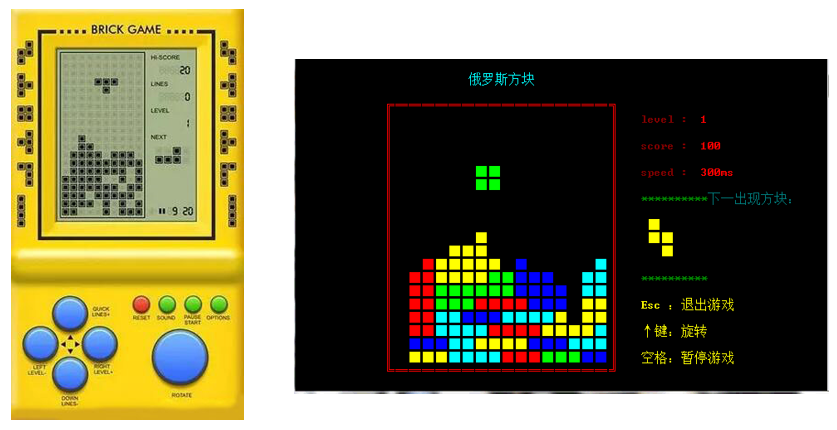

## 趣味俄罗斯方块




### 功能结构图


### 业务流程图


### 游戏欢迎界面


### 代码实现

```c
#include <stdio.h>
#include <time.h>
#include <windows.h>
#include <conio.h>

/*******宏  定  义*******/
#define FrameX 13   		//游戏窗口左上角的X轴坐标
#define FrameY 3   			//游戏窗口左上角的Y轴坐标
#define Frame_height  20 	//游戏窗口的高度
#define Frame_width   18 	//游戏窗口的宽度 

/*******定  义  全  局  变  量 *******/
int i,j,Temp,Temp1,Temp2; 	//temp,temp1,temp2用于记住和转换方块变量的值
int a[80][80]={0};   		//标记游戏屏幕的图案：2,1,0分别表示该位置为游戏边框、方块、无图案;初始化为无图案
int b[4];     				//标记4个"口"方块：1表示有方块，0表示无方块
struct Tetris		//声明俄罗斯方块的结构体
{
 	int x;     		//中心方块的x轴坐标
 	int y;     		//中心方块的y轴坐标
 	int flag;    	//标记方块类型的序号
 	int next;    	//下一个俄罗斯方块类型的序号
 	int speed;    	//俄罗斯方块移动的速度
 	int number;    	//产生俄罗斯方块的个数
 	int score;    	//游戏的分数
 	int level;    	//游戏的等级
};
HANDLE hOut;		//控制台句柄

/*******函  数  声  明 *******/
void gotoxy(int x, int y);			//光标移到指定位置
void DrwaGameframe();				//绘制游戏边框
void Flag(struct Tetris *);			//随机产生方块类型的序号
void MakeTetris(struct Tetris *);	//制作俄罗斯方块
void PrintTetris(struct Tetris *);	//打印俄罗斯方块
void CleanTetris(struct Tetris *);	//清除俄罗斯方块的痕迹
int  ifMove(struct Tetris *);		//判断是否能移动，返回值为1，能移动，否则，不能移动
void Del_Fullline(struct Tetris *);	//判断是否满行，并删除满行的俄罗斯方块
void Gameplay();					//开始游戏
void regulation();                  //游戏规则
void explation();                   //按键说明
void welcom();                      //欢迎界面
void Replay(struct Tetris *);  		//重新开始游戏
void title();                       //欢迎界面上方的标题
void flower();                      //欢迎界面上的字符装饰花
void close();                       //关闭游戏

/**
 * 获取屏幕光标位置
 */
void gotoxy(int x, int y)
{
 	COORD pos;
 	pos.X = x;  //横坐标
 	pos.Y = y;  //纵坐标
 	SetConsoleCursorPosition(GetStdHandle(STD_OUTPUT_HANDLE), pos);
}

/**
 * 文字颜色函数  此函数的局限性：1、只能Windows系统下使用   2、不能改变背景颜色
 */
int color(int c)
{
	SetConsoleTextAttribute(GetStdHandle(STD_OUTPUT_HANDLE), c); //更改文字颜色
	return 0;
}

/**
 * 制作游戏窗口
 */
void DrwaGameframe()
{
 	gotoxy(FrameX+Frame_width-7,FrameY-2);   	//打印游戏名称
	color(11);
	printf("趣味俄罗斯方块");
 	gotoxy(FrameX+2*Frame_width+3,FrameY+7);  	//打印选择菜单
 	color(2);
	printf("**********");
	gotoxy(FrameX+2*Frame_width+13,FrameY+7);  	//打印选择菜单
 	color(3);
	printf("下一出现方块：");
 	gotoxy(FrameX+2*Frame_width+3,FrameY+13);
 	color(2);
	printf("**********");
	gotoxy(FrameX+2*Frame_width+3,FrameY+17);
	color(14);
	printf("↑键：旋转");
	gotoxy(FrameX+2*Frame_width+3,FrameY+19);
	printf("空格：暂停游戏");
 	gotoxy(FrameX+2*Frame_width+3,FrameY+15);
 	printf("Esc ：退出游戏");
 	gotoxy(FrameX,FrameY);       	
	color(12);
	printf("╔");							//打印框角
 	gotoxy(FrameX+2*Frame_width-2,FrameY);
 	printf("╗");
 	gotoxy(FrameX,FrameY+Frame_height);
 	printf("╚");
 	gotoxy(FrameX+2*Frame_width-2,FrameY+Frame_height);
 	printf("╝");
 	a[FrameX][FrameY+Frame_height]=2;       //记住该处已有图案
 	a[FrameX+2*Frame_width-2][FrameY+Frame_height]=2;
 	for(i=2;i<2*Frame_width-2;i+=2)
 	{
  		gotoxy(FrameX+i,FrameY);
  		printf("═");         //打印上横框
 	}
 	for(i=2;i<2*Frame_width-2;i+=2)
 	{
  		gotoxy(FrameX+i,FrameY+Frame_height);
  		printf("═");         //打印下横框
  		a[FrameX+i][FrameY+Frame_height]=2;    //记住下横框有图案
 	}
 	for(i=1;i<Frame_height;i++)
	{
  		gotoxy(FrameX,FrameY+i); 
  		printf("║");         //打印左竖框
  		a[FrameX][FrameY+i]=2;       //记住左竖框有图案
 	}
 	for(i=1;i<Frame_height;i++)
 	{
  		gotoxy(FrameX+2*Frame_width-2,FrameY+i); 
  		printf("║");         //打印右竖框
  		a[FrameX+2*Frame_width-2][FrameY+i]=2;   //记住右竖框有图案
 	}
}

/**
 * 制作俄罗斯方块
 */
void MakeTetris(struct Tetris *tetris)
{
 	a[tetris->x][tetris->y]=b[0];    //中心方块位置的图形状态
 	switch(tetris->flag)      //共7大类，19种类型
 	{
  		case 1: //田字方块
   		{
			color(10);
    		a[tetris->x][tetris->y-1]=b[1];
    		a[tetris->x+2][tetris->y-1]=b[2];
    		a[tetris->x+2][tetris->y]=b[3];
   			break;
   		}
  		case 2: //直线方块
   		{
		   	color(13);
    		a[tetris->x-2][tetris->y]=b[1];
    		a[tetris->x+2][tetris->y]=b[2];
    		a[tetris->x+4][tetris->y]=b[3];
    		break;
   		}
  		case 3: // 直线方块
   		{
		   	color(13);
    		a[tetris->x][tetris->y-1]=b[1];
    		a[tetris->x][tetris->y-2]=b[2];
    		a[tetris->x][tetris->y+1]=b[3];
    		break;
   		}
  		case 4: //T字方块
   		{
		   	color(11);
    		a[tetris->x-2][tetris->y]=b[1];
    		a[tetris->x+2][tetris->y]=b[2];
    		a[tetris->x][tetris->y+1]=b[3];
    		break;
   		}
  		case 5: // 顺时针90°T字方块
   		{
		   	color(11);
    		a[tetris->x][tetris->y-1]=b[1];
    		a[tetris->x][tetris->y+1]=b[2];
    		a[tetris->x-2][tetris->y]=b[3];
    		break;
   		}
  		case 6: // 顺时针180°T字方块
   		{
		   	color(11);
    		a[tetris->x][tetris->y-1]=b[1];
    		a[tetris->x-2][tetris->y]=b[2];
    		a[tetris->x+2][tetris->y]=b[3];
    		break;
   		}
  		case 7: // 顺时针270°T字方块
   		{
		   	color(11);
    		a[tetris->x][tetris->y-1]=b[1];
    		a[tetris->x][tetris->y+1]=b[2];
    		a[tetris->x+2][tetris->y]=b[3];
    		break;
   		}
  		case 8: //Z字方块
   		{
		   	color(14);
    		a[tetris->x][tetris->y+1]=b[1];
    		a[tetris->x-2][tetris->y]=b[2];
    		a[tetris->x+2][tetris->y+1]=b[3];
    		break;
   		}
  		case 9: //顺时针Z字方块
   		{
		   	color(14);                                                                                                      
    		a[tetris->x][tetris->y-1]=b[1];
    		a[tetris->x-2][tetris->y]=b[2];
    		a[tetris->x-2][tetris->y+1]=b[3];
    		break;
   		}
  		case 10: //反转Z字方块
   		{
		   	color(14);
    		a[tetris->x][tetris->y-1]=b[1];
    		a[tetris->x-2][tetris->y-1]=b[2];
    		a[tetris->x+2][tetris->y]=b[3];
    		break;
   		}
  		case 11: //顺时针Z字方块
   		{
		   	color(14);
    		a[tetris->x][tetris->y+1]=b[1];
    		a[tetris->x-2][tetris->y-1]=b[2];
    		a[tetris->x-2][tetris->y]=b[3];
    		break;
   		}
  		case 12: //7字方块
   		{
		   	color(12);
    		a[tetris->x][tetris->y-1]=b[1];
    		a[tetris->x][tetris->y+1]=b[2];
    		a[tetris->x-2][tetris->y-1]=b[3];
    		break;
   		}
  		case 13: // 顺时针90°7字方块
   		{
		   	color(12);
    		a[tetris->x-2][tetris->y]=b[1];
    		a[tetris->x+2][tetris->y-1]=b[2];
    		a[tetris->x+2][tetris->y]=b[3];
    		break;
   		}
  		case 14: // 顺时针180°7字方块
   		{
		   	color(12);
    		a[tetris->x][tetris->y-1]=b[1];
   		 	a[tetris->x][tetris->y+1]=b[2];
    		a[tetris->x+2][tetris->y+1]=b[3];
    		break;
   		}
  		case 15: // 顺时针270°7字方块
   		{
		   	color(12);
    		a[tetris->x-2][tetris->y]=b[1];
    		a[tetris->x-2][tetris->y+1]=b[2];
    		a[tetris->x+2][tetris->y]=b[3];
    		break;
   		}
  		case 16: //反转7字方块
   		{
		   	color(12);
    		a[tetris->x][tetris->y+1]=b[1];
    		a[tetris->x][tetris->y-1]=b[2];
    		a[tetris->x+2][tetris->y-1]=b[3];
    		break;
   		}
  		case 17: // 顺时针转90°7字方块
   		{
		   	color(12);
    		a[tetris->x-2][tetris->y]=b[1];
    		a[tetris->x+2][tetris->y+1]=b[2];
    		a[tetris->x+2][tetris->y]=b[3];
    		break;
   		}
  		case 18: // 顺时针转180°7字方块
   		{
		   	color(12);
    		a[tetris->x][tetris->y-1]=b[1];
    		a[tetris->x][tetris->y+1]=b[2];
    		a[tetris->x-2][tetris->y+1]=b[3];
    		break;
   		}
  		case 19: // 顺指针转270°7字方块
  		{
		  	color(12);
    		a[tetris->x-2][tetris->y]=b[1];
    		a[tetris->x-2][tetris->y-1]=b[2];
    		a[tetris->x+2][tetris->y]=b[3];
    		break;
  	 	}
 	} 
}

/**
 * 打印俄罗斯方块
 */
void PrintTetris(struct Tetris *tetris)
{
 	for(i=0;i<4;i++)
 	{
  		b[i]=1;         				//数组b[4]的每个元素的值都为1
 	}
 	MakeTetris(tetris);      			//制作游戏窗口
 	for( i=tetris->x-2; i<=tetris->x+4; i+=2 )
 	{
  		for(j=tetris->y-2;j<=tetris->y+1;j++)
  		{
   			if( a[i][j]==1 && j>FrameY )
   			{
    			gotoxy(i,j);
				printf("■");     //打印边框内的方块
   			}
  		}
	}
 	//打印菜单信息
	gotoxy(FrameX+2*Frame_width+3,FrameY+1);
	color(4);
 	printf("level : ");
 	color(12);
 	printf(" %d",tetris->level);
	gotoxy(FrameX+2*Frame_width+3,FrameY+3);
	color(4);
 	printf("score : ");
 	color(12);
 	printf(" %d",tetris->score);
	gotoxy(FrameX+2*Frame_width+3,FrameY+5);
	color(4);
 	printf("speed : ");
 	color(12);
	printf(" %dms",tetris->speed);
}

/**
 * 判断是否可移动
 */
int ifMove(struct Tetris *tetris)
{
 	if(a[tetris->x][tetris->y]!=0)//当中心方块位置上有图案时，返回值为0，即不可移动
 	{
  		return 0;
 	}
 	else
 	{
  		if( //当为田字方块且除中心方块位置外，其他"■"字方块位置上无图案时，
            //说明这个位置能够放下田字方块，可以移动到这个位置，返回值为1，即可移动
			//比如田字方块，它的中心方块是左下角的■，如果它的上，右，右上的位置为空，
            //则这个位置就可以放一个田字方块；如果有一个位置上不为空，都放不下一个田
   		( tetris->flag==1  && ( a[tetris->x][tetris->y-1]==0   &&
    	a[tetris->x+2][tetris->y-1]==0 && a[tetris->x+2][tetris->y]==0 ) ) ||
   		//或为直线方块且除中心方块位置外，其他"■"字方块位置上无图案时，返回值为1，即可移动
   		( tetris->flag==2  && ( a[tetris->x-2][tetris->y]==0   && 
    	a[tetris->x+2][tetris->y]==0 && a[tetris->x+4][tetris->y]==0 ) )   ||
   		( tetris->flag==3  && ( a[tetris->x][tetris->y-1]==0   &&
    	a[tetris->x][tetris->y-2]==0 && a[tetris->x][tetris->y+1]==0 ) )   ||
   		( tetris->flag==4  && ( a[tetris->x-2][tetris->y]==0   &&
    	a[tetris->x+2][tetris->y]==0 && a[tetris->x][tetris->y+1]==0 ) )   ||
   		( tetris->flag==5  && ( a[tetris->x][tetris->y-1]==0   &&
   		 a[tetris->x][tetris->y+1]==0 && a[tetris->x-2][tetris->y]==0 ) )   ||
   		( tetris->flag==6  && ( a[tetris->x][tetris->y-1]==0   &&
    	a[tetris->x-2][tetris->y]==0 && a[tetris->x+2][tetris->y]==0 ) )   ||
   		( tetris->flag==7  && ( a[tetris->x][tetris->y-1]==0   &&
    	a[tetris->x][tetris->y+1]==0 && a[tetris->x+2][tetris->y]==0 ) )   ||
   		( tetris->flag==8  && ( a[tetris->x][tetris->y+1]==0   &&
    	a[tetris->x-2][tetris->y]==0 && a[tetris->x+2][tetris->y+1]==0 ) ) ||
   		( tetris->flag==9  && ( a[tetris->x][tetris->y-1]==0   &&
    	a[tetris->x-2][tetris->y]==0 && a[tetris->x-2][tetris->y+1]==0 ) ) ||
   		( tetris->flag==10 && ( a[tetris->x][tetris->y-1]==0   &&
    	a[tetris->x-2][tetris->y-1]==0 && a[tetris->x+2][tetris->y]==0 ) ) ||
   		( tetris->flag==11 && ( a[tetris->x][tetris->y+1]==0   &&
    	a[tetris->x-2][tetris->y-1]==0 && a[tetris->x-2][tetris->y]==0 ) ) ||
   		( tetris->flag==12 && ( a[tetris->x][tetris->y-1]==0   &&
    	a[tetris->x][tetris->y+1]==0 && a[tetris->x-2][tetris->y-1]==0 ) ) ||
   		( tetris->flag==15 && ( a[tetris->x-2][tetris->y]==0   &&
    	a[tetris->x-2][tetris->y+1]==0 && a[tetris->x+2][tetris->y]==0 ) ) ||
   		( tetris->flag==14 && ( a[tetris->x][tetris->y-1]==0   &&
    	a[tetris->x][tetris->y+1]==0 && a[tetris->x+2][tetris->y+1]==0 ) ) ||
   		( tetris->flag==13 && ( a[tetris->x-2][tetris->y]==0   &&
    	a[tetris->x+2][tetris->y-1]==0 && a[tetris->x+2][tetris->y]==0 ) ) ||
   		( tetris->flag==16 && ( a[tetris->x][tetris->y+1]==0   &&
    	a[tetris->x][tetris->y-1]==0 && a[tetris->x+2][tetris->y-1]==0 ) ) ||
   		( tetris->flag==19 && ( a[tetris->x-2][tetris->y]==0   &&
    	a[tetris->x-2][tetris->y-1]==0 && a[tetris->x+2][tetris->y]==0 ) ) ||
   		( tetris->flag==18 && ( a[tetris->x][tetris->y-1]==0   &&
    	a[tetris->x][tetris->y+1]==0 && a[tetris->x-2][tetris->y+1]==0 ) ) ||
   		( tetris->flag==17 && ( a[tetris->x-2][tetris->y]==0   &&
    	a[tetris->x+2][tetris->y+1]==0 && a[tetris->x+2][tetris->y]==0 ) ) )
   		{
    		return 1;
   		}
	}
 	return 0;
}

/**
 * 随机产生俄罗斯方块类型的序号
 */
void Flag(struct Tetris *tetris)
{
 	tetris->number++;  //记住产生方块的个数
	srand(time(NULL));  //初始化随机数
	 if(tetris->number==1)
 	{
  		tetris->flag = rand()%19+1;  	//记住第一个方块的序号
 	}
 	tetris->next = rand()%19+1;   		//记住下一个方块的序号
}


/**
 * 清除俄罗斯方块的痕迹
 */
void CleanTetris(struct Tetris *tetris)
{
 	for(i=0;i<4;i++)
 	{
  		b[i]=0;         //数组b[4]的每个元素的值都为0
 	}
	MakeTetris(tetris);      //制作俄罗斯方块
	for( i = tetris->x - 2;i <= tetris->x + 4; i+=2 )  // X为中心方块
	{
  		for(j = tetris->y-2;j <= tetris->y + 1;j++)        
  		{
   			if( a[i][j] == 0 && j > FrameY )
   			{
    			gotoxy(i,j);
    			printf("  ");    //清除方块
   			}
  		}
 	}
}

/**
 * 判断是否满行并删除满行的俄罗斯方块
 */
void Del_Fullline(struct Tetris *tetris)//当某行有Frame_width-2个方块时，则满行消除
{      
 	int k,del_rows=0;  //分别用于记录某行方块的个数和删除方块的行数的变量
 	for(j=FrameY+Frame_height-1;j>=FrameY+1;j--)
 	{
  		k=0;
  		for(i=FrameX+2;i<FrameX+2*Frame_width-2;i+=2)
  		{  
   			if(a[i][j]==1) //竖坐标依次从下往上，横坐标依次由左至右判断是否满行
   			{
    			k++;  //记录此行方块的个数
    			if(k==Frame_width-2)  //如果满行 
    			{
     				for(k=FrameX+2;k<FrameX+2*Frame_width-2;k+=2)//删除满行的方块
     				{  
      					a[k][j]=0;
      					gotoxy(k,j);
      					printf("  ");
						// Sleep(1);
     				}
                  	//如果删除行以上的位置有方块，则先清除，再将方块下移一个位置
    	 			for(k=j-1;k>FrameY;k--) 
     				{ 
      					for(i=FrameX+2;i<FrameX+2*Frame_width-2;i+=2)
      					{
       						if(a[i][k]==1)
       						{
        						a[i][k]=0;
        						gotoxy(i,k);
        						printf("  ");
        						a[i][k+1]=1;
        						gotoxy(i,k+1);
        						printf("■");
       						}
      					}
     				}			
     				j++;   //方块下移后，重新判断删除行是否满行
     				del_rows++; //记录删除方块的行数
    			}
   			}
  		}
 	}
 	tetris->score+=100*del_rows; //每删除一行，得100分
 	if( del_rows>0 && ( tetris->score%1000==0 || tetris->score/1000>tetris->level-1 ) )
 	{        //如果得1000分即累计删除10行，速度加快20ms并升一级
  		tetris->speed-=20;
  		tetris->level++;
 	}
}

/**
 * 开始游戏
 */
void Gameplay()
{
	int n;
 	struct Tetris t,*tetris=&t;       					//定义结构体的指针并指向结构体变量
 	char ch;         									//定义接收键盘输入的变量
 	tetris->number=0;      								//初始化俄罗斯方块数为0个
 	tetris->speed=300;      							//初始移动速度为300ms
	tetris->score=0;      								//初始游戏的分数为0分
 	tetris->level=1;      								//初始游戏为第1关
 	while(1)											//循环产生方块，直至游戏结束
 	{
  		Flag(tetris);     								//得到产生俄罗斯方块类型的序号
  		Temp=tetris->flag;     							//记住当前俄罗斯方块序号
  		tetris->x=FrameX+2*Frame_width+6;				//获得预览界面方块的x坐标
  		tetris->y=FrameY+10;                            //获得预览界面方块的y坐标
  		tetris->flag = tetris->next;                    //获得下一个俄罗斯方块的序号
  		PrintTetris(tetris);                           //调用打印俄罗斯方块方法
  		tetris->x=FrameX+Frame_width;  					//获得游戏窗口中心方块x坐标
  		tetris->y=FrameY-1;     						//获得游戏窗口中心方块y坐标
  		tetris->flag=Temp;     							//取出当前的俄罗斯方块序号
  		while(1)  										//控制方块方向，直至方块不再下移
  		{
   			label:PrintTetris(tetris);					//打印俄罗斯方块
   			Sleep(tetris->speed);   					//延缓时间
   			CleanTetris(tetris);  						//清除痕迹
   			Temp1=tetris->x;    						//记住中心方块横坐标的值
   			Temp2=tetris->flag;    						//记住当前俄罗斯方块序号
   			if(kbhit())       				  	 		//判断是否有键盘输入，有则用ch↓接收
   			{ 
    			ch=getch(); 
    			if(ch==75)     							//按 ←键则向左动，中心横坐标减2
    			{      
     				tetris->x-=2;
    			}
    			if(ch==77)     							//按 →键则向右动，中心横坐标加2
    			{      
     				tetris->x+=2;    
    			}
    			if(ch==80)     							//按 ↓键则加速下落
    			{    
					if(ifMove(tetris)!=0)
					{
						tetris->y+=2;
					}
					if(ifMove(tetris)==0)
						{
							tetris->y=FrameY+Frame_height-2;
    					}
    			}
    			if(ch==72)     						//按 ↑键则变体,即当前方块顺时针转90度
    			{      
    	 			if( tetris->flag>=2 && tetris->flag<=3 )
     				{
      					tetris->flag++; 
      					tetris->flag%=2;
      					tetris->flag+=2;
     				}
     				if( tetris->flag>=4 && tetris->flag<=7 )
     				{
      					tetris->flag++;
      					tetris->flag%=4;
      					tetris->flag+=4;
     				}    
     				if( tetris->flag>=8 && tetris->flag<=11 )
     				{
      					tetris->flag++;
      					tetris->flag%=4;
      					tetris->flag+=8;
     				}    
     				if( tetris->flag>=12 && tetris->flag<=15 )
     				{
      					tetris->flag++;
      					tetris->flag%=4;
      					tetris->flag+=12;
     				}    
     				if( tetris->flag>=16 && tetris->flag<=19 )
     				{
      					tetris->flag++;
      					tetris->flag%=4;
      					tetris->flag+=16;
     				}
    			}
    			if(ch == 32)     					//按空格键，暂停
    			{
     				PrintTetris(tetris);
     				while(1)
     				{
      					if(kbhit())   			//再按空格键，继续游戏
      					{
       						ch=getch();
       						if(ch == 32)
       						{
        						goto label;
       						}
      					}
     				}
    			}
				if(ch == 27)
				{
					system("cls");
					memset(a,0,6400*sizeof(int));       //初始化BOX数组
					welcom();
				}
    			if(ifMove(tetris)==0) 			//如果不可动，上面操作无效
    			{
    				tetris->x=Temp1;
     				tetris->flag=Temp2;
    			}
    			else      						//如果可动，执行操作
    			{
     				goto label;
    			}
   			}
   			tetris->y++;     					//如果没有操作指令，方块向下移动
   			if(ifMove(tetris)==0)  				//如果向下移动且不可动，方块放在此处
   			{    
    			tetris->y--;
    			PrintTetris(tetris);
    			Del_Fullline(tetris);
    			break;
   			}
  		}
  		for(i=tetris->y-2;i<tetris->y+2;i++)	//游戏结束条件：方块触到框顶位置
  		{
  			if(i==FrameY)
   			{
   				system("cls");
                gotoxy(29,7);
                printf("   \n");
				color(12);
				printf("\t\t\t■■■■   ■     ■   ■■     \n");
                printf("\t\t\t■         ■■   ■   ■  ■   \n");
                printf("\t\t\t■■■     ■  ■ ■   ■   ■  \n");
				printf("\t\t\t■         ■   ■■   ■  ■   \n");
				printf("\t\t\t■■■■   ■     ■   ■■     \n");
				gotoxy(17,18);
				color(14);
				printf("我要重新玩一局-------1");
				gotoxy(44,18);
				printf("不玩了，退出吧-------2\n");
				int n;
				gotoxy(32,20);
				printf("选择【1/2】：");
				color(11);
				scanf("%d", &n);
    			switch (n)
    			{
    				case 1:
        				system("cls");
        				Replay(tetris);       	//重新开始游戏
        				break;
    				case 2:
        				exit(0);
        				break;
    			}
   			}
  		}
  		tetris->flag = tetris->next;  			//清除下一个俄罗斯方块的图形(右边窗口)
  		tetris->x=FrameX+2*Frame_width+6;
  		tetris->y=FrameY+10;
  		CleanTetris(tetris);
 	}
}


 /**
 * 重新游戏
 */
void Replay(struct Tetris *)
{
	system("cls");                  	//清屏
	memset(a,0,6400*sizeof(int));       //初始化BOX数组，否则不会正常显示方块，导致游戏直接结束
	DrwaGameframe();       	//制作游戏窗口
	Gameplay(); 			//开始游戏
}

/**
 * 主  函  数
 */
int main()
{
	title();            //欢迎界面上的标题
	flower();           //打印字符画
	welcom();           //欢迎界面上的选项菜单
}

/**
 * 欢迎界面
 */
void welcom()
{
	int n;
	int i,j = 1;
	color(14);          			//黄色边框
	for (i = 9; i <= 20; i++)   	//输出上下边框===
	{
		for (j = 15; j <= 60; j++)  //输出左右边框||
		{
			gotoxy(j, i);
			if (i == 9 || i == 20) printf("=");
			else if (j == 15 || j == 59) printf("||");
		}
	}
	color(12);
	gotoxy(25, 12);
	printf("1.开始游戏");
	gotoxy(40, 12);
	printf("2.按键说明");
	gotoxy(25, 17);
	printf("3.游戏规则");
	gotoxy(40, 17);
	printf("4.退出");
	gotoxy(21,22);
	color(3);
	printf("请选择[1 2 3 4]:[ ]\b\b");
	color(14);
    scanf("%d", &n);    //输入选项
    switch (n)
    {
    	case 1:
    		system("cls");
        	DrwaGameframe();       	//制作游戏窗口
			Gameplay(); 			//开始游戏
        	break;
    	case 2:
        	explation();      	//按键说明函数
        	break;
    	case 3:
        	regulation();     	//游戏规则函数
        	break;
    	case 4:
       	 	close();    		//关闭游戏函数
        	break;
    }
}

/**
 * 主界面上方的标题
 */
void title()
{
	color(15);          
	gotoxy(24,3);
    printf("趣  味  俄  罗  斯  方  块\n");
	color(11);
	gotoxy(18,5);
    printf("■");
    gotoxy(18,6);
    printf("■■");
    gotoxy(18,7);
    printf("■");
    
    color(14);
	gotoxy(26,6);
    printf("■■");
    gotoxy(28,7);
    printf("■■");//
    
    color(10);
	gotoxy(36,6);
    printf("■■");
    gotoxy(36,7);
    printf("■■");
    
    color(13);
	gotoxy(45,5);
    printf("■");
    gotoxy(45,6);
	printf("■");
	gotoxy(45,7);
	printf("■");
	gotoxy(45,8);
	printf("■");
    
	color(12);
	gotoxy(56,6);
    printf("■");//
    gotoxy(52,7);
	printf("■■■");
}
void flower()
{
	gotoxy(66,11);   	//确定屏幕上要输出的位置
	color(12);			//设置颜色
	printf("(_)");  	//红花上边花瓣

	gotoxy(64,12);
	printf("(_)");      //红花左边花瓣

	gotoxy(68,12);
	printf("(_)");      //红花右边花瓣

	gotoxy(66,13);
	printf("(_)");      //红花下边花瓣

	gotoxy(67,12);      //红花花蕊
	color(6);
	printf("@");
	
	gotoxy(72,10);
	color(13);
	printf("(_)");      //粉花左边花瓣

	gotoxy(76,10);
	printf("(_)");      //粉花右边花瓣

	gotoxy(74,9);
	printf("(_)");      //粉花上边花瓣
	
	gotoxy(74,11);
	printf("(_)");      //粉花下边花瓣
	
	gotoxy(75,10);
	color(6);
	printf("@");        //粉花花蕊
	
	gotoxy(71,12);
	printf("|");      	//两朵花之间的连接

	gotoxy(72,11);
	printf("/");      	//两朵花之间的连接

	gotoxy(70,13);
	printf("\\|");       //注意、\为转义字符。想要输入\，必须在前面需要转义

	gotoxy(70,14);
	printf("`|/");

	gotoxy(70,15);
	printf("\\|");

	gotoxy(71,16);
	printf("| /");

	gotoxy(71,17);
	printf("|");
	
	gotoxy(67,17);
	color(10);
	printf("\\\\\\\\");      //草地

	gotoxy(73,17);
	printf("//");

	gotoxy(67,18);
	color(2);
	printf("^^^^^^^^");
	
	gotoxy(65,19);
	color(5);
	printf("明 日  科 技");
	
	gotoxy(68,20);
	printf("周小美");
}

 /**
 * 退出
 */
void close()
{
    exit(0);
}

 /**
 * 按键说明
 */
void explation()
{
	int i,j = 1;
    system("cls");
    color(13);
    gotoxy(32,3);
    printf("按键说明");
    color(2);
    for (i = 6; i <= 16; i++)   //输出上下边框===
	{
		for (j = 15; j <= 60; j++)  //输出左右边框||
		{
			gotoxy(j, i);
			if (i == 6 || i == 16) printf("=");
			else if (j == 15 || j == 59) printf("||");
		}
	}
    color(3);
    gotoxy(18,7);
    printf("tip1: 玩家可以通过 ← →方向键来移动方块");
    color(10);
    gotoxy(18,9);
    printf("tip2: 通过 ↑使方块旋转");
    color(14);
    gotoxy(18,11);
    printf("tip3: 通过 ↓加速方块下落");
    color(11);
    gotoxy(18,13);
    printf("tip4: 按空格键暂停游戏，再按空格键继续");
    color(4);
    gotoxy(18,15);
    printf("tip5: 按ESC退出游戏");
    getch();                //按任意键返回主界面
    system("cls");
    main();
}

 /**
 * 游戏规则
 */
void regulation()
{
	int i,j = 1;
    system("cls");
    color(13);
    gotoxy(34,3);
    printf("游戏规则");
    color(2);
    for (i = 6; i <= 18; i++)   //输出上下边框===
	{
		for (j = 12; j <= 70; j++)  //输出左右边框||
		{
			gotoxy(j, i);
			if (i == 6 || i == 18) printf("=");
			else if (j == 12 || j == 69) printf("||");
		}
	}
    color(12);
    gotoxy(16,7);
    printf("tip1: 不同形状的小方块从屏幕上方落下，玩家通过调整");
    gotoxy(22,9);
    printf("方块的位置和方向，使他们在屏幕底部拼出完整的");
    gotoxy(22,11);
    printf("一条或几条");
    color(14);
    gotoxy(16,13);
    printf("tip2: 每消除一行，积分增加100");
    color(11);
    gotoxy(16,15);
    printf("tip3: 每累计1000分，会提升一个等级");
    color(10);
    gotoxy(16,17);
    printf("tip4: 提升等级会使方块下落速度加快，游戏难度加大");
	getch();                //按任意键返回主界面
	system("cls");
	welcom();
}
```

