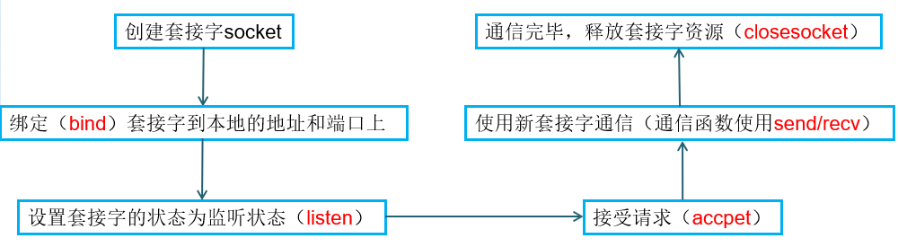
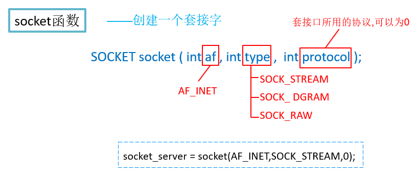
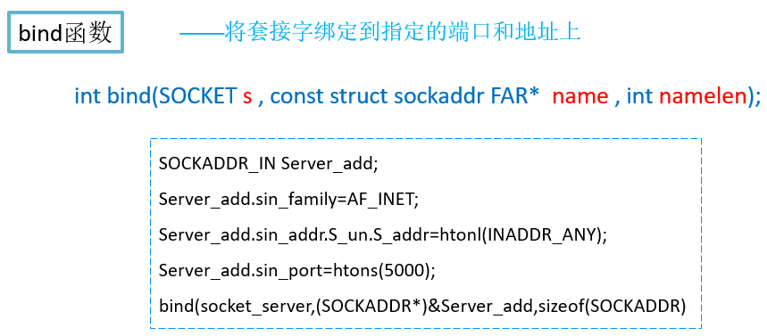

## 计算机网络基础

### ip地址

为了使网络上的计算机能够彼此识别对方，每台计算机都需要一个IP地址以标识自己。

IPv4:32位，IPv6:64位

### OSI七层参考模型

- 应用层
- 表示层
- 会话层
- 传输层
- 网络层
- 数据链路层
- 物理层

### 地址解析

地址解析是指将计算机的协议地址解析为物理地址，即MAC（Medium Access Control）地址，又称为媒体访问控制地址。通常，在网络上由地址解析协议（ARP）来实现地址解析。

假设主机A和主机B处于同一个物理网络上，主机A的IP为192.168.1.21，主机B的IP为192.168.1.23，当主机A与主机B进行通信时，将主机B的IP地址解析为物理地址

### 域名系统

Internet管理机构采取了在主机名后加上后缀名的方法标识一台主机，其后缀名被称为域名。


com：一级域名，商业组织，mingrisoft：本地域名

### TCP/IP协议

TCP/IP（Transmission Control Protocal/Internet Protocal，传输控制协议/网际协议）是互联网上最流行的协议，它能够实现互联网上不同类型操作系统的计算机相互通信。

| TCP/IP协议                 | OSI参考模型     |
| ------------------------ | ----------- |
| 应用层（包括Telnet、FTP、SNTP协议） | 会话层、表示层和应用层 |
| 传输层（包括TCP、UDP协议）         | 传输层         |
| 网络层（包括ICMP、IP、ARP等协议）    | 网络层         |
| 数据链路层                    | 物理层和数据链路层   |

### 协议

- ip协议
- tcp协议
- udp协议

###  端口

端口：标识通信的应用程序。

### 接字的引入

为了更方便地开发网络应用程序，美国的伯克利大学在UNIX上推出了一种应用程序访问通信协议的操作系统调用套接字（socket）。socket的出现，使得程序员可以很方便地访问TCP/IP，从而开发各种网络应用的程序。后来，套接字被引进到Windows等操作系统，成为开发网络应用程序的有效工具。

### 网络字节顺序

TCP/IP协议使用16位整数和32位整数的高位先存格式

## 套接字概述

### TCP的套接字的socket编程

基于TCP面向连接的socket编程的服务器端程序流程



## 套接字函数






| 函数名           | 作用                              |
| ------------- | ------------------------------- |
| listen函数      | 将套接字设置为监听模式                     |
| accept函数      | 接受客户端的连接                        |
| closesocket函数 | 关闭套接字                           |
| connect函数     | 发送一个连接请求                        |
| htons函数       | 将一个16位的无符号短整型数据由主机排列方式转换为网络排列方式 |
| htonl函数       | 将一个无符号长整型数据由主机排列方式转换为网络排列方式     |
| inet_addr函数   | 将一个由字符串表示的地址转换为32位的无符号长整型数据     |
| recv函数        | 从面向连接的套接字中接收数据                  |
| send函数        | 在面向连接方式的套接字间发送数据                |
| recvfrom函数    | 接收一个数据报信息并保存源地址                 |
| sendto函数      | 向一个特定的目的方发送数据                   |
| WSACleanup函数  | 释放为Ws2_32.dll动态链接库初始化时分配的资源     |

### Socket.c

```c
#include<stdio.h>
#include<winsock.h>		/*引入winsock头文件*/
int  main()
{
	/*-----------------------------------------*/
	/*------------定义变量---------------------*/
	/*-----------------------------------------*/
	char Sendbuf[100];		/*发送数据的缓冲区*/
	char Receivebuf[100];	/*接受数据的缓冲区*/
	int SendLen;			/*发送数据的长度*/
	int	ReceiveLen;			/*接收数据的长度*/
	int Length;				/*表示SOCKADDR的大小*/

	SOCKET socket_server;	/*定义服务器套接字*/
	SOCKET socket_receive;  /*定义用于连接套接字*/

	SOCKADDR_IN Server_add;	/*服务器地址信息结构*/
	SOCKADDR_IN Client_add;	/*客户端地址信息结构*/

	WORD wVersionRequested;	/*字（word）：unsigned short*/
	WSADATA wsaData;		/*库版本信息结构*/
	int error;				/*表示错误*/

	/*-----------------------------------------*/
	/*------------初始化套接字库---------------*/
	/*-----------------------------------------*/
	/*定义版本类型。将两个字节组合成一个字，前面是第字节，后面是高字节*/
	wVersionRequested = MAKEWORD( 2, 2 );	
	/*加载套接字库，初始化Ws2_32.dll动态链接库*/
	error = WSAStartup( wVersionRequested, &wsaData);	
	if(error!=0)
	{
		printf("加载套接字失败！");
		return 0;	/*程序结束*/
	}
	/*判断请求加载的版本号是否符合要求*/
	if ( LOBYTE( wsaData.wVersion ) != 2 ||
		   HIBYTE( wsaData.wVersion ) != 2 ) 
	{	
		WSACleanup( );	/*不符合，关闭套接字库*/
		return 0;		/*程序结束*/
	}

	/*-----------------------------------------*/
	/*------------设置连接地址-----------------*/
	/*-----------------------------------------*/
	Server_add.sin_family=AF_INET;/*地址家族，对于必须是AF_INET，注意只有它不是网络网络字节顺序*/
	Server_add.sin_addr.S_un.S_addr=htonl(INADDR_ANY);/*主机地址*/
	Server_add.sin_port=htons(5000);/*端口号*/

	/*------------创建套接字-------------------*/
	/*AF_INET表示指定地址族，SOCK_STREAM表示流式套接字TCP，特定的地址家族相关的协议。*/
	socket_server=socket(AF_INET,SOCK_STREAM,0);

	/*-----------------------------------------*/
	/*---绑定套接字到本地的某个地址和端口上----*/
	/*-----------------------------------------*/
			/*socket_server为套接字，(SOCKADDR*)&Server_add为服务器地址*/
	if(bind(socket_server,(SOCKADDR*)&Server_add,sizeof(SOCKADDR) )==SOCKET_ERROR)
	{
		printf("绑定失败\n");
	}

	/*-----------------------------------------*/
	/*------------设置套接字为监听状态---------*/
	/*-----------------------------------------*/
		/*监听状态，为连接做准备，最大等待的数目为5*/
	if(listen(socket_server,5)<0)
	{
		printf("监听失败\n");
	}
	
	/*-----------------------------------------*/
	/*------------接受连接---------------------*/
	/*-----------------------------------------*/
	Length=sizeof(SOCKADDR);
	/*接受客户端的发送请求,等待客户端发送connect请求*/
	socket_receive=accept(socket_server,(SOCKADDR*)&Client_add,&Length);
	if(socket_receive==SOCKET_ERROR)
	{
		printf("接受连接失败");
	}

	/*-----------------------------------------*/
	/*--------------进行聊天-------------------*/
	/*-----------------------------------------*/
	while(1)						/*无限循环*/
	{	
		
		/*--------接收数据---------*/
		ReceiveLen =recv(socket_receive,Receivebuf,100,0);
		if(ReceiveLen<0)
		{
			printf("接收失败\n");
			printf("程序退出\n");
			break;
		}
		else
		{
			printf("client say: %s\n",Receivebuf);
		}	
		
		/*--------发送数据---------*/
		printf("please enter message:");
		scanf("%s",Sendbuf);
		SendLen=send(socket_receive,Sendbuf,100,0);
		if(SendLen<0)
		{
			printf("发送失败\n");
		}
	}

	/*-----------------------------------------*/
	/*---------释放套接字，关闭动态库----------*/
	/*-----------------------------------------*/
	closesocket(socket_receive);	/*释放客户端的套接字资源*/
	closesocket(socket_server);/*释放套接字资源*/
	WSACleanup();/*关闭动态链接库*/
	return 0;
}
```

### Socket_Client.c

```c
#include<stdio.h>
#include<winsock.h>		/*引入winsock头文件*/

int  main()
{
	/*-----------------------------------------*/
	/*------------定义变量---------------------*/
	/*-----------------------------------------*/
	char Sendbuf[100];				/*发送数据的缓冲区*/
	char Receivebuf[100];			/*接受数据的缓冲区*/
	int	SendLen;					/*发送数据的长度*/
	int	ReceiveLen;					/*接收数据的长度*/

	SOCKET socket_send;				/*定义套接字*/

	SOCKADDR_IN Server_add;			/*服务器地址信息结构*/

	WORD wVersionRequested;			/*字（word）：unsigned short*/
	WSADATA wsaData;				/*库版本信息结构*/
	int error;						/*表示错误*/

	/*-----------------------------------------*/
	/*------------初始化套接字库---------------*/
	/*-----------------------------------------*/
				/*定义版本类型。将两个字节组合成一个字，前面是第字节，后面是高字节*/
	wVersionRequested = MAKEWORD( 2, 2 );	
				/*加载套接字库，初始化Ws2_32.dll动态链接库*/
	error = WSAStartup( wVersionRequested, &wsaData);	
	if(error!=0)
	{
		printf("加载套接字失败！");
		return 0;					/*程序结束*/
	}
				/*判断请求加载的版本号是否符合要求*/
	if ( LOBYTE( wsaData.wVersion ) != 2 ||
		   HIBYTE( wsaData.wVersion ) != 2 ) 
	{	
		WSACleanup( );				/*不符合，关闭套接字库*/
		return 0;					/*程序结束*/
	}

	/*-----------------------------------------*/
	/*------------设置服务器地址---------------*/
	/*-----------------------------------------*/
	Server_add.sin_family=AF_INET;/*地址家族，对于必须是AF_INET，注意只有它不是网络网络字节顺序*/
	/*服务器的地址，将一个点分十进制表示为IP地址，inet_ntoa是将地址转成字符串*/
	Server_add.sin_addr.S_un.S_addr = inet_addr("192.168.1.51");
	Server_add.sin_port=htons(5000);/*端口号*/

	/*-----------------------------------------*/
	/*-------------进行连接服务器--------------*/
	/*-----------------------------------------*/
	/*客户端创建套接字，但是不需要绑定的，只需要和服务器建立起连接就可以了，*/
	/*socket_sendr表示的是套接字，Server_add服务器的地址结构*/
	socket_send=socket(AF_INET,SOCK_STREAM,0);

	/*-----------------------------------------*/
	/*-------------创建用于连接的套接字--------*/
	/*-----------------------------------------*/
	/*AF_INET表示指定地址族，SOCK_STREAM表示流式套接字TCP，特定的地址家族相关的协议。*/
	if(connect(socket_send,(SOCKADDR*)&Server_add,sizeof(SOCKADDR)) == SOCKET_ERROR)
	{
		printf("连接失败!\n");
	}
	
	/*-----------------------------------------*/
	/*--------------进行聊天-------------------*/
	/*-----------------------------------------*/
	while(1)	/*无限循环*/
	{	
		/*---------------发送数据过程----------*/
		printf("please enter message:");
		scanf("%s",Sendbuf);
		SendLen = send(socket_send,Sendbuf,100,0);		/*发送数据*/
		if(SendLen < 0)
		{
			printf("发送失败!\n");
		}

		/*--------------接收数据过程---------------*/
		ReceiveLen =recv(socket_send,Receivebuf,100,0);	/*接受数据*/
		if(ReceiveLen<0)
		{
			printf("接收失败\n");
			printf("程序退出\n");
			break;
		}
		else
		{
			printf("Server say: %s\n",Receivebuf);
		}	
	}

	/*-----------------------------------------*/
	/*---------释放套接字，关闭动态库----------*/
	/*-----------------------------------------*/
	closesocket(socket_send);/*释放套接字资源*/
	WSACleanup();/*关闭动态链接库*/
	return 0;
}
```