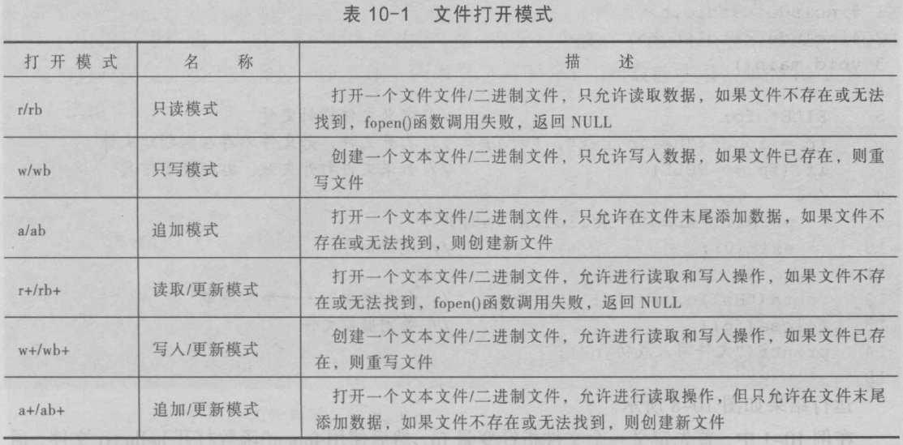

“文件”是指一组相关数据的有序集合。这个数据集有一个名称，叫做文件名。通常情况下，使用计算机也就是在使用文件。


### 文件指针

文件指针是一个指向文件有关信息的指针，这些信息包括文件名、状态和当前位置，它们保存在一个结构体变量中。在使用文件时需要在内存中为其分配空间，用来存放文件的基本信息。该结构体类型是由系统定义的，C语言规定该类型为FILE型。

### 计算机中的流

- 文本流
- 二进制流
- 预定义的流
  - stdin 标准输入流
  - stdout 标准输出流
  - stderr 标准错误输出流

### 文件

文件标识：文件路径，文件名主干，文件扩展名

文件的分类

- 二进制文件（映像文件）
- 文本文件（ASCII文件）

### 文件缓冲区

减少磁盘的读写次数，延长磁盘的使用寿命；提高计算机的运行速度

### 文件指针

```
FILE *fp;
```

| 函数声明       | 功能描述                      |
| ---------- | ------------------------- |
| fopen()    | 打开文件                      |
| fclose()   | 关闭文件                      |
| fgetc()    | 读取一个字符                    |
| fputc()    | 写入一个字符                    |
| fgets()    | 读取一个字符串                   |
| fputs()    | 写入一个字符串                   |
| fwrite()   | 写入数据                      |
| fread()    | 读取数据                      |
| printf()   | 格式化输出到控制台                 |
| scanf()    | 从标准输入设备（键盘）接收用户的输入（格式化输入） |
| fprintf()  | 格式化输出数据到文件                |
| fscanf()   | 从文件中格式化读取数据               |
| feof()     | 判断文件是否处于文件结束位置            |
| ferror()   | 检查文件在读写操作时是否出错            |
| clearerr() | 清除出错标志和文件结束标志             |
| getchar()  | 从标准输入设备中读取一个字符            |
| putchar()  | 把一个字符输出到标准输出设备            |
| puts()     | 把一个字符串输出到标准输出设备，并追加换行符    |
| gets()     | 从标准输入设备读取一个字符串            |

### 常用printf()格式字符


### scanf()输入字符串的终止符


### 文件打开模式

| 文件使用方式  | 含    义                  |
| ------- | ----------------------- |
| r（只读）   | 打开一个文本文件，只允许读数据         |
| w（只写）   | 打开或建立一个文本文件，只允许写数据      |
| a（追加）   | 打开一个文本文件，并在文件末尾写数据      |
| rb（只读）  | 打开一个二进制文件，只允许读数据        |
| wb（只写）  | 打开或建立一个二进制文件，只允许写数据     |
| ab（追加）  | 打开一个二进制文件，并在文件末尾写数据     |
| r+（读写）  | 打开一个文本文件，允许读和写          |
| w+（读写）  | 打开或建立一个文本文件，允许读写        |
| a+（读写）  | 打开一个文本文件，允许读，或在文件末追加数据  |
| rb+（读写） | 打开一个二进制文件，允许读和写         |
| wb+（读写） | 打开或建立一个二进制文件，允许读和写      |
| ab+（读写） | 打开一个二进制文件，允许读，或在文件末追加数据 |

| 打开模式   | 名称      | 描述                                       |
| ------ | ------- | ---------------------------------------- |
| r/rb   | 只读模式    | 以只读的形式打开一个文本文件/二进制文件，如果文件不存在或无法找到，fopen()函数调用失败，返回NULL |
| w/wb   | 只写模式    | 以只写的形式创建一个文本文件/二进制文件，如果文件已存在，重写文件        |
| a/ab   | 追加模式    | 以只写的形式打开一个文本文件/二进制文件，只允许在该文件末尾追加数据，如果文件不存在，则创建新文件 |
| r+/rb+ | 读取/更新模式 | 以读/写的形式打开一个文本文件/二进制文件，如果文件不存在，fopen()函数调用失败，返回NULL |
| w+/wb+ | 写入/更新模式 | 以读/写的形式创建一个文本文件/二进制文件，如果文件已存在，则重写文件      |
| a+ab+  | 追加/更新模式 | 打开一个文本/二进制文件，允许进行读取操作，但只允许在文件末尾添加数据，若文件不存在，则创建新文件 |




### 文件的随机读写

| 函数声明     | 功能描述         |
| -------- | ------------ |
| rewind() | 将文件指针指向文件开头  |
| fseek()  | 将文件指针移动到指定位置 |
| ftell()  | 获取文件指针的当前位置  |

### 内存模型大数据

```c
#define _CRT_SECURE_NO_WARNINGS
#include <stdio.h>
#include <stdlib.h>
#include <string.h>

#define srcPath "E:\\Resource\\TestData\\BigDB\\1EQQBig.txt"

//01.内存架构:文件缓冲于内存当中,将内存用作数据临时缓冲!
char ** g_pp;//全局二级指针变量
int imax = 84357147;//文件总行数
int jmax = 20027;//文件最宽列数

int getimax()
{
    int hang = -1;
    FILE * pf = fopen(srcPath, "r");
    if (NULL == pf)
    {
        printf("文件读取失败! \n");
        return -1;
    }
    else
    {
        printf("开始读取! \n");
        hang = 0;
        while (!feof(pf))//到了文件末尾返回1,没有到文件末尾返回0
        {
            char readStr[1024] = { 0 };
            fgets(readStr, 1024 - 1, pf);//一次读取一样进缓冲区
            ++hang;//自增
        }
        fclose(pf);
    }
    return hang;
}

int getjmax()
{
    int width = -1;
    FILE * pf = fopen(srcPath, "r");
    if (NULL == pf)
    {
        printf("文件读取失败! \n");
        return -1;
    }
    else
    {
        printf("开始读取! \n");
        while (!feof(pf))
        {
            char readStr[30000] = { 0 };
            fgets(readStr, 30000 - 1, pf);//每次读取一行的数据到手动字符数组缓冲区当中
            int strLength = strlen(readStr);
            if (strLength > 50)//字符串筛选
            {
                //pus(readstr);
                if (strLength > width)
                {
                    width = strLength;
                }
            }
        }
        fclose(pf);
        printf("结束读取! \n");
    }
    return width;
}

//02.字符串函数的处理特点:
//  不仅可以处理字符数组还可以处理字符指针!
//  兼容C语言当中的两种字符串表示方式!
//加载待读取的文件数据进内存,构建内存架构模型
void loadFromFile()
{
    //声明并初始化指针数组
    g_pp = (char **)malloc(imax * sizeof(int *));//分配指针数组
    memset(g_pp, '\0', imax * sizeof(char *));//清空指针数组
    FILE * pf = fopen(srcPath, "r");
    if (NULL == pf)
    {
        printf("文件读取失败! \n");
        return -1;
    }
    else
    {
        for (int i = 0; i < imax; ++i)
        {
            char str[1024] = { 0 };
            fgets(str, 1024 - 1, pf);//(按行+个数)进行字符串读取
            int strLength = strlen(str);
            if (strLength < 50)
            {
                g_pp[i] = malloc((strLength + 1)* sizeof(char));
                strcpy(g_pp[i], str);
            }
        }
        fclose(pf);
    }
}

//03.在内存架构模型当中执行检索操作!
void search(char * str)
{
    if (NULL == g_pp)
        return;
    for (int i = 0; i < imax; ++i)
    {
        if (NULL != g_pp[i])
        {
            char * p = strstr(g_pp[i], str);
            if (NULL != p)
            {
                puts(g_pp[i]);
            }
        }
    }
}

int main01(int argc, char * args[], char * envp[])
{
    //printf("imax = %d \n", getimax());
    //printf("jmax = %d \n", getjmax());

    loadFromFile();
    while (1)
    {
        char str[100] = { 0 };
        scanf("%s", str);
        search(str);
    }

    system("pause");
}
```

### 开放数据检索

```c
#define _CRT_SECURE_NO_WARNINGS
#include <stdio.h>
#include <stdlib.h>
#include <memory.h>
#include <string.h>

#define srcPath "E:\\Resource\\TestData\\BigDB\\KaiFang.txt"
char ** g_pp;
int imax = 20151574;

int getimax()
{
    FILE * pf = fopen(srcPath, "r");
    if (NULL == pf)
    {
        printf("读取文件失败! \n");
        return -1;
    }
    printf("读取文件成功! \n");
    int hang = 0;
    while (!feof(pf))
    {
        char readStr[1024] = { 0 };
        fgets(readStr, 1023, pf);
        ++hang;
    }
    fclose(pf);
    return hang;
}

void loadfromfile()
{
    g_pp = (char **)malloc(imax * sizeof(int *));
    memset(g_pp, 0, imax * sizeof(char *));
    FILE * pf = fopen(srcPath, "r");
    if (NULL == pf)
    {
        printf("打开文件失败! \n");
        return -1;
    }      
    printf("打开文件成功! \n");
    for (int i = 0; i < imax; ++i)
    {
        char str[1024] = { 0 };
        fgets(str, 1023, pf);
        int strLength = strlen(str);
        g_pp[i] = (char *)malloc((strLength + 1) * sizeof(char));
        if (NULL != g_pp[i])
            strcpy(g_pp[i], str);
    }
    fclose(pf);
}

void searchStr(char * str)
{
    char strPath[100] = { 0 };
    sprintf(strPath, "E:\\Resource\\TestData\\Test\\%s.txt", str);
    FILE * pf = fopen(strPath, "w");
    if (NULL == g_pp)
        return;
    for (int i = 0; i < imax; ++i)
    {
        if (NULL == g_pp[i])
            continue;
        char * p = strstr(g_pp[i], str);
        if (p == NULL)
            continue;
        puts(g_pp[i]);
        fputs(g_pp[i], pf);
    }
    fclose(pf);
    system(strPath);
}

int main01(void)
{
    //printf("imax = %d \n", getimax());
    loadfromfile();
    printf("内存数据库架构完成! \n");
    while (1)
    {
        char str[100] = { 0 };
        scanf("%s", str);
        searchStr(str);
    }
    system("pause");
}
```