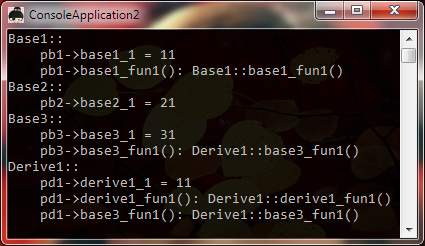
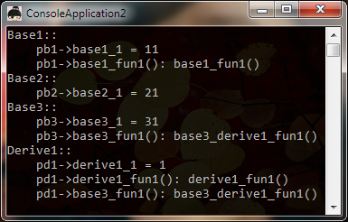

## 用C语言完全模拟C++虚函数表的实现与运作方式

如果对前面两大节的描述仔细了解了的话，想用C语言来模拟C++的虚函数以及多态，想必是轻而易举的事情了!

### 前提

但是，话得说在前面，C++的编译器在生成类及对象的时候，帮助我们完成了很多事件，比如生成虚函数表!
但是，C语言编译器却没有，因此，很多事件我们必须手动来完成，包括但不限于:

1. 手动构造父子关系
2. 手动创建虚函数表
3. 手动设置__vfptr并指向虚函数表
4. 手动填充虚函数表
5. 若有虚函数覆盖，还需手动修改函数指针
6. 若要取得基类指针，还需手动强制转换
7. ......

总之，要想用C语言来实现，要写的代码绝对有点复杂。

### C++原版调用

接下来，我们都将以最后那个，最繁杂的那个3个基类的实例来讲解，但作了一些简化与改动:

1. 用构造函数初始化成员变量
2. 减少成员变量的个数
3. 减少虚函数的个数
4. 调用函数时产生相关输出
5. Derive1增加一个基类虚函数覆盖

以下是对类的改动，很少：

```c++
class Base1
{
public:
    Base1() : base1_1(11) {}
    int base1_1;
    virtual void base1_fun1() {
        std::cout << "Base1::base1_fun1()" << std::endl;
    }
};

class Base2
{
public:
    Base2() : base2_1(21) {}
    int base2_1;
};

class Base3
{
public:
    Base3() : base3_1(31) {}
    int base3_1;
    virtual void base3_fun1() {
        std::cout << "Base3::base3_fun1()" << std::endl;
    }
};

class Derive1 : public Base1, public Base2, public Base3
{
public:
    Derive1() : derive1_1(11) {}
    int derive1_1;

    virtual void base3_fun1() {
        std::cout << "Derive1::base3_fun1()" << std::endl;
    }
    virtual void derive1_fun1() {
            std::cout << "Derive1::derive1_fun1()" << std::endl;
    }
};
```

为了看到多态的效果，我们还需要定义一个函数来看效果:

```c++
void foo(Base1* pb1, Base2* pb2, Base3* pb3, Derive1* pd1)
{
    std::cout << "Base1::\n"
        << "    pb1->base1_1 = " << pb1->base1_1 << "\n"
        << "    pb1->base1_fun1(): ";
    pb1->base1_fun1();

    std::cout << "Base2::\n"
        << "    pb2->base2_1 = " << pb2->base2_1
        << std::endl;

    std::cout << "Base3::\n"
        << "    pb3->base3_1 = " << pb3->base3_1 << "\n"
        <<"    pb3->base3_fun1(): ";
    pb3->base3_fun1();

    std::cout << "Derive1::\n"
        << "    pd1->derive1_1 = " << pd1->derive1_1<< "\n"
        <<"    pd1->derive1_fun1(): ";
    pd1->derive1_fun1();
    std::cout<< "    pd1->base3_fun1(): ";
    pd1->base3_fun1();
    
    std::cout << std::endl;
}
```

调用方式如下:

```c++
Derive1 d1;
foo(&d1, &d1, &d1, &d1);
```

输出结果:



可以看到输出结果全部正确(当然了!)，哈哈

同时注意到 pb3->base3_fun1() 的多态效果哦!

### 用C语言来模拟

必须要把前面的理解了，才能看懂下面的代码!

为了有别于已经完成的C++的类，我们分别在类前面加一个大写的C以示区分(平常大家都是习惯在C++写的类前面加C，今天恰好反过来，哈哈)。

##### C语言无法实现的部分

C/C++是两个语言，有些语言特性是C++专有的，我们无法实现! 不过，这里我是指调用约定，我们应该把她排除在外。

对于类的成员函数，C++默认使用__thiscall，也即this指针通过ecx传递，这在C语言无法实现，所以我们必须手动声明调用约定为:

- `__stdcall`，就像微软的组件对象模型那样
- `__cdecl`，本身就C语言的调用约定，当然能使用了。

上面那种调用约定，使用哪一种无关紧要，反正不能使用`__thiscall`就行了。

因为使用了非__thiscall调用约定，我们就必须手动传入this指针，通过成员函数的第1个参数!

##### 从最简单的开始: 实现 Base2

由于没有虚函数，仅有成员变量，这个当然是最好模拟的咯!

```c++
struct CBase2
{
    int base2_1;
};
```

##### 有了虚函数表的Base1，但没被覆盖

下面是Base1的定义，要复杂一点了，多一个__vfptr：

```c++
struct CBase1
{
    void** __vfptr;
    int base1_1;
};
```

因为有虚函数表，所以还得单独为虚函数表创建一个结构体的哦!

但是，为了更能清楚起见，我并未定义前面所说的指针数组，而是用一个包含一个或多个函数指针的结构体来表示!

因为数组能保存的是同一类的函数指针，不太很友好! 

但他们的效果是完全一样的，希望读者能够理解明白!

```c++
struct CBase1_VFTable
{
    void(__stdcall* base1_fun1)(CBase1* that);
};
```

**注意:** base1_fun1 在这里是一个指针变量!

**注意:** base1_fun1 有一个CBase1的指针，因为我们不再使用__thiscall，我们必须手动传入! Got it?

Base1的成员函数base1_fun1()我们也需要自己定义，而且是定义成全局的:

```c++
void __stdcall base1_fun1(CBase1* that)
{
    std::cout << "base1_fun1()" << std::endl;
}
```

##### 有虚函数覆盖的Base3

虚函数覆盖在这里并不能体现出来，要在构造对象初始化的时候才会体现，所以: base3其实和Base1是一样的。

```c++
struct CBase3
{
    void** __vfptr;
    int base3_1;
};

struct CBase3_VFTable
{
    void(__stdcall* base3_fun1)(CBase3* that);
};
```

Base3的成员函数:

```c++
void __stdcall base3_fun1(CBase3* that)
{
    std::cout << "base3_fun1()" << std::endl;
}
```

##### 定义继承类CDerive1

相对前面几个类来说，这个类要显得稍微复杂一些了，因为包含了前面几个类的内容:

```c++
struct CDerive1
{
    CBase1 base1;
    CBase3 base3;
    CBase2 base2;

    int derive1_1;
};
```

特别注意: CBase123的顺序不能错!

另外: 由于Derive1本身还有虚函数表，而且所以项是加到第一个虚函数表(CBase1)的后面的，所以此时的`CBase1::__vfptr`不应该单单指向`CBase1_VFTable`，而应该指向下面这个包含Derive1类虚函数表的结构体才行:

```c++
struct CBase1_CDerive1_VFTable
{
    void (__stdcall* base1_fun1)(CBase1* that);
    void(__stdcall* derive1_fun1)(CDerive1* that);
};
```

因为CDerive1覆盖了CBase3的base3_fun1()函数，所以不能直接用Base3的那个表:

```c++
struct CBase3_CDerive1_VFTable
{
    void(__stdcall* base3_fun1)(CDerive1* that);
};
```

Derive1覆盖`Base3::base3_fun1()`的函数以及自身定义的`derive1_fun1()`函数:

```c++
void __stdcall base3_derive1_fun1(CDerive1* that)
{
    std::cout << "base3_derive1_fun1()" << std::endl;
}

void __stdcall derive1_fun1(CDerive1* that)
{
    std::cout << "derive1_fun1()" << std::endl;
}
```

##### 构造各类的全局虚函数表

由于没有了编译器的帮忙，在定义一个类对象时，所有的初始化工作都只能由我们自己来完成了!

首先构造全局的，被同一个类共同使用的虚函数表!

```c++
// CBase1 的虚函数表
CBase1_VFTable __vftable_base1;
__vftable_base1.base1_fun1 = base1_fun1;

// CBase3 的虚函数表
CBase3_VFTable __vftable_base3;
__vftable_base3.base3_fun1 = base3_fun1;
```

然后构造CDerive1和CBase1共同使用的虚函数表:

```c++
// CDerive1 和 CBase1 共用的虚函数表
CBase1_CDerive1_VFTable __vftable_base1_derive1;
__vftable_base1_derive1.base1_fun1 = base1_fun1;
__vftable_base1_derive1.derive1_fun1 = derive1_fun1;
```

再构造CDerive1覆盖CBase3后的虚函数表: 注意: 数覆盖会替换原来的函数指针

```c++
CBase3_CDerive1_VFTable __vftable_base3_derive1;
__vftable_base3_derive1.base3_fun1 = base3_derive1_fun1;
```

##### 开始! 从CDerive1构造一个完整的Derive1类

先初始化成员变量与__vfptr的指向: 注意不是指错了!

```c++
CDerive1 d1;
d1.derive1 = 1;

d1.base1.base1_1 = 11;
d1.base1.__vfptr = reinterpret_cast<void**>(&__vftable_base1_derive1);
    
d1.base2.base2_1 = 21;

d1.base3.base3_1 = 31;
d1.base3.__vfptr = reinterpret_cast<void**>(&__vftable_base3_derive1);
```

由于目前的CDerive1是我们手动构造的，不存在真正语法上的继承关系，如要得到各基类指针，我们就不能直接来取，必须手动根据偏移计算:

```c++
char* p = reinterpret_cast<char*>(&d1);
Base1* pb1 = reinterpret_cast<Base1*>(p + 0);
Base2* pb2 = reinterpret_cast<Base2*>(p + sizeof(CBase1) + sizeof(CBase3));
Base3* pb3 = reinterpret_cast<Base3*>(p + sizeof(CBase1));
Derive1* pd1 = reinterpret_cast<Derive1*>(p);
```

真正调用:

```c++
foo(pb1, pb2, pb3, pd1);
```

调用结果:



**结果相当正确!**

## 源代码

我以为我把源代码搞丢了，结果过了一年多发现其实并没有。2015-12-24（每个圣诞我都在写代码）

有两个，忘了区别了：[Source1.cpp](https://blog.twofei.com/496/Source1.cpp)，[Source2.cpp](https://blog.twofei.com/496/Source2.cpp)

### Source1.cpp

```c++
#include <iostream>

class Base1
{
public:
	int base1_1;
	int base1_2;

	virtual void __cdecl base1_fun(int x)
	{
		std::cout << "Base1::base1_fun(" << x <<")\n";
	}
};

class Base2
{
public:
	int base2_1;

	virtual void __cdecl base2_fun(int x)
	{
		std::cout << "Base2::base2_fun(" << x << ")\n";
	}

	int base2_2;
};

class Derive : public Base1, public Base2
{
public:
	Derive()
	{
		base1_1 = 11;
		base1_2 = 12;
		base2_1 = 21;
		base2_2 = 22;

		derive1 = 1;
		derive2 = 2;
	}

	int derive1;
	int derive2;

	virtual void __cdecl derive_fun1() {}
	virtual void __cdecl derive_fun2() {}
};

class Derive_Derive : public Derive
{
public: 
	virtual void __cdecl derive_fun2() {}
	int ddd;
};

void foo2(Base1* pb1, Base2* pb2, Derive* pd, Derive_Derive* pdd)
{

}

void foo(Base1* pb1, Base2* pb2, Derive* pd)
{
	/*
	std::cout << "--------------------------------------" << std::endl;
	std::cout << "pb1:\n"
		<< "\t&pb1->base1_1  : " << &pb1->base1_1 << "\n"
		<< "\t&pb1->base1_2  : " << &pb1->base1_2 << "\n"
		<< "\t&pb1->base1_fun: " << &pb1->base1_fun << "\n"
		<< std::endl;
	std::cout << "-------------------------------------" << std::endl;*/

	std::cout << "Base1:\n"
		<< "\tbase1_1 = " << pb1->base1_1 << "\n"
		<< "\tbase1_2 = " << pb1->base1_2 << "\n"
		<< std::endl;

	std::cout << "Base2:\n"
		<< "\tbase2_1 = " << pb2->base2_1 << "\n"
		<< "\tbase2_2 = " << pb2->base2_2 << "\n"
		<< std::endl;

	std::cout << "Derive:\n"
		<< "\tderive1 = " << pd->derive1 << "\n"
		<< "\tderive2 = " << pd->derive2 << "\n"
		<< std::endl;

	pb1->base1_fun(11);
	pb2->base2_fun(22);

	pd->derive_fun1();
	pd->derive_fun2();
}

struct Base1_VPTR_VPTR{
	void (__cdecl* base1_fun)(Base1* that, int x);
};

struct Base1_VPTR{
	Base1_VPTR_VPTR* pvptr;
	int base1_1;
	int base1_2;
};

struct Base2_VPTR_VPTR{
	void (__cdecl* base2_fun)(Base2* that, int x);
};

struct Base2_VPTR{
	Base2_VPTR_VPTR* pvptr;
	int base2_1;
	int base2_2;
};

void __cdecl base1_fun(Base1* that, int x)
{
	std::cout << x << std::endl;
}

void __cdecl base2_fun(Base2* that, int x)
{
	std::cout << x << std::endl;
}

struct Derive_C
{
	Base1_VPTR base1;
	Base2_VPTR base2;

	int derive1;
	int derive2;
};

class Test1{
public:
	int a;
	int b;
	virtual void f1(){}
	virtual void f2(){}
};

int main()
{
	Base1 b1;
	std::cout << "offsetof Base1::base1_1 = " << (int)&b1.base1_1 - (int)&b1 << std::endl;

	Derive d1;
	std::cout << "offsetof Derive::derive2 = " << (int)&d1.derive2 - (int)&d1 << std::endl;

	Derive_Derive ddd;
	std::cout << "offsetof DD::ddd = " << (int)&ddd.ddd - (int)&ddd << std::endl;
	foo2(&ddd, &ddd, &ddd, &ddd);

	Test1 test1;
	Test1 test2;

	// 同一个类型的不同对象的虚函数表地址相同
	//std::cout << *(int*)&test1 << std::endl;
	//std::cout << *(int*)&test2 << std::endl;

	std::cout << "sizeof(Base1  ) = " << sizeof(Base1   ) << std::endl;
	std::cout << "sizeof(Base2  ) = " << sizeof(Base2   ) << std::endl;
	std::cout << "sizeof(Test1   ) = " << sizeof(Test1   ) << std::endl;
	std::cout << "sizeof(Derive  ) = " << sizeof(Derive  ) << std::endl;
	std::cout << "sizeof(Derive_C) = " << sizeof(Derive_C) << std::endl;

	Derive dd;
	foo(&dd, &dd, &dd);
	dd.derive_fun1();

	Derive_C d;
	Base1_VPTR_VPTR base1_vptr_vptr;
	Base2_VPTR_VPTR base2_vptr_vptr;

	base1_vptr_vptr.base1_fun = base1_fun;
	base2_vptr_vptr.base2_fun = base2_fun;

	d.base1.base1_1 = 11;
	d.base1.base1_2 = 12;
	d.base1.pvptr = &base1_vptr_vptr;

	d.base2.base2_1 = 21;
	d.base2.base2_2 = 22;
	d.base2.pvptr = &base2_vptr_vptr;

	d.derive1 = 1;
	d.derive2 = 2;
	
	foo((Base1*)&d.base1, (Base2*)&d.base2, (Derive*)&d);

	return 0;
}
```

### Source2.cpp

```c++
#include <iostream>

class Base1
{
public:
	Base1() : base1_1(11) {}
	int base1_1;
	virtual void __stdcall base1_fun1() {
		std::cout << "Base1::base1_fun1()" << std::endl;
	}
};

class Base2
{
public:
	Base2() : base2_1(21) {}
	int base2_1;
};

class Base3
{
public:
	Base3() : base3_1(31) {}
	int base3_1;
	virtual void __stdcall base3_fun1() {
		std::cout << "Base3::base3_fun1()" << std::endl;
	}
};

class Derive1 : public Base1, public Base2, public Base3
{
public:
	Derive1() : derive1_1(11) {}
	int derive1_1;

	virtual void __stdcall base3_fun1() {
		std::cout << "Derive1::base3_fun1()" << std::endl;
	}
	virtual void __stdcall derive1_fun1() {
		std::cout << "Derive1::derive1_fun1()" << std::endl;
	}
};

struct CBase2
{
	int base2_1;
};

struct CBase1
{
	void** __vfptr;
	int base1_1;
};

struct CBase1_VFTable
{
	void (__stdcall* base1_fun1)(CBase1* that);
};

void __stdcall base1_fun1(CBase1* that)
{
	std::cout << "base1_fun1()" << std::endl;
}

struct CBase3
{
	void** __vfptr;
	int base3_1;
};

struct CBase3_VFTable
{
	void(__stdcall* base3_fun1)(CBase3* that);
};

void __stdcall base3_fun1(CBase3* that)
{
	std::cout << "base3_fun1()" << std::endl;
}

struct CDerive1
{
	CBase1 base1;
	CBase3 base3;
	CBase2 base2;

	int derive1_1;
};

struct CBase1_CDerive1_VFTable
{
	void (__stdcall* base1_fun1)(CBase1* that);
	void (__stdcall* derive1_fun1)(CDerive1* that);
};

struct CBase3_CDerive1_VFTable
{
	void(__stdcall* base3_fun1)(CDerive1* that);
};

void __stdcall base3_derive1_fun1(CDerive1* that)
{
	std::cout << "base3_derive1_fun1()" << std::endl;
}

void __stdcall derive1_fun1(CDerive1* that)
{
	std::cout << "derive1_fun1()" << std::endl;
}

void foo(Base1* pb1, Base2* pb2, Base3* pb3, Derive1* pd1)
{
	std::cout << "Base1::\n"
		<< "    pb1->base1_1 = " << pb1->base1_1 << "\n"
		<< "    pb1->base1_fun1(): ";
	pb1->base1_fun1();

	std::cout << "Base2::\n"
		<< "    pb2->base2_1 = " << pb2->base2_1
		<< std::endl;

	std::cout << "Base3::\n"
		<< "    pb3->base3_1 = " << pb3->base3_1 << "\n"
		<< "    pb3->base3_fun1(): ";
	pb3->base3_fun1();

	std::cout << "Derive1::\n"
		<< "    pd1->derive1_1 = " << pd1->derive1_1 << "\n"
		<< "    pd1->derive1_fun1(): ";
	pd1->derive1_fun1();
	std::cout << "    pd1->base3_fun1(): ";
	pd1->base3_fun1();
	
	std::cout << std::endl;
}

int main()
{	
	// CBase1 的虚函数表
	CBase1_VFTable __vftable_base1;
	__vftable_base1.base1_fun1 = base1_fun1;

	// CBase3 的虚函数表
	CBase3_VFTable __vftable_base3;
	__vftable_base3.base3_fun1 = base3_fun1;

	// CDerive1 和 CBase1 共用的虚函数表
	CBase1_CDerive1_VFTable __vftable_base1_derive1;
	__vftable_base1_derive1.base1_fun1 = base1_fun1;
	__vftable_base1_derive1.derive1_fun1 = derive1_fun1;

	CBase3_CDerive1_VFTable __vftable_base3_derive1;
	__vftable_base3_derive1.base3_fun1 = base3_derive1_fun1;

	CDerive1 d1;
	d1.derive1_1 = 1;

	d1.base1.base1_1 = 11;
	d1.base1.__vfptr = reinterpret_cast<void**>(&__vftable_base1_derive1);
	
	d1.base2.base2_1 = 21;

	d1.base3.base3_1 = 31;
	d1.base3.__vfptr = reinterpret_cast<void**>(&__vftable_base3_derive1);

	char* p = reinterpret_cast<char*>(&d1);
	Base1* pb1 = reinterpret_cast<Base1*>(p + 0);
	Base2* pb2 = reinterpret_cast<Base2*>(p + sizeof(CBase1) + sizeof(CBase3));
	Base3* pb3 = reinterpret_cast<Base3*>(p + sizeof(CBase1));
	Derive1* pd1 = reinterpret_cast<Derive1*>(p);

	foo(pb1, pb2, pb3, pd1);

	return 0;
}
```