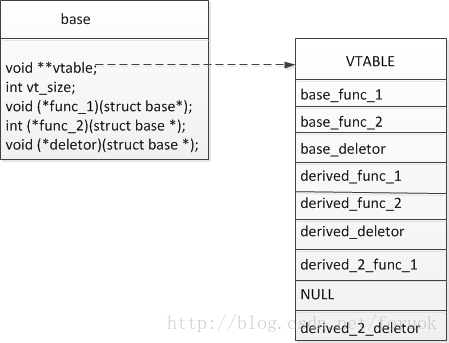

### C语言面向对象编程（三）：虚函数与多态

在《 C++ 编程思想》一书中对虚函数的实现机制有详细的描述，一般的编译器通过虚函数表，在编译时插入一段隐藏的代码，保存类型信息和虚函数地址，而在调用时，这段隐藏的代码可以找到和实际对象一致的虚函数实现。

我们在这里提供一个 C 中的实现，模仿 VTABLE 这种机制，但一切都需要我们自己在代码中装配。

之前在网上看到一篇描述 C 语言实现虚函数和多态的文章，谈到在基类中保存派生类的指针、在派生类中保存基类的指针来实现相互调用，保障基类、派生类在使用虚函数时的行为和 C++ 类似。我觉得这种方法有很大的局限性，不说继承层次的问题，单单是在基类中保存派生类指针这一做法，就已经违反了虚函数和多态的本意——多态就是要通过基类接口来使用派生类，如果基类还需要知道派生类的信息……。

我的基本思路是：

- 在“基类”中显式声明一个 `void**`成员，作为数组保存基类定义的所有函数指针，同时声明一个 int 类型的成员，指明 `void*` 数组的长度。
- “基类”定义的每个函数指针在数组中的位置、顺序是固定的，这是约定，必须的
- 每个“派生类”都必须填充基类的函数指针数组（可能要动态增长），没有重写虚函数时，对应位置置 0
- “基类”的函数实现中，遍历函数指针数组，找到继承层次中的最后一个非 0 的函数指针，就是实际应该调用的和对象相对应的函数实现

好了，先来看一点代码：

```c
struct base {  
    void ** vtable;  
    int vt_size;  
      
    void (*func_1)(struct base *b);  
    int (*func_2)(struct base *b, int x);  
};  
  
struct derived {  
    struct base b;  
    int i;  
};  
  
struct derived_2{  
    struct derived d;  
    char *name;  
};  
```

上面的代码是我们接下来要讨论的，先说一点，在 C 中，用结构体内的函数指针和 C++ 的成员函数对应， C 的这种方式，所有函数都天生是虚函数（指针可以随时修改哦）。

注意，derived 和 derived\_2 并没有定义 func\_1 和 func\_2 。在 C 的虚函数实现中，如果派生类要重写虚函数，不需要在派生类中显式声明。要做的是，在实现文件中实现你要重写的函数，在构造函数中把重写的函数填入虚函数表。

我们面临一个问题，派生类不知道基类的函数实现在什么地方（从高内聚、低耦合的原则来看），在构造派生类实例时，如何初始化虚函数表？在 C++ 中编译器会自动调用继承层次上所有父（祖先）类的构造函数，也可以显式在派生类的构造函数的初始化列表中调用基类的构造函数。怎么办？

我们提供一个不那么优雅的解决办法：

每个类在实现时，都提供两个函数，一个构造函数，一个初始化函数，前者用于生成一个类，后者用于继承层次紧接自己的类来调用以便正确初始化虚函数表。依据这样的原则，一个派生类，只需要调用直接基类的初始化函数即可，每个派生类都保证这一点，一切都可以进行下去。

下面是要实现的两个函数：

```c
struct derived *new_derived();  
void initialize_derived(struct derived *d); 
```

new 开头的函数作为构造函数， initialize 开头的函数作为 初始化函数。我们看一下 new_derived 这个构造函数的实现框架：

```c
struct derived *new_derived()  
{  
    struct derived * d = malloc(sizeof(struct derived));  
    initialize_base((struct base*)d);  
    initialize_derived(d);/* setup or modify VTABLE */  
    return d;  
}  
```

如果是 derived\_2 的构造函数 new\_derived\_2，那么只需要调用 initialize\_derived 即可。

说完了构造函数，对应的要说析构函数，而且析构函数要是虚函数。在删除一个对象时，需要从派生类的析构函数依次调用到继承层次最顶层的基类的析构函数。这点在 C 中也是可以保障的。做法是：给基类显式声明一个析构函数，基类的实现中查找虚函数表，从后往前调用即可。函数声明如下：

```c
struct base {  
    void ** vtable;  
    int vt_size;  
      
    void (*func_1)(struct base *b);  
    int (*func_2)(struct base *b, int x);  
    void (*deletor)(struct base *b);  
};  
```

说完构造、析构，该说这里的虚函数表到底是怎么回事了。我们先画个图，还是以刚才的 base 、 derived 、derived_2 为例来说明，一看图就明白了：




我们假定 derived 类实现了三个虚函数， derived\_2 类实现了两个，func\_2 没有实现，上图就是 derived\_2 的实例所拥有的最终的虚函数表，表的长度（ vt_size ）是 9 。如果是 derived 的实例，就没有表中的最后三项，表的长度（ vt_size ）是 6 。

必须限制的是：基类必须实现所有的虚函数，只有这样，这套实现机制才可以运转下去。因为一切的发生是从基类的实现函数进入，通过遍历虚函数表来找到派生类的实现函数的。

当我们通过 base 类型的指针（实际指向 derived\_2 的实例）来访问 func\_1 时，基类实现的 func\_1 会找到 VTABLE 中的 derived_2_func_1 进行调用。

好啦，到现在为止，基本说明白了实现原理，至于 初始化函数如何装配虚函数表、基类的虚函数实现，可以根据上面的思路写出代码来。按照我的这种方法实现的虚函数，通过基类指针访问，行为基本和 C++ 一致。

### 示例代码

多态，面向接口编程等设计方法并没有绑定到任何特定的语言上，使用纯C也可以实现简单的多态概念。下面给出一个非常简单粗糙的例子，只为说明概念。

父类Animal定义，文件：animal.h

```c
#ifndef ANIMAL_H
#define ANIMAL_H

// 方法表, 类似于C++的虚函数表
typedef struct vtable vtable;
struct vtable
{
    void (*eat)();
    void (*bite)();
};

typedef struct Animal Animal;
struct Animal
{
    const vtable* _vptr;  // 每一个对象都有一个指向虚表的指针
};

/*
 如果不用虚表的话，每个对象都要包含所有的接口函数指针, 而实际上所有同类型对象的这些指针的值是相同的,造成内存浪费。
 接口函数是和类型一对一的，而不是和对象一对一。

struct Animal
{
    void (*eat)();
    void (*bite)();
};
*/

#endif
```

子类Dog，文件dog.h

```c
#ifndef DOG_H
#define DOG_H

#include "animal.h"

typedef struct Dog Dog;
struct Dog
{
    Animal base_obj;
    int x;
};

Animal* create_dog();

#endif
```

dog.c

```c
#include <stdio.h>
#include <stdlib.h>
#include "dog.h"

static void dog_eat()
{
    printf("dog_eat()\n");
};

static void dog_bite()
{
    printf("dog_bite()\n");
};

/* 虚表是在编译时确定的 */
static const vtable dog_vtable = {
    dog_eat,
    dog_bite
};

Animal* create_dog()
{
    Dog * pDog = malloc(sizeof(Dog));
    if(pDog){
        pDog->base_obj._vptr = &dog_vtable; /*运行时，绑定虚表指针*/
        pDog->x = 0;
    }
    return (Animal*)pDog;
}
```

另一个子类Cat, 文件cat.h

```c
#ifndef CAT_H
#define CAT_H

#include "animal.h"

typedef struct Cat Cat;
struct Cat
{
    Animal base_obj;
    float y;
};

Animal* create_cat();

#endif
```

cat.c

```c
#include <stdio.h>
#include <stdlib.h>
#include "animal.h"
#include "cat.h"

static void cat_eat()
{
    printf("cat_eat()\n");
};

static void cat_bite()
{
    printf("cat_bite()\n");
};

static const vtable cat_vtable = {
    cat_eat,
    cat_bite
};

Animal* create_cat()
{
    Cat * pCat = malloc(sizeof(Cat));
    if(pCat){
        pCat->base_obj._vptr = &cat_vtable;
        pCat->y = 0.0;
    }
    return (Animal*)pCat;
}
```

主文件 main.c

```c
#include <stdio.h>
#include "animal.h"
#include "cat.h"
#include "dog.h"

void ShowBite(Animal* pAnimal)
{
    pAnimal->_vptr->bite();
}
void main()
{
    ShowBite(create_dog());
    ShowBite(create_cat());
}
```