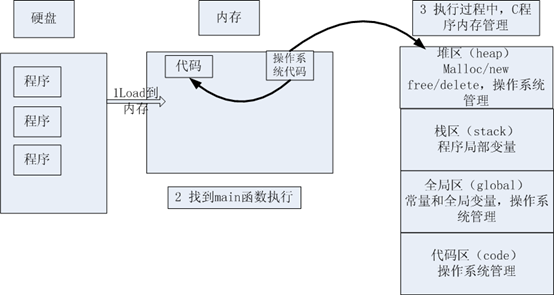
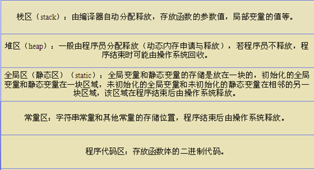
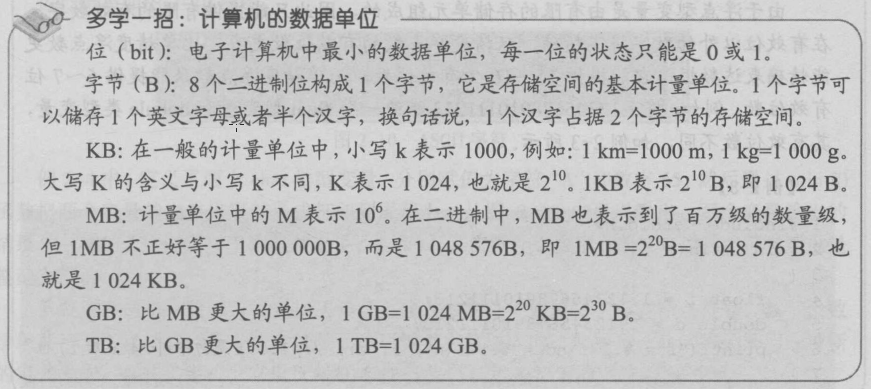

### 数据类型和运算符

- 数据存储的原理
  - 进制：十进制，二进制，八进制，十六进制
  - 进制转换
  - 源码、反码、补码
  - 源码、反码、补码的应用
- 关键字和标识符
- 常量和变量
- 运算符

### 声明和定义

什么是定义：所谓的定义就是(编译器)创建一个对象，为这个对象分配一块内存并给它取上一个名字，这个名字就是我们经常所说的变量名或对象名。但注意，这个名字一旦和这块内存匹配起来(可以想象是这个名字嫁给了这块空间，没有要彩礼啊。^_^)，它们就同生共死，终生不离不弃。并且这块内存的位置也不能被改变。一个变量或对象在一定的区域内（比如函数内，全局等）只能被定义一次，如果定义多次，编译器会提示你重复定义同一个变量或对象。

什么是声明：有两重含义，如下：

第一重含义：告诉编译器，这个名字已经匹配到一块内存上了(伊人已嫁，吾将何去何从？何以解忧，唯有稀粥)，下面的代码用到变量或对象是在别的地方定义的。声明可以出现多次。

第二重含义：告诉编译器，我这个名字我先预定了，别的地方再也不能用它来作为变量名或对象名。比如你在图书馆自习室的某个座位上放了一本书，表明这个座位已经有人预订，别人再也不允许使用这个座位。其实这个时候你本人并没有坐在这个座位上。这种声明最典型的例子就是函数参数的声明，例如：

```c
void fun(int i, char c);
```

定义声明最重要的区别：定义创建了对象并为这个对象分配了内存，声明没有分配内存(一个抱伊人，一个喝稀粥。^_^)。

### 静态存储区的理解

```c
#define  _CRT_SECURE_NO_WARNINGS 
#include <stdlib.h>
#include <string.h>
#include <stdio.h>

char * getStr1()
{
	char *p1 = "hello";
	return p1;
}
char *getStr2()
{
	char *p2 = "hello";
	return p2;
}

void main()
{
	char *p1 = NULL;
	char *p2 = NULL;
	p1 = getStr1();
	p2 = getStr2();

	//打印p1 p2 所指向内存空间的数据
	printf("p1:%s , p2:%s \n", p1, p2);

	//打印p1 p2 的值
	printf("p1:%d , p2:%d \n", p1, p2);
  
	system("pause");
	return ;
}
```

运行结果

```
p1:hello , p2:hello
p1:4210688 , p2:4210688
```

### 字符型：char

#### 字符变量的定义和输出

字符型变量用于存储一个单一字符，在 C 语言中用 char 表示，其中每个字符变量都会占用 1 个字节。在给字符型变量赋值时，需要用一对英文半角格式的单引号(' ')把字符括起来。

字符变量实际上并不是把该字符本身放到变量的内存单元中去，而是将该字符对应的 ASCII 编码放到变量的存储单元中。char的本质就是一个1字节大小的整型。

#### ASCII对照表

 ASCII编码是一个标准，其内容规定了把英文字母、数字、标点、字符转换成计算机能识别的二进制数的规则，并且得到了广泛认可和使用。

（1）ASCII非打印控制字符：ASCII表上的数字0-31分配给了控制字符，用于控制像打印机等一些外围设备（参详ASCII码表中0-31）。

（2）ASCII打印字符：数字32-126 分配给了能在键盘上找到的字符，当查看或打印文档时就会出现。数字127代表DELETE命令（参详ASCII码表中32-127）。

| ASCII值 | 控制字符 | ASCII值 | 字符      | ASCII值 | 字符   | ASCII值 | 字符   |
| ------ | ---- | ------ | ------- | ------ | ---- | ------ | ---- |
| 0      | NUT  | 32     | (space) | 64     | @    | 96     | 、    |
| 1      | SOH  | 33     | !       | 65     | A    | 97     | a    |
| 2      | STX  | 34     | "       | 66     | B    | 98     | b    |
| 3      | ETX  | 35     | #       | 67     | C    | 99     | c    |
| 4      | EOT  | 36     | $       | 68     | D    | 100    | d    |
| 5      | ENQ  | 37     | %       | 69     | E    | 101    | e    |
| 6      | ACK  | 38     | &       | 70     | F    | 102    | f    |
| 7      | BEL  | 39     | ,       | 71     | G    | 103    | g    |
| 8      | BS   | 40     | (       | 72     | H    | 104    | h    |
| 9      | HT   | 41     | )       | 73     | I    | 105    | i    |
| 10     | LF   | 42     | *       | 74     | J    | 106    | j    |
| 11     | VT   | 43     | +       | 75     | K    | 107    | k    |
| 12     | FF   | 44     | ,       | 76     | L    | 108    | l    |
| 13     | CR   | 45     | -       | 77     | M    | 109    | m    |
| 14     | SO   | 46     | .       | 78     | N    | 110    | n    |
| 15     | SI   | 47     | /       | 79     | O    | 111    | o    |
| 16     | DLE  | 48     | 0       | 80     | P    | 112    | p    |
| 17     | DCI  | 49     | 1       | 81     | Q    | 113    | q    |
| 18     | DC2  | 50     | 2       | 82     | R    | 114    | r    |
| 19     | DC3  | 51     | 3       | 83     | S    | 115    | s    |
| 20     | DC4  | 52     | 4       | 84     | T    | 116    | t    |
| 21     | NAK  | 53     | 5       | 85     | U    | 117    | u    |
| 22     | SYN  | 54     | 6       | 86     | V    | 118    | v    |
| 23     | TB   | 55     | 7       | 87     | W    | 119    | w    |
| 24     | CAN  | 56     | 8       | 88     | X    | 120    | x    |
| 25     | EM   | 57     | 9       | 89     | Y    | 121    | y    |
| 26     | SUB  | 58     | :       | 90     | Z    | 122    | z    |
| 27     | ESC  | 59     | ;       | 91     | [    | 123    | {    |
| 28     | FS   | 60     | <       | 92     | /    | 124    | \|   |
| 29     | GS   | 61     | =       | 93     | ]    | 125    | }    |
| 30     | RS   | 62     | >       | 94     | ^    | 126    | `    |
| 31     | US   | 63     | ?       | 95     | _    | 127    | DEL  |

ASCII 码大致由以下两部分组成：

- ASCII 非打印控制字符： ASCII 表上的数字 0-31 分配给了控制字符，用于控制像打印机等一些外围设备。
- ASCII 打印字符：数字 32-126 分配给了能在键盘上找到的字符，当查看或打印文档时就会出现。数字 127 代表 Del 命令。

#### 转义字符

| 转义字符 | 含义                      | ASCII码值（十进制） |
| ---- | ----------------------- | ------------ |
| \a   | 警报                      | 007          |
| \b   | 退格(BS) ，将当前位置移到前一列      | 008          |
| \f   | 换页(FF)，将当前位置移到下页开头      | 012          |
| \n   | 换行(LF) ，将当前位置移到下一行开头    | 010          |
| \r   | 回车(CR) ，将当前位置移到本行开头     | 013          |
| \t   | 水平制表(HT)  （跳到下一个TAB位置）  | 009          |
| \v   | 垂直制表(VT)                | 011          |
| \\\\ | 代表一个反斜线字符"\"            | 092          |
| \'   | 代表一个单引号（撇号）字符           | 039          |
| \"   | 代表一个双引号字符               | 034          |
| \?   | 代表一个问号                  | 063          |
| \0   | 数字0                     | 000          |
| \ddd | 8进制转义字符，d范围0~7          | 3位8进制        |
| \xhh | 16进制转义字符，h范围0~9，a~f，A~F | 3位16进制       |

### 类型限定符

| 限定符      | 含义                                       |
| -------- | ---------------------------------------- |
| extern   | 声明一个变量，extern声明的变量没有建立存储空间。  extern int a; |
| const    | 定义一个常量，常量的值不能修改。  const int a = 10;      |
| volatile | 防止编译器优化代码                                |
| register | 定义寄存器变量，提高效率。register是建议型的指令，而不是命令型的指令，如果CPU有空闲寄存器，那么register就生效，如果没有空闲寄存器，那么register无效。 |

### 程序的内存四区模型



流程说明

1. 操作系统把物理硬盘代码load到内存
2. 操作系统把c代码分成四个区
3. 操作系统找到main函数入口执行

各区元素分析



### 位操作

左移<<：左边移出去的二进制位丢弃，右边空出的二进制位补0，X << n = X * 2<sup>n</sup>

右移>>：左边的二进制位补0或者补1（如果操作数是无符号数或有符号正数就补0，如果是有符号负数就补1），右边的二进制位丢弃，X >> n = X / 2<sup>n</sup>

### 计算机中的数据单位



| 术语        | 含义                                       |
| --------- | ---------------------------------------- |
| bit(比特)   | 一个二进制代表一位，一个位只能表示0或1两种状态。数据传输是习惯以“位”（bit）为单位。 |
| Byte(字节)  | 一个字节为8个二进制，称为8位，计算机中存储的最小单位是字节。数据存储是习惯以“字节”（Byte）为单位。 |
| WORD(双字节) | 2个字节，16位                                 |
| DWORD     | 两个WORD，4个字节，32位                          |
| 1b        | 1bit，1位                                  |
| 1B        | 1Byte,1字节，8位                             |
| 1k，1K     | 1024                                     |
| 1M(1兆)    | 1024k, 1024*1024                         |
| 1G        | 1024M                                    |
| 1T        | 1024G                                    |
| 1Kb(千位)   | 1024bit,1024位                            |
| 1KB(千字节)  | 1024Byte，1024字节                          |
| 1Mb(兆位)   | 1024Kb = 1024 * 1024bit                  |
| 1MB(兆字节)  | 1024KB = 1024 * 1024Byte                 |

### 链接

C变量有3种链接属性

- 外部链接：可以在多文件中使用（全局作用域），跨文件访问
- 内部链接：只能在源代码文件和它所包含的头文件中使用（文件作用域）
- 无链接：块作用域、函数作用域、函数原型作用域，局部变量（auto的、static的）就是无链接的

存储类别说明符

- auto 自动变量
- static 内链接，static修饰的函数和全局变量，外部文件无法访问，只有文件内部才能够进行访问
- extern 修饰全局变量，可以实现跨文件访问变量
- register 寄存器变量
- typedef
- _thread_local

### 多文件


