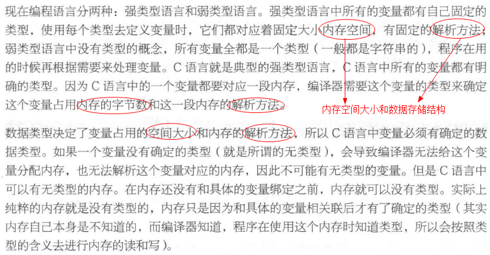
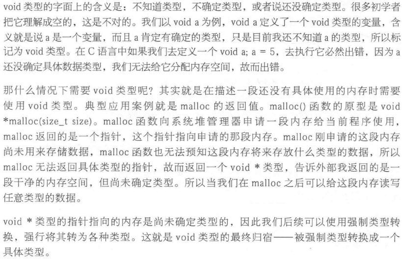
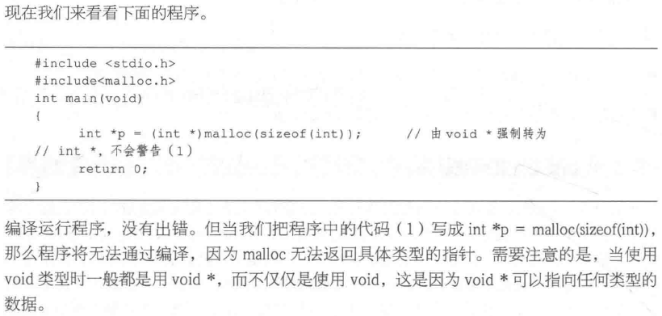

### void 类型

万能类型，在需要时再具体指定；在描述一段还没有具体使用的内存时需要使用void类型。

void * 类型的指针指向的内存是尚未确定类型的，因此我们后续可以使用强制类型转换，强行将其转为各种类型。这就是void类型的最终归宿——被强制类型转换成一个具体的类型。

void \* 万能指针，void \* 可以指向任何类型的数据，在32位系统下，占4个字节

```c
void* malloc(size_t size)
int *p = (int *)malloc(sizeof(int));
```
void类型的本质







#### void的作用

void 真正发挥的作用在于：

- 对函数参数的限定：当不需要传入参数时，即 `function (void);`
- 对函数返回值的限定：当函数没有返回值时，即 `void function(void);`

众所周知，如果指针p1 和p2 的类型相同，那么我们可以直接在p1 和p2 间互相赋值；如果p1 和p2 指向不同的数据类型，则必须使用强制类型转换运算符把赋值运算符右边的指针类型转换为左边指针的类型。

例如：

```c
float *p1;
int *p2;
p1 = p2;
```


其中p1 = p2 语句会编译出错，提示“= : cannot convert from int * to float *”，必须改为：`p1 = (float *)p2;`

而void *则不同，任何类型的指针都可以直接赋值给它，无需进行强制类型转换：

```c
void *p1;
int *p2;
p1 = p2;
```

但这并不意味着，void *也可以无需强制类型转换地赋给其它类型的指针。因为“空类型”可以包容“有类型”，而“有类型”则不能包容“空类型”。比如，我们可以说“男人和女人都是人”，但不能说“人是男人”或者“人是女人”。下面的语句编译出错：

```c
void *p1;
int *p2;
p2 = p1;
```

提示"=: cannot convert from void * to int * "

#### void指针的作用

(1) void指针可以指向任意的数据类型，即任意类型的指针可以赋值给void指针

```c
int *a;
void *p;
p=a;
```
如果void指针赋值给其他类型，则需要强制转换；`a=（int *）p;`

(2) 在ANSI C标准中不允许对void指针进行算术运算，因为没有特定的数据类型，即在内存中不知道移动多少个字节；而在GNU标准中，认为void指针和char指针等同。

#### 应用

(1) void指针一般用于应用的底层，比如malloc函数的返回类型是void指针，需要再强制转换		
(2) 文件句柄HANDLE也是void指针类型，这也是句柄和指针的区别；		
(3) 内存操作函数的原型也需要void指针限定传入参数：

```c
void * memcpy (void *dest, const void *src, size_t len);
void * memset (void *buffer, int c, size_t num );
```
(4) 面向对象函数中底层对基类的抽象。