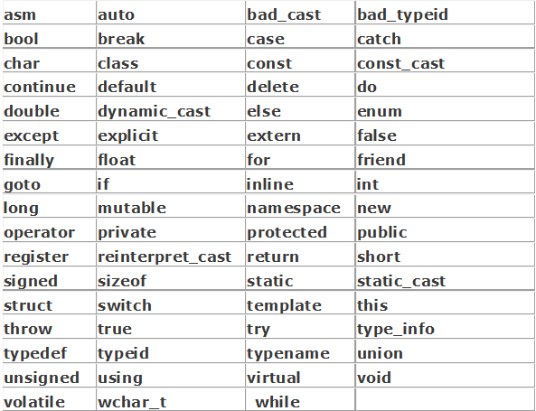

关键字，C的关键字共有32个



- 数据类型关键字（12个）

  char，short，int，long，float，double，unsigned，signed，struct，union，enum，void

- 控制语句关键字（12个）

  if，else，switch，case，default，for，do，while，break，continue，goto，return

- 存储关键字（5个）

  auto，extern，register，static，const

- 其它关键字（3个）

  sizeof，typedef，volatile

#### goto 关键字

一般来说，编码的水平与goto 语句使用的次数成反比。有的人主张慎用但不禁用goto语句，但我主张禁用。关于goto 语句的更多讨论可以参看Steve McConnell 的名著《CodeComplete. Second Edition》。

自从提倡结构化设计以来，goto 就成了有争议的语句。首先，由于goto 语句可以灵活跳转，如果不加限制，它的确会破坏结构化设计风格；其次，goto 语句经常带来错误或隐患。它可能跳过了变量的初始化、重要的计算等语句，例如：

```c
struct student *p = NULL;
…
goto state;
p = (struct student *)malloc(…); //被goto 跳过,没有初始化
⋯
state:
//使用p 指向的内存里的值的代码
⋯
```

如果编译器不能发觉此类错误，每用一次goto 语句都可能留下隐患。

#### 最易变的关键字 —— volatile

volatile 会自动从内存读取，防止变量被意外修改而不知道。

volatile 是易变的、不稳定的意思。很多人根本就没见过这个关键字，不知道它的存在。也有很多程序员知道它的存在，但从来没用过它。我对它有种“杨家有女初长成,养在深闺人未识” 的感觉。

volatile 关键字和const 一样是一种类型修饰符，用它修饰的变量表示可以被某些编译器未知的因素更改，比如操作系统、硬件或者其它线程等。遇到这个关键字声明的变量，编译器对访问该变量的代码就不再进行优化，从而可以提供对特殊地址的稳定访问。

先看看下面的例子：

```c
int i=10;
int j = i；//(1)语句
int k = i；//(2)语句
```

这时候编译器对代码进行优化，因为在（1）、（2）两条语句中，i 没有被用作左值。这时候编译器认为i 的值没有发生改变，所以在（1）语句时从内存中取出i 的值赋给j 之后，这个值并没有被丢掉，而是在（2）语句时继续用这个值给k 赋值。编译器不会生成出汇编代码重新从内存里取i 的值，这样提高了效率。但要注意：（1）、（2）语句之间i 没有被用作左
值才行。

再看另一个例子：

```c
volatile int i=10;
int j = i；//(3)语句
int k = i；//(4)语句
```

volatile 关键字告诉编译器i 是随时可能发生变化的，每次使用它的时候必须从内存中取出i的值，因而编译器生成的汇编代码会重新从i 的地址处读取数据放在k 中。这样看来，如果i 是一个寄存器变量或者表示一个端口数据或者是多个线程的共享数
据，就容易出错，所以说volatile 可以保证对特殊地址的稳定访问。

但是注意：在VC++6.0 中，一般Debug 模式没有进行代码优化，所以这个关键字的作用有可能看不出来。你可以同时生成Debug 版和Release 版的程序做个测试。

留一个问题：const volatile int i=10；这行代码有没有问题？如果没有，那i 到底是什么属性？

```c
#include<stdio.h>
#include<stdlib.h>
#include<time.h>

void main1()
{
	{
		time_t start, end;

		double res = 0;
		time(&start);//获取时间，传递给start
      	//volatile强制每次从内存读取，防止变量被意外修改而不知道
		for (volatile int i = 0; i < 3000000000; i++)
		{
			res += i;
		}

		printf("\n%f", res);
		time(&end);//获取结束时间
		printf("\nvolatile消耗时间%fs", difftime(end, start));
	}
	system("pause");
}

void main()
{
	time_t start, end;

	double res = 0;
	time(&start);//获取时间，传递给start
  	//register寄存器变量，i在CPU寄存器保证速度
	for (register int i = 0; i < 3000000000; i++)
	{
		res += i;
	}

	printf("%f", res);
	time(&end);//获取结束时间
	printf("\n消耗时间%fs", difftime(end, start));
	system("pause");
}
```

#### typedef

给一个已经存在的数据类型（注意：是类型不是变量）取一个别名，而非定义一个新的数据类型。