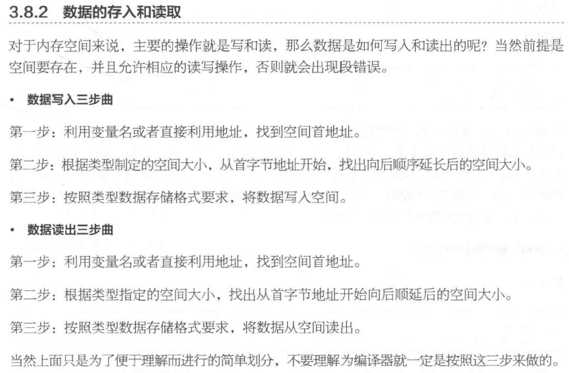
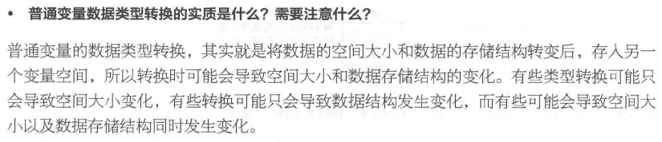
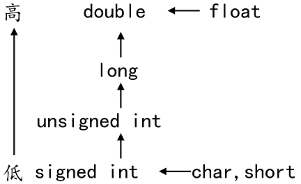
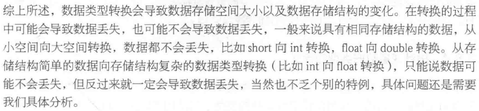

### 强制类型转换

隐式类型转换：隐式类型转换又称为自动类型转换，隐式类型转换可分为三种：算术转换、赋值转换和输出转换。

显式类型转换：显式类型转换又称为强制类型转换，指的是使用强制类型转换运算符，将一个变量或表达式转化成所需的类型，这种类型转换可能会造成数据的精度丢失。 



数据有不同的类型，不同类型数据之间进行混合运算时必然涉及到类型的转换问题。



转换的方法有两种：

- 自动转换(隐式转换)：遵循一定的规则,由编译系统自动完成。
- 强制类型转换：把表达式的运算结果强制转换成所需的数据类型。

类型转换的原则：占用内存字节数少(值域小)的类型，向占用内存字节数多(值域大)的类型转换，以保证精度不降低。



```c
float a = 12.34;
int b = (int)a;
```

- 创建临时变量X（int类型）
- 将 float a 的整数部分赋值给X
- 将 X 赋值给b
- 销毁 X



- float和double之间的数据转换：

由于浮点型变量是由有限的存储单元组成的，因此只能提供有限的有效数字。在有效位以外的数字将被舍去，这样可能会产生一些误差，例如，将3.1415926赋给一个float型变量，但它只能保证前7位是有效的。