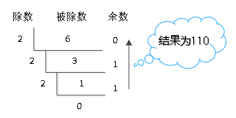
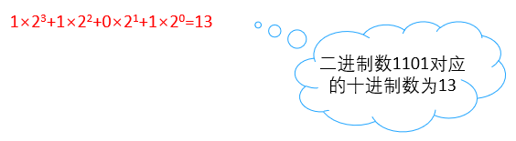
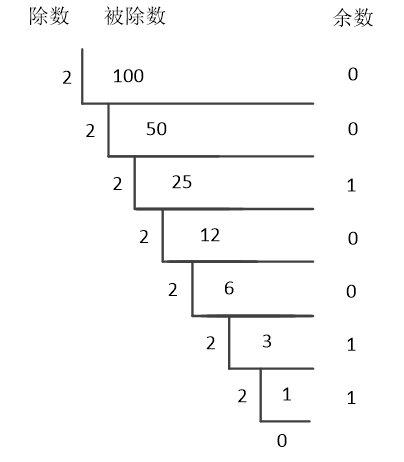
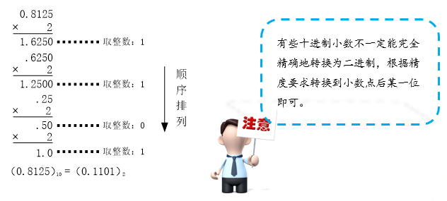

### 进制转换

#### 十进制转换为二进制

十进制转换成二进制可以采用除2取余的方式，也就是说将要转换的数，先除以2，获得商和余数，将商继续除以2，获得商和余数，此过程一直重复直到商为0。最后将所有得到的余数倒序排列，即可得到转换结果。



#### 二进制转换为十进制

二进制转化成十进制要从右到左用二进制位上的每个数去乘以2的相应次方。

以二进制数1101为例，将其转换为十进制形式，转换方式如下：



#### 二进制转换为八进制

二进制转换为八进制，有一个技巧，就是将二进制数自右向左每三位分成一段（若不足三位，左边用0补齐），然后将二进制每段的三位转为八进制的一位，转换过程中数值的对应关系如下表所示。

| 二进制  | 八进制  |
| ---- | ---- |
| 000  | 0    |
| 001  | 1    |
| 010  | 2    |
| 011  | 3    |
| 100  | 4    |
| 101  | 5    |
| 110  | 6    |
| 111  | 7    |

#### 二进制转换为八进制

以00101010转换为八进制，具体演算过程如下。

- 每三位分成一段，结果为：000 101 010
- 将每段的数值分别查表替换，结果如下

```
010 → 2
101 → 5
000 → 0
```

- 将替换的结果进行组合，组合后的八进制为0052

#### 十六进制转换为八进制

将二进制转为十六进制时，将二进制数每四位分成一段（若不足4位用0补齐），再查表转换即可。二进制转十六进制过程中数值的对应关系如下表所示。

| 二进制  | 十六进制 |      | 二进制  | 十六进制 |
| ---- | ---- | ---- | ---- | ---- |
| 0000 | 0    |      | 1000 | 8    |
| 0001 | 1    |      | 1001 | 9    |
| 0010 | 2    |      | 1010 | A    |
| 0011 | 3    |      | 1011 | B    |
| 0100 | 4    |      | 1100 | C    |
| 0101 | 5    |      | 1101 | D    |
| 0110 | 6    |      | 1110 | E    |
| 0111 | 7    |      | 1111 | F    |

#### 案例实现

十进制的100转换成二进制



### 小数二进制

十进制小数转换为二进制采用“乘2取整”的方式。方法是用2乘以十进制小数部分，将结果中的整数部分去掉，再次用2乘以余下的小数部分，并去掉其结果的整数部分；如此继续下去，直到余下的小数部分为0或满足所要求的精度为止。最后将每次得到的整数部分（0或1）按先后顺序排列，即为小数对应的二进制。



### 浮点型数据在内存中的存储方式


浮点数包含符号位、小数位和指数位三部分。例如，小数3.14159在内存中的符号位为“+”，小数部分为.31415，指数位为1，连方式接在一起即为 “+0.314159 * 10<sup>1</sup>  =  3.14159”。

在C语言中，一个小数会被默认为double类型的值，因此在为一个float类型的变量赋值时需要注意一点，所赋值的后面一定要加上字母“F”（或者小写“f”），而为double类型的变量赋值时，其所赋值后面的字符“D”（或小写“d”），可以省略。

### 补码

正数：原码 = 反码 = 补码，负数：反码 = 原码取反，补码 = 原码取反加1

负数以补码的形式在计算机中存储

```c
#include<stdio.h>
#include<stdlib.h>

void main3()
{
	//printf不会进行数据类型转换
	printf("%d", (int)10.3);//printf不管你是什么类型，按照%d ,%f解析数据
	printf("\n%f", (float)10);
	getchar();
}

void  main4()
{
	int num = 100;
	printf("%p", &num);//不同的解释方式就有不同的解释结果

	getchar();
}

void   main5()
{
	char ch = 1,ch1='1';//字符与编号的区别
	printf("%d,%d", ch,ch1);

	getchar();
}

void   main6()
{
	//解析的时候，与数据的长度有关系
	unsigned short num = 65535+1;
	printf("刘宁波有%d元", num);
	//  99
	// 100
	getchar();
}

void   main7()
{
	//补码，计算机存储数据的方式
	short num = -1;
	printf("%d", num);
	printf("\n%u", num);//%u 0-正整数

	getchar();
}
```

```c
#include <stdio.h>
#include <stdlib.h>
#include <limits.h>

//01.负数不能采用无符号类型的变量进行存储:
//  1.会造成数据被解析的过大
//  2.无符号类型的变量只能存储正数
// 负数的二进制通常很大,因为以1作为开头
//  所以存储的时候不能用无符号进行存储
//  否则存储的数据实体过大
int main01(void)
{
    unsigned int num = -1;//1111 1111 1111 1111 1111 1111 1111 1111
    printf("%u", num);

    for (int i = 0; i < num; i++)
    {//循环10次
        printf("你好天朝! \n");
    }

    system("pause");
    return 1;
}

//02.计算机当中的整数存储原理:
//  1.所有的整数都采用补码存储
//  2.原码-->反码-->补码:
//      正整数的原码,反码,补码一致
//      负整数的原码,反码,补码特点:
//          原码:该负数所对应的正整数的原码最高位加符号位(1)
//          反码:该负数所对应的原码的符号位不变,其余为取反
//          补码:该负数所对应的反码+1
//  3.采用补码的优点:
//      提升运算效率,减少不必要的计算操作
//      将以前的多步骤运算进行精简
//      例如:统一了+-法的差异,全部采用加法,符号位转到补码的表示当中
//          举例:1-1-2-2<==>1+(-1)+(-2)+(-3)-->统一为加法运算法则
int main02(void)
{
    char ch = -17;//计算机都是补码存储,手机,电脑,服务器也同样采用补码进行整数的存储
    //0001 0001 +17的原码
    //1001 0001 -17的原码
    //1111 1110 -17的反码
    //1111 1111 -17的补码 EF-->十六进制
    printf("%p \n", &ch);

    system("pause");
    return 1;
}

//03.有符号和无符号的推理法则:
//  1.-1所对应的内存二进制数据是:
//      1111 1111 1111 1111 1111 1111 1111 1111
//  2.对内存二进制数据的解析方式:
//      %d:按照有符号的解析法则(负数倒推)
//          补码-->反码-->原码-->负数
//          例如:-1的补码
//              1111 1111 补码
//              1111 1110 反码
//              1000 0001 原码-->就是-1
//      %u:按照无符号的解析法则(整数倒推)
//          补码=原码-->证书
//              1111 1111-->就是255
int main03(void)
{
    int num = -1;
    //0000 0000 0000 0000 0000 0000 0000 0001 +1原码
    //1000 0000 0000 0000 0000 0000 0000 0001 - 1原码
    //1111 1111 1111 1111 1111 1111 1111 1110 - 1反码
    //1111 1111 1111 1111 1111 1111 1111 1111 - 1补码
    printf("%d \n", num);
    printf("%u \n", num);

    system("pause");
    return 1;
}

int main04(void)
{
    printf("INT_MIN = %d, INT_MAX = %d \n", INT_MIN, INT_MAX);

    system("pause");
    return 1;
}

//04.特殊数据的二进制数值:
//  -1的内存二进制数据全是1
//      按照有符号解析得出-1
//      按照无符号解析就是一个整数最大值
//  越界现象解释:
//      物极必反的二进制数据转换特点
int main05(void)
{
    int num = -1;
    unsigned int data = 42949697295u;//无符号数据 1111 1111 1111 1111 1111 1111 1111 1111全部的是数据,并且按照正整数的方式进行解析
    int num1 = 4294967295u;//等价于32个二进制的1
    unsigned int data1 = -1;//等价于32个二进制的1

    printf("%d \n", num);//-1
    printf("%u \n", num);//4294967295
    printf("%d \n", num1);//-1
    printf("%u \n", num1);//4294967295
    printf("%u \n", data);//4294967295
    printf("%d \n", data);//-1
    printf("%u \n", data1);//4294967295
    printf("%d \n", data1);//-1
    printf("%f \n", 1);//printf,不管三七二十一,抓区二进制数据就解析

    system("pause");
    return 1;
}

int main06(void)
{
    printf("INT_MIN = %d, INT_MAX = %d \n", INT_MIN, INT_MAX);
    printf("INT_MIN = %d, INT_MAX + 1 = %d \n", INT_MIN, INT_MAX + 1);
    printf("INT_MIN - 1 = %d, INT_MAX = %d \n", INT_MIN - 1, INT_MAX);

    printf("UINT_MIN = %d, UINT_MAX = %d \n", 0, UINT_MAX);
    printf("UINT_MIN = %d, UINT_MAX + 1 = %d \n", 0, UINT_MAX + 1);
    printf("UINT_MIN - 1 =%d, UINT_MAX = %d \n", 0 - 1, UINT_MAX);

    system("pause");
    return 1;
}
```
### 计算机补码原理

```c
#include<stdio.h>
#include<stdlib.h>
#include<limits.h>

void main10()
{
	int x = 1;
	int y = -1;//补码

	printf("x=%p,y=%p", &x, &y);
  
	system("pause");
}

void  main123()
{
	//int  unsigned int  4个字节32位
	//有符号，0代表正数，1代表负数

	//0111 1111 1111 1111 1111 1111 1111 1111
	//1111 1111 1111 1111 1111 1111 1111 1111//无符号，正数，全部都是数据

	printf("%d,%d", INT_MAX, INT_MIN);//%d只能显示INT_MIN->INT_MAX
	printf("\n%d,%d", INT_MAX+1, INT_MIN-1);
	printf("\n%u,%u", UINT_MAX, 0);
	printf("\n%u,%u", UINT_MAX+1, 0-1);//%u   0->UINT_MAX

	system("pause");
}

void main1234()
{
	int x = 4294967295;
	int y = -1;
	//1111 1111 1111 1111 1111 1111 1111 1111内存的存储方式
	//无符号，没有符号位，全部都是数据 4294967295

	//0000 0000 0000 0000  0000 0000 0000 0001 1原码
	//1000 0000 0000 0000  0000 0000 0000 0001 -1的原码
	//1111 1111 1111 1111  1111 1111 1111 1110 -1的反码
	//1111 1111 1111 1111  1111 1111 1111 1111 -1的补码
	
	printf("%d，%u", x,x);
	printf("\n%d,%u", y, y);
	getchar();
}

void  main()
{
	unsigned int num = -1;
	//1111 1111 1111 1111 1111 1111 1111 1111内存的存储方式
	printf("%d,%u", num, num);

	system("pause");
}
```