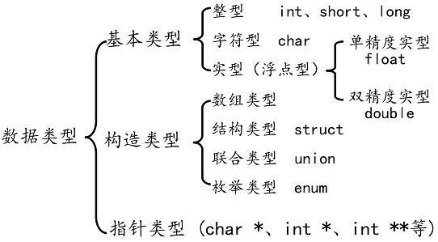

### 数据类型

数据类型的作用：编译器预算对象（变量）分配的内存空间大小。

数据类型决定：内存容器的宽度；数据解析方式。内存当中的二进制数据需要按照指定的方式进行解析,得到相应的解析结果



数据类型的本质是固定内存大小的别名

数据类型决定了变量占用的空间大小和内存的解析方法（存储结构）

类型对于编译器来说，主要就是用于说明数据存储空间的大小以及数据的存储结构

数据类型的作用是：编译器预算对象（变量）分配的内存空间大小

求数据类型的大小：sizeof(int *)，注意：sizeof()是运算符，不是函数

```c
void main31()
{
	int a; //告诉c编译器分配4个字节的内存
	int b[10] ; //告诉c编译器分配40个自己内存

	printf("b:%d, b+1:%d, &b:%d, &b+1:%d \n", b, b+1, &b, &b+1);

	printf("sizeof(b):%d \n", sizeof(b));  //40
	printf("sizeof(a):%d \n ", sizeof(a)); //4
 	//b 代表的数组首元素的地址
	//&b代表的是整个数组的地址  
  	system("pause");
}
```
### 数据类型别名

数据类型可以理解为固定大小内存块的别名，可以使用typedef关键字给已存在的数据类型起别名

```c
struct Teacher
{
	char name[64];
	int age;
}Teacher;

typedef struct Teacher2
{
	char name[64];
	int age;
}Teacher2;
//数据别名 typedef

typedef int u32;

void main33()
{
	int a; //告诉c编译器分配4个字节的内存
	int b[10] ; //告诉c编译器分配40个字节内存

	struct Teacher t1;

	Teacher2 t2;
	t1.age = 31;

	printf("u32:%d \n", sizeof(u32));

	{
		char *p2 = NULL;
		void *p1 = NULL;
		p2 = (char *)malloc(100);
		p1 = &p2;
	}
	{
		//void a;//编译器不知道如何分配内存
	}

	system("pause");
}
```
### C99语法补充_Bool

```c
#include <stdio.h>
#include <stdlib.h>

//01.在C99语法当中引入了基于C语言的布尔类型:
//  1._Bool类型
//  2.占用单个字节
//  3.true(非0)|false(0)-->单个字节存储
int main01(void)
{
    _Bool bl = 10;//true|false 非0|0

    printf("%d \n", bl);
    printf("%d \n", sizeof(bl));//一个字节
    bl ? printf("周瑞富爱凤姐! \n") : printf("周瑞富不爱凤姐! \n");

    system("pause");
    return 1;
}
```