论浮点数的存储原理:float浮点数与double浮点数的二进制存储原理–>阶码 

### 浮点数转二进制 

1.整数int类型和浮点数float类型都是占用4个字节,在计算机中有32位来进行表示,那为什么什么float的范围大于int？ 

答:因为两者的存储原理一样,虽然该同样是采用二进制的方式进行存储,但是整数类型(int)采用的是补码方式进行存储,但是浮点类型(float)采用的是阶码方式存储.由于阶码内部的存储原理和指数相关,所以采用同样大小的二进制码可以表示更大范围的浮点数据. 

2.浮点数(float类型)的精度为6~7位,只有这个范围内的浮点数才是精确的,只要过了这个位数的浮点数都存在可能精确和可能不精确的情况,比如1.66\*10^10(指数形式的浮点数)转化成为整数形式,所得到的结果并不是预期的结果16600000000,反而,描述实数的阶码(指数越大的等同原理)越大,误差越大. 

3.浮点数类型(float)和浮点数类型(double)在计算机当中的存储方式都遵从IEEE的规范,而且两种浮点类型在IEEE当中又有子规范类型,float遵从的是R32.24规范,double遵从的是R64.53规范 

4.无论浮点类型是单精度(float)还是双精度(double)在计算机当中的二进制码表示都分为三个部分: 

(1).符号位(Sign):0代表正数,1代表负数 
无论是float还是double,符号位都只占用一个二进制位 

(2).阶码位(Exponent):用于存储科学计[算法](http://lib.csdn.net/base/datastructure)中的指数数据,并且采用了移位存储原理. 
float的阶码位占用8个二进制位,double的阶码位占用11个二进制位 

(3).尾数部分(Mantissa):尾数部分 
float的尾数位占用23个二进制位,double的尾数位占用52二进制位 

5.图形化参考方式: 

 

图形化解释:将一个float类型的浮点数据转化为内存存储格式的步骤详解 

(1).先将这个实数的绝对值转化为规格化二进制. 

(2).将这个二进制格式的实数的小数点左移或者右移n位,知道小数点移动到第一个有效数字的右边. 

(3).从小数点右边第一位开始输出23位数字放入二进制位当中的第0~22位中(总共23位存储尾数). 

(4).如果实数是正的,则在第31位处的位置放入”0”,如果是负数则在31位处放置”1”. 

(5).如果n是左移得到的,则将n减去1后化为二进制,并在左边加”0”,补足7位,放入到第29位到底23位之间,如果n是右移得到的货n=0,则将n化为二进制后在左边加”0”补足7位,再个位进行求反,再放入到第29位到底23位之间。 

(6).第5个步骤还有另外一种解释: 
将其描述成为1.xxxx*2的n次方–>其中的n就是所谓的指数 
再用最终的指数+127=阶码对应的十进制数据–>转化成为二进制数据就行了–>放置到阶码位 
如果是float+127,如果是double+1023得到阶码位(指数位) 

6.额外补充内容: 

R32.24和R64.53的存储方式都是用科学计数法来存储数据的,比如8.25用十进制的科学计数法表示 就为:8.25×10^0,而120.5可以表示为1.205×10^2;而计算机根本不认识十进制的数据,它只认识0和1,所以在计算机存储中,首先要将上面的数更改为二进制的科学计数法表示,8.25用二进制表示可表示为1000.01,120.5用二进制表示可表示为1110110.1;用二进制的科学计数法表示1000.01可表示为1.00001×2^3,而1110110.1则可表示为1.1101101×2^6,任何一个数的科学计数法都可表示为1.xxx×2^n;因此尾数部分就可表示为xxx,反正第一位都是1,故可将小数点前面的1省略,故23bit的尾数部分,可以表达的精度却变成了24bit,道理就是在这里;那24bit能精确到小数点后的几位呢?我们知道9的二进制表示为1001,所以4bit能精确十进制中的1位小数点,24bit就能使float能精确到小数点后6位;另算上可以估读最后一位,故有效位数为7位.而对于指数部分,因为指数可正可负,8位的指数位能表示的指数范围就应该为-127至128了,所以指数部分的存储采用移位存储,存储的数据为原数据加127,下面就看看8.25和120.5在内存中真正的存储方式.首先看下8.25,用二进制的科学计数法表示1.00001×2^3。按照上面的存储方式,符号位为0,表示为正;指数位为3+127=130(二进制值10000010转十进制表示即为130);尾数部分为00001,故8.25的存储方式如下图所示: 

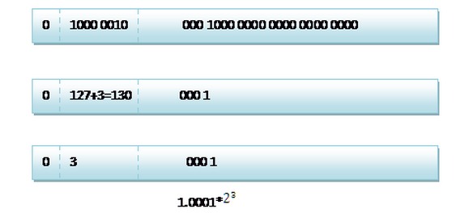 

120.5的存储方式 

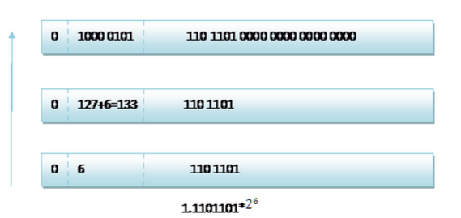 

二进制转浮点数 

将一个内存存储的float二进制格式转化为十进制的步骤: 

(1).将第22位到第0位的二进制数写出来,在最左边补一位1,得到二十四位有效数字.将小数点点在最左边那个1的右边. 
(2).取出第29到第23位所表示的值n,当30位是0时将n各位求反;当30位是1时将n增1. 
(3).将小数点左移n位(当30位是0时)或右移n位(当30位是1时),得到一个二进制表示的实数, 
(4).将这个二进制实数化为十进制,并根据第31位是0还是1加上正号或负号即可.那么如果给出内存中一段数据,并且告诉你是单精度存储的话,你如何知道该数据的十进制数值呢?其实就是对上面的反推过程,比如给出如下内存数据:0100001011101101000000000000,首先我们现将该数据分段,0 10000 0101 110 1101 0000 0000 0000 0000,在内存中的存储就为下图所示: 

 

根据我们的计算方式,可以计算出,这样一组数据表示为1.1101101*2^6=120.5 
二双精度浮点数(doube)的存储和单精度的存储大同小异,不同的只是阶码部分(指数部分)和尾数部分的位数不同而已,但是推导法则一模一样

### 对C语言中递归算法的深入解析 

[c语言](http://lib.csdn.net/base/c)通过运行时堆栈支持递归函数的实现.递归函数就是直接或间接调用自身的函数.许多教科书都把计算机阶乘和菲波那契数列用来说明递归,非常不幸我们可爱的著名的老潭老师的《C语言程序设计》一书中就是从阶乘的计算开始的函数递归.导致读过这本经书的同学们,看到阶乘计算第一个想法就是递归.但是在阶乘的计算里,递归并没有提供任何优越之处.在菲波那契数列中,它的效率更是低的非常恐怖.这里有一个简单的程序,可用于说明递归.程序的目的是把一个整数从二进制形式转换为可打印的字符形式.例如:给出一个值4267,我们需要依次产生字符’4’,’2’,’6’和’7’.就如在printf函数中使用了%d格式码,它就会执行类似处理.我们采用的策略是把这个值反复除以10,并打印各个余数.例如,4267除10的余数是7,但是我们不能直接打印这个余数.我们需要打印的是机器字符集中表示数字’7’的值.在ASCII码中,字符’7’的值是55,所以我们需要在余数上加上48来获得正确的字符,但是,使用字符常量而不是整型常量可以提高程序的可移植性.’0’的ASCII码是48,所以我们用余数加上’0’所以有下面的关系: 
‘0’ + 0 = ‘0’; 
‘0’ + 1 = ‘1’; 
‘0’ + 2 = ‘2’; 
…… 
从这些关系中,我们很容易看出在余数上加上’0’就可以产生对应字符的代码.接着就打印出余数.下一步再取商的值,4267/10等于426.然后用这个值重复上述步骤.这种处理方法存在的唯一问题是它产生的数字次序正好相反,它们是逆向打印的.所以在我们的程序中使用递归来修正这个问题.我们这个程序中的函数是递归性质的,因为它包含了一个对自身的调用.乍一看,函数似乎永远不会终止.当函数调用时,它将调用自身,第2次调用还将调用自身,以此类推,似乎永远调用下去.这也是我们在刚接触递归时最想不明白的事情.但是,事实上并不会出现这种情况.这个程序的递归实现了某种类型的螺旋状while循环.while循环在循环体每次执行时必须取得某种进展,逐步迫近循环终止条件.递归函数也是如此,它在每次递归调用后必须越来越接近某种限制条件.当递归函数符合这个限制条件时.它便不在调用自身.在程序中,递归函数的限制条件就是变quotient为零.在每次递归调用之前,我们都把quotient除以10,所以每递归调用一次,它的值就越来越接近零.当它最终变成零时,递归便告终止. 

```c
/接受一个整型值(无符号0,把它转换为字符并打印它,前导零被删除/
#include <stdio.h>
int binary_to_ascii( unsigned int value)
{
          unsigned int quotient;

   　　quotient = value / 10;
   　　if( quotient != 0)
       　　　　binary_to_ascii( quotient);
   　　putchar ( value % 10 + '0' );
}
```

递归是如何帮助我们以正确的顺序打印这些字符呢?下面是这个函数的工作流程. 
1.将参数值除以10. 
2.如果quotient的值为非零,调用binary-to- ascii打印quotient当前值的各位数字 
3.接着,打印步骤1中除法运算的余数 

注意:在第2个步骤中,我们需要打印的quotient当前值的各位数字.我们所面临的问题和最初的问题完全相同,只是变量quotient的值变小了.我们用刚刚编写的函数(把整数转换为各个数字字符并打印出来)来解决这个问题.由于quotient的值越来越小,所以递归最终会终止.一旦你理解了递归,阅读递归函数最容易的方法不是纠缠于它的执行过程,而是相信递归函数会顺利完成它的任务.如果你的每个步骤正确无误,你的限制条件设置正确,并且每次调用之后更接近限制条件,递归函数总是能正确的完成任务.但是,为了理解递归的工作原理,你需要追踪递归调用的执行过程,所以让我们来进行这项工作.追踪一个递归函数的执行过程的关键是理解函数中所声明的变量是如何存储的.当函数被调用时,它的变量的空间是创建于运行时堆栈上的.以前调用的函数的变量扔保留在堆栈上,但他们被新函数的变量所掩盖,因此是不能被访问的.当递归函数调用自身时,情况于是如此.每进行一次新的调用,都将创建一批变量,他们将掩盖递归函数前一次调用所创建的变量.当我追踪一个递归函数的执行过程时,必须把分数不同次调用的变量区分开来,以避免混淆.程序中的函数有两个变量:参数value和局部变量quotient.下面的一些图显示了堆栈的状态,当前可以访问的变量位于栈顶,所有其他调用的变量饰以灰色的阴影,表示他们不能被当前正在执行的函数访问.假定我们以4267这个值调用递归函数.当函数刚开始执行时,堆栈的内容如下图所示: 

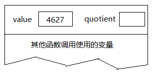

执行除法之后，堆栈的内容如下

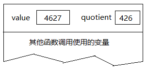

接着，if语句判断出quotient的值非零，所以对该函数执行递归调用。当这个函数第二次被调用之初，堆栈的内容如下

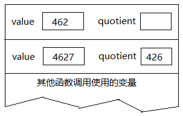

堆栈上创建了一批新的变量，隐藏了前面的那批变量，除非当前这次递归调用返回，否则他们是不能被访问的。再次执行除法之后，堆栈的内容如下

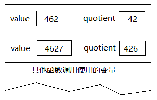

quotient的值现在为42，仍然非零，所以需要继续执行递归调用，并再创建一批变量。执行完这次调用的除法运算之后，堆栈的内容如下

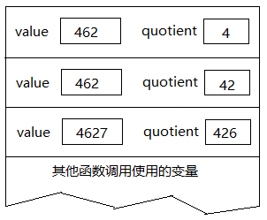

此时，quotient的值还是非零，仍然需要继续执行递归调用。在执行除法运算之后，堆栈的内容如下

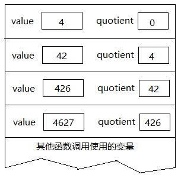

不算递归调用语句本身,到目前为止所执行的语句只是除法运算以及对quotient的值进行[测试](http://lib.csdn.net/base/softwaretest).由于递归调用这些语句重复执行,所以它的效果类似循环:当quotient的值非零时,把它的值作为初始值重新开始循环.但是,递归调用将会保存一些信息(这点与循环不同),也就好是保存在堆栈中的变量值.这些信息很快就会变得非常重要.现在quotient的值变成了零,递归函数便不再调用自身,而是开始打印输出.然后函数返回,并开始销毁堆栈上的变量值.每次调用putchar得到变量value的最后一个数字,方法是对value进行模10取余运算,其结果是一个0到9之间的整数.把它与字符常量’0’相加,其结果便是对应于这个数字的ASCII字符,然后把这个字符打印出来.输出4: 


接着函数返回，它的变量从堆栈中销毁。接着，递归函数的前一次调用重新继续执行，它所使用的是自己的变量，他们现在位于堆栈的顶部。因为它的value是42，所以调用putchar后打印出来的数字是2

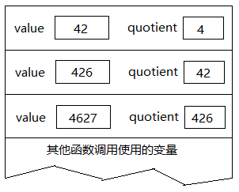

接着递归函数的这次调用也返回，它的变量也被销毁，此时位于堆栈顶部的是递归函数再前一次调用的变量。递归调用从这个位置继续执行，这次打印的数字是6。在这次调用返回之前，堆栈的内容如下，输出426

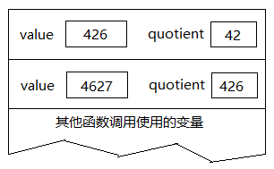

现在我们已经展开了这个递归过程，并回到该函数最初的调用。这次调用打印出数字7，也就是它的value参数除10的余数。输出4267

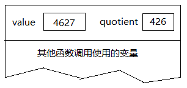

然后,这个递归函数就彻底返回到其他函数调用它的地点.如果你把打印出来的字符一个接一个排在一起,出现在打印机或屏幕上,你将看到正确的值:4267使用递归一定要有跳出的条件:这是一个最简单的递归,不过它会一直执行,可用 Ctrl+C 终止.

```c
#include <stdio.h>
void prn(int num) {
    printf("%d/n", num);
    if (num > 0) prn(--num);  
}
int main(void)
{
    prn(9);
    getchar();
    return 0;
}
```

```c
//实例:翻转字符串
#include <stdio.h>
void revers(char *cs);
int main(void)
{
    revers("123456789");
    getchar();    
    return 0;
}
void revers(char *cs)
{
    if (*cs)
    { 
        revers(cs + 1);
        putchar(*cs);
    }
}
```

```c
//实例:阶乘
#include <stdio.h>
int factorial(int num);
int main(void)
{
    int i;
    for (i = 1; i <= 9; i++)
    printf("%d: %d/n", i, factorial(i));
    getchar();    
    return 0;
}
int factorial(int num)
{
    if (num == 1)
        return(1);
    else
        return(num * factorial(num-1));
}
```

```c
//实例:整数到二进制
#include <stdio.h>
void IntToBinary(unsigned num);
int main(void)
{
    IntToBinary(255); /* 11111111 */
    getchar();
    return 0;
}
void IntToBinary(unsigned num) {
    int i = num % 2;
    if (num > 1) IntToBinary(num / 2);
    putchar(i ? '1' : '0'); 
//    putchar('0' + i);  /* 可代替上面一句 */
}
```

```c
//剖析递归:
#include <stdio.h>
void prn(unsigned n);
int main(void)
{
    prn(1);
    getchar();
    return 0;
}
void prn(unsigned n) {
    printf("%d: %p\n", n, &n);  /* A */
    if (n < 4) 
        prn(n+1);               /* B */
    printf("%d: %p\n", n, &n);  /* C */
}
```

运行结果

```
1: 0062FE30
2: 0062FE00
3: 0062FDD0
4: 0062FDA0
4: 0062FDA0
3: 0062FDD0
2: 0062FE00
1: 0062FE30
```

分析: 
程序运行到A,输出了第一行. 
此时n=1,满足<4的条件,继续执行B开始了自调用(接着会输出第二行);注意n=1时语句C还有待执行. 
……如此循环,一直到n=4,A可以执行,但因不满足条件B执行不了了;终于在n=4时得以执行C.但此时内存中有四个函数都等待返回(分别是n=1,2,3,4时), 咱们分别叫它f1,f2,f3,f4.f4执行C输出了第五行,函数返回,返回给f3(此时n=3),f3得以继续执行C,输出了第六行. 
f3–>f2–>继续C,输出了第七行. 
f2–>f1–>继续C,输出了第八行, 执行完毕! 
如此看来,递归函数还是很费内存的(有时不如直接使用循环),但的确很巧妙.