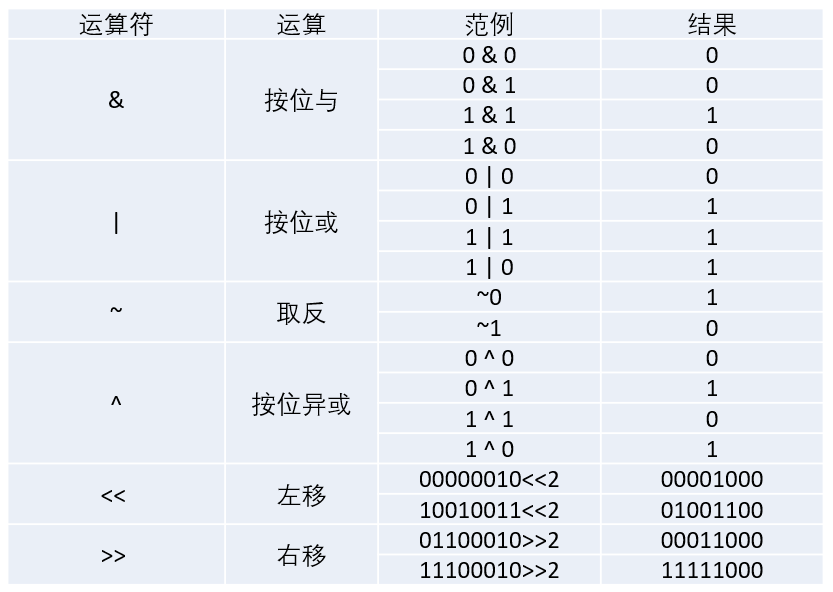

## 常用运算符分类

运算符是用来操作数据的，因此，这些数据也被称为操作数，使用运算符将操作数连接而成的式子称为表达式。表达式具有如下特点：

- 常量和变量都是表达式
- 运算符的类型对应表达式的类型
- 每一个表达式都有自己的值，即表达式都有运算结果。

| 运算符类型     | 作用                  |
| --------- | ------------------- |
| 算术运算符     | 用于处理四则运算            |
| 赋值运算符     | 用于将表达式的值赋给变量        |
| 比较运算符     | 用于表达式的比较，并返回一个真值或假值 |
| 逻辑运算符     | 用于根据表达式的值返回真值或假值    |
| 位运算符      | 用于处理数据的位运算          |
| sizeof运算符 | 用于求字节数长度            |

## 算术运算符

| 运算符  | 术语     | 示例          | 结果        |
| ---- | ------ | ----------- | --------- |
| +    | 正号     | +3          | 3         |
| -    | 负号     | -3          | -3        |
| +    | 加      | 10 + 5      | 15        |
| -    | 减      | 10 - 5      | 5         |
| *    | 乘      | 10 * 5      | 50        |
| /    | 除      | 10 / 5      | 2         |
| %    | 取模(取余) | 10 % 3      | 1         |
| ++   | 前自增    | a=2; b=++a; | a=3; b=3; |
| ++   | 后自增    | a=2; b=a++; | a=3; b=2; |
| --   | 前自减    | a=2; b=--a; | a=1; b=1; |
| --   | 后自减    | a=2; b=a--; | a=1; b=2; |

### 自增自减运算符

运算符“++”为自增运算符。在进行自增运算时，如果运算符放在变量的前面则是先进行自增运算，再参与其他运算。反之，如果运算符放在操作数的后面则是先进行运算，再进行自增。

运算符“--”为自减运算符，它与操作数结合的含义与自增运算符是相同的。

## 赋值运算符

赋值运算符的作用是将常量、变量或表达式的值赋给某一个变量。

| 运算符  | 术语   | 示例         | 结果        |
| ---- | ---- | ---------- | --------- |
| =    | 赋值   | a=2; b=3;  | a=2; b=3; |
| +=   | 加等于  | a=0; a+=2; | a=2;      |
| -=   | 减等于  | a=5; a-=3; | a=2;      |
| *=   | 乘等于  | a=2; a*=2; | a=4;      |
| /=   | 除等于  | a=4; a/=2; | a=2;      |
| %=   | 模等于  | a=3; a%2;  | a=1;      |

## 比较运算符

C 语言的比较运算中， “真”用数字“1”来表示， “假”用数字“0”来表示。

| 运算符  | 术语   | 示例     | 结果   |
| ---- | ---- | ------ | ---- |
| ==   | 相等于  | 4 == 3 | 0    |
| !=   | 不等于  | 4 != 3 | 1    |
| <    | 小于   | 4 < 3  | 0    |
| >    | 大于   | 4 > 3  | 1    |
| <=   | 小于等于 | 4 <= 3 | 0    |
| >=   | 大于等于 | 4 >= 1 | 1    |

## 逻辑运算符

| 运算符  | 术语   | 示例       | 结果                            |
| ---- | ---- | -------- | ----------------------------- |
| !    | 非    | !a       | 如果a为假，则!a为真；  如果a为真，则!a为假。    |
| &&   | 与    | a && b   | 如果a和b都为真，则结果为真，否则为假。          |
| \|\| | 或    | a \|\| b | 如果a和b有一个为真，则结果为真，二者都为假时，结果为假。 |

## 位运算符

位运算符是针对二进制数的每个二进制位进行运算的符号，它是专门针对数字0和1进行操作的。C语言中的位运算符及其范例如下表所示。



## 运算符优先级

同数学中的运算符一样，计算中各种运算符也具有优先级，用来明确表达式中所有运算符参与运算的先后顺序。

| 优先级  | 运算符                                      |
| ---- | ---------------------------------------- |
| 1    | .   []  ()                               |
| 2    | ++   --  ~  !  (数据类型)                    |
| 3    | *   /  %                                 |
| 4    | +   -                                    |
| 5    | <<  >>   >>>                             |
| 6    | <   > <=  >=                             |
| 7    | ==   !=                                  |
| 8    | &                                        |
| 9    | ^                                        |
| 10   | \|                                       |
| 11   | &&                                       |
| 12   | \|\|                                     |
| 13   | ?:（三目运算符）                                |
| 14   | =   *=  /=  %=   +=  -=  <<=   >>=  >>>=  &=   ^=  \|= |

## 表达式

在程序中，运算符是用来操作数据的，因此，这些数据也被称为操作数，使用运算符将操作数连接而成的式子称为表达式。

表达式具有如下特点：

- 常量和变量都是表达式，例如，常量3.14、变量i。
- 运算符的类型对应表达式的类型，例如，算术运算符对应算术表达式。

每一个表达式都有自己的值，即表达式都有运算结果。

## 赌博机的实现

- time()
- srand()
- rand()

```c
#include <stdio.h>
#include <stdlib.h>
#include <time.h>

//01.赌博问题模拟:
//  1.随机生成0~100之间的数字
//  2.生成的数字在>=80之间的数字
//      概率为20%
//02.随机数生成要素:
//  1.随机数种子
//  2.种植数种子
//  3.随机数函数
//  4.求余运算符
int main01(void)
{
    time_t ts;
    unsigned int num = time(&ts);//根据时间生成随机数种子
    srand(num);

    int data = rand() % 100;//随机数的生成依赖于随机数种子
    printf("%d \n", data);

    system("pause");
    return 1;
}

int main02(void)
{
    time_t ts;
    unsigned int num = (unsigned int)time(&ts);
    srand(num);

    int data = rand() % 100;
    printf("%d \n", data);
    data >= 90 ? printf("赢了 \n") : printf("输了 \n");

    system("pause");
    return 1;
}
```