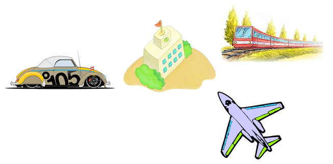
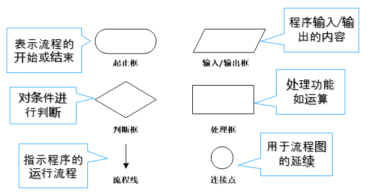

## 算法

算法（Algorithm）是解决特定问题的步骤描述。问题的解决方案就是算法，例如，新学期开学，从家到学校的交通方式这个问题，就有很多解决方案。

一个算法，尤其是一个成熟的算法，应该具有以下五个特性：

（1）确定性：算法的每一步都有确定的含义，不会出现二义性。

（2）可行性：算法的每一步都是可执行的，通过执行有限次操作来实现其功能。

（3）有穷性：一个算法必须在执行有穷步骤之后结束，且每一步都可在有穷时间内完成。

（4）输入：算法具有零个或多个输入。

（5）输出：算法至少具有一个或多个输出。

## 流程图

流程图是描述问题处理步骤的一种常用图形工具，它是由一些图框和流程线组成的。使用流程图描述问题的处理步骤，形象直观，便于阅读。

