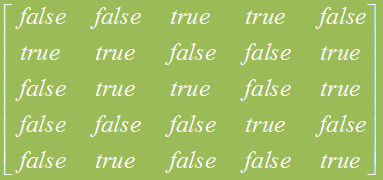

## 阶乘

可以用循环的方法，即从1开始，乘2，再乘3­…..一直乘到n。这种方法容易理解，也容易实现

由于n! = n× (n-1)! 数学里定义0！＝1，从而n!可以用下面的递归公式表示：


```c
int p(int n){
  	if(n == 0){
      	return 1;
  	}else{
      	return n*p(n-1);
  	}
}
```

递归的执行过程


递归与迭代的选择：

- 对于大多数常用的递归都有简单、等价的迭代程序。究竟使用哪一种，凭你的经验选择。
- 迭代程序复杂，但效率高。
- 递归程序逻辑清晰，但往往效率较低。

## 斐波那契数列

兔子在出生两个月后，就有繁殖能力，一对兔子每个月能生出一对小兔子来。如果所有兔都不死，那么一年以后可以繁殖多少对兔子？


```c
int  f(int n){
   if(n==0){
     	return 0;
   }else if(n==1){
     	return 1;
   }else{
     	return (f(n-1)+f(n-2));
   }        
}
```

实现效率分析：消费的时间是灾难性的！！！

Fibonacci函数的迭代实现

```c
int f(int n)
{ int i, fn, fn_1 = 0, fn_2 = 1;
  if (n == 0) return 0;
  if (n == 1) return 1;
  for ( i = 2; i<=n; ++i)
     { fn = fn_1 + fn_2;
        fn_2 = fn_1; fn_1 = fn; }
 return fn;
}
```

消耗的时间：执行n次加法和3n次赋值！！！

系统考虑：对递归函数的每次调用都需要内存空间。由于很多调用的活动都是同时进行的，操作系统可能会耗尽可用的内存,避免在处理过大的n时产生溢出问题。

## 数字旋转方阵（蛇阵）

数字旋转方阵如图所示。编程输出任意N*N的蛇阵。


用递归的观点看问题

- 先填最外圈，然后再填内部内部的填法同上。也是先填最外圈，再填内部。
- 根据上述思想，可以设计一个递归函数fill。该函数先填外圈，然后递归调用自己填内部。

函数原型：

```c
void fill(int number, int begin, int size)
// number：表示要填入的起始数据
// begin：表示要填的起始位置
// size：蛇阵的规模
```
要生成一个6*6的蛇阵只要调用：fill(1,0,6)

```c
#include<iostream>
using namespace std; 

int p[20][20];
void fill( int, int, int );

int main()
{
	int row, col, size;
	cout << "请输入蛇阵的规模：";
	cin >> size;
	fill( 1, 0, size );
	
	for ( row = 0; row < size; row++ )
	{
		cout << endl;
		for ( col = 0; col < size; col++ ){
			cout << p[row][col] << '\t';
		}
	}
	return 0;
}

void fill( int number, int begin, int size )
{
	int i, row = begin, col = begin;
	
	if ( size == 0 ) return;
		
	if ( size == 1 )
	{
		p[begin][begin] = number; 
		return;
	}
	
	p[row][col] = number++;
	
	for ( i = 0; i < size - 1; i++ )
	{
		p[++row][col] = number++;
	}
	
	for ( i = 0; i < size - 1; i++ )
	{
		p[row][++col] = number++;
	}
	
	for ( i = 0; i < size - 1; i++ )
	{
		p[--row][col] = number++;
	}
	
	for ( i = 0; i < size - 2; i++ )
	{
		p[row][--col] = number++;
	}
	
	fill( number, begin + 1, size - 2 );
}
```

- 自上而下填最左列
- 自左而右填最下行
- 自下而上填最右列
- 自右而左填最上行
- 递归调用fill，规模减2，起始位置为原来的下一行下一列，填入的起始数字为填入一圈后的第一个数字。

## 汉诺塔问题


目标：将A上的盘子全部移到B上

规则：每次只能移动一个盘子；不允许大盘子放在小盘子上

解题思路：

- 最简单的情况，只有一个盘子：将盘子直接从A移到B
- 大于一个盘子的情况：
  - 将除了最下面一个盘子外的所有盘子从A移到C
  - 将最下面的盘子从A移到B
  - 将C上的盘子移回B

```c
void  Hanoi(int n,  char start, char finish, char temp){ 
  	if (n==1){
      	cout << start << "->" << finish << '\t';
  	}else {  
      	Hanoi(n-1, start, temp, finish);
        cout << start << "->" << finish << '\t';
        Hanoi(n-1, temp, finish, start);
    }
}
```

## 基于递归的算法

- 回溯法
- 分治法
- 动态规则

## 回溯法

- 首先暂时放弃问题规模大小的限制，并将问题的候选解按某种顺序逐一枚举和检验。当发现候选解不可能是解时，就选择下一候选解。如果当前候选解除了不满足规模要求外，满足其他所有要求时，继续扩大当前候选解的规模，并继续试探。如果当前的候选解满足包括问题规模在内的所有要求时，该候选解就是问题的一个解。
- 寻找下一候选解的过程称为回朔。
- 扩大当前候选解的规模，并继续试探的过程称为向前试探。
- 分书问题和八皇后都是典型的回溯法问题

### 实例：分书问题

有编号为0，1，2，3，4的5本书，准备分给5个人A，B，C，D，E，每个人的阅读兴趣用一个二维数组描述：

- Like\[i][j] = true  i喜欢书j
- Like\[i][j] = false  i不喜欢书j

写一个程序，输出所有皆大欢喜的分书方案

存储设计：

- 用一个二维数组like存储用户的兴趣
- take[i] = j表示第i本书分给了第j个人。如果第i本书尚未被分配，给take[i]一个特殊值，如-1。


解题思路：

设计一个函数trynext(i)给第i个人分书。

- 依次尝试把书j分给人i。

  - 如果第i个人不喜欢第j本书，则尝试下一本书，如果喜欢，并且第j本书尚未分配，则把书j分配给i。

  - 如果i是最后一个人，则方案数加1，输出该方案。否则调用trynext（i+1)为第i+1个人分书。

  - 回溯。让第i个人退回书j，尝试下一个j，即寻找下一个可行的方案
- 由于在每次try中都要用到like，take以及目前找到的方案数n，因此可将它们作为全局变量，以免每次函数调用时都要带一大串参数。

```c
void trynext(int i)
{
   int j, k;
 
    for (j=0; j<5; ++j) {
        if (like[i][j] && take[j]== -1)   {        //如果i喜欢j，并且j未被分配
            take[j] = i;                           //j分给i
            if (i == 4)  {                         //找到一种新方案，输出此方案
                  n++;
                  cout << "\n第" << n << "种方案: "<< endl;
                  cout << " 书\t人" << endl;
                  for (k=0; k<5; k++)  
                        cout <<k << '\t' << char(take[k] +'A') << endl;
            }
            else  trynext(i+1);	//为下一个人分书
            take[j] = -1;	//尝试找下一方案
        }
    }
}
```

当like矩阵的值为：



调用trynext(0);的结果为：

| 书    | 人（方案1） | 人（方案2） |
| ---- | ------ | ------ |
| 0    | B      | B      |
| 1    | C      | E      |
| 2    | A      | A      |
| 3    | D      | D      |
| 4    | E      | C      |

### 实例：八皇后问题 

在一个8*8的棋盘上放8个皇后，使8个皇后中没有两个以上的皇后会在同一行、同一列或同一对角线上。

八皇后问题的求解过程：

求解过程从空配置开始，在第一列到第m列为合理配置的基础上再配置m+1列，直到第n列的配置也时合理时，就找到了一个解。另外在一列上也有n种配置。开始时配置在第一行，以后改变时，顺序选择第二行、第三行 ...... 第n行。当配置到第n行时还找不到一个合理的配置时，就要回朔，去改变前一列的配置。

```c
queen_all(k)
{   for (i = 1; i <=8; ++i)
        if (皇后放在第i行是可行的) {
             在第i行放入皇后；
             if（k == 8） 输出解；
             else queen_all(k+1);
            恢复该位置为空；
        }
}
```

棋盘的数据结构的设计：

- 比较直观的方法是采用一个二维数组，但仔细考察，就会发现，这种表示方法给调整候选解及检查其合理性会带来困难。
- 对于本题来说，我们关心的并不是皇后的具体位置，而是“一个皇后是否已经在某行和某条斜线合理地安置好了”。
- 因为在每一列上恰好放一个皇后，所以引入一个一维数组(设为col（9）)，值col[j]表示在棋盘第j列上的皇后位置。如col[3]的值为4，就表示第三列的皇后在第四行。另外，为了使程序在找完了全部解后回溯到最初位置，设定col[0]的初值为0。当回溯到第0列时，说明程序已求得全部解(或无解)，结束程序执行。

候选解的合理性检查：引入以下三个工作数组 

- 数组a[9]，a[A]=true表示第A行上还没有皇后；
- 数组b[16]，b[A]=true表示第A条右高左低斜线上没有皇后；从左上角依次编到右下角(1-15)。
- 数组c[16]，c[A]=true表示第A条左高右低斜线上没有皇后。从左下角依次编到右上角(1-15)。

```c
void queen_a11(int k) //在8x8棋盘的第k列上找合理的配置
{int i, j;
 char awn;
 for(i = 1; i < 9; i++) // 依次在l至8行上配置k列的皇后
     if ( a[i] && b[k+i-1] && c[8+k-i]) {          //可行位置 
           col[k] = i;
           a[i] = b[k+i-1] = c[8+k-i] = false;     //置对应位置有皇后
           if (k == 8) {                           // 找到一个可行解 
                 for (j = 1; j <= 8; j++)  cout << j << col[j]<< '\t' ;
	      cout << endl;
                 cin >> awn;
                 if (awn=='Q' || awn=='q') exit(0);
           }
           else  queen_a11(k+1);              //递归至第k+1列
           a[i] = b[k+i-1] = c[8+k-i] = true; //恢复对应位置无皇后
     }
}      
```

主程序

```c
int col[9];
bool a[9], b[17],c[17];

int main()
{  int j;

   for(j = 0; j <=8; j++) a[j] = true;
   for(j = 0; j <= 16; j++) b[j] = c[j] = true;
   queen_a11(1);

   return 0;
} 
```

### 实例：迷宫问题

迷宫问题是关于程序设计的一个典型问题，现在用递归的方法来求解迷宫问题。

所谓迷宫问题就是把一只老鼠从无顶盖的大盒子(迷宫)的入口处赶进迷宫。迷宫中设置了很多墙壁，对前进方向形成了多处障碍。在迷宫的唯一出口处放置了一块奶酪，吸引老鼠在迷宫中寻找通路以到达出口。

如果从迷宫的入口到达出口，途中不出现行进方向错误，则得到一条最佳路线。利用递归方法可获得迷宫从入口到出口的最佳路线。

用一个二维数组maze\[m+2]\[p+2]来表示迷宫。如图所示，当数组元素maze\[i]\[j]=1时，表示该位置是墙壁，不能通行；当maze\[i]\[j]=0时，表示该位置是通路。1≤i≤m，1≤j≤p。

数组的第0行、第m+1行，以及第0列和第p+1列是迷宫的围墙，第0列、p＋1列中各有一个0，表示迷宫的入口和出口。 


在求解迷宫问题的过程中，采用回溯法。老鼠在迷宫中任一时刻的位置可用数组行下标i和列下标j表示。从maze\[i]\[j]出发，可能的前进方向有8个，按顺时针方向为N(\[i-1]\[j])，NE(\[i-1]\[j+1])，E(\[i]\[j+1])，SE(\[i+1]\[j+1])，S(\[i+1]\[j])，SW(\[i+1]\[j-1])，W(\[i]\[j-1])，NW(\[i-1]\[j-1])


设位置\[i]\[j]标记为X，它实际是一个交通路口。X周围有8个前进方向，分别代表8个前进位置。如果某一方向是0值，表示该方向有路可通，否则表示该方向已堵死。

为了有效地选择下一位置，可以将从位置\[i]\[j]出发可能的前进方向预先定义在一个表内，参看表4-6。该表为前进方向表，它给出向各个方向的偏移量。

- 前进方向表move

| move[q].dir | move[q].a | move[q].b | move[q].dir | move[q].a | move[q].b |
| ----------- | --------- | --------- | ----------- | --------- | --------- |
| "N"         | 1         | 0         | "S"         | 1         | 0         |
| "NE"        | 1         | 1         | "SW"        | 1         | 1         |
| "E"         | 0         | 1         | "W"         | 0         | 1         |
| "SE"        | 1         | 1         | "NW"        | 1         | 1         |

```c++
struct offsets {      //位置在直角坐标系下的偏移
	int a, b;         //a，b是x，y方向的偏移
	char * dir;       //dir是方向
};
offsets move[8];      //各个方向的偏移表 
```
例如，当前位置在\[i]\[j]时，若向西南(SW)方向走，下一相邻位置\[g]\[h]则为：
g = i + move[5].a = i+1;   h = j + move[5].b = j-1;  d = move[5].dir;

当在迷宫中向前试探时，可根据表4-6所示的前进方向表，选择某一个前进方向向前试探。如果该前进方向走不通，则在前进路径上回退一步，再尝试其他的允许方向。

为了防止重走原路，另外设置一个标志矩阵mark\[m+2]\[p+2]，它的所有元素都初始化为0。一旦行进到迷宫的某个位置\[i]\[j]，则将mark\[i]\[j]置为1。下次这个位置不能再走了。

解决迷宫问题的递归算法

```c++
// 从迷宫某一位置[i][j]开始，寻找通向出口[m][p]的一条路径。
// 如果找到，则函数返回1。否则函数返回0。试探的出发点为[1][1]
int seekpath (int x, int y){
    int i, g, h;                     //用g，h记录位置信息
    char * d;                        //用d记录方向
    if (x == m && y == p) return 1;  //已到达出口，返回1
    for (i = 0; i<8; i++){   //依次对每一个方向寻找通向出口的路径
        g = x+move[i].a; 
        h = y+move[i].b;
        d = move[i].dir;     //找下一个位置和方向(g，h，dir)
        if (maze[g][h] == 0 && mark[g][h] == 0) // 下一位置可通，试探该方向
        {
                mark[g][h] = 1;                 //标记为已访问过
                if (seekpath (g , h)) 
                {   //从此位置递归试探
                    cout<<"("<<g<<"，"<<h<<")，"<<"Direction"<<dir<<"，";
                    return 1;       //试探成功，逆向输出路径坐标
                }
        }
 	//回溯，换一个方向再试探通向出口的路径
	}
    if (x == 1 && y == 1) cout<<"no path in maze"<<endl;
    return 0;
} 
```
## 分治法：递归与分而治之法

- 分：分成较小的可以递归解决的问题
- 治：从子问题的解形成原始问题的解
- 分而治之算法通常都是高效的递归算法
- 在分而治之法中，递归是“分”，额外的开销是“治”

### 最大连续子序列问题

给定(可能是负的)整数序列A1 , A2 , ... An，寻找(并标识) $\sum_{k=i}^{j}A_k$ 的值为最大的序列。如果所有的整数都是负的，那么最大连续子序列的和是零。

例如，假设输入是{-2, 11, -4, 13, -5, 2}，那么答案是20，它表示连续子序列包含了第2项到第4项（如粗体字部分）。又如第二个例子，对于输入{1, -3, 4, -2, -1, 6},答案是7，这个子序列包含最后四项。

分而治之法的解题思路：

假设输入是{4，－3，5，－2，－1，2，6，－2}。我们把这个输入划分成两部分，前四个和后四个。这样最大连续子序列的和可能出现在下面三种情况中。

- 情况1：整个位于前半部，可递归计算。
- 情况2：整个位于后半部，可递归计算。
- 情况3：从前半部开始但在后半部结束。

情况3的解决方法：

从两半部分的边界开始，通过从右到左的扫描来找到左半段的最长序列。类似地，从左到右的扫描找到右半段的最长序列。把这两个子序列组合起来，形成跨越分割边界的最大连续子序列。

在这个实例中，结果序列是从第一部分的第一个元素到第二部分的其余元素。总和是两个子序列的和，即4+7=11。

算法总结：

- 递归地计算整个位于前半部的最大连续子序列。
- 递归地计算整个位于后半部的最大连续子序列。
- 通过两个连续循环，计算从前半部开始但在后半部结束的最大连续子序列的和。
- 选择三个和中的最大值。

```c
// 找出数组a的下标从left到right之间的和值最大的子序列
// 用法：maxsum(a, 0, n-1);
int maxSum(int a[ ], int left, int right )
{	// maxLeft和maxRight分别为左、右半部的最长子序列和
    int maxLeft, maxRight, center;   
    int leftSum = 0, rightSum = 0;
    int maxLeftTmp = NEGMAX, maxRightTmp = NEGMAX; // NEGMAX最大负整数            
   
    if (left == right) return a[left] > 0 ? a[left] : 0;
    center = (left + right) / 2;  
   
    maxLeft = maxSum(a, left, center);       // 找前半部分的最大连续子序列
    maxRight = maxSum(a, center + 1, right); // 找后半部分的最大连续子序列

    //找从前半部分开始到后半部分结束的最大连续子序列
    for (int i = center; i >= left; --i){
        leftSum += a[i];
        if (leftSum > maxLeftTmp)  maxLeftTmp = leftSum;
    }
    for (i = center + 1; i <= right; ++i){
        rightSum += a[i];
        if (rightSum > maxRightTmp)  maxRightTmp = rightSum;
    }
 
    return  max3(maxLeft, maxRight, maxLeftTmp + maxRightTmp);
}

```

## 动态规划

在实际中经常会遇到一个复杂的问题不能简单地分成几个子问题，而是会分解出一系列的子问题。如果用分治法的话会使得递归调用的次数呈指数增长。如Finonacci数列的计算，第i个Fibonacci数是前两个Fibonacci数之和。

它是基于分而治之算法。在每一阶段都将当前问题分解为多个已解决的子问题

为解决递归爆炸问题，通常先找出小问题的解，记录在一个表中，在解决大问题时不需要递归，只需要从表中取出小问题的解。

### 实例：找零问题

对于一种货币，有面值为C1, C2, …, CN(分)的硬币，最少需要多少个硬币来找出K分钱的零钱。

### 贪婪法解法

我们不断使用可能的最大面值的硬币。如：硬币有1、5、10和25分的面值。我们可以通过使用2个25分、一个10分的硬币以及三个1分来找出63分钱，一共是6个硬币。 如果包含一个21分硬币时，贪心算法仍然给出一个用六个硬币的解，但是最佳的解是用三个硬币(三个都是21分的硬币。) 

### 解法1：分治法

如果我们可以用一个硬币找零，这就是最小的。否则，对于每个可能的值i，我们可以独立计算找i分钱零钱和K-i分钱需要的最小硬币数。然后选择这个和最小的i。 

### 怎样找出63分钱零钱

- 找出1分钱零钱和62分钱零钱分别需要的硬币数是1和4。因此，63分钱需要使用五个硬币。
- 找出2分钱和61分钱分别需要2和4个硬币，一共是六个硬币。
- 我们继续尝试所有的可能性。我们看到一个21分和42分的分解，它可以分别用一个和两个硬币来找开，因此，这个找零问题就可以用三个硬币解决。
- 我们需要尝试的最后一种分解是31分和32分。我们可以用两个硬币找出31分零钱，用三个硬币找出32分零钱，一共是五个硬币。
- 因此最小值是三个硬币。

```c++
int coin(int k)
{  
  	int i, tmp, int coinNum = k;
    if （能用一个硬币找零） return 1;
    for (i=1; i<k; ++i) 
       if ((tmp = coin(i) + coin(k-i)) < coinNum) 
　　　　coinNum = tmp;
    return coinNum;
}
```

上述解法分析：此算法的效率很低。事实上63分钱找零的问题是不会在一个合理的时间内解决的。就如Finbonacci 函数一样

### 解法2

- 通过指定其中的一个硬币来递归地简化问题。
- 例如，对于63分钱，我们可以给出以下找零的办法。
  - 一个1分的硬币加上递归地分派62分钱
  - 一个5分的硬币加上递归地分派58分钱
  - 一个10分的硬币加上递归地分派53分钱
  - 一个21分的硬币加上递归地分派42分钱
  - 一个25分的硬币加上递归地分派38分钱
- 该算法的问题仍然是效率问题

### 动态规划解

效率低下主要是由于重复计算造成的。因此，可把已有子问题的答案存放起来，当再次遇到此子问题时就不用重复计算了。在本例中，我们用coinsUsed[i]代表了找i分零钱所需的最小硬币数。

#### 算法思想

- 先找出0分钱的找零方法，把最小硬币数存入coinUsed[0] 
- 依次找出1分钱、2分钱…的找零方法，知道到达要找零的钱为止：
  - 对每个要找的零钱i，可以把i分解成某个coins[j]和 i - coins[j]，
  - 所需硬币数为coinUsed[i-coins[j]]+1。对所有的j，取最小的coinUsed[i-coins[j]]+1作为i元钱找零的的答案。 

```c++
// coins存放所有不同的硬币值，不同的硬币个数为differentCoins
// maxChange为要找的零钱数
void makechange( int coins[ ],  int differentCoins, 
                    int maxChange, int coinUsed[] )
{ 
  coinUsed[0] = 0; 
  for (int cents = 1; cents <= maxChange; cents++) {
         int minCoins = cents; 
         for (int j = 1; j < differentCoins; j++)  { 
                 if (coins[j] > cents) continue; 
                 if (coinUsed[ cents - coins[j] ] + 1 < minCoins) 
                       minCoins = coinUsed[ cents - coins[j] ] + 1;                   
          }
          coinUsed[cents] = minCoins; 
    }
} 
```
## 递归调戏GoogleEarth

```c
#include <stdio.h>
#include <stdlib.h>
#include <Windows.h>

//01.HWND类型的变量介绍:
//  1.窗体的唯一标识号
//  2.全局变量,谁都可以进行访问,递归函数同样可以调用
HWND win;

//打开GoogleEarth
void openGoogleEarth()
{
    ShellExecuteA(0, "open", "\"C:\\Program Files (x86)\\Google\\Google Earth\\client\\googleearth.exe\"", 0, 0, 1);
}

//GoogleEarth窗体的隐藏和显示切换
void HSGoogleEarth()
{//死循环-->反复调用-->递归的形式-->递归函数
    ShowWindow(win, SW_HIDE);//隐藏
    Sleep(1000);
    ShowWindow(win, SW_SHOW);//显示
    Sleep(1000);//实现完美间隔形式需要这行代码

    HSGoogleEarth();
}

//Google浏览器窗体的从左往右移动
void moveGoogleEarth(int n)
{//递归函数
    if (1600 == n)//当n == 1600的时候,结束递归循环
    {
        return;//跳出递归循环,进行递归函数的弹栈操作
    }
    else
    {
        SetWindowPos(win, NULL, n, 0, 500, 500, 0);//设置窗体坐标,尺寸
        Sleep(50);//休眠当前处理本函数的线程
        n += 10;//让递归循环函数趋于终止的条件
    }

    moveGoogleEarth(n);//递归调用
}

//0~1600,长度,宽度都会改变,放大
void googleEarthSmallToBig(int n)
{
    if (1600 == n)
    {
        return;//跳出递归循环结构
    }
    else
    {
        //实现从小到大,GoogleEarth有一个最小的窗口比例,最小不能小于这个窗口比例
        SetWindowPos(win, NULL, 0, 0, n, n * 768 / 1366, 0);//设置窗体坐标,尺寸
        Sleep(50);//休眠
        n += 10;
    }

    googleEarthSmallToBig(n);
}

//关闭GoogleEarth
void closeGoogleEarth()
{
    system("taskkill /f /im googleearth.exe");
}

//玩儿弄GoogleEarth
void playGoogleEarth()
{
    //寻找GoogleEarth窗体本身
    win = FindWindowA("QWidget", "Google Earth");
    if (NULL == win)
    {
        printf("GoogleEarth正在玩失踪! \n");
        return;
    }
    Sleep(2000);

    SetWindowTextA(win, "拉里佩奇!你的产品好垃圾! \n");
    Sleep(2000);

    moveGoogleEarth(0);//移动
    googleEarthSmallToBig(0);//放大
    HSGoogleEarth();//显示隐藏切换
}

int main01(void)
{
    closeGoogleEarth();
    Sleep(2000);
    openGoogleEarth();
    Sleep(5000);
    playGoogleEarth();

    system("pause");
}
```