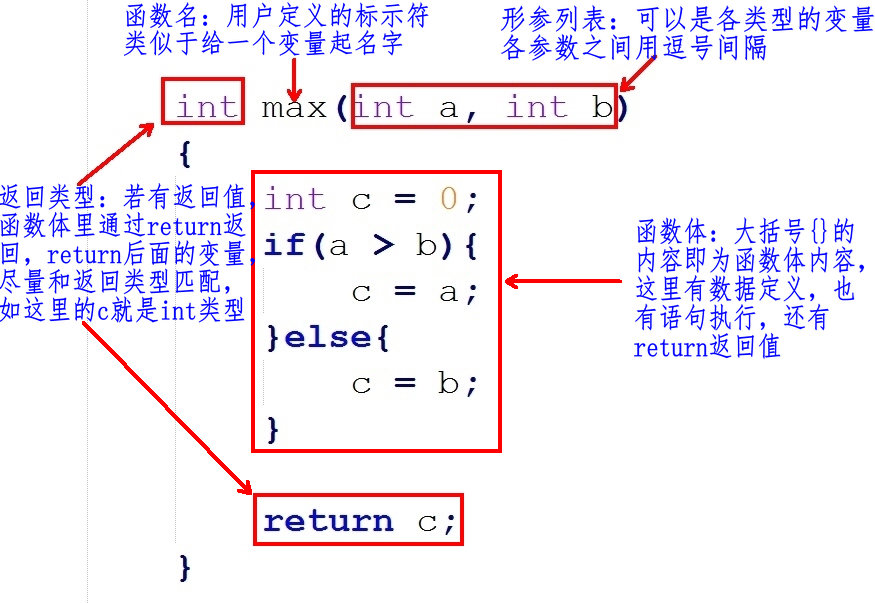
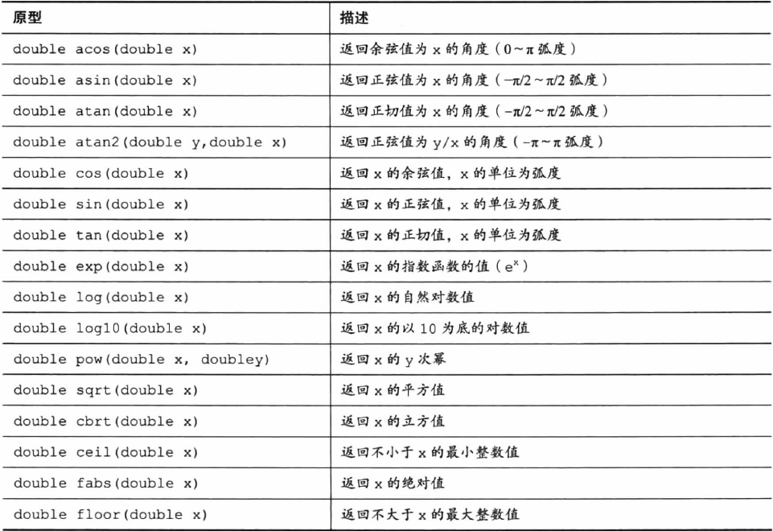
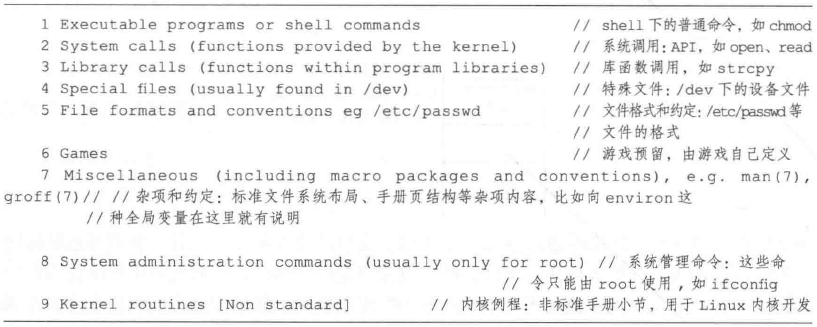
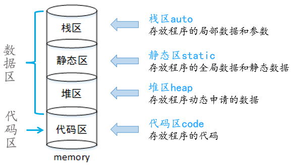
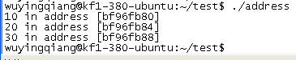
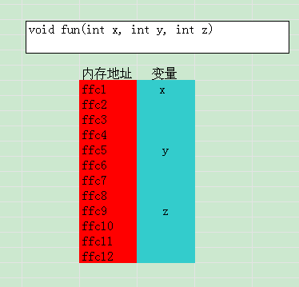
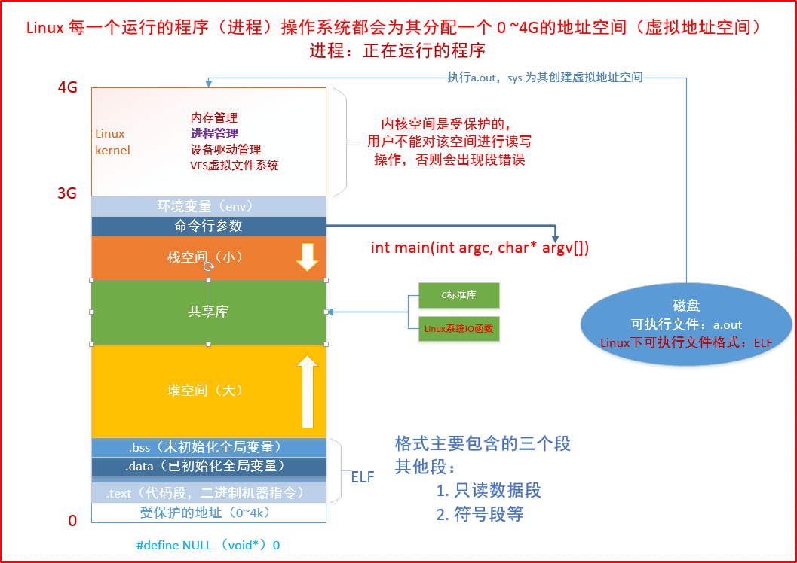
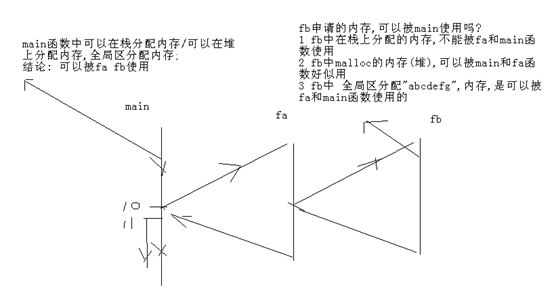
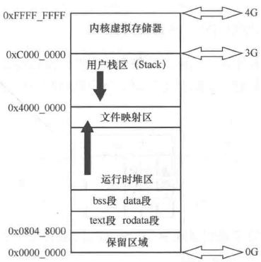

### 函数

函数名：本质上是指函数代码在内存中的首字节地址，是一个地址常量，实际上直接写函数地址的形式，也是可以调用函数的，比如：0x27364748(20,30)

指针作函数参数，具有输入输出特性，加const修饰指针可以防止实参被修改



### 函数的形参和实参

- 形参出现在函数定义中，在整个函数体内都可以使用，离开该函数则不能使用。
- 实参出现在主调函数中，进入被调函数后，实参也不能使用。
- 实参变量对形参变量的数据传递是“值传递”，即单向传递，只由实参传给形参，而不能由形参传回来给实参。
- 在调用函数时，编译系统临时给形参分配存储单元。调用结束后，形参单元被释放。
- 实参单元与形参单元是不同的单元。调用结束后，形参单元被释放，函数调用结束返回主调函数后则不能再使用该形参变量。实参单元仍保留并维持原值。因此，在执行一个被调用函数时，形参的值如果发生改变，并不会改变主调函数中实参的值

### 函数定义和声明的区别

1）定义是指对函数功能的确立，包括指定函数名、函数类型、形参及其类型、函数体等，它是一个完整的、独立的函数单位。
2）声明的作用则是把函数的名字、函数类型以及形参的个数、类型和顺序(注意，不包括函数体)通知编译系统，以便在对包含函数调用的语句进行编译时，据此对其进行对照检查（例如函数名是否正确，实参与形参的类型和个数是否一致）。

### 外部函数

```c
extern int add(int x, int y);
```

### 内部函数（静态函数）

```c
static void show(int x){
  	print("%d",x);
}
```

### 函数库

静态链接库：.a 归档文件（库文件）

动态链接库：共享库

### 常见的库函数

字符串函数，声明在string.h中

| 函数声明    | 功能描述                                     |
| ------- | ---------------------------------------- |
| memcpy  | 字符串拷贝，不处理内存重叠问题                          |
| memmove | 功能与memcpy类似，但是解决内存重叠问题                   |
| memset  | 初始化字符串                                   |
| memcmp  | 字符串比较                                    |
| memchr  | 字符串查找                                    |
| strcpy  | 字符串拷贝                                    |
| strncpy | 字符串拷贝（拷贝前n个字节）                           |
| strcmp  | 字符串比较                                    |
| strncm  | 字符串比较（比较前n个字节）                           |
| strdup  | 将串拷贝到新建的位置处，在内部调用了malloc()为变量分配内存，不需要使用返回的字符串时，需要用free()释放相应的内存空间，否则会造成内存泄漏。 |
| strndup | 将串的前n个字符拷贝到新建的位置处                        |
| strchr  | 字符查找                                     |
| strstr  | 子串查找                                     |
| strtok  | 字符串分割                                    |

数学库 math.h



### man手册



man手册的使用

数学库函数，math.h

| 函数声明           | 功能描述 |
| -------------- | ---- |
| clock()        | 当前时间 |
| system("cls"); | 清空屏幕 |

### 内存四区

开发人员将程序编写完成之后，程序要先装载到计算机的内核或者半导体内存中，再运行程序。


C语言程序运行时，操作系统会为其分配内存空间，这段空间主要分为四个区域，分别为：栈区、堆区、数据区和代码区。统称为“内存四区”。



| 内存四区 | 分配时机                                     | 释放时机                |
| ---- | ---------------------------------------- | ------------------- |
| 静态内存 | 内存分配时分配，在程序运行期间一直存在，由编译器负责分配。            | 程序退出时释放             |
| 栈内存  | 在函数调用的同时创建，函数入栈前回味函数、函数参数、函数中定义的变量在栈中申请空间。 | 函数结束时释放             |
| 堆内存  | 程序员根据需要使用malloc()等函数申请。                  | 在适当时机由程序员使用free()释放 |

- 栈区：栈区是一块连续的内存区域，该区域由编译器自动分配和释放，一般用来存放函数的参数、局部变量以及调用函数和被调用函数的联系等。
  - 空间实现自动管理：自动分配，自动释放
  - 能够被反复使用
  - 脏内存
  - 临时性
- 堆区：动态分配，malloc()，free()

堆可以是不连续的内存区域，此段区域可以由程序开发者自主申请，其使用比较灵活，但缺点是同样需要程序开发人员自主释放，若程序结束时该段空间仍未被释放，就会造成内存泄露，最后由系统回收。

- 数据区：分为静态全局区和常量区两个域
  - 静态全局区：用于存储全局变量和静态变量的区域
  - 常量区：存储字符串常量和其它常量的区域，该区域在程序结束后由操作系统释放。
- 代码区：用于存放函数体的二进制代码

### 函数参数入栈规则

栈底为高地址，栈顶为低地址。函数参数的入栈顺序为从右至左。

首先必须明确一点也是非常重要的一点，栈是向下生长的，所谓向下生长是指从内存高地址 --> 低地址的路径延伸，那么就很明显了，栈有栈底和栈顶，那么栈顶的地址要比栈底低。对x86体系的CPU而言

```c
void fun(int x, int y, int z){
　　printf("%d in address [%x]",x, &x);
　　printf("%d in address [%x]",y, &y);
　　printf("%d in address [%x]",z, &z);
}

int main()
{
　　fun(10, 20, 30);
　　return 0;
}
```

运行结果



分析图解



```c
#include <stdio.h>  
  
void main()  
{  
    int num = 100;  
    printf("%d, %d\n", num, ++num);  
    //从左->右， 100， 101（正确）  
    //从右->左，101， 101  
    getchar();  
} 
```

### 堆和栈的区别

堆在操作系统中有一个记录空闲内存地址的链表。当系统收到程序的申请时，系统就会开始遍历该链表，寻找第一个空间大于所申请空间的堆结点，然后将该节点从空闲结点链表中删除，并将该节点的空间分配给程序。另外，对于大多数系统，会在这块内存空间中的首地址处记录本次分配的大小。这样，代码中的删除语句才能正确地释放本内存空间。如果找到的堆节点的大小与申请的大小不相同，系统会自动地将多余的那部分重新放入空闲链表中。

- 申请大小的限制

堆是向高地址扩展的数据结构，是不连续的内存区域。这是由于系统用链表来存储的空闲内存地址，地址是不连续的，而链表的遍历方向是由低地址向高地址。堆的大小受限于计算机系统中有效的虚拟内存，因此堆获得的空间比较灵活，也比较大。

栈是向低地址扩展的数据结构，是一块连续的内存区域。因此，栈顶的地址和栈的最大容量是系统预先规定好的，如果申请的空间超过栈的剩余空间时，将提示栈溢出，因此，能从栈获得的空间较小。

- 堆和栈中的存储内容

堆一般在堆的头部用一个字节存放堆的大小，堆中的具体内容由程序员安排。

在调用函数时，第一个进栈的是函数调用语句的下一条可执行语句的地址，然后是函数的各个参数，在大多数的C语言编译器中，参数是由右往左入栈的，然后是函数中的局部变量。当本次函数调用结束后，局部变量先出栈，然后是参数，最后栈顶指针指向最开始的存储地址，也就是调用该函数处的下一条指令，程序由该点继续运行。

- 申请速度的限制

堆是由malloc等语句分配的内存，一般速度比较慢，而且容易产生内存碎片，不过用起来很方便。栈由系统自动分配，速度较快，但程序员一般无法控制。

#### 内存申请函数

- malloc()
- calloc()
- realloc()

#### 内存回收

使用malloc()函数、calloc()函数、realloc()函数申请到的空间都为堆空间，程序结束之后，系统不会将其自动释放，需要由程序员自主管理。

### 内存泄露

程序结束时，必须保证从堆区申请的所有空间都被安全释放，否则会造成内存泄露。堆上的空间在使用完毕后若未释放，将会一直占据该存储空间，知道程序结束。

### 虚拟地址



### 函数调用模型变量传递分析



### 存储类

就是存储类型，栈，堆，数据段，bss段，text段

| 存储类型     | 说明                                       |
| -------- | ---------------------------------------- |
| auto     | 修饰局部变量，自动局部变量，分配在栈上，普通的局部变量默认就是auto修饰的   |
| static   | 修饰局部变量，静态局部变量，分配在data段或bss段，生命周期和全局变量一样，作用域是代码块作用域，链接属性是无链接；修饰全局变量，静态全局变量； |
| register | 寄存器变量，修饰变量时，编译器会尽量分配在寄存器中，提高访问效率         |
| extern   | 修饰全局变量，实现跨文件访问变量，extern int var;         |
| volatile | 编译器在遇到volatile修饰的变量时不会对其进行优化（java中会禁止指令重排） |
| restrict | 用于限定和约束指针，所有希望修改该指针指向的内存时，都必须使用该指针才可以进行，目的是让编译器进行更好的优化 |
| typedef  | 给类型起别名                                   |

全局变量，作用域是文件作用域，链接属性是外链接

#### 最快的关键字 —— register

register：这个关键字请求编译器尽可能的将变量存在CPU 内部寄存器中而不是通过内存寻址访问以提高效率。注意是尽可能，不是绝对。你想想，一个CPU 的寄存器也就那么几个或几十个，你要是定义了很多很多register 变量，它累死也可能不能全部把这些变量放入寄存器吧，轮也可能轮不到你。

虽然寄存器的速度非常快，但是使用register 修饰符也有些限制的：register 变量必须是能被CPU 寄存器所接受的类型。意味着register 变量必须是一个单个的值，并且其长度应小于或等于整型的长度。而且register 变量可能不存放在内存中，所以不能用取址运算符“&”来获取register 变量的地址。

### 作用域

描述这个变量起作用的代码范围

代码块作用域

文件作用域

### 生命周期

### 链接属性

预编译，编译，汇编，链接

三种链接属性：

- 外链接：跨文件访问，extern修饰的全局变量和函数
- 内链接：static静态修饰全局变量和函数
- 无链接：局部变量（auto和static的）

### 命名冲突问题 

static修饰，内链接

### Linux的内存映像



内核空间3G~4G，用户空间 0G~3G

text，rodada 只读数据段

data 初始化的数据，bss 未初始化的数据

堆，动态分配的内存，malloc

栈，也叫临时区，存放局部变量，函数参数等

### 函数数据类型

