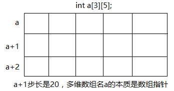
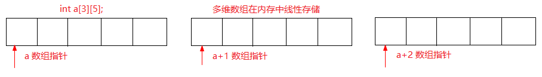

### 数组的基本概念

整个数组的地址和数组首元素的地址

```c
void main()
{
	int a[] = {1, 2};
	int b[100] = {1, 3};
	int c[200] = {0}; //编译的时候就已经确定所有的值为零

	memset(c, 0, sizeof(c)); //显式的重置内存块
	//对一维数组 C 规定：
	//c 是数组首元素的地址 c+1 步长 4个字节
	//&c 是整个数组的地址 &c+1 步长 200*4 

	system("pause");
	return ;
}
```

### 数组数据类型

```c
void main()
{
	typedef int (MyArrayType)[5]; //定义了一个数据类型,数组数据类型
	int i = 0;
	MyArrayType  myArray;  //int myArray[5];

	for (i=0; i<5; i++)
	{
		myArray[i] = i+1;
	}

	for (i=0; i<5; i++)
	{
		printf("%d ", myArray[i]);
	}

	printf("myArray代表数组首元素的地址 myArray:%d myArray+1:%d \n", myArray, myArray+1);
	printf("&myArray代表整个数组的地址 &myArray:%d &myArray+1:%d \n", &myArray, &myArray+1);

	system("pause");
	return ;
}
```

运行结果

```
1 2 3 4 5
myArray代表数组首元素的地址 myArray:6487600 myArray+1:6487604
&myArray代表整个数组的地址 &myArray:6487600 &myArray+1:6487620
```

### 数组指针

```c
void main()
{
	char *Myarray[] = {"123", "456", "abc"}; //指针数组

	//数组指针:用一个指针来指向一个数组

	typedef int (MyArrayType)[5]; //定义了一个数据类型,数组数据类型
	int i = 0;
	MyArrayType  myArray;  //int myArray[5]; //用类型定义变量 
	MyArrayType *pArray; //定义一个指针变量,这个指针变量指向一个数组

	{
		int  a;
		int *p = NULL;
		p = &a;

	}
	{
		int myArray2[5]; //相当于一级指针
		pArray = &myArray2; //相当于2级指针
		for (i=0; i<5; i++)
		{
			(*pArray)[i] = i+1;
		}
	
		for (i=0; i<5; i++)
		{
			printf("%d ", (*pArray)[i]);
		}
	}
	
	system("pause");
	return ;
}
```
定义数组指针变量的第二种方法
```c
void main()
{
	//定义声明一个数组指针类型
	typedef int (*PArrayType)[5];
	PArrayType pArray;  //告诉编译器给我分配一个指针变量

	int c[5];
	int i  = 0;
	pArray = &c;

	for (i=0; i<5; i++)
	{
		(*pArray)[i] = i + 1;
	}

	for (i=0; i<5; i++)
	{
		printf("%d ", (*pArray)[i]);
	}

	system("pause");
	return ;
}
```
定义数组指针变量的第三种方法
```c
//前2种方法通过类型定义变量比较麻烦
void main()
{
	//int [][5]
	int (*pMyArray)[5]; //直接定义一个指向数组的数组指针变量
	int c[5];
	int i  = 0;
	pMyArray = &c;

	for (i=0; i<5; i++)
	{
		(*pMyArray)[i] = i + 1;
	}

	for (i=0; i<5; i++)
	{
		printf("%d ", (*pMyArray)[i]);
	}

	system("pause");
	return ;
}
```
### 多维数组的本质

多维数组名的本质是数组指针

数组首元素的地址和整个数组的地址是两个不同的概念，指针步长不一样

数组名代表数组首元素的地址，它是个常量。变量本质是内存空间的别名，一定义数组，就分配内存，内存就固定了。所以数组名起名以后就不能被修改了。

### 多维数组做函数参数退化过程

```c
void printArray01(int a[3][5])
{
	int i, j, tmp = 0;
	for (i=0; i<3; i++)
	{
		for (j=0; j<5; j++)
		{
			printf("%d ", a[i][j]);
		}
	}
}

void printArray02(int a[][5])
{
	int i, j, tmp = 0;
	for (i=0; i<3; i++)
	{
		for (j=0; j<5; j++)
		{
			printf("%d ", a[i][j]);
		}
	}
}

void printArray03( int (*b)[5])
{
	int i, j, tmp = 0;
	for (i=0; i<3; i++)
	{
		for (j=0; j<5; j++)
		{
			printf("%d ", b[i][j]);
		}
	}
}

void main()
{
	int a[3][5], i=0, j=0;
	int tmp = 1;

	for (i=0; i<3; i++)
	{
		for (j=0; j<5; j++)
		{
			a[i][j] = tmp++;
		}
	}

	printf("----------------\n");
	printArray03(a);

	for (i=0; i<3; i++)
	{
		for (j=0; j<5; j++)
		{
			printf("%d ", a[i][j]);
		}
	}

	// a 多维数组名代表什么？
	printf("a %d , a+1:%d ", a, a+1);  //a+1的步长是20个字节 5*4
	printf("&a %d , &a+1:%d ", &a, &a+1);

	{
		//定义一个指向数组的指针变量 
		int (*pArray)[5] ;//告诉编译器分配4个字节的内存 32bit平台下
		pArray = a;

		printf("\n");
		for (i=0; i<3; i++)
		{
			for (j=0; j<5; j++)
			{
				printf("%d ", pArray[i][j]);
			}
		}
	}

	//多维数组名的本质是数组指针，步长:一维的长度

	// (a+i) 代表是整个第i行的地址  二级指针
	// *(a+i) 代表 1级指针  第i行首元素的地址
	// *(a+i) + j  ===> &  a[i][j]

	//*( *(a+i) + j) ===>a[i][j]元素的值

	//a[i][j] <=== >*( *(a+i) + j)
	//a[i] ===> a[0+i] ==> *(a+i);
	//a[i][j] === a[0+i][j]  ==>  *(a+i)[j]  ===>  *(a+i)[0 + j] ==>  *( *(a+i)  + j) 

	system("pause");
	return ;
}
```
运行结果

```
1 2 3 4 5 6 7 8 9 10 11 12 13 14 15
1 2 3 4 5 6 7 8 9 10 11 12 13 14 15
a 6487536 , a+1:6487556
&a 6487536 , &a+1:6487596
1 2 3 4 5 6 7 8 9 10 11 12 13 14 15
```

### 多维数组在内存中是线性存储的






```c
void printfArray(int *array, int size)
{
	int  i = 0;
	for (i=0; i<size; i++)
	{
		printf("%d ", array[i]);
	}
}
void main()
{
	int a[3][5];
	int i, j, tmp = 1;

	for (i=0; i<3; i++)
	{
		for (j=0; j<5; j++)
		{
			a[i][j] = tmp++;
		}
	}

	//把二维数组当成一维数组来打印证明线性存储
	printfArray((int *)a, 15);

	system("pause");
	return ;
}
```

运行结果

```
1 2 3 4 5 6 7 8 9 10 11 12 13 14 15
```

### 数组作函数参数的退化问题

数组作函数参数，传参传递的只是数组首元素的首字节地址。

无法向函数传递一个数组，C 语言中，当一维数组作为函数参数的时候，编译器总是把它解析成一个指向其首元素首地址的指针。

这么做是有原因的。在C 语言中，所有非数组形式的数据实参均以传值形式（对实参做一份拷贝并传递给被调用的函数，函数不能修改作为实参的实际变量的值，而只能修改传递给它的那份拷贝）调用。然而，如果要拷贝整个数组，无论在空间上还是在时间上，其开销都是非常大的。更重要的是，在绝大部分情况下，你其实并不需要整个数组的拷贝，你只想告诉函数在那一刻对哪个特定的数组感兴趣。这样的话，为了节省时间和空间，提高程序运行的效率，于是就有了上述的规则。同样的，函数的返回值也不能是一个数组，而只能是指针。这里要明确的一个概念就是：函数本身是没有类型的，只有函数的返回值才有类型。很多书都把这点弄错了，甚至出现“XXX 类型的函数”这种说法。简直是荒唐至极！

```c
void fun(int buf[100]){ // 等价于 int buf[] 和 int *buf
  	printf("%d\n", sizeof(buf)); // 4
}

int main(void){
  	int buf[100];
  	printf("%d\n", sizeof(buf)); // 400
  	fun(buf);
  	return 0;
}

void fun(int n, int buf[n]){ // [n]中的n只是起到说明的作用
  	printf("%d\n", sizeof(buf));
}
```

等价关系

| 数组参数                  | 等效的指针参数              |
| --------------------- | -------------------- |
| 一维数组 `char a[30]`     | 指针 `char*`           |
| 指针数组 `char *a[30]`    | 指针的指针 `char **a`     |
| 二维数组 `char a[10][30]` | 数组的指针 `char(*a)[30]` |

### 指针数组

```c
#include <stdio.h>
void main()
{
	// 定义并初始化3个整型变量
	int a = 1;
	int b = 2;
	int c = 3;
	int * arr[3] = { &a, &b, &c }; // 定义长度为3的指针数组并将数组元素指向整型变量
	printf("arr[0]=%p, &a=%p, *arr[0]=%d, a=%d\n", arr[0], &a, *arr[0], a);
	printf("arr[1]=%p, &b=%p, *arr[1]=%d, b=%d\n", arr[1], &b, *arr[1], b);
	printf("arr[2]=%p, &c=%p, *arr[2]=%d, c=%d\n", arr[2], &c, *arr[2], c);
}
```

运行结果

```
arr[0]=0062FE4C, &a=0062FE4C, *arr[0]=1, a=1
arr[1]=0062FE48, &b=0062FE48, *arr[1]=2, b=2
arr[2]=0062FE44, &c=0062FE44, *arr[2]=3, c=3
```
数组作函数参数，数组没有副本机制，传递是地址
```c
void  run(char *p[5]) //数组没有副本机制，传递是地址  
{  
    printf("\nrun=%d", sizeof(p));//4个字节  
    for (char **pp = p; pp < p + 5; pp++)  
    {  
        system(*pp);  
    }  
}  
  
void  run1(char **px) //数组没有副本机制，传递是地址  
{  
    printf("\nrun=%d", sizeof(px));//4个字节  
    for (char **pp = px; pp < px + 5; pp++)  
    {  
        system(*pp);  
    }  
}  
  
void main()  
{  
    char *p[5] = { "calc", "notepad", "mspaint", "tasklist &pause", "write" };  
    printf("\nmain=%d", sizeof(p)); // 20个字节
  
  	//轮询一个数组，需要一个指针，轮询一个指针数组，需要一个二级指针  
    for (char **pp = p; pp < p + 5; pp++)  
    {  
        system(*pp);  
    }  
  
  	// run(p); 
    run1(p);  
    getchar();  
}  
```

### 指针数组的应用场景

#### 求关键字在表中的位置

```c
//一个入口多个出口
int searcheKeyTable(const char* table[], const int size, const char* key, int *pos)
{
	int rv = 0;
	int i = 0;
	int inum = 0;
	if (table==NULL || key==NULL || pos==NULL)
	{
		rv = -1;
		printf("func searcheKeyTable:%d", rv);
		return rv;
	}

	//间接的证明数组做函数参数的退化
	inum = (sizeof(table)/sizeof(*table)); // inum = 1

	for(i=0; i<size; i++)
	{
		if( strcmp(key, table[i]) == 0 )
		{
			*pos = i;
			//break;
			return rv;	
		}
	}

	//没有找到返回-1
	if (i == size)
	{
		*pos = -1;
	}
	return rv;
}

#define DIM(a) (sizeof(a)/sizeof(*a))

int main()
{
	int inum = 0;
	int pos = 0;
	int a[10];
	int i = 0;
	//指针数组
	char*   c_keyword[] = {
		"while", 
		"case",
		"static",
		"do"
	};

	searcheKeyTable( c_keyword, DIM(c_keyword),"do", &pos);
	// ===> 带参数的宏
	//searcheKeyTable( c_keyword, (sizeof(c_keyword)/sizeof(*c_keyword)),"do", &pos);
	//searcheKeyTable( c_keyword, inum,"do", &pos);
	printf("pos:%d\n", pos);
	//searcheKeyTable(NULL, DIM(c_keyword),"do", &pos);
	//printf("pos:%d\n", pos);
	searcheKeyTable( c_keyword, DIM(c_keyword), "static", &pos);
	printf("pos:%d\n", pos);

	system("pause");
	return ;
}
```

#### 命令行参数

```c
//main函数是操作系统调用的函数
//在程序执行的时候可以向main函数传递参数

/*
argc 命令行参数
argv 命令行参数数组
env  环境变量数组

int main();
int main(int argc);
int main(int argc, char *argv[])
*/

int main(int argc, char* argv[], char**env)
{
	int i = 0;

	printf("---------- Begin argv ----------\n");
	for(i=0; i<argc; i++)
	{
		printf("%s\n", argv[i]);
	}

	// 	for(i=0; argv[i]!=NULL; i++)
	// 	{
	// 		printf("%s\n", argv[i]);
	// 	}
	printf("---------- End argv ----------\n");

	printf("\n");

	printf("---------- Begin env ----------\n");

	for(i=0; env[i]!=NULL; i++)
	{
		printf("%s\n", env[i]);
	}

	printf("---------- End env ----------\n");

	getchar();
}
```

#### 指针数组的自我结束能力

```c
void main()
{
	int inum = 0;
	int pos = 0;
	int a[10];
	int i = 0;
	//指针数组的自我结束能力
	char*   c_keyword[] = {
		"while", 
		"case",
		"static",
		"do",
		'\0'
	};  

	char*   c_keyword2[] = {
		"while", 
		"case",
		"static",
		"do",
		0
	}; 

	char*   c_keyword3[] = {
		"while", 
		"case",
		"static",
		"do",
		NULL
	}; 

	for (i=0; c_keyword[i] != NULL; i++)
	{
		printf("%s\n", c_keyword[i]);
	}
	printf("\n....\n");
	for (i=0; c_keyword2[i] != NULL; i++)
	{
		printf("%s\n", c_keyword2[i]);
	}
	printf("\n....\n");
	for (i=0; c_keyword3[i] != NULL; i++)
	{
		printf("%s\n", c_keyword3[i]);
	}

	system("pause");
}
```
### 函数指针数组


### 斐波那契数列

```c
#include <math.h>
int main()
{
	int arr[20] = { 1, 1 };
	int i;
	for (i =2; i < 20; i++) //i从2开始
	{
		arr[i] = arr[i - 1] + arr[i - 2];
	}
	for (i = 0; i < 20; i++)
	{
		if (i % 5 == 0)  //第5个元素就换行
			printf("\n");  
		printf("%-5d", arr[i]);
	}
	system("pause");
}
```

运行结果

```
1    1    2    3    5
8    13   21   34   55
89   144  233  377  610
987  1597 2584 4181 6765
```

### 打印杨辉三角

```c
#include<stdio.h>
#include<stdlib.h>
void main()
{
	int i, j, n = 0;
	int arr[10][10] = { 1 }; //定义一个10行10列的二维数组，初始化为1
	
	while (n < 1 || n > 10)  //此while循环控制用户只能输入n = 10
	{
		printf("请输入n的值：\n");
		scanf("%d", &n);
	}
	for (i = 1; i < n; i++)  //外层循环控制杨辉三角的行数
	{
		arr[i][0] = 1;         //每一行第1个元素都赋值为1，即第1列都为1
		for (j = 1; j <= i; j++)    //内层控制杨辉三角的列数
              //每个元素等于其上一行左边和上边两个元素之和
			arr[i][j] = arr[i - 1][j - 1] + arr[i - 1][j];
	}
	for (i = 0; i < n; i++)  //双重for循环打印这个二维数组中的元素
	{
		for (j = 0; j <= i; j++)
			printf("%-5d", arr[i][j]);
		printf("\n");
	}
	system("pause");
}
```
运行结果（n = 10）

```
1
1    1
1    2    1
1    3    3    1
1    4    6    4    1
1    5    10   10   5    1
1    6    15   20   15   6    1
1    7    21   35   35   21   7    1
1    8    28   56   70   56   28   8    1
1    9    36   84   126  126  84   36   9    1
```