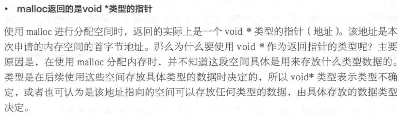

### void与空类型指针

空类型的指针可以存储任何类型变量(普通变量,一级指针变量,二级指针变量,三级指针变量,多级指针变量等等...)的地址,因为编译器决定了地址存储尺寸

空类型的指针既不可以间接取值,也不可以间接赋值(也就是只能存储内存地址,而不能根据内存地址进行间接访问操作)

将空类型的指针转化为具体指针类型,然后就达到了既明确了指针的解析步长,也明确了解析方式

```c
///01.void.c
#include <stdio.h>
#include <stdlib.h>

//01.空类型与空类型指针:
//  空类型:void
//  空类型指针:void *
//02.指针类型:
//  解析步长+解析方式
//03.空类型指针变量:
//  可以存储任何类型的指针
int main01(void)
{
    //error C2182:"a":非法引用"void"类型 void
    int num = 10;
    double db = 19.3;
    //void num;//不合法-->没有明确数据类型-->编译器既不知道分配多大步长的内存块儿,也不知道按照何种方式进行分配!
    void * vp = &num;//合法->Win平台(32/64)编译器明确指针所应使用的内存字节尺寸-->不需要明确解析方式-->因为只是一个数值意义的地址
    vp = &db;//空类型的指针可以存储任何类型变量(普通变量,一级指针变量,二级指针变量,三级指针变量,多级指针变量等等...)的地址,因为编译器决定了地址存储尺寸
    //printf("%d \n", *vp);//:error C2100:非法的间接寻址(问题原因通常是采用空类型的指针对该指针所存储的地址进行解析)->既不明确解析尺寸,也不明确解析方式,所以出错
    //空类型的指针既不可以间接取值,也不可以间接赋值(也就是只能存储内存地址,而不能根据内存地址进行间接访问操作)
    //*vp = 10;
    printf("%f \n", *((double *)vp));//将空类型的指针转化为具体指针类型,然后就达到了既明确了指针的解析步长,也明确了解析方式

    system("pause");
}
```

```c
///02.空指针.c
#include <stdio.h>
#include <stdlib.h>

//01.结构体变量:
//  用于组织多种不同类型的变量
struct MyStruct//包含四根指针,花心的妹子,可以进行动态的扩充
{//一个由多个一级指针变量所构成的单个普通结构体变量
    int *p1;
    int *p2;
    int *p3;
    int *p4;
};

//02.空指针(NULL):
//  实质:(void *)0
//  作用:标识任何指针变量没有存储内存地址
//  特点:空指针所指向的内存实体不允许访问,否则出现访问异常
int main02(void)
{
    //标记指针变量是否存储内存地址
    double db = 10.9;
    double 刘海华 = 10.9;
    double * pDb = NULL;//空指针(NULL):标识任何指针变量没有存储内存地址
    while (NULL == pDb)
    {
        //炮之
        pDb = &刘海华;
    }
    *pDb = 1;//空指针所指向的内存实体不允许进行操作

    system("pause");
}
```
### void * 万能指针

void * 无类型指针，也叫万能指针，可以指向任何类型的数据，在32位系统下，占4个字节。

这类指针指向一块内存，却没有告诉应用程序按什么类型去解读这块内存，所以无类型指针不能直接进行数据的存取操作，必须先转换成其它类型的指针才能将内存解读出来。

void * 类型的指针指向的内存是尚未确定类型的，因此我们后续可以使用强制类型转换，强行将其转为各种类型。这就是void类型的最终归宿——被强制类型转换成一个具体的类型。

C语言规定只有相同类型的指针才可以相互赋值

- void * 指针作为左值用于“接收”任意类型的指针
- void * 指针作为右值赋值给其它指针时需要强制类型转换

```c
int *p1 = NULL;
char *p2 = (char *)malloc(sizoeof(char)*20); 
```
void *指针可以指向任意变量的内存空间

```c
void *p = NULL;
int a = 10; 
p = (void *)&a; //指向变量时，最好转换为void *
//使用指针变量指向的内存时，转换为int * 
*( (int *)p ) = 11; 
printf("a = %d\n", a);
```



### void的作用

- 对函数参数的限定：当不需要传入参数时，即 `function (void);`
- 对函数返回值的限定：当函数没有返回值时，即 `void function(void);`

### void指针的作用

（1）void指针可以指向任意的数据类型，即任意类型的指针可以赋值给void指针

```c
int *a;
void *p;
p=a;
```
如果void指针赋值给其他类型，则需要强制转换；`a=（int *）p;`

（2）在ANSI C标准中不允许对void指针进行算术运算，因为没有特定的数据类型，即在内存中不知道移动多少个字节；而在GNU标准中，认为void指针和char指针等同。

### 应用

（1）void指针一般用于应用的底层，比如malloc函数的返回类型是void指针，需要再强制转换；
（2）文件句柄HANDLE也是void指针类型，这也是句柄和指针的区别；
（3）内存操作函数的原型也需要void指针限定传入参数：

```c
void * memcpy (void *dest, const void *src, size_t len);
void * memset (void *buffer, int c, size_t num );
```
（4）面向对象函数中底层对基类的抽象。

### 千万小心又小心使用void 指针类型

按照ANSI(American National Standards Institute)标准，不能对void 指针进行算法操作，即下列操作都是不合法的：

```c
void * pvoid;
pvoid++; //ANSI：错误
pvoid += 1; //ANSI：错误
```

ANSI 标准之所以这样认定，是因为它坚持：进行算法操作的指针必须是确定知道其指向数据类型大小的。也就是说必须知道内存目的地址的确切值。

例如：

```c
int *pint;
pint++; //ANSI：正确
```

但是大名鼎鼎的GNU(GNU's Not Unix 的递归缩写)则不这么认定，它指定void \*的算法操作与char \*一致。因此下列语句在GNU 编译器中皆正确：

```c
pvoid++; //GNU：正确
pvoid += 1; //GNU：正确
```

在实际的程序设计中，为符合ANSI 标准，并提高程序的可移植性，我们可以这样编写实现同样功能的代码：

```c
void * pvoid;
(char *)pvoid++; //ANSI：正确；GNU：正确
(char *)pvoid += 1; //ANSI：错误；GNU：正确
```

GNU 和ANSI 还有一些区别，总体而言，GNU 较ANSI 更“开放”，提供了对更多语法的支持。但是我们在真实设计时，还是应该尽可能地符合ANSI 标准。

### 如果函数的参数可以是任意类型指针，那么应声明其参数为void *

典型的如内存操作函数memcpy 和memset 的函数原型分别为：

```c
void * memcpy(void *dest, const void *src, size_t len);
void * memset ( void * buffer, int c, size_t num );
```

这样，任何类型的指针都可以传入memcpy 和memset 中，这也真实地体现了内存操作函数的意义，因为它操作的对象仅仅是一片内存，而不论这片内存是什么类型。如果memcpy和memset 的参数类型不是void *，而是char *，那才叫真的奇怪了！这样的memcpy 和memset明显不是一个“纯粹的，脱离低级趣味的”函数！

下面的代码执行正确：

例子：memset 接受任意类型指针

```c
int IntArray_a[100];
memset (IntArray_a, 0, 100*sizeof(int) ); //将IntArray_a 清0
```


例子：memcpy 接受任意类型指针

```c
int destIntArray_a[100], srcintarray_a[100];
//将srcintarray_a 拷贝给destIntArray_a
memcpy (destIntArray_a, srcintarray_a, 100*sizeof(int) );
```

有趣的是，memcpy 和memset 函数返回的也是void *类型，标准库函数的编写者都不是一般人。

### void 不能代表一个真实的变量

因为定义变量时必须分配内存空间，定义void 类型变量，编译器到底分配多大的内存呢。

下面代码都企图让void 代表一个真实的变量，因此都是错误的代码：

```c
void a; //错误
function(void a); //错误
```

void 体现了一种抽象，这个世界上的变量都是“有类型”的，譬如一个人不是男人就是女人（人妖不算）。

void 的出现只是为了一种抽象的需要，如果你正确地理解了面向对象中“抽象基类”的概念，也很容易理解void 数据类型。正如不能给抽象基类定义一个实例，我们也不能定义一个void（让我们类比的称void 为“抽象数据类型”）变量。