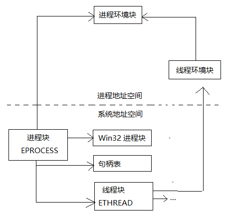
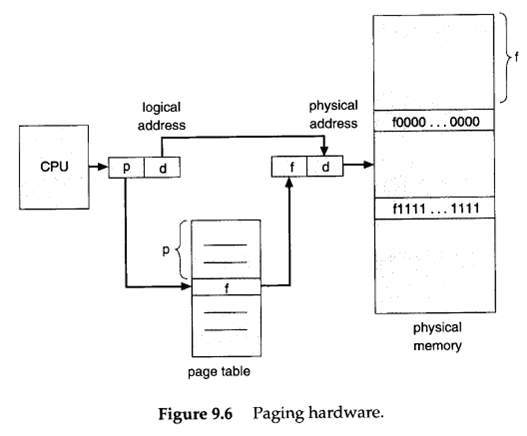
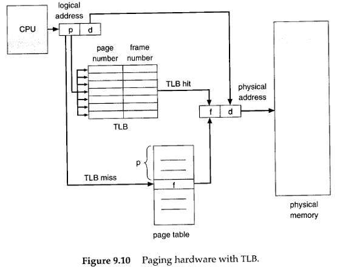
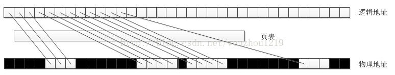
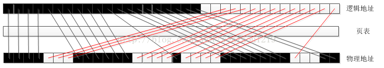
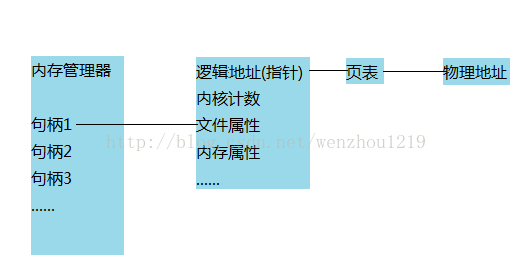

句柄是什么？在Windows中，句柄的存在就像指针的标识一样，但这样的答案显示不是你们需要的。闲暇之余，笔者摘录以下Windows句柄的解释。用户可以端着咖啡再看Windows结构体里面句柄的作用表述。



这里我列举词条中的关于句柄的叙述不当之处，至于如何不当先不管，继续往下看就会明白：

## 句柄是什么？

Windows 之所以要设立句柄，根本上源于内存管理机制的问题—虚拟地址，简而言之数据的地址需要变动，变动以后就需要有人来记录管理变动，（就好像户籍管理一样），因此系统用句柄来记载数据地址的变更。

如果想更透彻一点地认识句柄，我可以告诉大家，句柄是一种指向指针的指针。

通常我们说句柄是Windows用来标识被应用程序所建立或使用的对象的唯一整数。这句话是没有问题的，但是想把这句话对应到具体的内存结构上就做不到了。下面我们来详细探讨一下Windows中的句柄到底是什么。

### 虚拟内存结构

我们知道，CPU是通过寻址来访问内存的。32位CPU的寻址宽度是 0~0xFFFFFFFF ，计算后得到的大小是4G，也就是说可支持的物理内存最大是4G。但在实践过程中，碰到了这样的问题，程序需要使用4G内存，而可用物理内存小于4G，导致程序不得不降低内存占用。

为了解决此类问题，现代CPU引入了 MMU（Memory Management Unit 内存管理单元）。

MMU 的核心思想是利用虚拟地址替代物理地址，即CPU寻址时使用虚址，由 MMU 负责将虚址映射为物理地址。MMU的引入，解决了对物理内存的限制，对程序来说，就像自己在使用4G内存一样。

内存分页（Paging）是在使用MMU的基础上，提出的一种内存管理机制。它将虚拟地址和物理地址按固定大小（4K）分割成页（page）和页帧（page frame），并保证页与页帧的大小相同。这种机制，从数据结构上，保证了访问内存的高效，并使OS能支持非连续性的内存分配。在程序内存不够用时，还可以将不常用的物理内存页转移到其他存储设备上，比如磁盘，这就是大家耳熟能详的虚拟内存。

1、虚拟地址与物理地址需要通过映射，才能使CPU正常工作。

而映射就需要存储映射表。在现代CPU架构中，映射关系通常被存储在物理内存上一个被称之为页表（page table）的地方。

如下图：



从这张图中，可以清晰地看到CPU与页表，物理内存之间的交互关系。

进一步优化，引入TLB（Translation lookaside buffer，页表寄存器缓冲）。

由上一节可知，页表是被存储在内存中的。我们知道CPU通过总线访问内存，肯定慢于直接访问寄存器的。

为了进一步优化性能，现代CPU架构引入了TLB，用来缓存一部分经常访问的页表内容。

如下图：



在中间加入了TLB。

2、为什么要支持大内存分页？

TLB是有限的，这点毫无疑问。当超出TLB的存储极限时，就会发生 TLB miss，之后，OS就会命令CPU去访问内存上的页表。如果频繁的出现TLB miss，程序的性能会下降地很快。

为了让TLB可以存储更多的页地址映射关系，我们的做法是调大内存分页大小。

如果一个页4M，对比一个页4K，前者可以让TLB多存储1000个页地址映射关系，性能的提升是比较可观的。

简而言之，虚拟内存将内存逻辑地址和物理地址之间建立了一个对应表，要读写逻辑地址对应的物理内存内容，必须查询相关页表（当然现在有还有段式、段页式内存对应方式，但是从原理上来说都是一样的）找到逻辑地址对应的物理地址做相关操作。我们常见的对程序员开放的内存分配接口如malloc等分配的得到的都是逻辑地址，C指针指向的也是逻辑地址。

这种虚拟内存的好处是很多的，这里以连续内存分配和可移动内存为例来讲一讲。

首先说一说连续内存分配，我们在程序中经常需要分配一块连续的内存结构，如数组，他们可以使用指针循环读取，但是物理内存多次分配释放后实际上是破碎的，如下图



图中白色为可用物理内存，黑色为被其他程序占有的内存，现在要分配一个12大小的连续内存，那么显然物理内存中是没有这么大的连续内存的，这时候通过页表对应的方式可以看到我们很容易得到逻辑地址上连续的12大小的内存。

再说一说可移动内存，我们使用GlobalAlloc等函数时，经常会指定GMEM_MOVABLE和GMEM_FIXED参数，很对人对这两个参数很头疼，搞不明白什么意思。

实际上这里的MOVABLE和FIXED都是针对的逻辑地址来说的。GMEM_MOVABLE是说允许操作系统（或者应用程序）实施对内存堆（逻辑地址）的管理，在必要时，操作系统可以移动内存块获取更大的块，或者合并一些空闲的内存块，也称“垃圾回收”，它可以提高内存的利用率，这里的地址都是指逻辑地址。同样以分配12大小连续的内存，在某种状态时，内存结构如下


显然这时候是无法分配12连续大小的内存，但是如果这里的逻辑地址都指明为GMEM_MOVABLE的话，操作系统这时候会对逻辑地址做管理，得到如下结果：



这时候就实现了逻辑地址的MOVE，相对比实现物理内存的移动，这样的代价当然要小得多撒，但是聪明的小伙伴们是不是要问，这样在逻辑地址中移动了内存，那么实际访问数据不都乱套了吗，还能找到自己分配的实际物理内存数据吗，等等，不要心急，这就是等下要讲的句柄做的事情了。

GMEM_FIXED是说允许在物理内存中移动内存块，但是必须保证逻辑地址是不变的，在早期16位Windows操作系统不支持在物理内存中移动内存，所以禁止使用GMEM_FIXED，现在的你估计体会不到了。

事实上用GlobalAlloc分配内存时指定GMEM_FIXED参数返回的句柄就是指向内存分配的内存块的指针，不理解？？？接着看下面的句柄结构，你就明白了。

### 句柄结构

在上面讲解虚拟内存结构的过程中，我们就引出了几个问题：MOVABLE的内存访问为什么不会乱，FIXED的内存为什么说就是指向分配内存块的指针。

事实上我们尽管Windows没有给出源码，但是从一些头文件、MSDN和Windows早期内存分配函数中我们还是可以一窥端倪。

在Winnt.h头文件中做了通用句柄的定义：

```c
#ifdef STRICT
typedef void *HANDLE;
#define DECLARE_HANDLE(name) struct name##__ { int unused; }; typedef struct name##__ *name
#else
typedef PVOID HANDLE;
#define DECLARE_HANDLE(name) typedef HANDLE name
#endif
typedef HANDLE *PHANDLE;
```

在Windef.h做了特殊句柄的定义：
```c
#if !defined(_MAC) || !defined(GDI_INTERNAL)
DECLARE_HANDLE(HFONT);
#endif
DECLARE_HANDLE(HICON);
#if !defined(_MAC) || !defined(WIN_INTERNAL)
DECLARE_HANDLE(HMENU);
#endif
DECLARE_HANDLE(HMETAFILE);
DECLARE_HANDLE(HINSTANCE);
typedef HINSTANCE HMODULE; /* HMODULEs can be used in place of HINSTANCEs */
#if !defined(_MAC) || !defined(GDI_INTERNAL)
DECLARE_HANDLE(HPALETTE);
DECLARE_HANDLE(HPEN);
#endif
DECLARE_HANDLE(HRGN);
DECLARE_HANDLE(HRSRC);
DECLARE_HANDLE(HSTR);
DECLARE_HANDLE(HTASK);
DECLARE_HANDLE(HWINSTA);
DECLARE_HANDLE(HKL);
```

这里微软把通用句柄HANDLE定义为void指针，显然啦，他是不想让人知道句柄的真实类型，但是和他以往的做法一样，微软空有一个好的想法结果没有实现。马上，如果定义了强制类型检查STRICT，他又定义了特殊类型句柄宏DECLARE_HANDLE，这里用到了##，这是比较偏僻的用法，翻译过来，对于诸如DECLARE_HANDLE（HMENU）定义其实就是
```c
typedef struct HMENU__
{
int unused;
} *HMENU;

```

到这里，你是不是觉得有一点眉目了呢，对，句柄是一种指向结构体的指针，结合这里的int unused定义很容易猜到结构体的第一个字段就是我们的逻辑地址（指针）。那么，是不是仅仅如此呢，当然不是！！！由于指向结构体指针可以强制截断只获取第一个字段，这里的struct结构体绝对不止一个字段，联系我们在Windows中的编程经验，对于线程HANDLE有计数那么必须有计数段，对于事件HEVENT等内核对象会要求指定属性那么必须有属性段，对于内存分配HANDLE有可移动和不可移动之说那么必须有内存可移动属性段，等等。基于此我们可以大胆猜测Windows的句柄指向的结构类似如下
```c
struct
{
int pointer; //指针段
int count; //内核计数段
int attribute; //文件属性段:SHARED等等
int memAttribute; //内存属性段:MOVABLE和FIXED等等
...
};

```

事实上，Windows内存管理器管理的其实都是句柄，通过句柄来管理指针，Windows的系统整理内存时检测内存属性段，如果是可以移动的就能够移动逻辑地址，移动完后将新的地址更新到对应句柄的指针段中，当要使用MOVABLE地址时的时候必须Lock住，这时候计数加1，内存管理器检测到计数》0便不会移动逻辑地址，这时候才能获得固定的逻辑地址来操作物理内存，使用完后Unlock内存管理器又可以移动逻辑地址了，到此MOVABLE的内存访问为什么不会乱这个问题就解决了。

下面再说一说，FIXED的内存为什么说就是指向分配内存块的指针。我们看上面的通用句柄定义，可以发现HANDLE的句柄定义一直是void指针，其他的特殊句柄在严格类型检查的时候定义为结构体指针，为什么不把二者定义为一样的呢。查看MSDN关于GlobalAlloc的叙述对于GMEM_FIXED类型“Allocates fixed memory. The return value is a pointer.”，这里返回的是一个指针，为了验证这个说法，我写了一小段程序

```c
//GMEM_FIXED
hGlobal = GlobalAlloc(GMEM_FIXED, (lstrlen(szBuffer)+1) * sizeof(TCHAR));
pGlobal = GlobalLock(hGlobal);
lstrcpy(pGlobal, szBuffer);
_tprintf(TEXT("pGlobal和hGlobal%s\n"), pGlobal==hGlobal ? TEXT("相等") : TEXT("不相等"));
GlobalUnlock(hGlobal);
_tprintf(TEXT("使用句柄当做指针访问的数据为:%s\n"), hGlobal);
GlobalFree(hGlobal);

```

运行结果为
```
pGlobal和hGlobal相等
使用句柄当做指针访问的数据为:Test text
```

对比使用GMEM_MOVABLE程序为
```c
//GMEM_MOVABLE
hGlobal = GlobalAlloc(GMEM_MOVEABLE, (lstrlen(szBuffer)+1) * sizeof(TCHAR));
pGlobal = GlobalLock(hGlobal);
lstrcpy(pGlobal, szBuffer);
_tprintf(TEXT("pGlobal和hGlobal%s\n"), pGlobal==hGlobal ? TEXT("相等") : TEXT("不相等"));
_tprintf(TEXT("使用句柄当做指针访问的数据为:%s\n"), hGlobal);
GlobalUnlock(hGlobal);
GlobalFree(hGlobal);
```
运行结果为
```
pGlobal和hGlobal不相等
使用句柄当做指针访问的数据为:?
```

显然，使用GMEM_FIXED和使用GMEM_MOVABLE得到的数据类型不是一样的，我们有理由相信Windows在调用GlobalAlloc使用GEM_FIXED的时候返回的就是数据指针，使用Windows在调用GMEM_MOVABLE的时候返回的是指向结构体的句柄，这样操作的原因相信是为了使用更加方便。那么这里我们就要修正一下前面的说法了：通用句柄HANDLE有时候是逻辑指针，大多数时候是结构体指针，特殊句柄如HMENU等是结构体指针。这样第二个问题也解决了。

## 总结：



下面，我们再回头看一看博文开头说的叙述不当之处，说他们不当是因为不是完全错误：第一点，确实句柄有管理内存地址变动之用，但是并不只是这个作用，内核对象访问级别、文件是否打开都是和他相关的；第二点，指向指针的指针，看得出来作者也是认真思考了的，但是他忽略了句柄包含的其他功能和管理内存地址的作用。

那么到这里对于句柄你应该非常理解了，在此基础我们在Windows编程上是不是可以有一些启发：

1、通用句柄HANDLE和特殊句柄一般情况下是可以相互转换的，但是有时候会出错。

2、如果不考虑跨平台移植的话，应该多采用Windows SDK提供的内存管理函数，这样可以获得更好的内存管理。

3、C语言的内存分配函数的实现都是依靠使用GMEM_FIXED调用Windows SDK的内存分配函数的。

注意可能在新的VS2005等系列编译器中看不到本文说的一些内容，因为在VC6时候有些代码还不是那么完善，所以给了我们机会去挖掘潜在的内容。至于微软苦心积虑不让我们看到句柄的真实定义那是必然的，试想一下主要的内存对象结构都被摸清楚了，那么黑客们还不反了天了。

至此，用户应该明白句柄是什么了吧，其实在不同的领域中，句柄的作用都是差不多的，可以作为一个标识的作用。

> 原文链接：http://blog.csdn.net/wenzhou1219/article/details/17659485