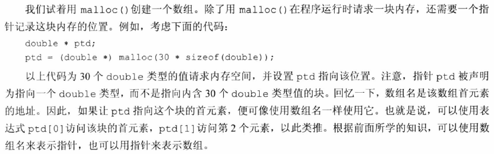
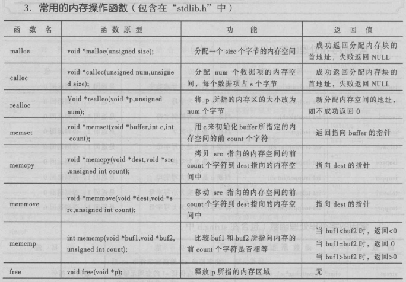

### 内存32位和64位的区别

```c
///01.Point.c
#include <stdio.h>
#include <stdlib.h>

//01.指针变量所占用的内存尺寸由编译器进行直接决定
//      指针变量所占用的内存尺寸同时直接或间接与CPU-->操作系统-->编译器平台有关
//          综合决定:CPU-->操作系统-->编译器平台
//          直接决定:编译器平台
//02.指针变量当中的指针就是内存寻址范围当中的地址(注意类型差别)
//  32位操作系统的CPU寻址能力
//      32位编译器:0x00000000~0xFFFFFFFF
//          2^32=2^2*2^10*2^10*2^10=4*1024*1024*1024=4G
//  64位操作系统的CPU寻址能力
//      64位编译器:0x0000000000000000~0xFFFFFFFFFFFFFFFFF
//          所能寻址的范围很大
//03.CPU的不同位数所导致的能力差异:
//  1.寻址能力不同:
//      寻址范围非常的大
//  2.运算能力不同:
//      32位CPU只能做32位运算;
//      64位CPU既能做32位运算,也能做64位运算
int main01(void)
{
    int num = 1;
    int * pNum = &num; 
    printf("%llu \n", sizeof(pNum));

    system("pause");
}

//04.寄存器相关的特点分析:
//  1.所有的运算操作都需要借助CPU的寄存器区域进行完成
//  2.任何一个表达式都是位于CPU的寄存器区域(eax|rax)
//      但是C语言不能直接对CPU的寄存器进行写入操作,除非内嵌汇编
//      注:包括对任何一个变量名的取地址操作(&varName)
//05.计算机在CPU的寄存器区域生成常量的过程:
//      CPU-->寄存器-->代码区-->符号表-->读取常量-->寄存器生成常量
int main02(void)
{
    int num = 1;
    int data = 0;
    data = num;
    //&(num+1);
    data = num + 1;
    data = num + 2;

    system("pause");
}
```

```c
///02.进程.c
#include <stdio.h>
#include <stdlib.h>
#include <Windows.h>

//01.单个进程处于不同编译器平台之下所支持的单进程内存尺寸不同:
//  32位编译器平台情况之下,所支持的单进程最大内存尺寸为2GB
//  64位编译器平台情况之下,所指吃的单进程最大内存尺寸为1024GB
//  注:
//      1.区分大小写B的区别
//      2.该单进程内存尺寸指整个进程所占用的内存(包含:代码区+全局区+栈内存+堆内存)
//      3.单个进程所占用的内存尺寸是由编译器平台的位数所直接决定的(间接因素:CPU->操作系统->编译器)
//02.内存分配,内存释放,内存回收四个词语的意思:
//  内存分配:操作系统为进程分配指定内存区域的访问权限(写入权限和读取权限)
//  内存释放:操作系统从进程回收指定内存区域的访问权限
//      只是收回权限,不会清空数据
//  内存回收:清空内存的实际数据
//      不仅收回权限,还会清空数据
//03.关于软访问和硬访问的区别:
//  软访问:所能访问的最小内存单位是二进制位(Bit)(补码)
//      但是通常都是采取字节作为最小单位操作内存的
//      除非是位运算就会操作到内存的最小单位
//  硬访问:所能访问的最小硬盘单位是字节(Byte)
int main03(void)
{
    while (1)
    {
        malloc(1024*1024*100);//不断的分配内存空间
        Sleep(100);
    }

    system("pause");
}
```

```c
///03.内存的栈和堆.c
#include <stdio.h>
#include <stdlib.h>
#include <Windows.h>
#include <process.h>

//01.最常用栈内存和堆内存耗费方式:
//  栈耗费:auto int num
//  对耗费:malloc(1024)
//02.栈内存和堆内存的基本特点:
//  数据结构的栈和堆:
//      栈:先进后出的一种数据结构
//      堆:一种二叉树形式的存储结构
//  内存访问的栈内存和堆内存:
//      栈内存:自动释放,自动回收
//      堆内存:手动释放,手动回收
//  注:栈内存由编译器进行维护,编译器控制自动释放和自动回收的时机,默认栈内存所占用的尺寸为1M,可以手动拓展编译器
//      所操控的栈内存尺寸大小,通过项目配置修改栈内存所操纵的栈内存尺寸大小[配置属性-->链接器-->系统-->堆栈保留大小]
//03.区分虚拟内存和物理内存:
//  虚拟内存:硬盘内存
//  物理内存:真实内存
void stack(int numA)//int numA:作为形式参数,占用栈内存
{
    int numB = 10;//局部变量,占用栈内存
    printf("%p, %p \n", &numA, &numB);
    numA = 1;
    numB = 2;
    getchar();//某些情况之下如果不能进行断点调试,需要添加上这句无用的代码,以便插上断点进行断点调试
}

//04.关于编译器的自动优化特点解释:
//  1.一个函数在调用完成之后,如果调用了其它函数,那么当前函数会被立即释放
//  2.然而编译器检测到两次调用的是相同函数,只不过中间插入了一个无关紧要的函数,
//      那么此时的编译器不会对两次重复调用的相同函数进行不同的栈内存开辟
//05.静态数组分配的代码分析:
//  int intArr[1024*1024];
//      1.该数组占用栈内存字节数为4M
//      2.该数组属于静态数组,需要在代码一旦加入进内存之后就决定该数组的内存尺寸
//      3.该数组分配方式为静态分配,因此必须使用常量指明数组元素个数
int main04(void)
{
    //stack(1);
    //printf("\n\n\n");
    //stack(1);
    //printf("\n\n\n");
    //int intArr[1024 * 1024];
    system("pause");
}

//06.线程任务函数的标准格式
void run(void * p)
{
    while (1)
    {
        int num[1024 * 1024];//自动释放回收栈内存
    }

    while (1)
    {
        malloc(1024 * 1024 * 10);//不断的进行堆内存的分配而没有进行释放,很容易造成内存溢出情况
        Sleep(1000);//堆内存膨胀-->导致整个进程的内存溢出,不是栈内存溢出
    }
}

//07.32位编译器平台之下,由于编译器所编译的单个进程程序所支持的最大内存尺度为2GB(同时包含内存四区)大小
//  全局区+代码区+栈内存+堆内存=2GB,因此堆内存所占用的尺寸极限必定小于2GB
//08.关于多线程情况之下的单个进程的内存使用情况:
//  1.多条线程共享同一个进程的堆内存
//  2.各条线程独自占用一定的进程的栈内存
//09.关于启动线程函数处理线程任务代码的特点分析:
//  代码:_beginthread(taskFun, 0, NULL);
//  参数说明:
//          taskFun:线程待处理的任务函数
//                     0:以跟主线程相同栈内存尺寸分配线程任务栈内存-->通常所说的堆栈保留大小其实就是主线程的堆栈保留大小
//              NULL:传递给任务处理函数的实际参数
int main05(void)
{
    //void * p = malloc(1024 * 1024);//分配1M
    for (int i = 0; i < 8; ++i)
    {
        _beginthread(run, 0, NULL);//多线程,每一个线程都有各自独立的栈内存
    }

    system("pause");
}
```

### 内存的申请与回收

| 函数声明      | 功能描述                                     |
| --------- | ---------------------------------------- |
| malloc()  | 未初始化，返回的是 void * 类型的指针（地址），该地址是本次申请的内存空间的首字节地址。 |
| calloc()  | 经过初始化的内存空间                               |
| realloc() | 可以实现内存分配和内存释放的功能                         |
| _recalloc | 内存清零                                     |
| alloca    | 栈内存分配，位于malloc.h头文件                      |
| free()    | 内存回收                                     |

#### malloc()

因为 char 表示一个字节，malloc() 的返回类型通常被定义为指向 char 的指针。然而，从 ANSI C 标准开始，C使用一个新的类型：指向 void 的指针。该类型相当于一个“通用指针”。malloc() 函数可用于返回指向数组的指针，指向结构的指针等，所以通常该函数的返回值会被强制转换为匹配的类型。然而，把指向 void 的指针赋给任意类型的指针完全不用考虑类型匹配的问题。

#### realloc()

内存不清零(参数1:内存首地址,总内存字节数)

1. 如果原始内存地址足够拓展,就在原始内存地址进行拓展

2. 如果原始内存地址不够拓展,就在新地址内存进行拓展。拷贝原始内存地址所对应的有效数据+回收原始内存地址数据

3. 拓展之后的内存如果没有数据进行覆盖,就不回执行内存清零操作!

#### _recalloc()

内存清零(参数1:内存首地址+参数2:数组元素个数+参数3:单个元素尺寸)

1. 如果原始内存地址足够拓展,就在原始内存地址进行拓展
2. 如果原始内存地址不够拓展,就在新地址内存进行拓展。拷贝原始内存地址所对应的有效数据+回收原始内存地址数据
3. 拓展之后的内存如果没有进行手动初始化,系统将会执行自动初始化操作!

```c
#include <stdio.h>
#include <stdlib.h>

//01.内存四大分配函数:
//  malloc<->calloc:
//      malloc:内存不清零(参数:内存字节数)
//      calloc:内存清零(参数1:数组元素个数+参数2:单个元素尺寸)
int main01(void)
{
    //int * p = (int *)malloc(100);//malloc不会初始化参数,参数是整体所占用的内存尺寸(字节数)!
    int * p = calloc(25, sizeof(int));//calloc存在初始化参数,参数解释:第一个参数是元素个数,第二个参数是元素内存尺寸
    printf("%p \n", p);
    //for (int i = 0; i < 25; ++i)
    //{
    //  p[i] = i;
    //}

    system("pause");
}

int main02(void)
{
    int * p = malloc(10 * sizeof(int));//指针能够操作这片儿堆内存!
    //int * p_p = malloc(100);
    for (int i = 0; i < 10; ++i)
    {
        printf("%d \n", p[i] = i);
    }
    printf("p = %p \n", p);

    int * px = realloc(p, 200);//拓展内存,内存不清零
    //返回值是内存首地址,说明拓展成功,后续地址拓展,拓展不成功,重新开辟内存
    //原来的内存就被回收了
    printf("px = %p \n", px);
    for (int i = 0; i < 50; ++i)
    {
        px[i] = i;
        printf("%d \n", px[i]);
    }
    //p[120387] = 10;

    system("pause");
}

int main03(void)
{
    int * p = calloc(25, sizeof(int));//会初始化为0,参数:数组元素个数+内存字节大小
    //scanf("123");
    printf("%p \n", p);
    for (int i = 0; i < 25; ++i)
    {
        p[i] = i;
    }
    p = _recalloc(p , 50, sizeof(int));//内存清零操作
    for (int i = 25; i < 50; ++i)
    {
        p[i] = i;
    }
    system("pause");
}
```

### 如何使用malloc 函数

函数原型

```c
(void *)malloc(int size)
```

malloc 函数的返回值是一个void 类型的指针，参数为int 类型数据，即申请分配的内存大小，单位是byte。内存分配成功之后，malloc 函数返回这块内存的首地址。你需要一个指针来接收这个地址。但是由于函数的返回值是void *类型的，所以必须强制转换成你所接收的类型。也就是说，这块内存将要用来存储什么类型的数据。比如：

```c
char *p = (char *)malloc(100);
```

在堆上分配了100 个字节内存，返回这块内存的首地址，把地址强制转换成`char *`类型后赋给`char *`类型的指针变量p。同时告诉我们这块内存将用来存储char 类型的数据。也就是说你只能通过指针变量p 来操作这块内存。这块内存本身并没有名字，对它的访问是匿名访问。

#### 动态创建一维数组



```c
void main(){
  	int arr_len = 10; // 指定生成的数组的长度
	int *arr = NULL;
	// 申请内存空间作为整形数组，空间大小是sizeof(int)*arr_len个字节
	arr = (int *)malloc(sizeof(int)*arr_len);
	// 将这块内存空间全部初始化为0
	memset(arr,0,sizeof(int)*arr_len);
	
	for(int i=0; i<arr_len; i++){ // 为整形数组的元素赋值
	  	arr[i] = i;
	}
	
	for(int i=0; i<arr_len; i++){ // 打印整形数组的元素的值
	  	printf("%d ", arr[i]);
	}
	
	printf("\n");
	free(arr); // 释放内存空间
}
```

#### 动态创建二维数组

```c
#include <stdio.h>
void main()
{
	int u, v;			//	定义二维数组的长和宽
	printf("第一维为：");
	scanf("%d", &u);
	printf("第二维为：");
	scanf("%d", &v);
	int** array = (int**)malloc(sizeof(int*)* u);  //先创建第一维
	for (int i = 0; i < u; i++)
	{
		//在内层循环中动态创建第二维
		array[i] = (int*)malloc(sizeof(int)* v);
		for (int j = 0; j < v; j++)
		{
			array[i][j] = 0;		 //给数组元素复制
			printf("%d  ", array[i][j]);
		}
	}
	free(array);
	printf("\n");
}
```

```c
#include<stdio.h>  
#include<stdlib.h>  
  
void main1()  
{  
    int  *p =(int *) calloc(10, sizeof(int));//分配内存  
    printf("%p\n", p);//输出地址  
  
    for (int i = 0; i < 10; i++)  
    {  
        *(p + i) = i;//*(p+i)等价于p[i]  
    }  
  
    int *pnew = (int *)realloc(p, 100000);//变长  
    // realloc
  	// 第一种情况，后面的内存没人用，就直接拓展变长  
    // 第二种情况，后面的内存有人用，先分配新的长度，拷贝原来的内存，释放的原来的内存  
    printf("%p", pnew);  
  
    for (int i = 10; i < 25000; i++)  
    {  
        *(pnew + i) = i;  
    }  
  
    system("pause");  
}  
```

- 无法把指针变量本身传递给一个函数

```c
void GetMemory(char *p, int num){
  	p = (char *)malloc(sizeof(char)*num);
}
int main(){
  	char *str = NULL;
  	GetMemory(str, 100); // str 仍然为NULL
  	strcopy(str, "hello"); // 运行时错误
  	free(str); // free 并没有起作用，内存泄露
  	return 0;
}
```

- 使用二级指针作函数参数去申请内存

```c
void GetMemory(char **p, int num){
  	*p = (char *)malloc(sizeof(char)*num); // 间接赋值是指针存在的最大意义
}
int main(){
  	char *str = NULL;
  	GetMemory(&str, 100);
  	strcopy(str, "hello"); // ok
  	cout<<str<<endl;
  	free(str); // ok
  	return 0;
}
```

- 查找不及格的学生成绩

假设一个年级有3个班级，每个班级有40个学生。考试后，学校要从这些学生的考试成绩中找出不及格的学生成绩

```c
#include <stdio.h>
#include <stdlib.h>
// 该函数的功能是申请内存空间
void create_array(int *** p, int cls_num, int stu_num)
{
	*p = (int **)calloc(sizeof(int *), cls_num); // 申请内存空间作为指针数组
	for (int i = 0; i < cls_num; i++)
	{
		// 申请内存空间作为整型数组，将数组首地址赋给指针数组的元素
		*(*p + i) = (int *)calloc(sizeof(int), stu_num);
	}
}
// 该函数的功能是获取输入的学生成绩并存入申请的内存空间中
void input_score(int ** arr, int cls_num, int stu_num)
{
	for (int i = 0; i < cls_num; i++)
	{
		printf("请输入第 %d 个班级的学生成绩：\n", i + 1);
		for (int j = 0; j < stu_num; j++)
		{
			scanf("%d", *(arr + i) + j); // 将输入的成绩赋给整型数组的元素
		}
	}
}
// 该函数的功能是打印出学生的成绩
void print_score(int ** arr, int cls_num, int stu_num)
{
	for (int i = 0; i < cls_num; i++)
	{
		printf("第 %d 个班级的学生成绩：\n", i + 1);
		for (int j = 0; j < stu_num; j++)
		{
			printf("%d  ", *(*(arr + i) + j)); // 将整型数组中存入的学生成绩打印出来
		}
		printf("\n");
	}
}
// 该函数的功能是打印出不及格的学生成绩
void print_fail_score(int ** arr, int cls_num, int stu_num)
{
	for (int i = 0; i < cls_num; i++)
	{
		printf("第 %d 个班级的学生的不及格成绩：\n", i + 1);
		for (int j = 0; j < stu_num; j++)
		{
			if (*(*(arr + i) + j) < 60) // 将整型数组中不及格的学生成绩打印出来
			{
				printf("%d  ", *(*(arr + i) + j));
			}
		}
		printf("\n");
	}
}
// 该函数的功能是销毁并回收刚才申请的内存空间
void distroy_array(int *** arr, int cls_num, int stu_num)
{
	for (int i = 0; i < cls_num; i++)
	{
		free(*(*arr + i));				// 首先销毁整型数组所占内存空间
	}
	free(*arr);							// 其次销毁指针数组所占内存空间
	*arr = NULL;						// 为防止野指针的存在,将二级指针赋值为0
}
void main()
{
	int cls_num, stu_num;
	int ** arr;
	printf("请输入班级数量：");
	scanf("%d", &cls_num);
	printf("请输入每个班级学生数量：");
	scanf("%d", &stu_num);
	create_array(&arr, cls_num, stu_num);
	input_score(arr, cls_num, stu_num);
	print_score(arr, cls_num, stu_num);
	print_fail_score(arr, cls_num, stu_num);
	distroy_array(&arr, cls_num, stu_num);
}
```

### 内存泄露

使用malloc()函数、calloc()函数、realloc()函数申请到的空间都为堆空间，程序结束之后，系统不会将其自动释放，需要由程序员自主管理。

内存泄露：也称作“内存渗漏”，用动态存储分配函数动态开辟的空间，在使用完毕后未释放，结果导致一直占据该内存单元，直到程序结束（即该内存空间使用完毕之后未回收），即所谓内存泄露。

程序结束时，必须保证从堆区申请的所有空间都被安全释放，否则会造成内存泄露。堆上的空间在使用完毕后若未释放，将会一直占据该存储空间，知道程序结束。

### 内存操作

| 函数声明      | 功能描述                            |
| --------- | ------------------------------- |
| memset()  | 用于对指定的内存空间进行初始化操作               |
| memcopy() | 将一块内存空间的内容复制到另一块内存空间中，不处理内存重叠问题 |
| memmove() | 将源内存区的内容复制到目标内存区，可以正确处理内存重叠问题   |
| memcmp()  | 比较两个内存空间中数据的大小                  |



#### memset()内存初始化

```c
#include <stdio.h>
#include <stdlib.h>
#include <string.h>
void main()
{
	int arr_len = 5;						// 指定生成的数组的长度
	int * arr;
	// 申请内存空间作为整型数组，空间大小是sizeof(int) * arr_len个字节
	arr = (int *)malloc(sizeof(int) * arr_len);
	printf("内存初始化前的数组元素：\n");
	for (int i = 0; i < arr_len; i++)		// 打印整型数组的元素的值
	{
		printf("%d  ", arr[i]);
	}
	printf("\n");
	memset(arr, 0, sizeof(int) * arr_len);	// 初始化内存空间
	printf("内存初始化后的数组元素：\n");
	for (int i = 0; i < arr_len; i++)		// 打印整型数组的元素的值
	{
		printf("%d  ", arr[i]);
	}
	printf("\n");
	free(arr);								// 释放内存空间
}

```

```c
#include <stdio.h>
#include <stdlib.h>
#include <memory.h>

//memset:从指定的地址开始,进行内存单字节设置
//  设置总数按照字节数进行决定,并返回设置之后的内存首地址
//特点:针对于数值类型的数组,相当于清零动作;
//      针对于其他类型的数组,相当于字符替换作用!
void * memsetByIndex(void * dest, int value, unsigned int size)
{
    if (NULL == dest)
    {
        return NULL;
    }
    for (int i = 0; i < size; ++i)
    {
        *(((char *)dest) + i) = value;
    }
    return dest;
}

void * memsetByPoint(void * dest, int value, unsigned int size)
{
    if (NULL == dest)
    {
        return NULL;
    }
    for (char * p = (char *)dest; p < (char *)dest + size; ++p)
    {
        *p = value;
    }
    return dest;
}

int main01(void)
{
    int intArr[5] = { 1, 2, 3, 4, 5 };
    double dbArr[5] = { 1.1, 2.2, 3.3, 4.4, 5.5 };
    char chrArr[1024] = "Hello World";
    memset(intArr, 0, 20);//数据清零
    memsetByIndex(intArr, 0, 20);//数据清零
    memsetByPoint(chrArr, 'A', 1023);//数据替换
    for (int i = 0; i < 5; ++i)
    {
        printf("%d, %lf", intArr[i], dbArr[i]);
    }
    printf("%s \n", chrArr);

    system("pause");
}
```

#### memcpy()内存拷贝

```c
#include <stdio.h>
#include <stdlib.h>
#include <string.h>
void main()
{
	int arr_len = 5;					// 指定生成的数组的长度
	int * arr_src, * arr_dst;
	// 申请内存空间作为整型数组，空间大小是sizeof(int) * arr_len个字节
	arr_src = (int *)malloc(sizeof(int) * arr_len);
	for (int i = 0; i < arr_len; i++)	// 为整型数组的元素赋值
	{
		arr_src[i] = i;
	}
	printf("源内存数组元素：\n");
	for (int i = 0; i < arr_len; i++)	// 打印整型数组的元素的值
	{
		printf("%d  ", arr_src[i]);
	}
	printf("\n");
	// 申请内存空间作为整型数组，空间大小是sizeof(int) * arr_len个字节
	arr_dst = (int *)malloc(sizeof(int) * arr_len);
	printf("目标内存复制前的数组元素：\n");
	for (int i = 0; i < arr_len; i++)	// 打印整型数组的元素的值
	{
		printf("%d  ", arr_dst[i]);
	}
	printf("\n");
	// 将指针arr_src指向的内存空间的内容复制到指针arr_dst指向的内存空间
	// 共复制sizeof(int) * arr_len个字节
	memcpy(arr_dst, arr_src, sizeof(int) * arr_len);
	printf("目标内存复制后的数组元素：\n");
	for (int i = 0; i < arr_len; i++)	// 打印整型数组的元素的值
	{
		printf("%d  ", arr_dst[i]);
	}
	printf("\n");
	free(arr_src);						// 释放指针arr_src指向的内存空间
	free(arr_dst);						// 释放指针arr_dst指向的内存空间
}
```

```c
#include <stdio.h>
#include <stdlib.h>
#include <memory.h>

//memcpy:
//  将内存数据按照字节数从一片儿内存拷贝到另一片儿内存
//      并返回拷贝成功之后的地址
void * memcpyByIndex(void * dest, const char * src, unsigned int size)
{
    if (NULL == dest || NULL == src)
    {
        return NULL;
    }
    char * pDest = dest;
    for (int i = 0; i < size; ++i)
    {
        *(pDest + i) = *(src + i);
    }
    return dest;
}

void * memcpyByPoint(void * desc, const char * src, unsigned int size)
{
    if (NULL == desc || NULL == src)
    {
        return NULL;
    }
    int i = 0;//同一个for循环当中只允许定义统一类型的变量,决不允许第二种数据类型的出现
    for (char * p = desc; i < size; ++p)
    {
        *p++ = *src++;
    }
    return desc;
}

//01.同一个for循环当中只允许定义同一个类型的变量!
//  决不允许第二种数据类型的出现!
int main(void)
{
    int arr[10] = { 0, 1, 2, 3, 4, 5, 6, 7, 8, 9 };
    int * p = (int *)malloc(10 * sizeof(int));
    memcpy(p, arr, 40);
    for (int i = 0; i < 10; ++i)
    {
        printf("%d \n", *(p + i));
    }
    char str[1024] = "Hello Boygod";
    char * pStr = (char *)malloc((strlen(str) + 1)*sizeof(char));
    char * pNew = memcpyByIndex(pStr, str, strlen(str) + 1);
    printf("%s \n", pStr);
    printf("%s \n", pNew);

    system("pause");
}
```

#### memmove()内存拷贝

和memcpy()功能类似，但是能正确处理内存重叠的问题

```c
#include <stdio.h>
#include <stdlib.h>
#include <string.h>
void main()
{
	int arr_len = 5;					// 指定生成的数组的长度
	int * arr_src, * arr_dst;
	// 申请内存空间作为整型数组，空间大小是sizeof(int) * arr_len个字节
	arr_src = (int *)malloc(sizeof(int) * arr_len);
	for (int i = 0; i < arr_len; i++)	// 为整型数组的元素赋值
	{
		arr_src[i] = i;
	}
	printf("源内存数组元素：\n");
	for (int i = 0; i < arr_len; i++)	// 打印整型数组的元素的值
	{
		printf("%d  ", arr_src[i]);
	}
	printf("\n");
	// 申请内存空间作为整型数组，空间大小是sizeof(int) * arr_len个字节
	arr_dst = (int *)malloc(sizeof(int) * arr_len);
	printf("目标内存复制前的数组元素：\n");
	for (int i = 0; i < arr_len; i++)	// 打印整型数组的元素的值
	{
		printf("%d  ", arr_dst[i]);
	}
	printf("\n");
	// 将指针arr_src指向的内存空间的内容移动到指针arr_dst指向的内存空间
	// 共移动sizeof(int) * arr_len个字节
	memmove(arr_dst, arr_src, sizeof(int) * arr_len);
	printf("目标内存复制后的数组元素：\n");
	for (int i = 0; i < arr_len; i++)	// 打印整型数组的元素的值
	{
		printf("%d  ", arr_dst[i]);
	}
	printf("\n");
	free(arr_src);						// 释放指针arr_src指向的内存空间
	free(arr_dst);						// 释放指针arr_dst指向的内存空间
}
```

```c
#include <stdio.h>
#include <stdlib.h>
#include <memory.h>

//memmove:内存移动:
//  特点:将一个内存块儿当中指定的区域拷贝一份到临时缓冲区当中
//      在将临时缓冲区当中的内容直接覆盖到指定内存块儿当中(覆盖!)
//      返回被覆盖内存块儿的首地址
void * memmoveByMemCpy(void * dest, const void * src, unsigned int size)
{//借用memcpy实现memmove
    if (NULL == dest || NULL == src)
    {
        return NULL;
    }
    void * tAddr = malloc(size);
    memcpy(tAddr, src, size);
    memcpy(dest, tAddr, size);
    free(tAddr);//临时内存缓冲区释放!
    return dest;
}

//01.严格区分memcpy和memmove的拷贝原理区别:
//  1.memcpy是从源地址进行单个字节单个字节的拷贝到目标地址
//      只有这么一条规则
//  2.memmove是从源地址进行指定字节数先拷贝到临时缓冲区
//      然后再将临时缓冲区当中的字节内存整块儿覆盖到目标地址
//  3.如果不是字节拷贝到自己的内存环境下,两者都可以互换,一旦涉及
//      到交叉内存拷贝的时候,针对于memcpy会出现问题,针对于memmove
//      不会出现问题!
//  注:实现方式不同,memmove可以借助memcpy进行实现!
int main01(void)
{
    int arrA[5] = { 1, 2, 3, 4, 5 };
    int arrB[5] = { 0 };
    for (int i = 0; i < 5; ++i)
    {
        printf("%d, %d \n", arrA[i], arrB[i]);
    }
    memmoveByMemCpy(arrB, arrA, 20);
    for (int i = 0; i < 5; ++i)
    {
        printf("%d, %d \n", arrA[i], arrB[i]);
    }
    char str1[32] = "abcdefghijklmnopq";
    char str2[32] = "********************";
    memmoveByMemCpy(str2, str1, 6);
    printf("%s, %s \n", str1, str2);
    memmoveByMemCpy(str1 + 2, str1, 4);

    system("pause");
}
```

#### memcmp()比较内存空间数据大小

```c
#include <stdio.h>
#include <stdlib.h>
#include <string.h>
void main()
{
	int buf_len = 5;			// 指定生成的数组的长度
	int * buf1, * buf2;
	int result;
	// 申请内存空间作为整型数组，空间大小是sizeof(int) * arr_len个字节
	buf1 = (int *)malloc(sizeof(int) * buf_len);
	// 申请内存空间作为整型数组，空间大小是sizeof(int) * arr_len个字节
	buf2 = (int *)malloc(sizeof(int) * buf_len);
	// 为指针buf1指向的整型数组赋值并打印出来
	for (int i = 0; i < buf_len; i++)
	{
		buf1[i] = i;
		printf("%d  ", buf1[i]);
	}
	printf("\n");
	// 为指针buf2指向的整型数组赋值并打印出来
	for (int i = 0; i < buf_len; i++)
	{
		buf2[i] = buf_len - i - 1;
		printf("%d  ", buf2[i]);
	}
	printf("\n");
	// 将指针buf1指向的内存空间的内容和指针buf2指向的内存空间进行比较
	// 最多比较sizeof(int) * arr_len个字节
	result = memcmp(buf1, buf2, sizeof(int) * buf_len);
	// 根据比较的结果打印文字
	if (result > 0)
	{
		printf("buf1 大于 buf2\n");
	}
	if (result == 0)
	{
		printf("buf1 等于 buf2\n");
	}
	if (result < 0)
	{
		printf("buf1 小于 buf2\n");
	}
	free(buf1);					// 释放指针buf1指向的内存空间
	free(buf2);					// 释放指针buf2指向的内存空间
}
```
```c
#include <stdio.h>
#include <stdlib.h>
#include <memory.h>

//memicmp:比对两个内存首地址开始的指定个字节数关系
//  返回值:小于+等于+大于
//注:不仅可以对比内存字节,还可以对比字符串当中的字符
int myMemIcmp(const void * addr1, const void * addr2, unsigned int size)
{
    if (NULL == addr1 || NULL == addr2)
    {
        return 0;
    }
    char * pa = (char *)addr1;
    char * pb = (char *)addr2;
    char * pLast = pa + size;
    int i = 0; 
    while (i < size && (*pa == *pb))
    {
        ++pb;
        ++pa;
        ++i;
    }//否则,字节数比对完成-->相等,单字节小于-->小于,单字节大于-->大于
    if (size == i)
    {
        return 0;
    }
    else if (*pa < *pb)
    {
        return -1;
    }
    else
    {
        return 1;
    }
}

//memchr:从指定的地址开始,在固定字节数的情况下查找单个字符是否存在?
//  存在则,返回其在内存当中的位置
void * memchrByIndex(const void * start, char ch, int size)
{
    for (int i = 0; i < size; ++i)
    {
        if (ch == *((char *)start + i))
        {
            return (char *)start + i;
        }
    }
    return 0;
}

void * memchrByPoint(const void * start, char ch, unsigned int size)
{
    for (char * p = (char *)start; p < (char *)start + ch; ++p)
    {
        if (ch == *p)
        {
            return p;
        }
    }
    return NULL;
}

int main01(void)
{
    int arrA[5] = { 1, 2, 4, 4, 5 };
    int arrB[5] = { 1, 2, 4, 5, 4 };
    char str1[128] = "wuweikbeijing";
    char str2[128] = "wuweijshanghai";
    int i = myMemIcmp(arrA, arrB, 12);
    int j = myMemIcmp(str1, str2, 5);
    printf("%d \n", i);
    printf("%d \n", j);

    system("pause");
}
```

### 栈内存分配

```c
#include <stdio.h>
#include <stdlib.h>
#include <malloc.h>

//01.关于堆内存开辟四大函数和栈内存开辟单函数:
//  堆内存:malloc-->calloc-->realloc-->_recalloc
//  栈内存:alloca-->位于malloc.h头文件
//注:栈内存没有对应的内存回收函数,堆内存才有对应
//  的内存回收函数!!
int main01(void)
{
    int * p = alloca(10 * sizeof(int));//超过栈内存尺寸上限
    for (int i = 0; i < 10; ++i)
    {
        p[i] = i;
    }
    //free(p);//栈内存没有回收的free();函数

    system("pause");
}

void show()
{
    int * p = alloca(10 * sizeof(int));//超过栈内存大小
    for (int i = 0; i < 10; ++i)
    {
        p[i] = i;
    }
    //free(p);//栈内存没有匹配的free函数-->自动回收所属内存
    printf("\n");
}

int main02(void)
{
    show();
    printf("\n\n");//促进内存回收动作的发生
    show();//检验栈内存数组的自动回收特点
    printf("\n");//注意编译器的优化情况

    system("pause");
}
```

GccArray

```c
#include <stdio.h>
#include <stdlib.h>

//01.GCC支持栈内存的动态数组的实现原理就是
//  位于malloc.h头文件当中的alloca函数!
//02.VC编译器不支持位于栈内存的动态数组!
int main01()
{
    printf("Hello world! \n");

    //GCC当中的实现原理就是C语言当中的alloc,但是这种规则不是C语言的标准机试
    int num=20;
    int a[num];

   // a=a;
    return 0;
}
```

```c
#include <stdio.h>
#include <stdlib.h>
#include <malloc.h>

//01.内存五大开辟函数总结:
//  堆内存:
//      malloc:不会初始化内存+整体内存尺寸
//      calloc:会初始化内存+元素个数+单个内存尺寸
//      realloc:不会初始化内存+原始指针+拓展后的总体大小
//      _recalloc:会初始化内存+原始指针+拓展后的元素个数+拓展后的单个内存尺寸
//  栈内存:
//      alloca:
//          位于malloc.h头文件
//          实际占用的内存总尺寸!
int main01(int argc, char * args[], char * envp)
{
    int * p = calloc(25, sizeof(int));//在堆内存开辟一个普通类型的一维数组,会自动初始化为0
    printf("%p \n", p);
    for (int i = 0; i < 25; ++i)
    {
        p[i] = i;
    }
    p = _recalloc(p, 50, sizeof(int));//内存推展+内存清零操作
    for (int i = 25; i < 50; ++i)
    {
        p[i] = i;
    }

    system("pause");
}

int main02(int argc, char * args[], char * envp)
{
    int * p = malloc(10 * sizeof(int));//只能使用这片儿内存
    int * p_p = malloc(100);
    for (int i = 0; i < 10; ++i)
    {
        printf("%d \n", p[i] = i);
    }
    printf("p = %p \n", p);
    int * px = realloc(p, 200);//拓展内存,内存不会清零
    //返回值为内存地址,拓展成功,后续地址拓展,拓展不成功,将会重新开辟
    //原始的内存空间将会自动回收
    printf("px= %p \n", px);
    for (int i = 0; i < 50; ++i)
    {
        px[i] = i;
        printf("%d \n", px[i]);
    }
    p[2398787] = 10;

    system("pause");
}

int main03(int argc, char * args[], char * envp)
{
    //int * p = malloc(100);//malloc不会初始化内存,是整体内存尺寸!
    int * p = calloc(25, sizeof(int));//calloc会初始化参内存,个数+尺寸
    printf("%p \n", p);
    for (int i = 0; i < 25; ++i)
    {
        p[i] = i;
    }
    int * p = alloca(123);

    system("pause");
}
```

### 内存分析

```C++
char* toStr1() 
{
    char *s = "hello"; // 常量区
    return s;
}

char* toStr2() 
{
    char s[] = "hello"; // 栈
    return s;
}

int main()
{
  	cout << toStr1() << endl; // hello
    cout << toStr2() << endl; // 乱码
    return 0;
}
```

### 内存四区

- 栈区（stack）：由编译器自动分配释放，存放函数的参数值，局部变量的值等。其操作方式类似于数据结构中的栈。
- 堆区（heap）：一般由程序员分配释放，若程序员不释放，程序结束时可能由OS回收。注意它与数据结构中的堆是两回事，分配方式倒是类似于链表
- 全局区（静态区）（static），全局变量和静态变量的存储是放在一块的，初始化的全局变量和静态变量在一块区域，未初始化的全局变量和未初始化的静态变量在相邻的另一块区域。  程序结束后由系统释放。
- 文字常量区：常量字符串就是放在这里的。程序结束后由系统释放
- 程序代码区：存放函数体的二进制代码。

```c
int a = 0; //全局初始化区
char *p1; //全局未初始化区
    
main()
{
    int b; //栈
    char s[] = "abc"; //栈
    char *p2; //栈
    char *p3 = "123456"; //"123456" 在常量区，p3在栈上。
    static int c =0;//全局（静态）初始化区
    p1 = (char *)malloc(10);    
    p2 = (char *)malloc(20);//分配得到10和20字节的区域就在堆区。
  
  	//"123456" 放在常量区，编译器可能会将它与p3所指向的"123456"优化成一个地方。
    strcpy(p1, "123456");      
} 
```

- 申请后系统的响应

栈：只要栈的剩余空间大于所申请空间，系统将为程序提供内存，否则将报异常提示栈溢出。 
堆：首先应该知道操作系统有一个记录空闲内存地址的链表，当系统收到程序的申请时，会遍历该链表，寻找第一个空间大于所申请空间的堆结点，然后将该结点从空闲结点链表中删除，并将该结点的空间分配给程序，另外，对于大多数系统，会在这块内存空间中的首地址处记录本次分配的大小，这样，代码中的delete语句才能正确的释放本内存空间。另外，由于找到的堆结点的大小不一定正好等于申请的大小，系统会自动的将多余的那部分重新放入空闲链表中。

- 申请大小的限制

栈：在Windows下，栈是向低地址扩展的数据结构，是一块连续的内存的区域。这句话的意思是栈顶的地址和栈的最大容量是系统预先规定好的，在 WINDOWS 下，栈的大小是2M（也有的说是1M，总之是一个编译时就确定的常数），如果申请的空间超过栈的剩余空间时，将提示overflow。因此，能从栈获得的空间较小。 

堆：堆是向高地址扩展的数据结构，是不连续的内存区域。这是由于系统是用链表来存储的空闲内存地址的，自然是不连续的，而链表的遍历方向是由低地址向高地址。堆的大小受限于计算机系统中有效的虚拟内存。由此可见，堆获得的空间比较灵活，也比较大。 

所以在程序中自动变量数组（函数内部）不能很大，因为栈（这就是我们通常说的程序的堆栈段，大数组发生段溢出）的大小有限，而可以申请为全局变量，因为那是分配在静态区，大小不受限制。

- 申请效率的比较

栈由系统自动分配，速度较快。但程序员是无法控制的。 

堆是由new分配的内存，一般速度比较慢，而且容易产生内存碎片,不过用起来最方便。

另外，在WINDOWS下，最好的方式是用VirtualAlloc分配内存，他不是在堆，也不是在栈是直接在进程的地址空间中保留一快内存，虽然用起来最不方便。但是速度快，也最灵活 

- 堆和栈中的存储内容 

栈： 在函数调用时，第一个进栈的是主函数中的下一条指令（函数调用语句的下一条可执行语句）的地址，然后是函数的各个参数，在大多数的C编译器中，参数是由右往左入栈的，然后是函数中的局部变量。注意静态变量是不入栈的。 

当本次函数调用结束后，局部变量先出栈，然后是参数，最后栈顶指针指向最开始存的地址，也就是主函数中的下一条指令，程序由该点继续运行。 

堆：一般是在堆的头部用一个字节存放堆的大小。堆中的具体内容有程序员安排。 