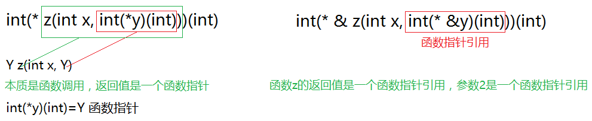

往往，我们一提到指针函数和函数指针的时候，就有很多人弄不懂。下面详细为大家介绍C语言中指针函数和函数指针。

### 指针函数

当一个函数声明其返回值为一个指针时，实际上就是返回一个地址给调用函数，以用于需要指针或地址的表达式中。

格式： 
```c
类型说明符 * 函数名(参数)  
```

由于返回的是一个地址，所以类型说明符一般都是int。

在c语言中，函数也是一种类型，可以定义指向函数的指针。我们知道，指针变量的内存单元存放一个地址值，而函数指针存放的就是函数的入口地址（位于.text段）。下面看一个简单的例子：

```c
#include <stdio.h>  
   
void say_hello(const char *str)  
{  
    printf("Hello %s\n", str);  
}  
   
int main(void)  
{  
    void (*f)(const char *) = say_hello;  
    f("Guys");  
    return 0;  
}  
```

分析一下变量f的类型声明`void (*f)(const char *)`，f首先跟\*号结合在一起，因此是一个指针。`(*f)`外面是一个函数原型的格式，参数是`const char *`，返回值是void，所以f是指向这种函数的指针。而say_hello的参数是`const char *`，返回值是void，正好是这种函数，因此f可以指向say_hello。注意，say_hello是一种函数类型，而函数类型和数组类型类似，做右值使用时自动转换成函数指针类型，所以可以直接赋给f，当然也可以写成`void (*f)(const char *) = &say_hello;`，把函数say_hello先取地址再赋给f，就不需要自动类型转换了。

可以直接通过函数指针调用函数，如上面的f("Guys")，也可以先用`*f`取出它所指的函数类型，再调用函数，即`(*f)("Guys")`。可以这么理解：函数调用运算符()要求操作数是函数指针，所以f("Guys")是最直接的写法，而say_hello("Guys")或`(*f)("Guys")`则是把函数类型自动转换成函数指针然后做函数调用。

### 函数指针

函数指针可以实现面向对象编程，可以实现软件分层设计（回调函数）。

指向函数的指针包含了函数的地址，可以通过它来调用函数。声明格式如下： 

```c
类型说明符 (*函数名)(参数)  
```

其实这里不能称为函数名，应该叫做指针的变量名。这个特殊的指针指向一个返回整型值的函数。指针的声明笔削和它指向函数的声明保持一致。

指针名和指针运算符外面的括号改变了默认的运算符优先级。如果没有圆括号，就变成了一个返回整型指针的函数的原型声明。

例如：

```c
void (*fptr)();  
```

把函数的地址赋值给函数指针，可以采用下面两种形式：

```c
fptr=&Function;   
fptr=Function;  
```

取地址运算符&不是必需的，因为单单一个函数标识符就标号表示了它的地址，如果是函数调用，还必须包含一个圆括号括起来的参数表。

可以采用如下两种方式来通过指针调用函数：

```c
x=(*fptr)();
x=fptr();
```

第二种格式看上去和函数调用无异。但是有些程序员倾向于使用第一种格式，因为它明确指出是通过指针而非函数名来调用函数的。下面举一个例子：

```c
void (*funcp)();   
void FileFunc(),EditFunc();   

int main(void)   
{   
	funcp=FileFunc;   
	(*funcp)();   
	funcp=EditFunc;   
	(*funcp)();   
}   

void FileFunc()   
{    
	printf("FileFunc\n");
}   

void EditFunc()   
{   
	printf("EditFunc\n");   
}  
```

程序输出为：

```
FileFunc 
EditFunc
```

下面再举几个例子区分函数类型和函数指针类型。首先定义函数类型F：

```c
typedef int F(void);  
```

这种类型的函数不带参数，返回值是int。那么可以这样声明f和g：

F f, g;相当于声明：

```c
int f(void);  
int g(void);  
```

下面这个函数声明是错误的：

```c
F h(void);  
```

因为函数可以返回void类型、标量类型、结构体、联合体，但不能返回函数类型，也不能返回数组类型。而下面这个函数声明是正确的：

```c
F *e(void);  
```

函数e返回一个F *类型的函数指针。如果给e多套几层括号仍然表示同样的意思：

```c
F *((e))(void);  
```

但如果把*号也套在括号里就不一样了：
```c
int (*fp)(void);  
```

这样声明了一个函数指针，而不是声明一个函数。fp也可以这样声明：
```c
F *fp;  
```

### 函数指针强化

诀窍:挖取函数指针变量声明格式当中的函数变量名就是该函数指针的具体类型!



```c
#include <stdio.h>
#include <stdlib.h>

//01.在C语言当中,当形参位于函数声明位置的时候:
//  可以不用指明形参名称;但是函数实现的时候需要指明形参名称!
int add(int, int);

int add(int a, int b)
{
    return a + b;
}

int sub(int a, int b)
{
    return a - b;
}

int mul(int a, int b)
{
    return a * b;
}

int divv(int a, int b)
{
    return a / b;
}

int getmin(int a, int b)
{
    return a < b ? a : b;
}

int getmax(int a, int b)
{
    return a > b ? a : b;
}

//02.采用函数指针作为形参可以实现固化接口的作用
//  固化接口+动化逻辑!
void op(int(*pFun)(int, int), int a, int b)
{
    printf("%d \n", pFun(a, b));
}

//02.只要作为声明的格式,就可以进行函数形参的省略!
//  1.区分函数调用和读取函数指针常量所存储的函数入口点地址
//  2.对于函数指针变量没有自变的说法,因为毫无意义!
//03.区分函数指针变量和函数指针变量的类型!
int main01(void)
{
    //错误的定义方式,因为类型不匹配
    //int(*pFun)(int, int) = add(1, 2);//不行:函数调用-->返回结果-->被当做函数调用地址!-->错误现象
    //参数名可以省略,声明的结构
    int(*pFun)(int, int) = add;
    //p1++;//函数指针变量,没有变的说法!
    //p2++;
    //p3 + n;

    //int(*pFun)(int, int);//函数指针
    //int (*)(int, int)//函数指针的类型
    int(* get() )(int, int);//一个返回值为函数指针,参数为void类型的函数常量指针

    //难度解析:规律剖析
    //  原始:int(*get(int(*y)(int, int), double))(int, int);
    //  剖析:int(*        get(        int (*y)(int, int), double      )       )(int, int)
    //  解析:一个返回值为函数指针(int (*)(int, int)),参数为函数指针(int(*y)(int, int))和双精度浮点型(double)的函数指针常量
    //  特点:函数实现的时候,所有形参必须具备形参名称!
    //      作为函数的返回值类型声明不需要进行名称说明!
    //  拓展:指向该函数指针的函数指针变量声明格式
    //  int (*(*pFun)(int(*y)(int, int), double))(int, int)-->该函数指针常量所对应的函数指针变量类型
    //  int (* (* const pFun)(int(*y)(int, int), double))(int, int)-->该函数指针常量所对应的函数指针类型
    system("pause");
}
```
下面的代码分别表示什么意思？
```c
void * ( * (*fp1)(int))[10];
```

fp1是一个指针，指向一个函数，这个函数的参数为int型，函数的返回值是一个指针，这个指针指向一个数组，这个数组有10个元素，每个元素是一个void*型指针。

```c
float (*(* fp2)(int,int,int))(int);	 
// p = (* fp2)(int,int,int)
// ==> float (* p)(int)
```

fp2是一个指针，指向一个函数，这个函数的参数为3个int型，函数的返回值是一个指针，这个指针指向一个函数，这个函数的参数为int型，函数的返回值是float型。

```c
int (* ( * fp3)())[10]();
// p = ( * fp3)()  函数指针
// ==> int (* p)[10]();
// 返回值是数组指针，数组的元素是函数指针
```

fp3是一个指针，指向一个函数，这个函数的参数为空，函数的返回值是一个指针，这个指针指向一个数组，这个数组有10个元素，每个元素是一个指针，指向一个函数，这个函数的参数为空，函数的返回值是int型。

### 函数指针数组与指向函数指针的指针

```c
#include <stdio.h>
#include <stdlib.h>

int getmin(int a, int b)
{
    return a < b ? a : b;
}

int getmax(int a, int b)
{
    return a > b ? a : b;
}

int add(int a, int b)
{
    return a + b;
}

int sub(int a, int b)
{
    return a - b;
}

int mul(int a, int b)
{
    return a * b;
}

int divv(int a, int b)
{
    return a / b;
}

//01.数组格式的规律:
//  在数组所存储元素的定义格式基础上,在数组元素名称的末尾添加中括号[数组元素个数];
//      该数组元素名称成为数组名称
//02.函数指针的规律:
//  在函数声明格式的基础之上,将函数名称直接替换为(*pFun),那么pFun
//      就是指向该函数的函数指针(*pFun)-->函数变量指针;(* const pFun)函数常量指针,如同数组名
int main01(void)
{
    //int a;
    //int a[10];
    //int *p;
    //int *arrP[10];

    int(*funP)(int, int) = getmax;
    //函数指针数组
    int(*funPArr[10])(int, int) = { getmin, getmax, add, sub, mul, divv };
    //funPArr是函数指针数组的数组名,二级函数指针可以直接存储一个一级函数指针数组的首地址
    //int (**funP1)(int, int)<=>int (*funP2[6])(int, int)
    //  funP1是二级函数变量指针+funP2是二级函数常量指着
    //注:凡是设计数组名都是常量指针
    //printf("%d \n", sizeof(funP1));
    //funP2 = funP1;//funP2是一个常量指针
    for (int i = 0; i < 6; ++i)
    {//索引遍历
        //printf("%d \n", funPArr[i](1, 2));//funPArr[i]代表函数指针变量本身
        printf("%d \n", (*(funPArr + i))(1, 2));//funPArr[i]=>*(funPArr + i)
    }
    for (int(**funPP)(int, int) = funPArr; funPP < funPArr + 6; ++funPP)
    {
        printf("%d", (*funPP)(100, 10));
    }

    system("pause");
}

//03.函数指针相关概念!
//int (*funP)(int, int)
//  funP是一级函数变量指针
//int (*funPArr[10])(int, int)
//  funPArr是二级函数常量指针
//int (**funPP)(int, int)
//  funPP是二级函数变量指针

//04.所有数组的推导特点
//int a;
//int a[10];
//int * a;
//int * p1;
//int * p1[10];
//int ** p1;
int main02(void)
{
    //int intArr[6] = { 1, 2, 3, 4, 5, 6 };
    int(*funPArr[6])(int, int) = { getmin, getmax, add, sub, mul ,divv };
    //intArr和funPArr都属于常量指针:作为数值而言,都是存储与代码区符号表当中
    //int * p = (int []){ 1, 2, 3, 4, 5, 6 }//栈上开辟一个一维数组
    //int(**funPP)(int, int);//二级函数变量指针,存储函数指针数组的数组名
    //int (*[])(int, int);//函数指针数组类型
    int(**funPP)(int, int) = (int(*[])(int, int)) { add, sub, mul, div };
    for (int i = 0; i < 4; ++i)
    {
        //printf("%d \n", funPP[i](100, 10));
        printf("%d \n",(*(funPP + i))(100, 10));
    }

    system("pause");
}

int main03(void)
{
    int(**funPP)(int, int) = malloc(4 * sizeof(int(*)(int, int)));//在堆内存开辟一个一级函数指针数组
    *funPP = add;
    *(funPP + 1) = sub;
    *(funPP + 2) = mul;
    *(funPP + 3) = divv;
    for (int i = 0; i < 4; ++i)
    {
        //printf("%d \n", funPP[i](100, 10));
        printf("%d \n", (*(funPP + i))(100, 10));
    }

    system("pause");
}

//05.变量+变量数组+指向变量的变量:
//  三种形式的推导规律
//int * p;------->int (*funP)(int, int);
//int * p[10];--->int (*funP[10])(int, int);
//int ** pp;----->int (**funPP)(int, int)

//06.typedef的强大作用:
//  某些情况之下的复杂函数指针必须通过typedef进行别名定义!
//int a;
//typedef int a;
//int b[10];
//typedef int b[10];
//double * d;
//typedef double * d;
//int (* funP )(int, int);
//typedef int (*funP)(int, int);
//int (*funP[10])(int, int);
//typedef int (*funP[10])(int, int);
//int (**funPP)(int, int);
//typedef int (**funPP)(int, int);
//typedef终极规律:
//  先定义变量名:类型+变量名
//  再使用前置typedef:于是变量名就成为了类型别名
//注:typedef并不是生产出一个新类型,而是为已有类型领取一个简洁的别名
//  编译后期操作类型-->某些情况之下的复杂函数指针不得不使用typedef关键字
//  进行别名定义!
int main04(void)
{
    //a a1;
    //b b1;
    //d d1;
    //p d1 = add;
    //px px1 = { add, sub, mul, divv };
    //pp pp1 = (px){ add, sub };
    //printf("%d \n", sizeof(px1));

    system("pause");
}

//07.函数指针终极形式!
//  原始:int(**x(int(*z)(int,int),int,double))(int);
//  返回值:int(**   x(int(*z)(int,int),int,double)   )(int)
//  形参:int(**   x(  int(*z)(int, int), int, int )   )(int)
//  解读:
//      函数名:x是一个函数的名称,属于函数常量指针
//      返回值:int(**)(int),是一个函数二级函数指针
//      形参:int (*z)(int, int), int, double,有三个形式参数
//           分别是函数指针类型+int类型+double类型
//注:区分数组指针和函数指针
//  数组指针:
//  int arrArr[a][b]-->int (*p)[a][b];
//注:指向N维数组的指针声明规律:
//  只需要将数组名称替换为(*p)

//08.数组指针和函数指针的区别:
//  1.都含有(*p)说明特点
//  2.各自的后续内容不一样:
//      数组指针跟的是中括号!
//      函数指针跟的是小括号!
//注:所有指向数组类型的指针定义绝招!
//  先写出数组的声明格式,再将数组名称替换为(*pArr);
//注:所有指向函数类型的指针定义绝招!
//  先写出函数的声明格式,再将函数名称提花为(*Fun);
int main05(void)
{
    int(*funPArr[10])(int, int);
    int(*(*pFunPArr)[10])(int, int);//指向函数数组的指针

    system("pause");
}
```

### 指针类型的参数和返回值

首先看下面的程序：

```c
#include <stdio.h>  
   
int *swap(int *px, int *py)  
{  
         inttemp;  
         temp= *px;  
         *px= *py;  
         *py= temp;  
         returnpx;  
}  
   
int main(void)  
{  
         inti = 10, j = 20;  
         int*p = swap(&i, &j);  
         printf("nowi=%d j=%d *p=%d\n", i, j, *p);  
         return0;  
}
```

我们知道，调用函数的传参过程相当于用实参定义并初始化形参，swap(&i, &j)这个调用相当于：

```c
int *px = &i;  
int *py = &j;  
```

所以px和py分别指向main函数的局部变量i和j，在swap函数中读写*px和*py其实是读写main函数的i和j。尽管在swap函数的作用域中访问不到i和j这两个变量名，却可以通过地址访问它们，最终swap函数将i和j的值做了交换。

上面的例子还演示了函数返回值是指针的情况，return px;语句相当于定义了一个临时变量并用px初始化： 
```c
int *tmp = px;
```

然后临时变量tmp的值成为表达式swap(&i,&j)的值，然后在main函数中又把这个值赋给了p，相当于： 
```c
int *p = tmp;  
```

最后的结果是swap函数的px指向哪就让main函数的p指向哪。我们知道px指向i，所以p也指向i。

```c
#define _CRT_SECURE_NO_WARNINGS
#include <stdio.h>
#include <stdlib.h>
#include <string.h>
#include <time.h>

//01.对字符数组除了定义并初始化格式之外的字符串赋值方式!
//  必须借助strcpy();函数进行对字符数组的赋值操作!
//注:所以数组的数组名都绝对是一个常量指针!
//02.被掉函数在进行返回指针的时候绝对不能够返回指向栈内存
//  的指针!切忌这一点儿
char * get()
{
    char str[100] = { 0 };//栈内存-->字符数组
    strcpy(str, "Hello ZhouRuiFu");//为字符数组赋予字符串
    printf("%s \n", str);
    return str;
}

//03.如何快速定位某个数组的两种形式:
//  1.数组的两种形式:分别用指针形式进行表述
//      普通数组形式-->指向数组的指针
//      指针数组形式-->指向指针的指针
//  2.任何数组都可以用两种形式的指针进行指向!
//      规律总结:针对任何一个维度的数组!
//      普通数组形式-->指向数组的指针:将数组名直接替换为(*arrP)
//      指针数组形式-->指向指针的指针:将数组名以及最高维度直接替换为(*pArr)
int * rungetmin()
{
    int * p = calloc(10, sizeof(int));//不会进行自动回收!
    time_t te;
    unsigned int seed = (unsigned int)time(&te);
    srand(seed);
    for (int i = 0; i < 10; ++i)
    {
        printf("%d \n", p[i] = rand() % 100 + 1);
    }
    int minIndex = 0;
    for (int i = 1; i < 10; ++i)
    {
        if (p[i] < p[minIndex])
            minIndex = i;
    }
    //p + minIndex = &p[minIndex];
    //p[minIndex] = *(p + minIndex)
    return p + minIndex;
}

//04.printf();函数针对于字符串的解析特点:
//  字符数组:按照字符数组的长度+直接解析到'\0'
//      如果没有解析到'\0'就会出现烫烫...
//  字符指针:解析字符指针所指向的字符串本身+直接解析到'\0'
//      分字符指针所指向的内存空间
//          如果是栈内存和堆内存-->有可能字字符串没有字符串结尾标识符'\0'
//          如果是代码区常量池-->就一定会有字符串结尾标识符'\0'
int main01(int argc, char * args[], char * envp[])
{
    char str[100] = { 0 };
    strcpy(str, "Hello ZhouRuiFu");
    printf("%s \n", str);

    system("pause");
}

//05.迷途指针
int main02(int argc, char * argv[], char * envp[])
{
    char * p = get();
    printf("%s \n", p);//函数在返回指针的时候,不可以返回指向栈内存空间的指针
    //因为有可能出现迷途指针

    system("pause");
}

int main03(int argc, char * argv[], char * envp[])
{
    printf("最小的是%d \n", *rungetmin());

    system("pause");
}
```

### 函数指针

若在程序中定义了一个函数，在编译时，编译器会为函数代码分配一段存储空间，这段空间的起始地址（又称入口地址）称为这个函数的指针。

函数指针是用来存放函数的地址，这个地址是一个函数的入口地址，而且是函数调用时使用的起始地址。当一个函数指针指向了一个函数，就可以通过这个指针来调用该函数，函数指针可以将函数作为参数传递给其他函数调用。

函数指针主要有两个用途，一是调用函数，而是将函数的地址作为函数参数传入其它函数。

函数名的实质其实就是函数这段代码的首地址

函数名数组名的最大区别就是：函数名做右值时加不加&的效果和意义都是一样的，但是数组名做右值时加不加&的效果和意义是不一样的。

```c
int (*p)(int, int);
int add(int x, int y);
p = add;
(*p)(3,5);
```

函数指针作为函数参数

```c
void func(int (*p)(int, int), int b, int n);
```

### 函数指针基础语法

函数指针用于指向一个函数，函数名是函数体的入口地址

```c
#define  _CRT_SECURE_NO_WARNINGS 
#include <stdlib.h>
#include <string.h>
#include <stdio.h>

//数组指针 语法 梳理
//定义一个数组类型   
//int a[10];

//定义一个指针数组类型 
//定义一个指向数组类型的指针，数组类的指针

void main01()
{
	int a[10]; //a代表的是数组首元素的地址  &a代表整个数组的地址  a+1 4  &a+1步长 40
	{
		//定义一个数组类型
		typedef int (myTypeArray)[10];
		myTypeArray myArray;
		myArray[0] = 10;
		printf("%d \n", myArray[0]);
	}

	{
		//定义一个数组指针类型 
		typedef int (*PTypeArray)[10];  //int *p 

		PTypeArray myPArray; //sizeof(int) *10
		myPArray = &a;
		//int b = 10;
		//int *p = NULL;
		//p = &b;
		(*myPArray)[0] = 20;

		printf("a[0]: %d \n", a[0]);
	}

	{
		//定义一个指向数组类型的指针，数组类的指针
		int (*MyPointer)[10]; //变量 告诉C编译器 给我分配内存
		MyPointer = &a;
		(*MyPointer)[0] = 40;
		printf("a[0]: %d \n", a[0]);
	}
	
	system("pause");
	return ;
}

//函数指针语法梳理
//1 如何定义一个函数类型
//2 如何定义一个函数指针类型
//3 如何定义一个 函数指针  (指向一个函数的入口地址)

int add(int a, int b)
{
	printf("func add ....\n");
	return a +b;
}

void main02()
{
	add(1, 2); //直接调用调用，函数名就是函数的入口地址 

	//定义一个函数类型
	{
		typedef int (MyFuncType)(int a, int b); //定义了一个类型
		MyFuncType *myPointerFunc = NULL; //定义了一个指针, 指向某一种类的函数

		myPointerFunc  = &add;  //细节
		myPointerFunc(3, 4); //间接调用

		myPointerFunc  = add;  //细节，C 过程 兼容历史版本的原因
		myPointerFunc(3, 4); //间接调用
	}

	//定义一个函数指针类型
	{
		typedef int (*MyPointerFuncType)(int a, int b); //int * a = NULL;
		MyPointerFuncType myPonterFunc; //定义一个指针
		myPonterFunc = add;
		myPonterFunc(5, 6);
	}

	//函数指针 
	{
		int (*MyPonterFunc)(int a, int b); //定义了一个变量
		MyPonterFunc = add;
		MyPonterFunc(7, 8);
	}

	system("pause");
}
```

### 函数指针数组

### 函数指针做函数参数

当函数指针 做为函数的参数，传递给一个被调用函数，被调用函数就可以通过这个指针调用外部的函数，这就形成了回调

```c
#define  _CRT_SECURE_NO_WARNINGS 
#include <stdlib.h>
#include <string.h>
#include <stdio.h>

int myadd(int a, int b)  //子任务的实现者
{
	printf("func add() do...\n");
	return a + b;
}
int myadd2(int a, int b)  //子任务的实现者
{
	printf("func add2() do...\n");
	return a + b;
}
int myadd3(int a, int b)  //子任务的实现者
{
	printf("func add3() do...\n");
	return a + b;
}
int myadd4(int a, int b)  //子任务的实现者
{
	printf("func add4() do...\n");
	return a + b;
}

//定义了一个类型 
typedef int (*MyTypeFuncAdd)(int a, int b);

//函数指针做函数参数
int MainOp(MyTypeFuncAdd myFuncAdd)
{
	int c = myFuncAdd(5, 6);
	return c;
}

// int (*MyPointerFuncAdd)(int a, int b)
int MainOp2(int (*MyPointerFuncAdd)(int a, int b) )
{
	int c = MyPointerFuncAdd(5, 6); //间接调用
	return c;
}

//间接调用 
//任务的调用和任务的编写可以分开
void main()
{
	/*
	MyTypeFuncAdd  myFuncAdd = NULL;
	myadd(1, 2); //直接调用

	myFuncAdd = myadd; 
	myFuncAdd(3, 4); //间接调用 

	MainOp2(myadd);
	MainOp(myadd);
	*/

	//在mainop框架 没有发生任何变化的情况下
	MainOp(myadd2);
	MainOp(myadd3);
	MainOp(myadd4);

	system("pause");
	return ;
}
```
回调函数：函数的调用和函数的实现 有效的分离

回调函数的本质：提前做了一个协议的约定（把函数的参数、函数返回值提前约定）

请思考：

C编译器通过那个具体的语法，实现解耦合的？回调函数，即函数指针作函数参数

C++编译器通过多态的机制(提前布局vptr指针和虚函数表，找虚函数入口地址来实现)

### 结构体内嵌函数指针实现分层

cal.h

```c
#ifndef __CAL_H__
#define __CAL_H__

typedef int (*pFunc)(int, int);

struct cal_t{
	int a;
	int b;
	pFunc p;
};

int calculator(const struct cal_t *p);

#endif
```

framework.c

```c
#include "cal.h"

int calculator(const struct cal_t *p){
	p->p(p->a, p->b);
}
```

cal.c

```c
#include "cal.h"
#include<stdio.h>

int add(int a, int b){
	return a + b;
}

int sub(int a, int b){
	return a - b;
}

int multiply(int a, int b){
	return a * b;
}

int divide(int a, int b){
	return a / b;
}

int main(void){
	
	int ret = 0;
	
	struct cal_t myCal;
	
	myCal.a = 12;	
	myCal.b = 4;
	myCal.p = divide;
	
	ret = calculator(&myCal);
	
	printf("ret = %d.\n",ret);
	
	return 0;
}
```