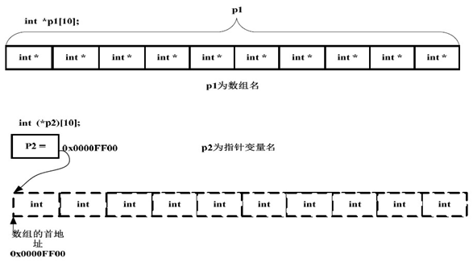
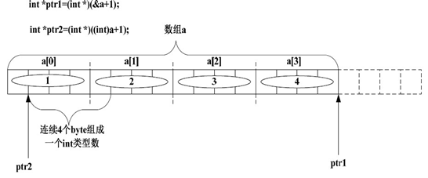
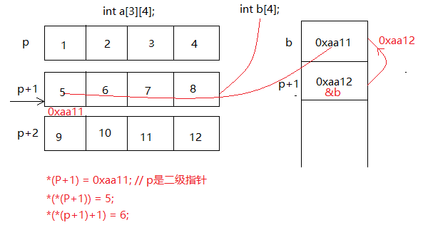

指针运算

```c
///01.指针运算.c
#include <stdio.h>
#include <stdlib.h>

//01.指针变量的运算符特点:
//  1.指针变量的运算只有在所属数组的情况下才具备实际意义
//  2.指针变量的运算与其所指向的数据实体的类型密切相关
//  3.没有明确类型的指针变量完全无法进行访问(读取|修改)
//      只是具备这存储地址这么一个唯一的功能
//02.指针变量的运算规律总结:
//  1.p+1<==>p+sizeof(*p)*1;
//  2.空类型的指针变量必须明确数据类型之后才能进行具体操作
//      否则只是具备容器的特点
int main01(void)
{
    int intNum = 10;
    int * pIntNum = &intNum;
    //pIntNum+1;<>pIntNum+sizeof(*pIntNum)*1;
    printf("%p, %p \n", pIntNum, pIntNum + 1);

    char ch = "X";
    char *pCh = &ch;
    printf("%p, %p, %p \n", pCh, pCh + 1, pCh - 1);//指针变量的运算与类型密切相关

    void * ppCh = &ch;
    //pv+1;//没有明确指针类型的指针变量,不能进行指针变量的算术运算

    system("pause");
}

int main02(void)
{
    int intNum = 10;
    int * pIntNum = &intNum;
    printf("%p, %p, %p \n", pIntNum - 1, pIntNum, pIntNum + 1);
    printf("%d, %d, %d \n", *(pIntNum - 1), *pIntNum, *(pIntNum + 1));
    //如果指针变量所存储的指针所描述的地址不在数组当中,那么指针变量的加减运算法则没有任何意义
    //  因为运算结果可以和数组索引相互挂钩

    system("pause");
}

//02.关于指针变量的运算特点:
//  1.参与运算的指针变量所存储的指针必须指向同一个数组内存情况下
//  2.指针变量的运算范围:
//      (1).指针变量既可以加上一个整数或者也可以减去一个整数(指针结果不要越过数组)
//      (2).指着变量值可以减去一个指针变量,但不可以加上一个指针变量
//      (3).指针变量既不可以执行乘法运算也不可执行除法运算,因为运算结果毫无实际意义!
int main03(void)
{
    int intArr[10] = { 1, 2, 3, 4, 5, 6, 7, 8, 9, 10 };
    int * p1 = &intArr[0];
    int * p2 = &intArr[6];
    printf("%d \n", p2 - p1);//在同一个数组当中的两个指针变量(指针变量p1-指针变量p2<=>(指针1-指针2)/sizeof(*p1)<=>相差的元素个数)
    //printf("%d \n", *(p1 -2));

    system("pause");
}
```

数组

```c
///02.数组.cpp
#include <stdio.h>
#include <stdlib.h>
#include <iostream>

using namespace std;

//01.关于数组名和&数组名的内容详解:
//  1.数组名的本质:将所有数组看作为一维数组,那么数组名就是该一维数组当中首个数组元素的地址
//      常量指针!-->含有内存实体,是个伪常量,可以避免直接修改,但是无法避免间接修改
//  2.&数组名的本质:获取指向整个数组整体的指针类型
//      指针常量!-->没有内存实体,是个真常量,既不可以直接修改,也不可以间接修改
//  因此:无论是常量指针还是指针常量所对应的值都是指针(是具备类型含义的地址)
//      数组名+1<=>常量指针+1<=>常量指针的值+sizeof(*常量指针)
//      &数组名+1<=>指针常量+1<=>指针常量的值+sizeof(*指针常量)
//  诀窍:对任何类型的变量(无论是真变量还是伪变量)进行取地址操作,都属于指针类型
//      也就统统占用4个字节的内存空间
int main04(void)
{
    int intArr[10] = { 1, 2, 3, 4, 5, 6, 7, 8, 9, 10 };
    printf("intArr = %p, &intArr = %p \n", intArr, &intArr);
    printf("%d, %d \n", intArr, intArr + 1);//数组的第一个元素的地址,长度为int类型的字节数
    printf("%d ,%d \n", &intArr, &intArr + 1);//整个数组的类型,长度为整个数组的长度(4*10),这里说明取地址运算符在进行运算的时候同时获取了指针的地址和类型
    printf("sizeof(intArr) = %lu, sizeof(&intArr) = %lu \n", sizeof(intArr), sizeof(&intArr));
    printf("%s ,%s", typeid(intArr).name(), typeid(&intArr).name());

    system("pause");
    return 1;
}
```

数组实战

```c
///03.数组实战.c
#include <stdio.h>
#include <stdlib.h>

//01.函数的形式参数如果是数组名称,就取消了副本机制!
//  取消副本机制的原理-->将数组名称当做了指针变量的名称进行处理
//  该指针变量具备着实际参数数组的所有信息(包括类型信息)
//  注:这里的指针变量的类型是将所有数组类型看做为一维数组,那么
//      该一维数组当中的所有元素的类型就是该指针变量所指向的内存
//      实体的类型
void testFun(int * p)//借助指针变量访问外界数组
{
    printf("testFun sizeof(p) = %d \n", sizeof(p));
    for (int * px = p; px < p + 10; px++)
    {
        *px = 12;
        printf("%d ,%p \n", *px, px);
    }
}

//02.sizeof(对象)运算诀窍:
//  sizeof(*&对象);<==>绝对正确的一个结果
int main05(void)
{
    int intArr[10] = { 1, 2, 3, 4, 5, 6, 7, 8, 9, 10 };
    printf("main: sizof(intArr) = %d \n", sizeof(intArr));//sizeof(数组名)<=>sizeof(*&数组名);
    testFun(intArr);
    printf("原生数组: \n");
    for (int * p = intArr; p < intArr + 10; ++p)
    {
        printf("%d ,%p \n", *p, p);
    }

    system("pause");
}

//03.对于数组的变量需要借助指针变量进行:
//  指针变量作为循环变量进行运算
int main06(void)
{
    int intArr[10] = { 1, 2, 3, 4, 5, 6, 7, 8, 9, 10 };
    //int * pIntArr = &intArr;//类型不匹配:&intArr-->指向数组的指针
    //intArr++;//数组名称intArr作为一个常量指针,是不能够直接进行自增自减运算的
    for (int * p = intArr + 2; p < intArr + 10; ++p)
    {
        printf("%d, %p \n", *p, p);
    }
    for (int * p = intArr + 10; p > intArr - 1; --p)
    {
        printf("%d, %p \n", *p, p);
    }

    system("pause");
}

//04.sizeof();诀窍:
//  sizeof(ob);<=>sizeof(*&obj);
int main07(void)
{
    double * pDb;//在C语言当中,指针变量必须进行初始化,否则就会成为野指针,使用的时候容易出现问题,某些编译器不会通过的
    printf("%d \n", sizeof(*pDb));//对称法则:double  | * pDb-->8个字节
    int intArr[10] = { 1, 2, 3, 4, 5, 6, 7, 8, 9, 10 };
    printf("intArr = %p, &intArr = %p \n", intArr, &intArr);
    //printf("sizeof(intArr) = %lu, sizeof(&intArr) = %lu \n", sizeof(intArr), sizeof(&intArr));
    //printf("sizeof(*intArr) = %lu, sizeof(*&intArr) = %lu", sizeof(*intArr), sizeof(*&intArr));
    printf("%d \n", sizeof(intArr));//sizoef();使用诀窍

    system("pause");
}
```

指针结合数组

```c
#include <stdio.h>
#include <stdlib.h>

//01.几组概念区分:
//  1.普通变量和指针变量:
//      是否具有地址意义
//  2.变量指针和常量指针
//      指针变量和数组名的区分
//  3.常量指针和指针常量
//      数组名和地址意义上的数值
//  注:通常意义上的指针实质上是指着变量
//02.函数形参使用数组声明形式以及指针声明形式
//  其访问实参的方式都是相同的(数组形式<=>指针形式)
int main01(void)
{
    int arr[10] = { 1, 2, 3, 4, 5, 6, 7, 8, 9, 0 };
    int * p = arr;//变量指针接收常量指针的值
    for (int i = 0; i < 10; ++i)
    {
        printf("%d, %d, %d, %d \n", arr[i], *(arr + i), p[i], *(p + i));
    }
    //接收同样一个数组实参
    //  采用数组声明形式和采用指针声明形式的访问方式完全一样
    //  例如:arr[i]<=>p[i];*(p+i)<=>*(arr+i)

    system("pause");
}

//03.数组作为形参的函数标准声明形式!
//  指向数组元素的指针+数组元素个数
void revArr(int * p, int n)
{
    for (int i = 0; i < n / 2; ++i)//节省效率的反转方式
    {
        p[i] = p[i] ^ p[n - 1 - i];
        p[n - 1 - i] = p[i] ^ p[n - 1 - i];
        p[i] = p[i] ^ p[n - 1 - i];
    }
}

//04.通过指针方式来对数组进行遍历!
void revArrT(int * p, int n)
{
    for (int * pHead = p, *pTail = p + n - 1; pHead < pTail; ++pHead, --pTail)
    {//奇数:重合退出+偶数:交叉退出
        *pHead = *pHead ^ *pTail;
        *pTail = *pHead ^ *pTail;
        *pHead = *pHead ^ *pTail;
    }
}

//05.传递实质是什么就可以以何种形式进行数据访问!
//  这里传递的实质是数组,因此可以采用数组方式访问
void showArr(int * p, int n)
{
    for (int i = 0; i < n; ++i)
    {
        printf("%2d", p[i]);
    }
}

int main02(void)
{
    int arrA[10] = { 1, 2, 3, 4, 5, 6, 7, 8, 9, 0 };//10/2=5..0--><=5-->0~4(前0~4与后0~4)对称
    int arrB[9] = { 1, 2, 3, 4, 5, 6, 7, 8, 9 };//9/2=4..1--><=4-->0~3(前0~3与后0~4)对称
    revArr(arrA, sizeof(arrA) / sizeof(arrA[0]));
    showArr(arrA, sizeof(arrA) / sizeof(arrA[0]));
    putchar('\n');
    revArrT(arrB, sizeof(arrB) / sizeof(arrB[0]));
    showArr(arrB, sizeof(arrB) / sizeof(arrB[0]));

    system("pause");
}

//06.特殊常量指针访问数组方式:
//  原理:arr[i]<=>*(arr+i)
//  因此:i[arr]<=>*(i+arr)
//  注:所有数组的解析方式都是按照arr[i]-->*(arr+i)-->
//      所有荒唐用法i[arr]也可以进行替换为-->*(i+arr)
int main03(void)
{
    int arr[10] = { 1, 2, 3, 4, 5, 6, 7, 8, 9, 0 };
    printf("% \n", 8[arr]);
    //arr[1]<==>*(arr+1)

    system("pause");
}
```

二维数组

```c
#include <stdio.h>
#include <stdlib.h>

//01.关于栈内存开辟数组:
//  诀窍:将所有维度的数组看做为一维数组,
//      然后再采用指向该数组当中首个元素的指针(变量|常量)
//  秘诀:原始数组数组名称替换法:
//      就可以直接得到指向数组的指针(将数组名称-->替换为-->(*pArr))
//  特点:指针变量可以不用最高维度,
//      但是类型转换必须加上表示最高维度的中括号!
int main01(void)
{
    //int arrArr[3][4];//位于栈内存:
    int * p1 = (int []) {0};//一维数组-->栈上开辟
    int(*p2)[4] = (int[][4]) { 0 };//二维数组-->栈上开辟
    int(*p3)[3][4] = (int[][3][4]) { 0 };//三维数组-->栈上开辟

    system("pause");
}

//02.堆栈开辟指针数组以及指针数组的回收顺序!
//  1.防止内存泄露现象的产生
//  2.动态数组可以按照静态数组的方式进行访问!
int main02(void)
{
    //堆内存开辟数组!
    int ** pp = calloc(3, sizeof(int *));//分配指针数组[一级指针数组!]
    for (int i = 0; i < 3; ++i)
    {
        pp[i] = malloc(4 * sizeof(int));//每个指针必须分配内存!
    }

    int num = 0;
    for (int i = 0; i < 3; ++i)
    {
        for (int j = 0; j < 4; ++j)
        {
            //&pp[i]-->pp+i
            //&pp[i][j]-->*(pp+i)+j
            //pp[i]-->*(pp+i)
            //pp[i][j]-->*(*(pp+i)+j);
            //printf("%4d", pp[i][j] = num++);
            printf("%4d", *(*(pp + i) + j));
        }
        printf("\n");
    }
    //严格注意堆内存当中数组的回收顺序!
    for (int i = 0; i < 3; ++i)
    {
        free(pp[i]);//先回收一级指针所指向的内存块儿-->防止堆内存泄露
    }
    free(pp);//再释放指针数组

    system("pause");
}

//03.栈上开辟二维数组:
//  注:在进行栈内存的类型转换的时候,需要一个准确的数组!
int main03(void)
{
    //栈上开辟二维数组
    int(*p)[4] = (int[3][4]) { 0 };//栈上开辟二维数组,自动回收
    int num = 0;
    for (int i = 0; i < 3; ++i)
    {
        for (int j = 0; j < 4; ++j)
        {
            printf("%3d", p[i][j] = num++);
        }
        printf("\n");
    }

    system("pause");
}

//04.分块儿数组的逐级回收特点!
int main04(void)
{
    //分块儿内存切忌要逐级进行内存回收!
    int(*pArr)[4] = malloc(3 * 4 * sizeof(int));//堆内存:呈线性存储的二维数组
    int num = 0;
    for (int i = 0; i < 3; ++i)
    {
        for (int j = 0; j < 4; ++j)
        {
            printf("%3d \n", pArr[i][j] = num++);
        }
        printf("\n");
    }
    free(pArr);//根据指向堆内存的连续存储的二维数组指针,进行堆内存二维数组的回收操作!

    system("pause");
}
```

### 指针数组和数组指针的内存布局

初学者总是分不出指针数组与数组指针的区别。其实很好理解：

指针数组：首先它是一个数组，数组的元素都是指针，数组占多少个字节由数组本身决定。它是“储存指针的数组”的简称。

数组指针：首先它是一个指针，它指向一个数组。在32 位系统下永远是占4 个字节，至于它指向的数组占多少字节，不知道。它是“指向数组的指针”的简称。

下面到底哪个是数组指针，哪个是指针数组呢：

A)
```c
int *p1[10];  
```

B)
```c
int (*p2)[10];  
```

每次上课问这个问题，总有弄不清楚的。这里需要明白一个符号之间的优先级问题。

“[]”的优先级比 \* 要高。p1 先与“[]”结合，构成一个数组的定义，数组名为p1，int \*修饰的是数组的内容，即数组的每个元素。那现在我们清楚，这是一个数组，其包含10 个指向int 类型数据的指针，即指针数组。至于p2 就更好理解了，在这里“（）”的优先级比“[]”高，“*”号和p2 构成一个指针的定义，指针变量名为p2，int 修饰的是数组的内容，即数组的每个元素。数组在这里并没有名字，是个匿名数组。那现在我们清楚p2 是一个指针，它指向一个包含10 个int 类型数据的数组，即数组指针。我们可以借助下面的图加深理解：



如果换一种定义指针的方式：int (*)[10] p2也行我们会更好理解。

这里有个有意思的话题值得探讨一下：平时我们定义指针不都是在数据类型后面加上指针变量名么？这个指针p2 的定义怎么不是按照这个语法来定义的呢？也许我们应该这样来定义p2：

```c
int (*)[10] p2;  
```

int (*)[10]是指针类型，p2 是指针变量。这样看起来的确不错，不过就是样子有些别扭。其实数组指针的原型确实就是这样子的，只不过为了方便与好看把指针变量p2 前移了而已。

### a 和&a 之间的区别

既然这样，那问题就来了。前面我们讲过a 和&a 之间的区别，现在再来看看下面的代码：
```c
int main()  
{  
   char a[5]={'A','B','C','D'};  
   char (*p3)[5] = &a;  
   char (*p4)[5] = a;  
   return 0;  
}  
```

上面对p3 和p4 的使用，哪个正确呢？p3+1 的值会是什么？p4+1 的值又会是什么？毫无疑问，p3 和p4 都是数组指针，指向的是整个数组。&a 是整个数组的首地址，a是数组首元素的首地址，其值相同但意义不同。在C 语言里，赋值符号“=”号两边的数据类型必须是相同的，如果不同需要显示或隐式的类型转换。p3 这个定义的“=”号两边的数据类型完全一致，而p4 这个定义的“=”号两边的数据类型就不一致了。左边的类型是指向整个数组的指针，右边的数据类型是指向单个字符的指针。在Visual C++上给出如下警告：

```
warning C4047: initializing: char (*)[5] differs in levels ofindirection from char *
```

还好，这里虽然给出了警告，但由于&a 和a 的值一样，而变量作为右值时编译器只是取变量的值，所以运行并没有什么问题。不过我仍然警告你别这么用。

既然现在清楚了p3 和p4 都是指向整个数组的，那p3+1 和p4+1 的值就很好理解了。

但是如果修改一下代码，会有什么问题？p3+1 和p4+1 的值又是多少呢？

```c
int main()  
{  
   char a[5]={'A','B','C','D'};  
   char (*p3)[3] = &a;  
   char (*p4)[3] = a;  
   return 0;  
}  
```

甚至还可以把代码再修改：

```c
int main()  
{  
   char a[5]={'A','B','C','D'};  
   char (*p3)[10] = &a;  
   char (*p4)[10] = a;  
   return 0;  
}  
```

这个时候又会有什么样的问题？p3+1 和p4+1 的值又是多少？

### 地址的强制转换

先看下面这个例子：

```c
struct Test  
{  
   int Num;  
   char *pcName;  
   short sDate;  
   char cha[2];  
   short sBa[4];  
}*p;  
```

假设p 的值为0x100000。如下表表达式的值分别为多少？

- p + 0x1 = 0x___ ?
- (unsigned long)p + 0x1 = 0x___?
- (unsigned int*)p + 0x1 = 0x___?

可能大家一开始没看明白这个问题是什么意思。但是我们再仔细看看，这个知识点似曾相识。一个指针变量与一个整数相加减，到底该怎么解析呢？

还记得前面我们的表达式“a+1”与“&a+1”之间的区别吗？其实这里也一样。指针变量与一个整数相加减并不是用指针变量里的地址直接加减这个整数。这个整数的单位不是byte 而是元素的个数。所以：p + 0x1 的值为0x100000+sizof（Test）*0x1。至于此结构体的大小为20byte，前面的章节已经详细讲解过。所以p +0x1 的值为：0x100014。

(unsigned long)p + 0x1 的值呢？这里涉及到强制转换，将指针变量p 保存的值强制转换成无符号的长整型数。任何数值一旦被强制转换，其类型就改变了。所以这个表达式其实就是一个无符号的长整型数加上另一个整数。所以其值为：0x100001。

(unsigned int\*)p + 0x1 的值呢？这里的 p 被强制转换成一个指向无符号整型的指针。所以其值为：0x100000+sizof（unsigned int）*0x1，等于0x100004。

上面这个问题似乎还没啥技术含量，下面就来个有技术含量的：在x86 系统下，其值为多少？

```c
int main()  
{  
   int a[4]={1,2,3,4};  
   int *ptr1=(int *)(&a+1);  
   int *ptr2=(int *)((int)a+1);  
   printf("%x,%x",ptr1[-1],*ptr2);  
   return 0;  
}  
```

对于上面的代码，如果我们懂得一些汇编方面的知识，就会很简单。下面就来分析分析这个问题：

根据上面的讲解，&a+1 与a+1 的区别已经清楚。

ptr1：将&a+1 的值强制转换成int*类型，赋值给int* 类型的变量ptr，ptr1 肯定指到数组a 的下一个int 类型数据了。ptr1[-1]被解析成*(ptr1-1)，即ptr1 往后退4 个byte。所以其值为0x4。

ptr2：按照上面的讲解，(int)a+1 的值是元素a[0]的第二个字节的地址。然后把这个地址强制转换成int*类型的值赋给ptr2，也就是说\*ptr2 的值应该为元素a[0]的第二个字节开始的连续4 个byte 的内容。

其内存布局如下图：



好，问题就来了，这连续4 个byte 里到底存了什么东西呢？也就是说元素a[0],a[1]里面的值到底怎么存储的。这就涉及到系统的大小端模式了，如果懂汇编的话，这根本就不是问题。既然不知道当前系统是什么模式，那就得想办法测试。我们可以用下面这个函数来测试当前系统的模式。

```c
int checkSystem()  
{  
   union check  
   {  
      int i;  
     char ch;  
   } c;  
   c.i = 1;  
   return (c.ch ==1);  
}  
```

如果当前系统为大端模式这个函数返回0；如果为小端模式，函数返回1。也就是说如果此函数的返回值为1 的话，\*ptr2 的值为0x2000000。如果此函数的返回值为0 的话，*ptr2 的值为0x100。

### 数组与指针

数组指针是指向数组的指针，数组中存储的是统一的其他数据类型的变量；指针指向这一块内存的首地址。可以通过指针的移动来依次访问数组中的元素。

指针数组是指数组中存储的是指针，数组中指针的数据类型必须一致，指针数组的定义方式与普通数组类似，只需在类型前面加上“\*”，如`int *arr[10];` 存储了10 个int 类型的指针。

```c
int buf[10] = {0}; 
```

- buf：数组名，表示数组首元素的地址（&buf[0]），是一个常量，不可变（为了保证释放内存的安全性）。
- buf[0]：数组的首元素
- &buf[0]：数组首元素的地址，等价于buf
- &buf：表示数组首地址（整个数组的地址），是一个地址常量，只能作为右值
- buf+1 步长是4字节，&buf+1 步长是4*10字节



```c
#include<stdio.h>  
#include<stdlib.h>

int main(){

    int a[10] = { 1, 2, 3, 4, 5, 6, 7, 8, 9, 10 };  
    for (int *p = a; p < a + 10; p++)//指针类型决定占4个字节  
    {  
        printf("\n%p,%d", p, *p);  
    } 
  
    //指针数组，管理地址，按照顺序执行指令  
    char *str[5] = { "calc", "notepad", "tasklist", "pause", "mspaint" };  
    for (char **pp = str; pp < str + 5; pp++)
    {  
        system(*pp);  
    }
  
    char str[5][10] = { "calc", "notepad", "tasklist", "pause", "mspaint" };  
    printf("%p", str); 

    for (char(*p)[10] = str; p < str + 5; p++)  
    {  
        printf("\n %p,%s", p, p);//打印地址  字符串  
        system((char *)p);  
    }
  
  	return 0;
}
```

### 指针数组

一个元素数据类型为指针的数组

```c
int *p[5];
```

指针数组动态分配

```c
#define _CRT_SECURE_NO_WARNINGS
#include <stdio.h>
#include <stdlib.h>
#include <string.h>

//01.跨级指针实现数据层&显示层
//  查找权限的控制-->地址映射对!
int main01(void)
{
    //char *pArr[10] = { "1123", "1231" };
    int count;
    scanf("%d", &count);
    char **pp = (char **)malloc(count * sizeof(char *));
    for (int i = 0; i < count; ++i)
    {
        char str[1024] = { 0 };
        scanf("%s", str);//针对于字符串的所有操作实质都是通过字符指针实现间接修改内存实体!
        *(pp + i) = (char *)malloc((strlen(str) + 1)*sizeof(char));//字符串结尾整体标识符'\0'
        strcpy(*(pp + i), str);//字符串拷贝!
    }
    for (int i = 0; i < count; ++i)
    {
        printf("%s \n", *(pp + i));
    }

    system("pause");
}

int num;
//跨函数操控指针数组!
void init(char *** ppp)
{
    scanf("%d", &num);
    *ppp = (int **)malloc(num * sizeof(int *));
    for (int i = 0; i < num; ++i)
    {
        char str[1024] = { 0 };
        scanf("%s", str);
        *((*ppp) + i) = (int *)malloc((strlen(str) + 1) * sizeof(char));
        strcpy(*((*ppp) + i), str);
    }
    for (int i = 0; i < num; ++i)
    {
        printf("%s \n", *((*ppp) + i));
    }
}

//指针数组二分查找
int binsearch(char **pp)
{
    printf("二分查找法! \n");
    char searchStr[128] = { 0 };
    scanf("%s", searchStr);
    int minIndex = 0;
    int midIndex = 0;
    int maxIndex = num - 1;
    while (minIndex <= maxIndex)
    {
        midIndex = (minIndex + maxIndex) / 2;
        if (0 == strcmp(searchStr, *(pp + midIndex)))
        {
            printf("searchStr = %s找到,位于多少%p号地址! \n", searchStr, *(pp + midIndex));
            return midIndex;
        }
        else if (-1 == strcmp(searchStr, *(pp + midIndex)))
        {
            maxIndex = midIndex - 1;
        }
        else
        {
            minIndex = midIndex + 1;
        }
    }
    return -1;
}

//指针数组排序
void sort(char **pp)
{
    for (int i = 0; i < num - 1; ++i)
    {
        for (int j = 0; j < num - 1 - i; ++j)
        {
            if (0 < strcmp(*(pp + j), *(pp + j + 1)))
            {//比较数据区+交换指针区
                char * pTmp = *(pp + i);
                *(pp + i) = *(pp + i + 1);
                *(pp + i + 1) = *(pp + i);
            }
        }
    }
    puts("排序之后! \n");
    for (int i = 0; i < num; ++i)
    {
        printf("%s \n", *(pp + i));
    }
}

//通过二级指针数组间接从指针数组当中进行数据查询!
int binSearchAddr(char *** ppp)
{
    printf("二分查找法! \n");
    char searchStr[128] = { 0 };
    scanf("%s", searchStr);
    int minIndex = 0;
    int midIndex = 0;
    int maxIndex = num - 1;
    while (minIndex <= maxIndex)
    {
        midIndex = minIndex + (maxIndex - minIndex) / 2;
        if (0 == strcmp(searchStr, *(*(ppp + midIndex))))
        {
            printf("searchStr = %s找到,位于%p号地址! \n", *(*(ppp + midIndex)));
            return midIndex;
        }
        else if (-1 == strcmp(searchStr, *(*(ppp + midIndex))))
        {
            maxIndex = midIndex - 1;
        }
        else
        {
            minIndex = midIndex + 1;
        }
    }
    return -1;
}

//不操作原有指针数组的情况之下操作二级指针数组实现排序!
//  诀窍:比较内存实体,交换指针变量(数据保护措施!)
//注:只要有需求不改变原有数据的情况下实现排序,就需要高级指针:
//  通过对地址映射进行排序,从而实现数据表现形式的排序特点!
void sortByAddr(char ** pp)
{
    char *** ppp = (char ***)malloc(num * sizeof(char **));
    for (int i = 0; i < num; ++i)
    {
        *(ppp + i) = pp + i;
    }
    for (int i = 0; i < num - 1; ++i)
    {
        for (int j = 0; j < num - 1 - num; ++j)
        {
            if (0 < strcmp(*(*(ppp + j)), *(*(ppp + j + 1))))
            {
                char ** ppTmp = *(ppp + j);
                *(ppp + j) = *(ppp + j + 1);
                *(ppp + j + 1) = ppTmp;
            }
        }
    }
    printf("二级指针数组显示层! \n");
    for (int i = 0; i < num; ++i)
    {//对二级指针数组进行排序之后-->方可对二级指针数进行查询操作!
        printf("%s \n", *(*(ppp + i)));
    }
    printf("一级指针数组数据层! \n");
    for (int i = 0; i < num; ++i)
    {
        printf("%s \n", *(pp + i));
    }
    binSearchAddr(ppp);
}

int main02(void)
{
    //char * p[10] = { "1123", "1231" };
    char **pp;
    init(&pp);
    //sort(pp);//指针数组排序
    //binsearch(pp);//指针数组二分查找
    sortByAddr(pp);//构建二级指针数组,实现一级指针数据的权限查找

    system("pause");
}
```

### 二维数组参数与二维指针参数

```c
void fun(char a[3][4]);
void fun(char a[ ][4]);
void fun(char (*p)[4]);
void fun(char **p);
```

| 数组参数                | 等效的指针参数             |
| ------------------- | ------------------- |
| 数组的数组：char a\[3][4] | 数组的指针：char (*p)[10] |
| 指针数组： char *a[5]    | 指针的指针：char **p      |

C 语言中，当一维数组作为函数参数的时候，编译器总是把它解析成一个指向其首元素首地址的指针。这条规则并不是递归的，也就是说只有一维数组才是如此，当数组超过一维时，将第一维改写为指向数组首元素首地址的指针之后，后面的维再也不可改写。比如：a\[3]\[4]\[5]作为参数时可以被改写为（*p）\[4][5]

### 带参数的main()函数

```c
int main(int argc, char *argv[]);
```

- argc 表示在命令行中输入的参数个数
- argv 参数是字符串指针数组，其各元素值为命令行中各字符串的首地址

例如：`main.exe arg1 arg2 arg3` ，argc为4，argv指针数组中元素指向的字符串分别是：“main.exe”、 “arg1”、“arg2 ”、“arg3”

### 分析数组指针与指针数组的表达式

```c
int (*p)[10]; // 数组指针
int *p[10]; // 指针数组
```

规律：第一步找核心，第二步找结合（根据运算符优先级）

如果核心和星号\*结合，表示核心是指针；如果核心和中括号[]结合，表示核心是数组；如果核心和小括号()结合，表示核心是函数

### 数组指针作为函数参数

将数组作为函数参数的本质就是将指向数组首元素的指针作为函数参数。数组指针作为函数参数时，由于无法获取数组的长度，所以根据需求传入数组的长度。

### 动态数组

```c
#define _CRT_SECURE_NO_WARNINGS
#include <stdio.h>
#include <stdlib.h>

//01.动态数组采用什么类型的指针变量进行接收:
//  就表明动态数组名称属是什么类型!(变量指针|)
//  简而言之:接收动态数组的指针变量就是动态数组名的本质!
//注:严格区分变量指针和常量指针
//02.区分释放内存和回收内存之间的区别:
//  个人观点:释放内存+数据清除=回收内存
//      仅仅的释放内存:不会自动发生数据清除操作!
int main01(void)
{
    //arr[N];
    int N;
    scanf("%d", &N);

    int * p;
    p = (int *)malloc(N * sizeof(int));
    for (int i = 0; i < N; ++i)
    {
        p[i] = i;
        printf("%d \n", p[i]);
    }
    free(p);//回收内存
    //free(p);//释放内存,针对于同一片儿内存的指针,对该指针进行释放的操作不可重复进行!

    system("pause");
}

//02.在堆内存开辟模拟栈内存的二维数组的关键点在于:
//  指针变量的类型-->决定对内存块儿的解析方式!
//注:可以对动态数组的数组名执行类似于栈内存二维数组的操作!
int main02(void)
{
    int arrArr[3][10];//开辟堆内存动态数组模拟这个栈内存二维数组,关键在于指针
    int(*p)[10] = malloc(30 * sizeof(int));//p就是堆内存当中的动态数组数组名
    int num = 0;
    for (int i = 0; i < 3; ++i)
    {
        for (int j = 0; j < 10; ++j)
        {
            printf("%3d", p[i][j] = num++);//原理:p[i][j]<=>*(*(p+i)+j));
        }
        printf("\n");
    }

    system("pause");
}

//03.关于动态内存分配的注意事项:
//  1.参数按照无符号类型进行解析的!
//      因此不能使用特殊值-1-->会解析为极大的数据
//      无符号类型解析方式:内存二进制全部看做为补码进行逆向解析
//  2.取特殊内存字节数0可以分配成功,但是并没有
//      实际意义!
//注:解析方式尤其重要!
int main03(void)
{
    //int * p = malloc(-1);//分配失败为0,-1补码-->所分配的内存空间比较大
    int * p = malloc(0);
    printf("%p \n", p);//0能分配成功,但是没有实际意义!

    system("pause");
}

//04.动态内存开辟诀窍:
//      数组首元素的指针!
//  注:回收内存的操作只能执行一次,为了软件规范
//      只要对指针变量当中所存储的指针执行了回收操作
//      就应当置为空指针,防止重复回收内存错误!
int main04(void)
{
    int N;
    scanf("%d", &N);

    int * p;
    p = malloc(N * sizeof(N));
    printf("p = %p \n", p);
    for (int i = 0; i < N; ++i)
    {
        p[i] = i;
        printf("%d", p[i]);
    }
    free(p);//内存回收!
    printf("p = %p \n", p);
    //free(p);回收内存,回收内存的操作只能执行一次,不可以进行重复回收动作
    p = NULL;//被妹子回收了,为了防止迷途指针的产生,需要设定指针变量为空
    free(p);//回收空指针不会出错!
    //*p = 123;

    system("pause");
}

//05.一定要在存储指针的指针变量消亡之前
//  执行指针所指向内存区块儿回收操作,否则会导致内存泄露
void run()
{
    void * p = malloc(10);//指针变量p本身存储与栈内存
    //内存泄露,存储地址的指针消亡,就无法进行回收动作了
    free(p);
}

//06.如何定义一个三维动态数组?
//  采用面儿指针<=>指向二维数组的指针
//注:定义N维数组需要(N-1)维的数组的指针
//  任何N维数组都可以看做为一个一维数组,内部的(N-1)维数组只是一个元素!
int main05(void)
{
    int(*p)[3][5] = malloc(sizeof(int) * 15 * 2);
    int num = 0;
    for (int z = 0; z < 2; ++z)//纵坐标-->控制面
    {
        for (int x = 0; x < 3; ++x)//横坐标-->控制行
        {
            for (int y = 0; y < 5; ++y)//纵坐标-->控制列
            {
                printf("%3d", p[z][x][y] = num++);
            }
            printf("\n");
        }
        printf("\n\n");
    }

    system("pause");
}
```

动态内存

```c
#include <stdio.h>
#include <stdlib.h>

//01.静态数组:
//  位于栈内存:在编译时期就已经确定了该数组的所含有的元素个数
int main01(void)
{
    int arr[10];//栈内存-->静态数组-->在编译时期就已经确定了数组的元素个数

    system("pause");
}

//02.动态数组:
//  位于堆内存:在运行时期动态确定该数组所占有的内存尺寸!
int main02(void)
{
    int n;
    scanf("%d", &n);

    int * p = malloc(n * sizeof(int));
    for (int i = 0; i < n; ++i)
    {
        p[i] = i;
        printf("%d \n", p[i]);
    }

    system("pause");
}

//03.区分软访问与硬访问:
//  软访问和硬访问的默认最小单位是字节
//  软访问可以实现的极限最下单位是二进制位
int main03(void)
{
    while (1)
    {
        void * p = malloc(1024 * 1024 * 10);
    }

    system("pause");
}

//04.使用动态内存的原因:
//  静态内存(栈内存)使用尺寸过小!
int main04(void)
{
    //int a[1024 * 1024 * 1024];//栈内存的大小,不能太大,设置很大不但耗费CPU,还耗费内存
    int a;

    system("pause");
}
```