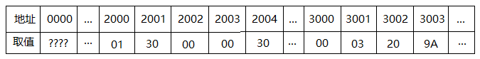
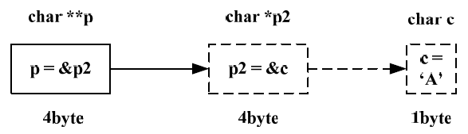

指针，大概是C语言中最难理解的概念之一了。指针这个东西是c语言中的一个基本概念，C99中对于指针的定义是：

1. 指针的类型是derived from其它类型，也就是说指针的类型是由它指向的类型决定的；
2. 指针是一种reference类型，即引用类型；

指针这个词出现在高级语言程序设计中，在汇编中，就没有指针这个概念，有的只是地址。计算机的每一个内存单元都是编址的，对内存的访问都是通过地址进行的。高级语言把这些低级的硬件细节隐藏起来，程序处理的数据都存在数据对象里，数据对象在能用其间有特定的存储位置，占据一定的内存单元。由于访问内存需要地址，在高级语言中，就引入指针变量来存储数据对象的地址，进而访问内存。

简单来说，指针就是一个整数。计算机中的内存都是编址的，每个地址都有一个符号，就像家庭地址或者IP地址一样。指针，是一个无符号整数（unsigned int，因不致歧义，下简称“整数”），它是一个以当前系统寻址范围为取值范围的整数。声明指针和声明一个无符号整数实质上并没有区别。

以地址为值的变量就是指针变量，简称指针。

既然指针中存储的是地址，就要能够对所有的内存单元寻址，也就是说指针的大小是系统寻址范围。

所有指针占的存储一样大，因为它们的值都是地址，通常用一个机器字表示，那么机器字通常就和地址范围大小一致了，数据总线和地址总线宽度在程序设计上最好保持一致。

我们知道32位地址总线能够寻址4GB的地址空间（0~2<sup>32</sup>-1），指针是变量 ，其本身也要占据内存单元，那么在32位系统中，整形int也是32位的。

32位系统的寻址能力（地址空间）是4GB（0~2<sup>32</sup>-1），二进制表示长度为32比特，也就是4B。不难验证，在32位系统里，int类型也正好是4B（32-bit）长度，可以取遍上述范围。同理，64位系统取值范围为0~2<sup>64</sup>-1，int类型长度为8B。

例证就是程序1得到的答案和程序2的答案一致。

程序1

```c
#include <stdio.h>  
int main(void)  
{  
   char *pT;  
   char t='h';  
   pT=&t;  
   putchar(*pT);  
}  
```

程序2
```c
#include <stdio.h>  
int main(void)  
{  
   char *pT;  
   char t='h';  
   pT=(char *)1245048;  
   putchar(*pT);  
}  
```

## 指针和整数的区别

既然指针的实质是一个整数，为何不用unsigned int直接声明，或者统一用`int *`声明，而要用不同的类型后面加上一个“\*”表示呢？`char *`声明过的类型，一次访问1个sizeof(char)长度，`double *`声明过的类型，一次访问1个sizeof(double)长度。也正因此，程序2第6行加上“(char \*)”是因为毕竟unsigned int和char \*不是一回事，需要强制转换，否则会有个警告。

在汇编里，没有数据类型这一概念，整数类型和指针就是一回事了。不论是整数还是指针，执行自增的时候，都是将原值加一。如果上文声明`char *pT;`，汇编语言中pT自增（INC）之后值为1245049，可是C语言中pT++之后pT值为1245052。如果32位系统中，上文声明`int *pT;`，汇编语言中pT自增之后值为1245049，可是C语言中pT++之后pT值为1245052。

为什么DOS下面的Turbo C，和Windows下的VC的int类型自增时的步进不一样长？因为DOS是16位的，Windows x86是32位的，int类型长度取决于操作系统的位长。可以预见，在Windows x64中编译，上文声明`int *pT;`，在执行pT++之后pT值为1245056。

## 指针的空间分配

### 1. 基本数据类型
在程序编译或者运行时，系统开辟了一张表。每遇到一次声明语句（包括变量的声明、函数的声明和传入参数的声明等等）都会开辟一个内存空间，并在表中增加一行纪录，记载一些对应关系。以32位操作系统下为例：

| 声明                 | 变量名        | 内存地址 | 访问长度 | 值          |
| ------------------ | ---------- | ---- | ---- | ---------- |
| int nP;            | nP         | 2000 | 4B   | 0xCCCCCCCC |
| char myChar;       | myChar     | 2002 | 4B   | 0xCC       |
| int * myPointer;   | myPointer  | 2003 | 4B   | 0xCCCCCCCC |
| char * myPointer2; | myPointer2 | 2005 | 4B   | 0xCCCCCCCC |

### 2. 高级数据类型
那么，复杂的结构怎么分配空间呢？C语言的结构体（汇编语言对应为Record类型）按顺序分配空间。
```c
int a[20];  
typedef struct st  
{  
   double val;  
   char c;  
   struct st *next;  
} pst;  
pst pT[10];  
```

这就说明了为什么sizeof(pst)=16而不是8。编译器把结构体的大小规定为结构体成员中大小最大的那个类型的整数倍。至于pT的存储，可以推得总长为160。如果执行pT++，答案不是自增，也不是160。因为数组声明时，pT是常量，不能加减。

### 3. 指针连接的数据类型
所以，我们就可以声明：
```c
typedef struct BiTree
{  
   int value;  
   struct BiTree *LeftChild;  
   struct BiTree *RightChild;  
} BTree;  
```

用一个整数，代表一棵树的结点。把它赋给某个结点的LeftChild/RightChild值，就形成了上下级关系。只要无法找到一个路径，使得 A->LC/RC->LC/RC...->LC/RC==A（A泛指某一结点），这就构成了一棵二叉树。反之就成了图。

## 使用指针的目的
### 1. 简化代码

如果没有指针，我们很难用一个统一的模式去A的定位并修改一棵树的结点。例如：不用指针要修改A的左子树的左子树的右子结点，只有“A.LC.LC.RC=…”一种表达方式，不能通过赋值而简化。

### 2. 参数传递
C中函数调用是按值传递的，传入参数在子函数中只是一个初值相等的副本，无法对传入参数作任何改动。但实际编程中，经常要改动传入参数的值。这一点我们可以用一个小技巧，即传入参数的地址而不是原参数本身，当对传入参数（地址）取“*”运算时，就可以直接在内存中修改，从而改动原想作为传入参数的参数值。
```c
#include <stdio.h>  
void inc(int *val)  
{  
   (*val)++;  
}  
int main(void)  
{  
   int a=3;  
   inc(&a);  
   printf("%d", a);  
}  
```

在执行inc(&a);时，系统在内存分配表里增加了一行“val@inc”，其地址为新地址，值为&a。操作“*val”，即是在操作a了。

## 指针的运算和声明
### 1. 取地址和取值运算
“\*p”操作是这样一种运算，返回p的值作为地址之内存空间的取值。“&p”则是这样一种运算，返回当时声明p时开辟的地址。显然可以用赋值语句对内存地址赋值。

我们假设有这么一段内存地址空间，他们取值如下：（单位：H，16进制）



然后，执行这么一段代码`int *p;`，假设开辟空间时p被分配3001H、3002H两个位置。则p为2003H，`*p`为3001H。

`**p`的值为多少？
`**p=*(*(p))=*(*(2003H))=*(3000H)=0300H`。

那么&&p、`*(&p)`和`&(*p)`又等于多少？
`&&p=&(&(p))=&(3001H)`，此时出错了，3001H是个常数怎么可能有地址呢？

`*&p=*(&(p))=*(3001H)=2003H`，也就是`*&p=p`。
`&*p=&(*(p))=&(3001H)`，读者可能以为`&*p=p`此时出错了，3001H是个常数怎么可能有地址呢？

### 2. 指针和引用的声明注记

我们再看看另类的*和&。这里有两个地方要注意：

（1）在程序声明变量的时候的\*，只是表明“它是一个整数，这个整数指向某个内存地址，一次访问sizeof(type)长度”。这点不要和(*)操作符混淆；

（2）在C++程序声明变量的时候的&，只是表明“它是一个引用，这个引用声明时不开辟新空间，它在内存分配表加入新的一行，该行内存地址等于和调用时传入的对应参数内存地址”。这一点不要与“*”声明符和“&”操作符混淆。

## 指针的复杂形式

### 1. 二级指针（指向指针的指针）



二级指针是指向指针的指针，它是一个整数，这个整数指向某个内存地址，该地址的值是一个整数，指向给另一个内存地址（通常异于前者，但不排除二者相等）。综合前述的BTree定义，对于一棵树，我们通常用它的根结点地址来表示这棵树。找到了树的根，其每个结点都可以找到。

但是有时候我们需要对树进行删除结点，增加节点操作，往往考虑到删除根结点，增加的结点取代原来的根结点作为新根结点的情况。为了修改根结点这个“整数”，我们需要退一步，使用这个“整数”的内存地址，也就是指向这个“整数”的指针。在声明时，我们用2个*号，声明指向指针的指针。它的意思是“它是一个整数，这个整数指向某个内存地址，一次访问sizeof(unsigned int)长度，其指向的内存地址所存储的值是一个整数，那个整数值指向某个内存地址，一次访问sizeof(BTree)长度。”详见数据结构有关“树”的程序代码。

### 2. 指针数组

指针数组：就是一个整数数组，那个数组的各个元素都是整数，指向某个内存地址。

### 3. 数组指针

数组指针：数组名本身就是一个指针，指向数组的首地址。注意这是声明定长数组时，其数组名指向的数组首地址是常量。而声明数组并使某个指针指向其值指向某个数组的地址（不一定是首地址），指针取值可以改变。

### 4. 指向函数的指针

指向函数的指针：从二进制角度考虑，数组名是该数组数据段首地址，函数名就是该代码段的首地址，可以用“int *fun()”。在二进制层面，代码段和数据段什么区别？没什么区别。很多人都说C语言是一种面向过程的语言，因为它最多只有struct的定义，而没有class的概念。根据本段所述，我们可以认为C语言能成为面向对象的语言，只是表述比较麻烦而已。事实上很多开源程序都使用这种方式组织他们的代码。

```c
#include <stdio.h>  

void inc(int *val)  
{  
   (*val)++;  
}  

main()  
{  
   void (*fun)(int *);  
   int a=3;  
   fun=inc;  
   (*fun)(&a);  
   printf("%d", a);  
}  
```
