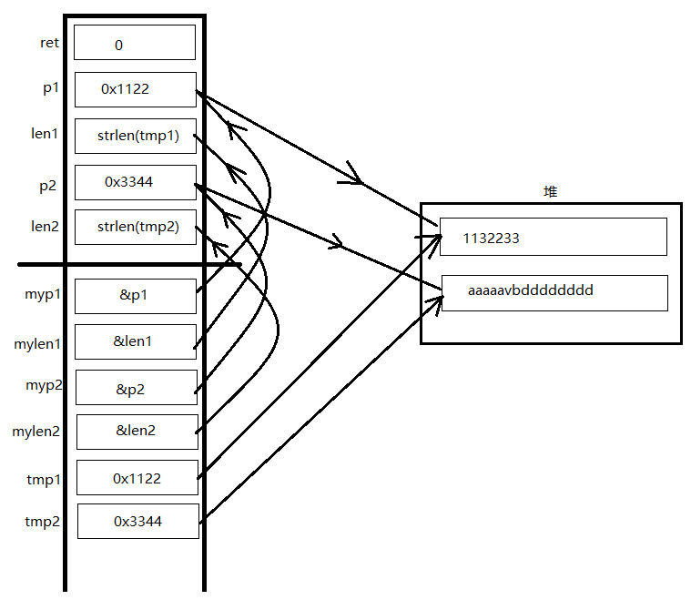
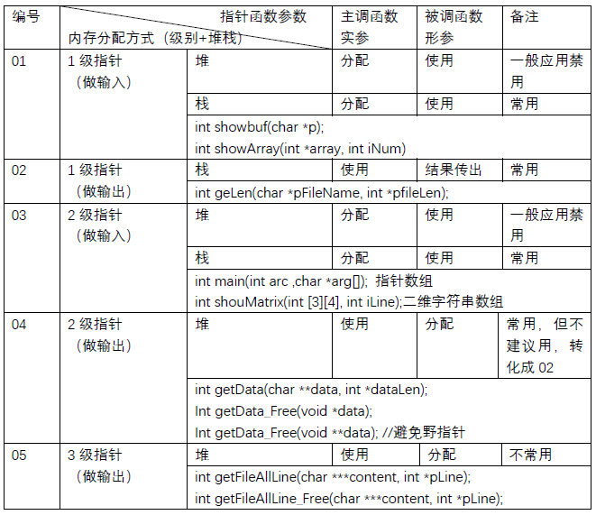
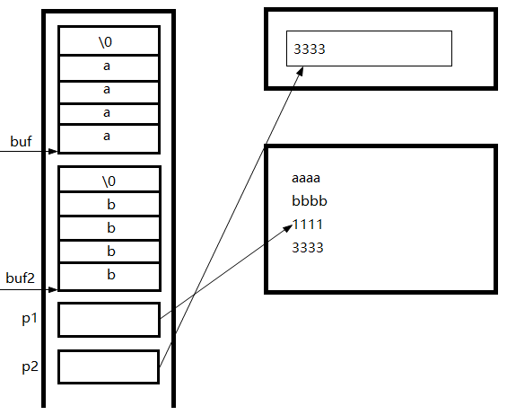
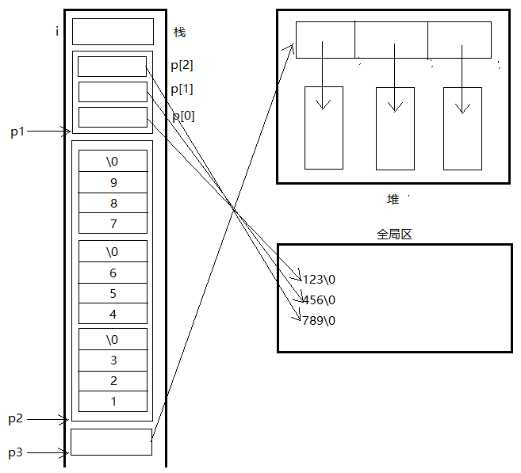
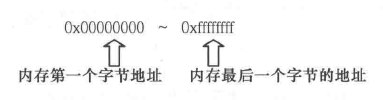

指针是一种数据类型，具有指针类型的变量称为指针变量。实际上，可以把指针变量（也简称为指针）看成一种特殊的变量，它用来存放某种类型变量的地址。一个指针存放了某个变量的地址值，就称这个指针指向了被存放地址的变量。简单地说，指针就是内存地址，它的值表示被存储的数据的所在的地址，而不是被存储的内容。

内存是按字节（8位）排列的存储空间，每个字节有一个编号，称之为内存地址，就象一个大楼里各个房间有一个编号一样。内存中存放的数据包括各种类型的数、地址，还有程序的指令代码，等等。保存在内存中的变量一般占几个字节，我们称之为内存单元，一个内存单元保存一个变量的值。不同的数据类型在机器内存中所占的内存单元的大小一般是不一样的，例如，整型数占两个字节，浮点数占4个字节等。但是，在同一个机器上，相同的数据类型占有相同大小的存储单元，而在不同的机器系统里，即使相同的数据类型所占的存储单元也可能是不一样的，例如，16位机器上，一个整型数占两个字节，而在32位机器上，一个整型数占4个字节。

为了访问某个单元中的数据，就必须知道该单元在内存中的地址。这跟我们的实际生活很类似，比如说，当我们要找某一个人的时候，就必须知道他的当前地址，否则，就无法达到目的。 

### 一个内存单元的地址与内存单元的内容的区别

打个比方，为了打开一个A抽屉，有两种办法，一种是将A抽屉的钥匙带在身上，需要时直接找出该钥匙打开抽屉，取出所需的东西，另一种办法是，为安全起见，将该A抽屉的钥匙放在另一个抽屉B中锁起来。如果需要打开A抽屉，就需要先找出B抽屉中的钥匙，打开B抽屉，取出A抽屉的钥匙，再打开A抽屉，取出A抽屉中之物，这就是"间接访问"。指针变量相当于B抽屉，B抽屉中的东西相当于地址（如果把钥匙比喻成地址，不甚确切），A抽屉中的东西，相当于存储单元的内容。

既然指针变量的值是一个地址，那么这个地址不仅可以是变量的地址，也可以是函数的地址。在一个指针变量中存放一个数组或一个函数的首地址有何意义呢？因为数组元素或函数代码都是连续存放的。通过访问指针变量取得了数组或函数存储单元的首地址，也就找到了该数组或函数。这样一来，凡是出现数组、函数的地方都可以用一个指针变量来操作。

### 指针知识体系搭建

在程序运行过程中，数据都是保存在内存中的，内存是以字节为单位的连续存储空间，每个字节都有一个编号，这个编号称为地址。变量也是有地址的，专门用于存放其他变量的地址，这种变量称为指针变量，通常简称指针。通过指针可以操作它
指向的内存中的变量。取内存的地址或取内存中的值进行运算。如`char arr[10], *p; p= arr;`arr 是大小为10 的指针数组，p 是指向这个数组的指针。

指针是一种变量，在32位系统下占4字节，在64位系统下占8字节

指针和指针变量是两个完全不同的概念，指针是一个地址，而指针变量是存放地址（指针）的变量。

指针变量和它所指向的内存空间变量是两个不同的概念

指针指向谁，就把谁的地址赋给指针

不断的给指针赋值，相当于不停的改变指针的指向

理解指针的关键是内存，没有内存哪里来的指针 

间接赋值是指针存在的最大意义

在C语言中，地址还是扩大变量或者函数作用域的有效手段

- 空指针NULL
- 野指针：就是指针指向一个不确定的地址空间，或者虽然指向一个确定的地址空间，但是引用空间的结果却是不可预知的
- 万能指针void *
- 函数指针：指向函数（入口地址）的指针
- 指针函数：返回值为指针的函数
- 数组指针
- 指针数组

#### 铁律1：指针是一种数据类型

（1）指针也是一种变量，占有内存空间，用来保存内存地址。

指针变量占有内存空间大小，32位系统大小为4个字节，64位系统大小为8个字节

（2）*p操作内存

- 在指针声明时，*号表示所声明的变量为指针
- 在指针使用时，*号表示操作指针所指向的内存空间中的值
- *p相当于通过地址(p变量的值)找到一块内存；然后操作内存
- *p放在等号的左边赋值（给内存赋值）
- *p放在等号的右边取值（从内存获取值）

（3）指针变量和它指向的内存块是两个不同的概念

- 含义1： 给p赋值p=0x1111; 只会改变指针变量值，不会改变所指的内容；p = p +1;p++
- 含义2： 给\*p赋值`*p='a';` 不会改变指针变量的值，只会改变所指的内存块的值  
- 含义3： =左边\*p 表示 给内存赋值， =右边\*p 表示取值，含义不同切记！
- 含义4： =左边`char *p`
- 含义5： 保证所指的内存块能修改，全局区中的常量区受系统保护，不能通过指针修改

（4）指针是一种数据类型，是指它指向的内存空间的数据类型

含义1：指针步长（p++），根据所指内存空间的数据类型来确定

p++ = (unsigned char )p+sizeof(a);

结论：指针的步长，根据所指内存空间类型来定。

注意：建立指针指向谁，就把谁的地址赋值给指针。	

不断的给指针变量赋值，就是不断的改变指针变量（和所指向内存空间没有任何关系）。

#### 铁律2：间接赋值（*p）是指针存在的最大意义 

（1）两码事：指针变量和它指向的内存块变量
（2）条件反射：指针指向某个变量，就是把某个变量地址赋值给指针
（3）\*p间接赋值成立条件：3个条件 

- 2个变量（通常一个实参，一个形参）
- 建立关系，实参取地址赋给形参指针 
- \*p形参去间接修改实参的值 

```c
int  getMem(char **myp1, int *mylen1,  char **myp2, int *mylen2)
{
	int		ret = 0;
	char	*tmp1, *tmp2;

	tmp1 = (char *)malloc(100);
	strcpy(tmp1, "12345");

	//间接赋值 
	*mylen1 = strlen(tmp1);  //1级指针
	*myp1 = tmp1; //2级指针的间接赋值

	tmp2 = (char *)malloc(200);
	strcpy(tmp2, "abcd");

	*mylen2 = strlen(tmp2);  //1级指针
	*myp2 = tmp2; //2级指针的间接赋值

	return ret;
}

int  main()
{
	int		ret = 0;
	char	*p1 = NULL;
	int		len1 = 0;
	char	*p2 = NULL;
	int		len2 = 0; 

	ret = getMem(&p1, &len1, &p2, &len2);
	if (ret != 0)
	{
		printf("func getMem() err:%d \n", ret);
		return ret;
	}
	printf("p1:%s \n", p1);
	printf("p2:%s \n", p2);
	if (p1 != NULL)
	{
		free(p1);
		p1 = NULL;
	}
	if (p2 != NULL)
	{
		free(p2);
		p2 = NULL;
	}

	printf("p1:%d \n", p1);
	system("pause");
	return ret;
}
```



#### 铁律3：理解指针必须和内存四区概念相结合

（1）主调函数和被调函数 

- 主调函数可把堆区、栈区、全局数据内存地址传给被调用函数
- 被调用函数只能返回堆区、全局数据

（2）内存分配方式

- 指针作函数参数，是有输入和输出特性的。
- 在主调用函数为指针分配内存，传给被调用函数，这种用法叫指针的输入in
- 运算结果可以当作指针参数传进来，不要轻易改变形参的值，为了不改变形参的值，用一个辅助指针接收形参的值

#### 铁律4：应用指针必须和函数调用相结合（指针做函数参数）

指针变量作为函数参数：共享内存，“双向”传递



#### 铁律5：一级指针典型用法（指针做函数参数）

数组（int a[10]）作函数参数，会退化为指针

字符串作函数参数

- C语言的字符串，以0结尾的字符串
- 在C语言中没有字符串类型，通过字符数组来模拟字符串
- 字符串的内存分配，栈上、堆上、全局区

```c
void main()
{
	char buf[20]= "aaaa"; //定义并且初始化
	char buf2[] = "bbbb";
	char *p1 = "1111";
	char *p2 = malloc(100); 
	strcpy(p2, "3333");

	system("pause");
	return ;
}
```



```c
char *str_cnct( char *x, char* y )
{
	if( x == NULL )
	{
		return NULL;
	}
	char * str3 = (char *) malloc( 80 );
	char *z = str3; // 指针z指向数组str3
	while ( *z++ = *x++ );
	z--; // 去掉串尾结束标志
	while ( *z++ = *y++ );
	z = str3; // 将str3地址赋给指针变量z
	return(z);
}
void main()
{
	char *p = str_cnct( "hello", "world" );
  	printf("%s", p);
  
	if( p != NULL )
	{
		free(p); 
      	p = NULL;
	} 
	return;
}
```

运行结果

```
helloworld
```

#### 铁律6：二级指针典型用法（指针做函数参数）

二级指针三种内存模型图

```c
void main()
{
	int i = 0;
	//指针数组
	char *p1[] = {"123", "456", "789"};
	//二维数组
	char p2[3][4]  = {"123", "456", "789"};
	//手工二维内存
	char **p3 = (char **)malloc(3 * sizeof(char *)); //int array[3];
	for (i=0; i<3; i++)
	{
		p3[i] = (char *)malloc(10*sizeof(char)); //char buf[10]
		sprintf(p3[i], "%d%d%d", i, i, i);
	}
}
```



```c
int sort(char *p[], int count, char **p,int *ncount);
int sort(char *p[], int count, char (*p)[30],int *ncount);
int sort(char (*p)[30], int ncount,  char **p, int *ncount);

//把第一种内存模型第二种内存模型结果copy到第三种内存模型中，并排序，打印
char ** sort(char **p1, int num1, char(*p)[30], int num2, int *num3 );
```

```c
#define  _CRT_SECURE_NO_WARNINGS 
#include <stdlib.h>
#include <string.h>
#include <stdio.h>

int sort(char **myp1 /*in*/, int num1, char (*myp2)[30], int num2, char ***myp3, int *num3)
{
	int i = 0, j = 0, k= 0;
	int  tmplen = 0;
	char **p3 = NULL;
	char *tmpP = NULL;
	p3 = (char **)malloc((num1 + num2) * sizeof(char *)); //里面装的是指针
	if (p3 == NULL) 
	{
		return -1;
	}
	//根据长度分配内存空间
	for (i=0; i<num1; i++)
	{
		tmplen= strlen(myp1[i]) + 1;
		p3[i] = (char *)malloc( tmplen * sizeof(char)) ;
		if (p3[i] == NULL)
		{
			return -2;
		}
		strcpy(p3[i], myp1[i]);
	}

	for (j=0; j<num2; j++, i++)
	{
		tmplen = strlen(myp2[j]) + 1;
		p3[i] = (char *)malloc (tmplen * sizeof(char));
		if (p3[i] == NULL)
		{
			return -3;
		}
		strcpy(p3[i], myp2[j]);
	}

	tmplen = num1 + num2;
	//*num3 = num1 + num2;

	//排序
	for (i=0; i<tmplen; i++)
	{
		for (j=i+1; j<tmplen; j++)
		{
			if ( strcmp(p3[i], p3[j]) > 0 )
			{
				tmpP = p3[i];
				p3[i] = p3[j];
				p3[j] = tmpP;
			}
		}
	}

	//间接赋值
	*num3 = tmplen;
	*myp3 = p3;
	return 0;
}

void sortFree01(char **p, int len)
{
	int i = 0;
	if (p == NULL)
	{
		return ;
	}

	for (i=0; i<len ; i++)
	{
		free(p[i]);
	}
	free(p);
}

//把二级指针指向二维内存释放掉,同时间接的修改了实参的值
void sortFree02(char ***myp, int len)
{
	int i = 0;
	char **p = NULL;
	if (myp == NULL)
	{
		return ;
	}

	p  = *myp; //还原成二级指针
	if (p == NULL)
	{
		return ;
	}

	for (i=0; i<len ; i++)
	{
		free(p[i]);
	}
	free(p);
	//myp 是实参的地址
	*myp = NULL; //间接赋值是指针存在的最大意义
}

int  main()
{
	int ret = 0;
	char *p1[] = {"aaaa", "cccc", "bbbb"};
	char buf2[10][30] = {"1111", "3333", "2222"};
	char **p3 = NULL;
	int len1, len2, len3, i = 0;

	len1 = sizeof(p1)/sizeof(*p1);
	len2 = 3;

	ret = sort(p1, len1, buf2, len2, &p3, &len3);
	if (ret != 0)
	{
		printf("func sort() err:%d \n", ret);
		return ret;
	}

	for (i=0; i<len3; i++)
	{
		printf("%s\n", p3[i]);
	}

	system("pause");
	return ret;
}
```

#### 铁律7： 三级指针输出典型用法

### 变量空间的首字节地址，作为整个空间的地址

实际上，内存中的每一个字节空间都有一个地址，如果是内核有32根地址线，地址以二进制表示，其最大可寻址范围是

0000000 0000000 0000000 0000000 ~ 11111111 11111111 11111111 11111111

地址的十六进制表示



0xffffff：16<sup>8</sup> = 2<sup>32</sup> = 4G

既然每个字节对应的地址都是32位的，那么所有存放地址的指针变量大小也应该是32位的，即4个字节。64位系统同理。

当我们说一个地址的时候，指的就是一个字节的地址，比如 int a 的空间大小有4个字节，每个字节都有一个地址，但只有首字节地址才能作为整个a空间的地址。&a代表的就是第一个字节的地址。拿到了空间的首地址后，同时 int 类型又明确了空间大小是4个字节，所以从首地址字节顺延3个字节的空间，一共4个字节作为整个变量的空间。

### 指针函数

```c
int * add(int x, int y);
```

### 用typedef定义数据类型

- 给类型起别名
- 简化类型，让程序更易理解和书写
- 创建平台无关类型，方便移植。

```c
typedef char Line[80]; // Line就是别名，代表80个元素的字符数组
typedef int (*fun_ptr)(int, int); // 函数指针
typedef struct Student{
  	char name[10];
  	int age;
} Student;
Lint t;
fun_ptr p;
Student stu;
```

### 回调函数

### 指针与const

C语言中的const是个冒牌货，变量的值可以通过指针修改

```c
const int *p; // 常量指针，指针所指向变量的值不能被改变
int * const p; // 指针常量，一个常量，即指针存放的地址不能被改变
const int * const; // 指向常量的常指针，指针指向的地址不能被改变，且所指向地址中的值也不能被改变
// 通过指针可以间接修改const修饰的变量
const int a = 10;
int *p = &a;
*p = 20; 
```