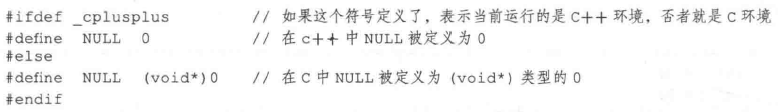
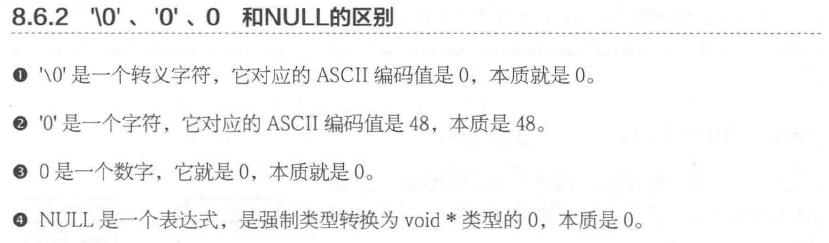

指针变量也是变量，是变量就可以任意赋值，不要越界即可（32位编译器指针大小为4字节，64位编译器指针大小为8字节），但是，任意数值赋值给指针变量没有意义，因为这样的指针就成了野指针，此指针指向的区域是未知(操作系统不允许操作此指针指向的内存区域)。所以，野指针不会直接引发错误，操作野指针指向的内存区域才会出问题。

```c
int a = 100;
int *p;
p = a; //把a的值赋值给指针变量p，p为野指针， ok，不会有问题
p = 0x12345678; //给指针变量p赋值， 为野指针，ok，不会有问题
p = 1000; //操作野指针指向未知区域，内存出问题，err
```

但是，野指针和有效指针变量保存的都是数值，为了标志此指针没有指向任何变量（空闲可用），C语言中，可以把NULL赋值给此指针，这样标志此指针为空指针，没有任何指向。

```c
int *p = NULL;
```

NULL是一个值为0的宏常量

```c
#define NULL ((void *)0)
```

### NULL到底是什么



本质上是一个宏定义，在C语言中NULL本质是0，但是这个0不是当一个数字来解析，而是当一个内存地址来解析的，这个0其实就是0x00000000，代表内存的0地址。

NUL是ASCII码表的第一个字符，表示的是空字符，其ASCII码值为0

(void *)0这个整体表达式表示一个指针。这个指针变量本身占四个字节，地址指向哪里取决于指针变量本身，这个指针变量的值是0，也就是说这个指针变量指向0地址（实际是0地址开始的一段内存）

```c
#ifdef __cplusplus
#define NULL 0
#else
#define NULL ((void *)0)
#endif
```

```c
int *p = NULL; // p的值是(void *)0的值，实际就是0，意思是指针p指向内存的0地址处
```



### 野指针

指向不可用区域的指针被称为野指针。对野指针进行操作可能会发生不可预知的错误。野指针的形成原因有以下两种：

- 指针变量没有被初始化。定义的指针若没有被初始化，则可能指向系统中任意一块存储空间，若指向的存储空间正在使用，当发生调用并执行某种操作时，就可能造成系统崩溃。
- 若两个指针指向同一块存储空间，指针与内存使用完毕之后，调用相应函数释放了一个指针与其指向的内存，却未改变另一个指针的指针，将其置空。

在编程时，可以通过“if(p==NULL){}”来判断指针是否指向空，但是无法检测该指针是否为野指针，所以要避免野指针的出现。

**1.野指针**

野指针:没有进行初始化操作的指针-->由于该指针变量内部所存储的地址是个随机值,因此是野地址(类型含义:指针)

注:指针类型的变量必须在其被创建的时候就需要进行初始化操作,否则就成了野指针,所谓野指针就是乱指向的指针,形成的就是一个随机垃圾地址

**2.胡乱使用野指针所造成的现象:**

(1).指向驱动程序所属内存,将会出现蓝屏现象

(2).指向普通的应用程序,会将本身的这个应用程序结束掉

```c
#include <stdio.h>
#include <stdlib.h>
  
int main01(void)
{
	int * p;
  	printf("%d \n", *p);
    system("pause");
}
```

### 野指针产生的原因

指针变量和它所指向的内存空间变量是两个不同的概念

释放了指针所指的内存空间  但是指针变量本身没有重置成NULL

避免方法： 

（1）定义指针的时候 初始化成NULL

（2）释放指针所指向的内存空间后，把指针重置成NULL

```c
void main()
{
	char  *p1 = NULL;
	p1 = (char *)malloc(100);
	if (p1 == NULL)
	{
		return ;
	}
	strcpy(p1, "12345");

	printf("p1:%s \n", p1);

	if (p1 != NULL)
	{
		free(p1);
		p1 = NULL;
	}

	if (p1 != NULL)
	{
		free(p1);
	}

	system("pause");
	return ;
}
```