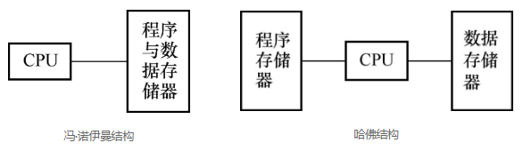
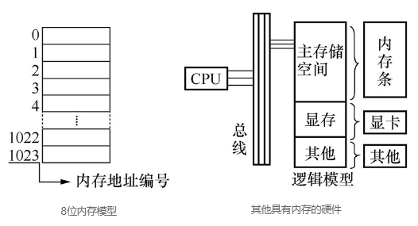

## 1. 引言

其实我们不知道的是，早期的计算机是没有内存的，但是如今我们去买电脑时，都会十分关心电脑内存的各种参数，因此可以看出内存对于电脑性能的重要性。那么为什么需要内存呢？换句话说，内存与计算机以及程序之间的关系又是什么呢？本章将会以内存为中心，探讨许多与内存相关的概念和话题，这些概念是学好后续C语言知识不可缺少的基础，因此希望读者认真对待本章节的内容。

## 2. 计算机程序运行的目的

### 2.1 什么是程序

程序是什么？最为直观的表达就是：程序=数据+算法。对于计算机来说，一个程序就是一堆代码加一堆数据。代码告诉CPU如何加工数据，而数据则是被加工的对象。例如我们写一个加法程序，对于计算机来说，代码告诉CPU是执行加法，数据就是加数和被加数。当然，我们也可以将加法运算的过程封装成一个函数，即便不封装成一个子函数，那它也是在主函数（main）里。C语言程序就是由一个个函数组合而成，这也是C语言模块化的一个强烈表现。

### 2.2 计算机运行程序的目的

既然我们已经知道了程序是什么，那么我们接下来就可以来探讨计算机运行程序的目的是什么了。其实运行程序的目的无外乎如下几个：要么是得出一个确定的运行结果；要么是关注运行的过程；要么二者皆有。得到一个结果还是可以理解的，但说程序运行只是为了过程可能就不太好理解了，设想那些没有返回值的函数不都是在注重过程，它们并不会返回一个结果。

函数程序的形参就是待加工的数据，当然函数内还需要一些临时数据（局部变量），函数本体就是代码（程序的组成：数据+算法），函数的返回值就是结果，函数体的执行就是过程，所以说函数的运行目的是：结果、过程或者二者全有。

#### 例子1

```c
int add(int a, int b)
{ 
    return a + b;
}
// 这个函数的执行就是为了得到结果
```

#### 例子2

```c
void add(int a, int b)
{
    int c;
    c = a + b;
    printf("c = %d\n", c);
}
// 这个函数的执行重在过程（重在过程中的printf），不需要返回值
```

#### 例子3

```c
int add(int a, int b)
{
    int c;
    c = a + b;
    printf("c = %d\n", c);
    return c;
}
// 这个函数既重结果又重过程
```

通过上面的例子，大家应该有了新的认识，理解了程序的组成和程序运行的目的。

### 2.3 静态内存SRAM和动态内存DRAM

上一节我们探讨了什么是程序，以及运行程序的目的是什么。这一节我们准备谈一谈存储和运行程序的硬件—内存。内存大致分为静态内存（Static RAM，SRAM）和动态内存（Dynamic RAM，DRAM）。

SRAM的性能非常高，是目前读写最快的存储设备了，但是它也非常昂贵，所以只在要求很苛刻的地方使用，如CPU的一级缓冲、二级缓冲；而DRAM的速度要比SRAM慢，但是DRAM的价格比SRAM便宜很多。DRAM又有好多代，譬如最早的SDRAM，后来的DDR1、DDR2……，LPDDR，我们这里介绍其中一种DDR。

DDR（Doubk Date Rate）是一种改进型的RAM，它可以在一个时钟读写两次数据，这样就使得数据传输速度加倍了，并且它有着很好的成本优势，因此DDR是目前电脑中用得最多的内存。目前在很多高端的显卡上，大都配备了高速DDR，用于提高带宽，以求大幅度提高对3D加速卡像素的渲染能力。


DDR内存

不管是SRAM还是DRAM，对于编程者来说，并不需要详细了解其内部原理，只需要使用即可。实际上内存就是存储代码和数据的，这就是内存的本质。那么内存中到底存储的是什么东西呢？数据和代码以什么样的方式存储在内存中呢？我们接下来就会讲到。

### 2.4 冯·诺伊曼结构和哈佛结构

按数据（全局变量、局部变量）和代码（函数）的存储方式的不同，可以分为冯·诺伊曼结构（又称作普林斯顿体系结构）和哈佛结构。

冯·诺伊曼结构：数据和代码放在一起。

哈佛结构：数据和代码分开存放。



在冯·诺伊曼结构中，程序中的代码和数据统一存储在同一个存储器中，而且数据和代码共用一条传输总线。由于指令和数据都是二进制码，指令和操作数的地址又密切相关，因此当初选择这种结构是自然的。如ARM公司的ARM7、MIPS公司的MIPS处理器，都采用了冯·诺伊曼结构。但是这种指令和数据共享同一总线的结构，使得信息流的传输成为限制计算机性能的瓶颈，影响了数据处理速度的提高。

与冯·诺伊曼结构相反，哈佛结构是一种将指令和数据分开存储的结构。中央处理器首先到程序指令存储器中读取程序指令内容，解码后得到数据地址，再到相应的数据存储器中读取数据，然后执行操作并读取下一条指令。

在指令和数据分开存储的哈佛结构中，指令和数据的存取可以同时进行，可以使指令和数据有不同的数据宽度，并且在执行时还可以预先读取下一条指令，因此哈佛结构的微处理器通常都具很高的执行效率。目前使用哈佛结构的中央处理器和微控制器有很多，像Microchip公司的PIC系列芯片、摩托罗拉公司的MC68系列、Zilog公司的Z8系列、ATMEL公司的AVR系列甚至连51单片机也属于哈佛结构。

因为两种存储方式毕竟是不同的，所以其产生的效果也是不同的。不过现实中这两种方式均有应用。比如在三星推出的一款适用于智能手机和平板电脑等多媒体设备的应用处理器S5PV210上运行应用程序时，所有应用程序的代码和数据都存放在DRAM中，所以用的是冯·诺伊曼结构。又比如某些单片机里面既有代码存储器Flash，又有数据存储器RAM。当我们把代码写到内存（Flash）中，代码直接在Flash中原地运行，但是用到的数据（全局变量、局部变量）不能放在Flash中，而是放在RAM（SRAM）中，这里用的就是哈佛结构。

### 2.5 总结：程序运行为什么需要内存呢

我们从程序是什么、运行程序的目的是什么，再到内存种类以及程序在内存中的存储方式进行了探讨。总结起来，内存实际上是用来存储程序中可变数据的，而C程序中的可变数据为全局变量、局部变量等。当然在GCC中，其实常量也是存储在内存中的，而大部分单片机，常量是存储在Flash中的，也就是在代码段。另外从变量的名字来看，什么是变量？变量就是在内存中分配一块内存空间，并且将它的地址和变量名相关联。可见当我们在定义变量的时候就已经在和内存打交道了，所以内存对我们写程序来说非常重要。

程序越简单，所需要的内存也就会更少；程序越庞大、越复杂，那么所需要的内存也就越多。倘若没有内存，我们的数据将会没有地方可以存储。但反过来，即使有内存，内存也不是无限的，可见内存管理非常重要。其实很多编程的关键都是围绕内存而展开，如数据结构（数据结构研究数据如何组织并如何在内存中存放）和算法（算法研究如何加工存入的数据）。所以如何合理使用内存的同时让我们的程序更加完善，这一直是一名优秀程序员应该关注的东西。那究竟应该如何管理内存呢？接下来我们就来谈谈这个问题。

### 2.6 深入思考：如何管理内存（无OS时，有OS时）

对于计算机来说，内存容量越大，能够实现功能的可能性就更大，所以大家都希望自己电脑的内存越大越好。但是不管我们的内存有多大，一旦内存使用管理不善，程序运行时就会消耗过多的内存，这样内存迟早都被程序消耗殆尽。当无内存可用时，程序就会崩溃。因此我们说内存是一种资源，如何高效地管理内存对程序员来说是一个重要技术和话题。

在C语言中定义变量时，就会分配一块内存空间。如果想要获取更大内存空间的话，我们可以通过定义数组来实现。其实在有操作系统（OS）的前提下，我们还可以通过一些操作系统提供的接口来分配内存，这样的分配方式称为静态内存分配。在程序运行的时候，需要时随时分配，不需要时随时释放，这种分配叫动态内存分配。下面我们以有无操作系统这两种情况介绍内存的管理。

当有操作系统时，操作系统会管理所有的硬件内存。由于内存很大，所以操作系统把内存分成一块一块的页面（一块一般是4KB），然后以页面为单位来管理。页面内用更细小的字节为单位管理。操作系统内存管理的原理非常复杂，那么对我们这些使用操作系统的人来说，不需要了解这些细节，只要通过静态内存分配和动态内存分配就够了。动态内存分配时，操作系统给我们提供了接口，我们只需要用API即可管理内存。例如在C语言中使用malloc()、free()这些接口来动态管理内存。

当没有操作系统时（裸机程序），程序需要直接操作内存，编程者需要自己计算内存的使用和安排，这属于静态内存分配。如果编程者不小心把内存用错了，产生的不良结果就由程序员自己承担。

从系统的角度介绍完，我们再从语言角度来讲：对比几种语言对内存的管理。

（1）汇编语言：根本没有任何内存管理，内存管理全靠程序员自己，汇编中操作内存时直接使用内存地址（譬如0xd0020010），非常麻烦，但如果用得好，程序执行效率是最高的。

（2）C语言：C语言中编译器帮我们管理内存地址，我们都是通过编译器提供的变量名等来访问内存的，操作系统下如果需要大块内存，可以直接通过API（malloc、free）来访问系统内存。裸机程序中所需的大块内存需要自己来定义数组等来解决。

（3）C++语言：C++语言对内存的使用进一步封装。我们可以用new来创建对象（其实就是为对象分配内存），使用完后用delete来删除对象（其实就是释放内存）。所以C++语言对内存的管理比C语言要高级一些，也容易一些。但是C++中内存的管理还是靠程序员自己来做。如果程序员用new创建一个对象，但是用完之后忘记delete，就会造成这个对象占用的内存不能释放，这就是内存泄漏。

（4）Java/C#等语言：这些语言不直接操作内存，而是通过虚拟机来操作内存。这样虚拟机作为我们程序员的代理，来帮我们处理内存的释放工作。如果我的程序申请了内存，使用完成后忘记释放，则虚拟机会帮助我释放掉这些内存。听起来似乎C#/Java等语言比C/C++有优势，但是其实虚拟机回收内存是需要付出一定代价的。所以说语言没有好坏，只有适应不适应。当程序对性能非常在乎的时候（如操作系统内核），就会用C/C++语言；当我们对开发程序的速度非常在乎的时候，就会用Java/C#等语言。

## 3. 位、字节、半字、字的概念和内存位宽

### 3.1 深入了解内存（硬件和逻辑两个角度）

在前面我们就已经介绍了什么是内存，这里我们继续深入理解内存。

从硬件角度，内存实际上是电脑的一个配件（一般叫内存条）。根据不同的硬件实现原理，还可以把内存分成SRAM和DRAM（DRAM又有好多代，如最早的SDRAM，后来的DDR1、DDR2、LPDDR……）。

从逻辑角度：内存可以随机访问（随机访问的意思是只要给一个地址，就可以访问这个内存地址），并且可以读写（当然了，逻辑上也可以限制其为只读或者只写）。内存在编程中的本质是用来存放变量内容的（就是因为有了内存，所以C语言才能定义变量，C语言中的一个变量实际就对应内存中的内存空间）。

### 3.2 内存的逻辑抽象图（内存的编程模型）

对于编程者来说，不需要深入了解内存的电子结构，但是内存的逻辑结构是必须知道的。从逻辑角度来讲，内存实际上是由无限多个内存单元格组成的，每个单元格有一个固定的地址，叫内存地址，这个内存地址和这个内存单元格唯一对应且永久绑定。

为了大家更好地理解，我们以大楼来类比内存。逻辑上的内存就好像是一栋大楼，内存的单元格好比大楼中的一个个小房间，每个内存单元格的地址就好象每个小房间的房间号。内存中存储的内容就好像住在房间中的人。如果我们想要找到一个人和他说点什么，那么我们就必须知道他的房间号 。同理，我们对内存中某个空间操作，前提是我们需要知道它的内存地址。C语言虽然不像汇编、可以写出直接操作内存的指令，但本质的东西是不会变的，内存的硬件构造是不会变的。你不告诉CPU内存地址，CPU就无法控制指令将数据读写到正确的内存空间。所以C语言也不例外，虽然C语言并不会直接操作内存地址，但变量的引入其实就是对内存的操作。在下面左图中，我们给出了一个内存条的逻辑模型，内存地址的排列是从零开始。右图的目的是为了让大家明白，除了内存条还有其他硬件设备也有内存，像显卡内存、网卡内存，但在CPU看来它们和内存条并无二异，只要有地址就可以控制数据的读写。



逻辑上来说，内存可以有无限大，因为数学上编号是没有尽头的。但是现实中实际的内存大小是有限制的，如32位的系统（32位系统指的是32位数据线，但是一般地址线也是32位，这个地址线32位决定了内存地址只能有32位二进制，所以逻辑上的大小为2的32次幂），内存限制就为4G。实际上32位的系统中可用的内存是小于等于4G的（如32位CPU装32位Windows，但电脑实际可能只配置了512MB内存条）。这里涉及三总线的概念。所谓三总线就是指地址总线、数据总线和控制总线。如我们现在要向内存中写入一个数据，这个过程就是，控制总线上面传输写指令，地址总线上面传输内存地址，而数据总线传输要写入内存的数据。由此可知总线的重要性。我们常常讲多少位CPU，指的就是数据总线位数。数据线越多，一次传输处理的数据就越多，性能也就越好，这也是为什么32位的CPU就比16位的性能强。

地址线的数量决定了它可以寻址内存空间的大小。我们举个简单例子，例如我们有两根地址线，每根地址线上面可以传输0或者1，那两根线就有4种不同的状态，分别是00、01、10、11。由这4种不同的状态就可以确定4个地址。如果有32根地址线可以确定多少种不同状态？2的32次方，也就意味着最高可访问的内存大小为2的32次幂（4G）。


### 3.3 位和字节

上面讲了内存不可能无限大，那么为了衡量内存大小以及更好地使用内存，我们就需要引入内存单位。内存单位有很多，我们平时经常提到的以G为单位的内存，其实对于编程来说，这个单位反而不常用。我们编程往往是操控内存单元。下面首先给出一个单位换算表达式。

1GB=1024MB　1MB=1024KB　1KB=1024B　1B=8bit

这里的KB是千字节的意思。注意，计算机里面的千是1024，而不是1000。B是字节（Byte），bit是位（bit），也叫二进制位，可见它是表示二进制的一位（0或者1），我们的代码和数据编译后对应的就是二进制的0和1。除了我们了解的位（1bit）、字节（8bit），还有半字（一般是16bit）、字（一般是32bit）。这里我们特别注意，在所有的计算机中，不管是32位系统、16位系统，还是以后的64位系统，位永远都是1bit，字节永远都是8bit。

### 3.4 字和半字

历史上曾经出现过16位系统、32位系统、64位系统等，而且操作系统还有Windows、Linux、iOS等，所以很多的概念在历史上的定义都很乱。建议大家对字、半字、双字这些概念不要详细区分，只要知道这些单位具体是多少字节，都是依赖于平台的。实际工作中，我们了解了这些平台后，才具体到该平台的“字”是多少位，当然“半字”永远是字的一半，双字永远是字的两倍大小）。编程时一般用不到“字”这个概念，我们区分这个概念主要是因为有些文档中会用到这些概念，如果不加区别可能会造成对程序的误解。

### 3.5 内存位宽（硬件和逻辑两个角度）

内存位宽（内存数据线的数量）是指在一定时间（时间指的是一个时钟周期，不需要了解）内所能传送数据的位数，位数越大，则所能传输的数据量就越大。左图就是一个8位的内存逻辑图，右图是32位的内存逻辑图。8位内存模型表示一次可以传送数据的位数为8位，32位内存模型表示一次可以传送数据的位数为32位，所以我们把32位（4个格子）画为一排，学了下面的内存编址你就会更加明白了。


从硬件角度讲：硬件内存的实现本身是有宽度的，也就是说有些内存条就是8位的，而有些就是16位的。那么需要强调的是，内存芯片之间是可以并联的，通过并联，即使8位的内存芯片也可以做出来16位或32位的硬件内存。

从逻辑角度讲：内存位宽在逻辑上是任意的，甚至逻辑上存在内存位宽是24位的内存（但是实际上这种硬件是买不到的，也没有实际意义）。不管内存位宽是多少，对操作不构成影响。但是因为操作不是纯逻辑而是需要硬件去执行的，所以不能为所欲为，我们实际上很多操作都是受限于硬件的特性。如24位的内存逻辑上和32位的内存没有任何区别，但实际硬件都是32位的，都要按照32位硬件的特性和限制来编程。

## 4. 内存编址和寻址、内存对齐

### 4.1 内存编址方法

上面我们讲了内存的单位，以及内存的逻辑模型，这节我们会更加详细地介绍这个逻辑模型。内存在逻辑上就是一个一个的格子，这些格子可以用来装东西（里面装的东西就是数据），每个格子有一个编号，这个编号就是内存地址，这个内存地址（一个数字）和这个格子的空间（实质是一个内存空间）是一一对应且永久绑定的。这就是内存的编址方法。

在程序运行时，计算机中CPU实际只认识内存地址，而不关心这个地址所代表的空间怎么分布（硬件设计保证了只要按照这个地址就一定能找到这个格子，这就涉及了内存单元的两个重要概念—地址和空间。那么问题也就来了，我们究竟以多大空间来划分一个格子，并绑定一个地址呢？）。

### 4.2 关键：内存编址是以字节为单位

前面一直提到内存地址，那么我们究竟以多大的内存空间来划分绑定一个地址？答案是：我们以一个字节为基本单元对整个内存进行划分，并且一一绑定地址。常说的一个个内存空间指的就是内存单元。由此可见一个内存单元就是一个字节。如果把内存比喻为一栋大楼，那么这个楼里面的一个一个房间就是一个一个内存单元，每个房间的编号就好比内存单元地址。32根地址线可以找到多大的内存空间？每根线有两种状态，要么是0，要么是1，所以32根有2的32次幂种状态，每种状态对应一个地址，就有2的32次幂个地址。而内存以字节编址，一个地址对应一个字节，那就有2的32次幂个字节（B），我们把它换算成G，也就是4GB内存，大于4GB内存，对于CPU来说将无法寻址。这就好比你只有一个木桶，哪怕你身边有再多大江大河，但你还是只能装一桶水……

2<sup>32</sup>÷（1024×1024×1024）=2<sup>32</sup>÷2<sup>30</sup>=2<sup>2</sup>=4(G)

注意：1024=2<sup>10</sup>

计算内存大小时，2的10次幂是1024，不是数学上的1000。所以1GB=1024MB，1MB=1024KB，1KB=1024B，因此2<sup>32</sup>=4GB

在讲内存位宽的时候我们就提到了内存编址，无论是多少位的内存，都是以字节为单位进行内存编址的。下面是64位位宽内存的编址，表示在一定时间（时间指的是一个时钟周期，不需要了解）内所能传送数据的位数是64位，也就是8个内存单元，所以我们把8个单元画成一排。


### 4.3 内存和数据类型的关系

现在搞清楚了内存单元的划分，我们有必要讨论一下C语言中的基本数据类型：char、short、int、long、float、double。在C语言中，数据类型的本质表示一个内存格子的长度和解析方法。也就是在定义变量时，到底需要给这个变量分配多大空间，按照什么样的方式去解析该空间。用int和char类型定义一个变量时，其分配的空间大小自然是不同的。

当然，在32位系统中定义变量最好用int，这样效率高，因为32位系统中很多硬件本身都是32位的，配合定义的int型变量在内存中恰好分配4个字节，使得软件和硬件对于数据的处理非常契合，这样的工作效率自然就高。32位的硬件配置天生就适合定义32位的int型变量。千万不要单纯地认为定义char型变量由于分配了更少的内存空间，所以效率就更高，因此我们一直强调写程序时要尽量配合硬件特点。

在很多32位系统环境下，当定义bool类型变量时，我们基本都是用int来替代。虽然bool型只需要一个位，但是我们定义一个整型替代时，看似浪费了31个bit，但是好处是效率会高很多。对于现代计算机来说，内存还是很充足的，浪费31个bit并不是一个很大的问题。特别提示一点，int（整型）这个“整”字体现在它和CPU本身的数据位宽是一样的，如32位的CPU，整型就是32位，int就是32位。

问题：实际编程时，节省内存和提高效率到底谁重要？

回答：很多年前内存很贵，因此内存都很少，那时候写代码以省内存为主。现在随着半导体技术的发展，内存变得很便宜了，现在的机器都是高配，不在乎省一点内存，而效率和用户体验变成了关键。所以现在写程序大部分都是以效率为重。

### 4.4 内存对齐

什么是内存对齐，首先这是一个硬件问题。因为是逻辑模型，前面我们为了便于大家理解，在画内存逻辑图的时候并没有体现内存单元的对齐。但此时我们为了分析内存对齐，就需要画出内存的这个特性。内存对齐其实也很好理解。


32位内存模型，单元格中的数是单元格编号。

假设我们现在要在C语言中用int a；定义一个int类型变量，在内存中就必须分配4个字节来存储这个a的数据。下面有两种不同的内存分配思路和策略。

第一种：0 1 2 3　　　　　　　 　　　　　　对齐访问

第二种：1 2 3 4　或者2 3 4 5或者3 4 5 6　　非对齐访问

内存的对齐访问不是逻辑的问题，而是硬件的问题。从硬件角度来说，对于32位的内存，0 1 2 3这四个单元本身逻辑上就有相关性，四个组合起来当作一个int，在硬件上就是合适的，效率就高。对齐访问更符合硬件规律，所以效率更高；非对齐访问因为和硬件本身不搭配，所以效率不高。因为兼容性的问题，通常硬件也都提供非对齐访问，但是效率要低很多。一般来说，除了直接使用汇编外，使用高级语言编写程序的时候，内存空间分配都会自动对齐。

## 5. C语言如何操作内存

### 5.1 C语言对内存地址的封装

前面一直谈内存，其间虽然穿插一些C语言的内容，但还不够细致、深入。本节将深入分析C语言的内存地址封装，如用变量名来访问内存、数据类型的含义、函数名的含义。下面以C代码实例分析。

```c
int a；
a = 5;
a += 4；// 结果a等于9
```

下面结合内存来解析C语言语句的本质。

int a：编译器帮我们申请了一个int类型的内存格子（长度是4字节，地址是确定的，但是只有编译器知道，我们是不知道的，也不需要知道），并且把符号a和这个格子绑定。

a = 5：编译器发现我们要给a赋值，就会把这个值5丢到符号a绑定的那个内存格子中。

a += 4：编译器发现我们要给a加值，a += 4等效于a = a + 4，编译器会先把a原来的值读出来，然后给这个值加4，再把加之后的和写入a里面去，最后这个格子里面存储的内容就是9。

C语言中数据类型的本质含义，是表示一个内存格子的长度和解析方法。

数据类型决定长度的含义，如一个内存地址（0x30000000），本来只代表一个字节的长度，但是实际上我们可以通过给它一个类型（int），让它有了长度（4），这样这个代表内存地址的数字0x30000000，就能表示从这个数字开头的连续n（4）个字节的内存格子了，即0x30000000 + 0x30000001 + 0x30000002 + 0x30000003。

数据类型决定解析方法的含义是：假如有一个内存地址（0x30000000），我们可以通过给这个内存地址不同的类型来指定这个内存单元格子中二进制数的解析方法。如int的含义就是0x30000000 + 0x30000001 + 0x30000002 + 0x30000003这四个字节连起来共同存储的是一个int型数据；那float的含义就是0x30000000 + 0x30000001 + 0x30000002 + 0x30000003这四个字节连起来共同存储的是一个float型数据。

int a；时，编译器会自动分配一块内存出来，假设这里是32位操作系统，那么int就是4个字节，如果这块内存的第一个字节（首字节）地址为0x12345678，编译器会将变量名a与这个首字节地址绑定，对a进行存取与操作，实际上就是向0x12345678开始的4个字节空间进行读写操作。

```c
float a;     
(int *)a;// 等价于分配一块指针类型的空间，并且把地址和变量名关联
```

最后我们谈谈C语言中的函数，不知道你是否思考过C语言中函数调用是如何实现的，主调函数是如何找到那些被调函数的。在C语言中，函数就是一段代码的封装。函数名的实质就是这一段代码的首地址，所以说函数名的本质也是一个内存地址。有了函数名（指针），也就是有了地址，我们才实现了函数的调用。

### 5.2 用指针来间接访问内存

我们常常把C语言中的指针列为难点对象，很多人始终搞不清楚指针，其实这就需要你掌握我们前面讲的那些东西。下面我们就以前面的知识为基础，啃下这根难啃的骨头。

指针是什么？我们的回答是指针就是地址。说得再全面一点，指针是一个变量，且这个变量是专门用来存放地址的。这就好比你想给A打电话，但你不知道A的电话号码，但你知道C有A的电话号码，而且你也有C的电话，这样你就可以间接地通过C来找到A。指针也是如此。通过下面的例子我们就可以看出用指针变量p来间接地获取了变量a的内容。

```c
# include <stdio.h>
int main (void)
{
    int a=5;            // 开辟一块整型类型的内存空间，里面放入数据5
                           并且把该内存空间的地址和变量名a相关联
    int *p=&a;          // 开辟一块指针类型的内存空间，里面放入a的
                        // 地址数据，并且把空间地址和变量名p相关联
    printf("%d",*p);    // *是取内容符，也就是取一个地址所对应空
                        // 间里面的内容,*p就是*（a的地址）也就是取a地
                        // 址所对应空间里的内容，那就是5
    return 0;
}
```

### 5.3 指针类型的含义

C语言中的指针，全名叫指针变量，指针变量其实和普通变量没有任何区别（不管int float等，还是指针类型`int *`或者`float *`等）。只要记住：类型只是对其所修饰的数字或者符号所代表内存空间的长度和解析方法的规定。如int a和`int *p`其实没有任何区别，a和p都代表一个内存地址（如0x20000000），但是这个内存地址0x20000000的长度和解析方法不同。a和b的空间大小虽然都是4个字节（碰巧），但是解析方法是截然不同的，前者解析方法是按照int的规定来的；后者按照`int *`方式解析。对于`int *p`来说，表示变量p里面存放的是一个地址，这个地址指向的空间用于存放一个int型的整数。

### 5.4 用数组来管理内存

数组和变量其实没有本质区别，只是符号的解析方法不同（普通变量、数组、指针变量其实都没有本质差别，都是对内存地址的解析，只是解析方法不一样）。我们知道数组定义就是在内存中开辟一块连续的内存空间，并且数组名就是其开辟的内存空间的首地址。也就是说，数组名就相当于一个指针，它里面放着这个数组的首元素地址（如&a[0]）。由此定义我们可以知道，定义数组就是一次性定义一堆变量，并且这些变量在内存中开辟的空间地址是连续的，第一个变量a[0]的地址记录在数组名a中。

```c
int a;         // 编译器分配4字节长度给a，并且把首地址和符号a绑定起来
int a[10];     // 编译器分配40个字节长度给a，并且把首元素首地址和符号a绑定起来
```

下面我们做个实验：为了大家更加容易理解，我们把一个数组中的元素地址输出看看。

```c
#include <stdio.h>
int main (void)
{
    int a[5]={5,4,3,2,1};//定义数组
    printf("%p,%p,%p,%p,%p,%p\n",a,&a[0],&a[1],&a[2],&a[3],&a[4]);
    // %p是以地址形式输出（也就是16进制）。在我的计算机中运行
    // 后输出的结果是:
    // 0018FF34,0018FF34,0018FF38,0018FF3C,0018FF40,0018FF44
    // 我们可以看出，在当前编译器下，编译器为每一个元素分配4个字节的空间
    // 并且它们的地址是连续的。也可以看出数组名就是首元素的地址
    return 0;
}
```

下面我们给出对应上面程序的内存逻辑图，前面为了便于大家理解，内存地址全部是十进制，实际上，我们一般用十六进制表示内存地址。


数组中第一个元素（a[0]）称为首元素；每一个元素类型都是int，所以长度都是4，其中第一个字节的地址称为首地址；首元素a[0]的地址称为首元素地址。由上面的图可以看出，第三个元素的地址也就是a[2]的地址，可以由第一个元素a[0]的地址推出，因为数组元素的地址是连续的。也就是a[0]的地址（a）加1就是a[1]的地址，加2就是a[2]的地址。可能此时你就有疑问了，不对啊，a[0]的地址加1不是0x0018FF35吗？其实不是的，我们一直强调数据类型的重要性，其中一点就是解析方法。int*的数据类型，编译器解析的时候就知道是以4个字节的跨度来依次分配。你写的a+1，编译器就会明白是指a[1]的地址，也就是首地址加4。你写a+2，编译器就会明白是a[2]的地址，也就是首地址加8，依次类推。如果你还是不够明白，我们举个例子。当你确定我们是一个人的时候，那我们就是一个完整的人，此时对于我们的划分就是一个人、两个人， 不能是1/2个、1/3个。当然我们不是单纯地为了研究数组中元素的地址，我们的最终目的是想通过元素中的地址找到该元素的值。

```c
#include <stdio.h>
int main (void)
{
      int a[5]={5,4,3,2,1};    // 定义数组
      printf("%p,%p,%p,%p\n",a,a+1,a+2,a+3);
      // 输出结果是：0018FF34,0018FF38,0018FF3C,0018FF40
      // 以首地址为基础，依次加1，加2，加3，也就是a[1],a[2],a[3]的地址
      printf("%d,%d,%d,%d\n",a[0],*a,*(a+1),*(a+3));
      // 第一个应该输出5，也就是首元素a[0]
      // 第二个也是5，原因是a相当于指针变量，里面放着a[0]的地址
      // 所以取该地址所对应的内容，也就是a[0]的值
      // 第三个值是4，*（a+1）取（a+1)地址里面的内容，也就是a[1]的值4
      // 第四个输出是2，取a+3后的地址所对应的内容，a+3后的地址也就
      // 是a[3]的地址。取其内容就是a[3]的值:2
      return 0;
}
```

## 6. 内存管理之结构体

### 6.1 数据结构这门学问的意义

数据结构就是研究数据如何组织（在内存中排布）、如何加工的学问。

### 6.2 最简单的数据结构：数组

为什么要有数组？因为程序中有好多个类型相同、意义相关的变量需要管理，这时候如果用单独的变量的话，会使得程序看起来比较杂乱；用数组更便于管理，而且定义简单、使用方便。

### 6.3 数组的优缺点

优点：数组定义简单，而且访问也很方便。

缺点：

- 数组中所有元素类型必须相同；
- 数组大小必须定义时给出，而且在大多数情况下，数组的空间大小一旦确定后就不能再改；
- 数组的空间必须是连续的，这就造成数组在内存中分配空间时必须找到一块连续的内存空间。所以数组不可能定义得太大，因为内存中不可能有那么多大的连续的内存空间，而解决这个问题的方法就是使用链表。我们这里先不讲，后面的章节会讲到。

### 6.4 结构体隆重登场

结构体发明出来就是为了解决数组的第一个缺点—数组中所有元素类型必须相同。有时候，我们在描述事物时，不得不从多个方面描述，如下面的例子。

我们要管理3个学生的年龄（int类型），怎么办？
第一种解法：用数组        int ages[3];
第二种解法：用结构体  

```c  
struct ages
{
    int age1;
    int age2;
    int age3;
};
struct ages age;
```

在这个示例中，数组要比结构体好。但是不能说数组就一定比结构体好，如果元素类型不同时，就只能用结构体而不能用数组了。

```c
struct people
{
    int age;               // 人的年龄
    char name[20];         // 人的姓名
    int height;            // 人的身高
};
```

因为people的各个元素类型不完全相同，所以必须用结构体，没办法使用数组。

由上面的例子我们可以看出，结构体属于聚合数据类型，提供一种把各种相关且类型可能不同的数据组合到一起的手段。而数组是同种数据类型的集聚。结构体变量在被定义后，编译器在编译的时候会为所有成员分配空间。向函数传递结构时，实际上是传递结构成员的值，即都是值传递方式（包括用结构体变量作为函数参数以及函数返回值也是结构体变量的情况）。由此也可看出，结构体变量名代表的是整个结构体变量，而不像数组名代表地址。除了简单结构体外，向函数传递整个结构体变量存在很大的缺陷，因为当执行函数调用时，数据压栈需要开销（为什么会调用压栈，下节我们就讲）。这对于多成员结构或成员中有数组的结构，运行性能会严重恶化。解决的方案是，传递结构体变量的指针。向函数传递结构指针时，压栈的仅仅是结构体变量的地址，而使得函数调用非常快。传递结构体变量地址的另一个优点是，函数还可以修改被传递结构体变量的成员值。

### 6.5 题外话：结构体内嵌指针实现面向对象

总体来说，C语言是面向过程的，但是C语言写出的Linux系统是面向对象的。非面向对象的语言，其实也是可以使用面向对象的思想来编写程序的。只是说用面向对象的语言来实现面向对象的编程会更加简单一些，所以我们会觉得用C++、Java等面向对象语言来实现面向对象的开发更容易接受，而使用C语言来实现面向对象的开发相对不容易理解些，这就是为什么大多数人学过C语言却看不懂Linux内核代码。

```c
structs
{
    int age;                  // 普通变量
    void (*pFunc)(void);      // 函数指针，指向void func(void)
                              // 这类的函数
};
```

使用这样的结构体就可以实现面向对象，这样包含了函数指针的结构体就类似于面向对象中的class，结构体中的变量类似于class中的成员变量，结构体中的函数指针类似于class中的成员方法。

## 7. 内存管理之栈（stack）

### 7.1 什么是栈

我们常常听人说堆栈，但大家一定要明确区分：堆就是堆，栈就是栈。我们平常说的堆栈一般是指栈。那栈的本质是什么？栈是一种数据结构，C语言中使用栈来保存局部变量（注意，下文中不强调的情况下，局部变量均指非静态局部变量）。栈是被发明出来管理内存的，是一种维护内存的机制，这就是栈的本质。

### 7.2 栈管理内存的特点（小内存、自动化）

栈的特点是入口即出口，只有一个口，另一个口是堵死的。所以先进去的后出来，也就是先进后出，而与栈特点相对的就是先进先出，也就是队列。队列的特点是入口和出口都有，必须从入口进去，从出口出来，所以先进去的必须先出来，否则就堵住后面的。

```
先进后出FILO   first in last out      栈
先进先出FIFO   first in first out     队列
```

为了大家更形象地理解，我们给出两张图。栈就好比往一个容器里面放东西，只有一个口，先放进去的只能后来拿出，后来放进去的，可以最先拿出。而队列就好比一列火车或者排着队列的军队。走在最前面的也是最早通过隧道的，先进先出。


### 7.3 栈的应用举例：局部变量和函数调用

C语言中的局部变量是用栈来实现的。

我们在C语言中定义一个局部变量时（int a），编译器会在栈中分配一段空间（4字节）给这个局部变量用。分配时栈顶指针会移动出4个字节空间给局部变量a用的意思就是，将这4字节的栈内存的内存地址和我们定义的局部变量名a关联起来，对应的栈操作为入栈，就是将数据存入变量a中。需要注意的是，这里栈指针的移动和内存分配是自动完成的，不需要程序参与。

然后等我们函数退出的时候，局部变量就会被释放。对应的操作是弹栈（出栈）。出栈时也是栈顶指针移动，将栈空间中与a关联的那4个字节空间释放，这个动作也是自动的，不需要人为干预。所以我们在写代码的时候，一定不要从被调函数返回一个局部变量的地址给主调函数，因为在函数执行完后局部变量就释放了，这个地址里面的内容有可能被新的内容填充。这时如果你在主调函数里面使用它，就很有可能造成数据错误。

除了保存局部变量，栈对于函数调用来说也是至关重要的，栈保存着函数调用所需的所有维护信息。我们都知道，函数调用时，程序跳到被调函数内部，执行完后返回当前位置接着执行。这就好比你去一个陌生的地方探险，我们的目的是去寻求刺激，但是我们最后还是希望可以平安回家。在旅行前就必须做一些准备（如多带水、带指南针，等等）。我们的函数在调用时，跳到被调函数之前也是要做诸多准备的。对于函数来说，最起码它要找到回家的路，也就是被调函数的下一行代码的地址（为返回做准备），以及当前相关的局部变量值、寄存器的值等重要信息。之所以保存这些信息是怕在被调函数运行时，由于子函数会用到与主调函数一样的寄存器，而造成主调函数正在使用的寄存器数据破坏，在函数返回时，栈里面的数据弹出，即使寄存器被用过也没关系，弹出数据会使寄存器里面的值覆盖为调用以前，从而复原调用以前的现场。这些值保存在哪里呢？就保存在栈里。在函数调用时，将这些东西压入栈，在被调函数执行完，栈再弹出这些值。

以栈方式管理内存，好处是方便，分配和最后回收都不用程序员操心，C语言（背后的运行时系统）会自动完成。

分析一个细节：在C语言中，定义局部变量时如果未初始化，则值是随机的。为什么？

定义局部变量，其实就是在栈中通过移动栈指针，来给程序提供一个内存空间和这个局部变量名绑定。因为这段内存空间在栈上，而栈内存是反复使用的（脏的，上次用完没清零的），所以说使用栈来实现的局部变量定义时如果不初始化，里面的值就是一个垃圾值。由此我们扩展一下，其实不仅仅是局部变量，所有的变量在定义时只是在内存中分配一块空间，并没有对这块空间进行任何的初始化。如果这块内存以前被用过，里面的数据还在，那它对于我们来说是没有任何意义的垃圾值。而且有时候这些数据会对我们的编程造成错误。所以我们一定要初始化变量，也就是用新的、有用的数据覆盖掉以前的数据。可能你会有个问题，那些以前用过的内存经过操作系统回收后，为什么里面还有数据。其实操作系统仅仅是回收这些内存，告诉其他程序可以用了，但并不删除这些内存里面的数据。

C语言通过一个小手段来实现局部变量的初始化。

```c
int a = 15;    // 局部变量定义时初始化
```

C语言编译器会自动把这行转成：

```c
int a;         // 局部变量定义
a = 15;        // 普通的赋值语句
```

### 7.4 栈的约束（预定栈大小不灵活，怕溢出）

首先，栈是有大小的。而且栈的大小是可以设置的，只是栈内存大小不好选择。如果太小怕溢出，太大怕浪费内存（这个缺点有点像数组）。

其次，栈的溢出危害很大，一定要避免。所以，在C语言中定义局部变量时不能定义太多或者太大（如不能定义局部变量时int a[10000]；使用递归来解决问题时一定要注意递归收敛）。

## 8. 内存管理之堆

### 8.1 什么是堆

堆（heap）也是一种动态内存管理方式。内存管理对操作系统来说是一件非常复杂的事情，因为首先内存容量很大，其次内存需求在时间和大小块上没有规律（操作系统上运行着的几十、几百、几千个进程随时都会申请或者释放内存，申请或者释放的内存块大小随意）。

堆这种内存管理方式特点就是自由（随时申请、释放，大小块随意）。我们前面就讲过这两个API（malloc和free），那时候我们只是讲了用这两个接口可以申请和释放内存，但并没有说是从什么地方申请，以及通过什么申请。其实它们申请释放的内存来源于堆内存，然后向使用者（用户进程）提供API（malloc和free）来使用堆内存。我们什么时候使用堆内存？需要内存容量比较大时，以及需要反复使用及释放时（动态特性），很多数据结构（譬如链表）的实现都要使用堆内存。

### 8.2 堆管理内存的特点（大块内存、手工分配/使用/释放）

特点一：容量不限，动态分配（常规使用的需求容量都能满足）。当然也并不是完全不限，因为它毕竟建立在内存的基础上，所以在申请堆内存的时候一定要注意malloc函数的返回值，如果返回值是NULL，就是申请空间失败。而所谓动态，就是指程序在运行中取得内存空间，而不是编译时就确定好固定大小的内存空间。

特点二：申请和释放都需要手工进行。手工进行的含义就是需要程序员写代码明确进行申请（malloc）及释放（free）。如果程序员申请内存但使用后并不释放，这段内存就丢失了（在堆管理器的记录中，这段内存仍然属于你这个进程，但是进程会认为这段内存已经被占用，再用的时候又会去申请新的内存块），这称为内存泄漏。在C/C++语言中，内存泄漏是最严重的程序bug，这也是别人认为Java/C#等语言比C/C++优秀的地方。

### 8.3 C语言操作堆内存的接口（malloc/free）


堆内存释放时最简单，直接调用free释放，即void free(void *ptr);。

堆内存申请时，有三个可选择的兄弟函数：malloc、calloc和realloc。和malloc相比，它的两个兄弟calloc，realloc在功能上更加强大。二弟calloc会将返回的内存初始化为0，而三弟realloc可以修改原先已经分配的内存块的大小。而malloc只是单纯地从内存中申请固定大小的内存。

```c
void *malloc(size_t size);
void *calloc(size_t nmemb, size_t size);  // nmemb个单元，每个单元size字节
void *realloc(void *ptr, size_t size);    // 改变原来申请的空间的大小的
```

如要申请10个int元素的内存，如下所示。

```c
malloc(40);            malloc(10*sizeof(int));
calloc(10, 4);         calloc(10, sizeof(int));
```

数组定义时，必须同时给出数组元素个数（数组的大小），而且一旦定义再无法更改。在Java等高级语言中，有一些语法技巧好像可以更改数组大小，但其实这只是一种障眼法。它的工作原理是：先新建一个新需求大小的数组，再将原数组的所有元素复制进新的数组，然后释放掉原数组，最后返回新的数组给用户。堆内存申请时必须给定大小，然后一旦申请完成则空间大小不变，如果要变，只能通过realloc接口。realloc的实现原理类似于上面介绍的Java中可变大小数组的方式。

### 8.4 堆的优势和劣势（管理大块内存、灵活、容易内存泄漏）

优势：灵活。

劣势：需要程序员去处理各种细节，所以容易出错，严重依赖于程序员的水平。

局部变量存在于栈（stack）中，全局变量存在于静态数据区中，动态申请数据存在于堆（heap）中。

### 8.5 静态存储区

我们现在知道，非静态局部变量存储在栈中，但程序中不仅仅只有非静态局部变量，还有静态局部变量和全局变量。静态局部变量和全局变量存储在静态存储区。编译器在编译程序时就确定了静态存储区的大小，静态存储区随着程序运行而分配空间，直到程序运行结束才释放内存空间，这也正是我们定义静态变量或者全局变量的目的。相比于栈，静态存储区对内存的操作比较简单，就是在编译期分配一块确定大小的内存，用来存储数据。局部变量存在于栈（stack）中，全局变量和静态局部变量存在于静态存储区中，动态申请数据存在于堆（heap）中。这里我们做个比喻，栈、堆、静态存储区相当于程序中的三国，它们的地盘就是内存，它们对各自地盘的施政（对内存的管理）方针也各不相同。