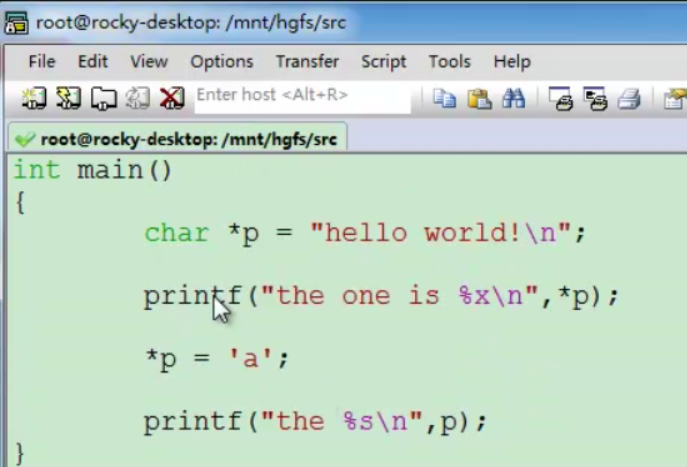
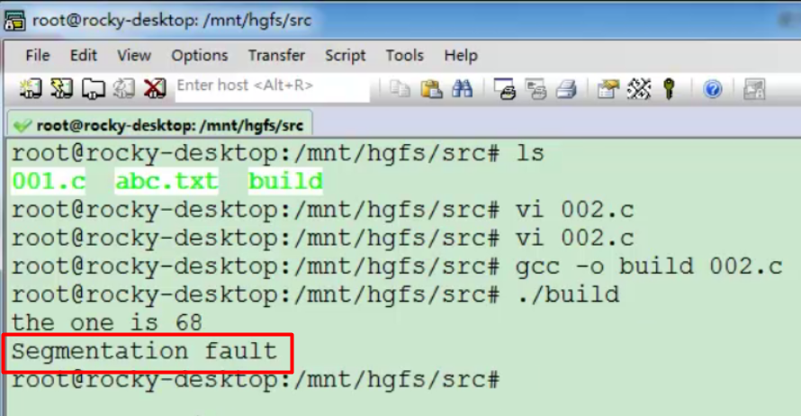
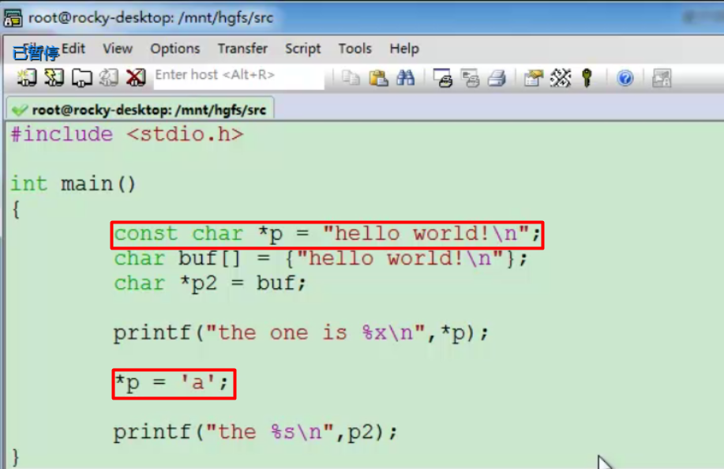
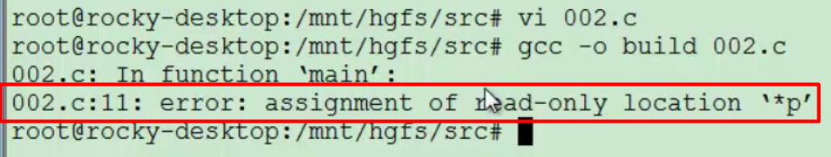

### 指针对常量字符串进行写操作

测试代码如下

首先要知道的是，双引号里面的字符串是常量类型的，在存储字符串的空间中，字符串的每一个字节被展开存储，按照‘h’‘e’‘l’…来存储。我们用char类型的指针指向了这一片区域，严格来说，它们的类型是不匹配的。在前面我们使用\*p来访问变量的值，但是在指向的是字符串的时候，*p代表第一个字节所存储的内容，并修改了这个字符的值。通过p来访问这个字符串全部的内容。

运行结果如下

可以看到第一个字符的内容被显示为h的ASCII码的数值，而修改常量字符串的第一个字符导致了一个我们经常遇到的段错误（显然不是最后输出导致的，如果是输出导致的，将会打印the），这就是指针指向的内容被非法访问导致的段错误。不管你使用声明方法，操作系统都会保证这个空间是不可写的。所以双引号里面的字符串我们应该理解为`const char *`。

### 指针对数组进行写入操作

测试代码如下

由于数组定义的时候就是一个变量，所以我们可以通过指针修改它的值。

运行结果如下

可以看到数组的第一个字符确实被我们修改了。

### 通过指针的修饰符

我们更明确的修饰了内存的属性。

内存属性

1）内存操作的大小：  由指针的类型来决定。

2）内存的变化性，可写可读。

如果内存的实现和我们定义的指针的类型不一样，就很容易导致我们在实际操作中出现一些非法访问的情况，最终出现段错误。所以我们在对指针进行定义的时候，一定要了解指针指向的这片内存真正的属性是什么。如果我们将刚才的字符串常量赋值给一个`const char *p`，显然类型是一样的，此时我们再对它的第一个字符赋值操作的话，编译器就会明确的给我们一个警告而不是段错误了，如下：编译器提示*p是一个只读的值。我们使用char 类型的指针编译的时候没有报错，在运行的时候却会因为段错误而导致程序崩溃，这显然比编译器报错糟糕多了。所以我们赋值的时候应该类型匹配。 

### 在linux系统中，有一个操作手册

我们可以通过下面的命令来查看printf这个函数：

我们可以看到printf这个函数第一个参数为一个常量字符串，所以我们在输出操作的时候都是使用双引号输出。如果你想使用一个非常量的字符指针也是可以的，反正它是不会修改字符的值的。

