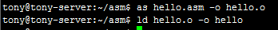
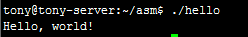

为了更加深入理解C语言的本质，我们需要学习一些汇编相关的知识。作为最基本的编程语言之一，汇编语言虽然应用的范围不算很广，但是非常重要。因为它能够完成许多其它语言所无法完成的功能。就拿 Linux 内核来讲，虽然绝大部分代码是用 C 语言编写的，但仍然不可避免地在某些关键地方使用了汇编代码，其中主要是在 linux 的启动部分。由于这部分代码与硬件的关系非常密切，即使是 C 语言也会有些力不从心，而汇编语言则能够很好扬长避短，最大限度地发挥硬件的性能。

大多数情况下我们不需要使用汇编语言，因为即便是硬件驱动这样的底层程序在 Linux 操作系统中也可以用完全用 C 语言来实现，再加上 GCC 这一优秀的编译器目前已经能够对最终生成的代码进行很好的优化。但实现情况是我们有时还是需要使用汇编，或者不得不使用汇编，理由很简单：精简、高效和 libc 无关性。假设要移植 Linux 到某一特定的嵌入式硬件环境下，首先必然面临如何减少系统大小、提高执行效率等问题，此时或许只有汇编语言能帮上忙了。

汇编语言直接同计算机的底层软件甚至硬件进行交互，它具有以下一些优点：

- 能够直接访问与硬件相关的存储器或 I/O端口；
- 能够不受编译器的限制，对生成的二进制代码进行完全的控制；
- 能够对关键代码进行更准确的控制，避免因线程共同访问或者硬件设备共享引起的死锁；
- 能够根据特定的应用对代码做最佳的优化，提高运行速度；
- 能够最大限度地发挥硬件的功能。

x86汇编的两种语法：intel语法和AT&T语法。在intel的官方文档中使用intel语法，Windows也使用intel语法，而Linux/UNIX平台的汇编器一直使用AT&T语法。如果AT&T语法的mov%edx,%eax这条指令如果用intel语法来写，就是mov eax,edx，寄存器名不加%号，并且源操作数和目标操作数的位置互换。由于我们在Linux平台下开发，所以使用AT&T语法。

Linux 平台下的汇编工具虽然种类很多，但是最基本的仍然是汇编器、连接器和调试器。

汇编器（assembler）的作用是将用汇编语言编写的源程序转换成二进制形式的目标代码。Linux 平台的标准汇编器是 GAS，它是 GCC 所依赖的后台汇编工具，它包含在 binutils 软件包中。GAS 使用标准的 AT&T 汇编语法，可以用来汇编用 AT&T 格式编写的程序。

另外一种经常用到的汇编器是 NASM，它提供了很好的宏指令功能，并能够支持相当多的目标代码格式。NASM使用的是 Intel 汇编语法，可以用来编译用 Intel 语法格式编写的汇编程序：

由汇编器产生的目标代码是不能直接在计算机上运行的，它必须经过链接器的处理才能生成可执行代码。链接器通常用来将多个目标代码连接成一个可执行代码，这样可以先将整个程序分成几个模块来单独开发，然后才将它们组合(链接)成一个应用程序。 Linux 使用 ld 作为标准的链接程序，它同样也包含在 binutils 软件包中。汇编程序在成功通过 GAS 或 NASM 的编译并生成目标代码后，就可以使用 ld 将其链接成可执行程序了。

Linux 下调试汇编代码既可以用GDB、DDD 这类通用的调试器，也可以使用专门用来调试汇编代码的 ALD。执行 as 命令时带上参数 --gstabs 可以告诉汇编器在生成的目标代码中加上符号表，同时需要注意的是，在用 ld 命令进行链接时不要加上 -s 参数，否则目标代码中的符号表在链接时将被删去。

在 GDB 和 DDD 中调试汇编代码和调试 C 语言代码是一样的，我们可以通过设置断点来中断程序的运行，查看变量和寄存器的当前值，并可以对代码进行单步跟踪。

下面我们来使用汇编语言编写一个Hello world程序。

```
#hello.asm  
.section .data                    # 数据段声明  
         msg: .string "Hello, world!\\n"  #要输出的字符串  
         len= . - msg<span style="white-space:pre"> </span># 字串长度  
.section .text<span style="white-space:pre">        </span># 代码段声明  
.global _start<span style="white-space:pre">        </span># 指定入口函数  
   
_start:<span style="white-space:pre">           </span># 在屏幕上显示一个字符串  
         movl$len, %edx<span style="white-space:pre">   </span># 参数三：字符串长度  
         movl$msg, %ecx # 参数二：要显示的字符串  
         movl$1, %ebx   #参数一：文件描述符(stdout)  
         movl$4, %eax   # 系统调用号(sys_write)  
         int  $0x80     # 调用内核功能                       
# 退出程序  
         movl$0,%ebx    # 参数一：退出代码  
         movl$1,%eax    # 系统调用号(sys_exit)  
         int  $0x80     # 调用内核功能  
```

把这个程序保存成文件hello.asm，然后用汇编器（Assembler）as把汇编程序中的助记符翻译成机器指令，生成目标文件hello.o，再用链接器（Linker，或Link Editor）ld把目标文件hello.o链接成可执行文件hello：



我们执行生产的hello程序：



程序中的#号表示单行注释，类似于c语言的//注释。

汇编程序中以.开头的名称并不是指令的助记符，不会被翻译成机器指令，而是给汇编器一些特殊的指示，称为汇编指示或伪操作，由于它不是真正的指令所以加个“伪”字。.section指示把代码划分成若干个段（Section），程序被操作系统加载执行时，每个段被加载到不同的地址，具有不同的读、写、执行权限。.data段保存程序的数据，是可读可写的，C程序的全局变量也属于.data段。

.text段保存代码，是只读和可执行的，后面那些指令都属于这个.text段。

_start是一个符号，符号在汇编程序中代表一个地址，可以用在指令中，汇编程序经过汇编器的处理之后，所有的符号都被替换成它所代表的地址值。在C语言中我们通过变量名访问一个变量，其实就是读写某个地址的内存单元，我们通过函数名调用一个函数，其实就是跳转到该函数第一条指令所在的地址，所以变量名和函数名都是符号，本质上是代表内存地址的。

.globl指示告诉汇编器，\_start这个符号要被链接器用到，所以要在目标文件的符号表中给它特殊标记。\_start就像C程序的main函数一样特殊，是整个程序的入口，链接器在链接时会查找目标文件中的\_start符号代表的地址，把它设置为整个程序的入口地址，所以每个汇编程序都要提供一个_start符号并且用.globl声明。如果一个符号没有用.globl指示声明，就表示这个符号不会被链接器用到。

\_start在这里就像C语言的语句标号一样。汇编器在处理汇编程序时会计算每个数据对象和每条指令的地址，当汇编器看到这样一个标号时，就把它下面一条指令的地址作为\_start这个符号所代表的地址。而_start这个符号又比较特殊，它所代表的地址是整个程序的入口地址，所以下一条指令`movl $len, %edx`就成了程序中第一条被执行的指令。 

int $0x80前四条指令都是为这条指令做准备的，执行这条指令时发生以下动作：

1、int指令称为软中断指令，可以用这条指令故意产生一个异常，CPU从用户模式切换到特权模式，然后跳转到内核代码中执行异常处理程序。

2、int指令中的立即数0x80是一个参数，在异常处理程序中要根据这个参数决定如何处理，在Linux内核中，int $0x80这种异常称为系统调用。内核提供了很多系统服务供用户程序使用，但这些系统服务不能像库函数（比如printf）那样调用，因为在执行用户程序时CPU处于用户模式，不能直接调用内核函数，所以需要通过系统调用切换CPU模式，通过异常处理程序进入内核，用户程序只能通过寄存器传几个参数，之后就要按内核设计好的代码路线走，而不能由用户程序随心所欲，想调哪个内核函数就调哪个内核函数，这样保证了系统服务被安全地调用。在调用结束之后，CPU再切换回用户模式，继续执行int指令后面的指令，在用户程序看来就像函数的调用和返回一样。

3、eax、ebx、ecx和edx寄存器的值是传递给系统调用的两个参数，eax的值是系统调用号，4表示sys_write系统调用，ebx、ecx和edx的值则是传给sys_write系统调用的参数，也就是向标准输出设备输出字符串。大多数系统调用完成之后是会返回用户程序继续执行的，
最后一部分的代码：
```
movl$0,%ebx     # 参数一：退出代码  
movl$1,%eax     # 系统调用号(sys_exit)  
int  $0x80      # 调用内核功能  
```

eax和ebx寄存器的值是传递给系统调用的两个参数，eax的值是系统调用号，1表示_exit系统调用，ebx的值则是传给_exit系统调用的参数，也就是退出状态。_exit这个系统调用会终止掉当前进程，而不会返回它继续执行。