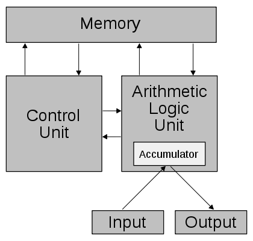
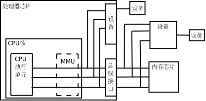
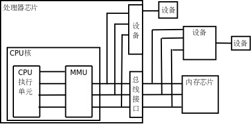

现代计算机都是基于冯·诺依曼或哈佛体系结构的，不管是[嵌入式](http://lib.csdn.net/base/embeddeddevelopment)系统、个人电脑还是服务器。这种两种体系结构的主要特点是：CPU和内存是计算机的两个主要组成部分，内存中保存着数据和指令，CPU从内存中取指令执行，其中有些指令让CPU做运算，有些指令让CPU读写内存中的数据。

**冯·诺依曼结构**

冯·诺依曼结构也称普林斯顿结构，是一种将程序指令存储器和数据存储器合并在一起的存储器结构。程序指令存储地址和数据存储地址指向同一个存储器的不同物理位置，因此程序指令和数据的宽度相同。比如英特尔公司的中央处理器，ARM公司的ARM7、MIPS公司的MIPS处理器都采用了冯·诺依曼结构。

1945年，冯·诺依曼首先提出了“存储程序”的概念和二进制原理，后来，人们把利用这种概念和原理设计的电子计算机系统统称为“冯·诺依曼型结构”计算机。冯·诺依曼结构的处理器使用同一个存储器，经由同一个总线传输。

冯.诺曼结构处理器具有以下几个特点：

- 必须有一个存储器
- 必须有一个控制器
- 必须有一个运算器，用于完成算术运算和逻辑运算
- 必须有输入和输出设备，用于进行人机通信

冯·诺依曼的主要贡献就是提出并实现了“存储程序”的概念。由于指令和数据都是二进制码，指令和操作数的地址又密切相关，因此，当初选择这种结构是自然的。但是，这种指令和数据共享同一总线的结构，使得信息流的传输成为限制计算机性能的瓶颈，影响了数据处理速度的提高。

**哈佛结构**

哈佛结构的微处理器通常具有较高的执行效率。其程序指令和数据指令分开组织和储存的，执行时可以预先读取下一条指令。目前使用哈佛结构的中央处理器和微控制器有很多，ARM公司的ARM9以上系列，ATMEL公司的AVR系列，还有摩托罗拉公司的MC68系列、Zilog公司的Z8系列等。

哈佛结构是一种将程序指令存储和数据存储分开的存储器结构。中央处理器首先到程序指令存储器中读取程序指令内容，解码后得到数据地址，再到相应的数据存储器中读取数据，并进行下一步的操作（通常是执行）。程序指令存储和数据存储分开，可以使指令和数据有不同的数据宽度

与冯.诺曼结构处理器比较，哈佛结构处理器有两个明显的特点：

- 使用两个独立的存储器模块，分别存储指令和数据，每个存储模块都不允许指令和数据并存；
- 使用独立的两条总线，分别作为CPU与每个存储器之间的专用通信路径，而这两条总线之间毫无关联。

下面我们以常见的冯·诺依曼[架构](http://lib.csdn.net/base/architecture)详细讲解。

**CPU**

CPU从内存取指令解释并执行，然后再取下一条指令，再解释执行。CPU包含以下几个功能单元：

1、寄存器

寄存器是CPU内部的高速存储器，像内存一样可以存取数据，但比访问内存快得多。有些寄存器保存的数据只能用于某种特定的用途，比如用作程序计数器的eip寄存器，这称为特殊寄存器，而另外一些寄存器保存的数据可以用在各种运算和读写内存的指令中，比如eax寄存器，这称为通用寄存器。

程序计数器（PC，Program Counter），保存着CPU取指令的地址，每次CPU读出程序计数器中保存的地址，然后按这个地址去内存中取指令，这时程序计数器保存的地址会自动加上该指令的长度，指向内存中的下一条指令。

程序计数器通常是CPU的一个特殊寄存器，x86的程序计数器是特殊寄存器eip，由于地址是32位的，所以这个寄存器也是32位的，事实上通用寄存器也是32位的，所以也可以说处理器的位数是指它的寄存器的位数。处理器的位数也叫做字长，字（Word）这个概念用得比较混乱，在有些上下文中指16位，在有些上下文中指32位（这种情况下16位被称为半字Half Word），在有些上下文中指处理器的字长，如果处理器是32位那么一个字就是32位，如果处理器是64位那么一个字就是64位。

2、指令解码器

CPU取上来的指令由若干个字节组成，这些字节中有些位表示内存地址，有些位表示寄存器编号，有些位表示这种指令做什么操作，是加、减、乘、除还是读、写，指令解码器负责解释这条指令的含义，然后调动相应的执行单元去执行它。

3、算术逻辑单元

如果解码器将一条指令解释为运算指令，就调动算术逻辑单元去做运算，比如加减乘除、位运算、判断一个条件是否成立等。运算结果可能保存在寄存器中，也可能保存到内存中。

4、地址和数据总线（Bus）

CPU和内存之间用地址总线、数据总线和控制线连接起来，32位处理器有32条地址线和32条数据线，每条线上有1和0两种状态，32条线的状态就可以表示一个32位的数。如果在执行指令过程中需要访问内存。

CPU访问内存读数据的过程是

1. CPU内部将寄存器对接到数据总线上，使寄存器的每一位对接到一条数据线，等待接收数据。
2. CPU将内存地址通过地址线发给内存，然后通过另外一条控制线发一个读请求。
3. 内存收到地址和读请求之后，将相应的存储单元对接到数据总线的另一端，这样，存储单元每一位的1或0状态通过一条数据线到达CPU寄存器中相应的位，就完成了数据传送。

往内存里写数据的过程与此类似，只是数据线上的传输方向相反。

**内存与地址**

内存是计算机中重要的部件之一，它是与CPU进行沟通的桥梁。计算机中所有程序的运行都是在内存中进行的，因此内存的性能对计算机的影响非常大。内存也被称为内存储器，其作用是用于暂时存放CPU中的运算数据，以及与硬盘等外部存储器交换的数据。只要计算机在运行中，CPU就会把需要运算的数据调到内存中进行运算，当运算完成后CPU再将结果传送出来，内存的运行也决定了计算机的稳定运行。

内存可以看作是一个简单的字节数组。在这个数组中，每个内存单元都有自己的地址，内存地址相当于普通数组的下标。计算机可以随时访问内存的任何位置，所以称为“随机存取存储器”。内存地址是从0开始编号的整数，最大编到多少取决于CPU的地址空间有多大。目前主流的处理器是32位或64位的，以32位的x86平台为例，所谓32位就是指地址是32位的，从0x0000 0000到0xFFFFFFFF。

地址分为线性地址和物理地址。

线性地址是一个32位的无符号整数，可以表达高达2^32（4GB）的地址。通常用16进制表示线性地址，其取值范围为0x00000000～0xffffffff。

物理地址就是内存单元的实际地址，用于芯片级内存单元寻址。物理地址也由32位无符号整数表示。

现代[操作系统](http://lib.csdn.net/base/operatingsystem)普遍采用虚拟内存管理（Virtual Memory Management）机制，这需要MMU（MemoryManagement Unit，内存管理单元）的支持。有些嵌入式处理器没有MMU，则不能运行依赖于虚拟内存管理的操作系统。MMU是一种硬件电路，它包含两个部件，一个是分段部件，一个是分页部件，它们分别叫做分段机制和分页机制。分段部件把一个逻辑地址转换为线性地址；接着，分页部件把一个线性地址转换为物理地址。

如果处理器没有MMU，或者有MMU但没有启用，CPU执行单元发出的内存地址将直接传到芯片引脚上，被内存芯片（以下称为物理内存，以便与虚拟内存区分）接收，这称为物理地址。

如果处理器启用了MMU，CPU执行单元发出的内存地址将被MMU截获，从CPU到MMU的地址称为虚拟地址，而MMU将这个地址翻译成另一个地址发到CPU芯片的外部地址引脚上，也就是将虚拟地址映射成物理地址。

MMU将虚拟地址映射到物理地址是以页为单位的，对于32位CPU通常一页为4KB。例如，MMU可以通过一个映射项将虚拟地址的一页0xb7001000~0xb7001fff映射到物理地址的一页0x2000~0x2fff，物理内存中的页称为物理页面或页帧。至于虚拟内存的哪个页面映射到物理内存的哪个页帧，这是通过页表来描述的，页表保存在物理内存中，MMU会查找页表来确定一个虚拟地址应该映射到什么物理地址。

在操作系统初始化或者分配、释放内存时，会执行一些指令在物理内存中填写页表，然后用指令设置MMU，告诉MMU页表在物理内存中的什么位置。

设置好之后，CPU每次执行访问内存的指令都会自动引发MMU做查表和地址转换的操作，地址转换操作完全由硬件完成，不需要用指令控制MMU去做。

我们在程序中使用的变量和函数都有各自的地址，程序被编译后，这些地址就成了指令中的地址，指令中的地址被CPU解释执行，就成了CPU执行单元发出的内存地址，所以在启用MMU的情况下，程序中使用的地址都是虚拟地址。一个操作系统中同时运行着很多进程，通常每一个运行的程序都是一个进程，此外还有很多系统服务和后台进程在工作。由于有了虚拟内存管理机制，各进程不必担心自己使用的地址范围会不会和别的进程冲突，比如两个进程都使用了虚拟地址0x0804 8000，操作系统可以设置MMU的映射项把它们映射到不同的物理地址，它们通过同样的虚拟地址访问不同的物理页面，就不会冲突了。

MMU除了做地址转换之外，还提供内存保护机制。各种体系结构都有用户模式和特权模式之分，操作系统可以设定每个内存页面的访问权限，有些页面不允许访问，有些页面只有在CPU处于特权模式时才允许访问，有些页面在用户模式和特权模式都可以访问，允许访问的权限又分为可读、可写和可执行三种。这样设定好之后，当CPU要访问一个虚拟地址时，MMU会检查CPU当前处于用户模式还是特权模式，访问内存的目的是读数据、写数据还是取指令，如果和操作系统设定的页面权限相符，就允许访问，把它转换成物理地址，否则不允许访问，产生一个异常。

**设备**

CPU执行指令除了访问内存之外还要访问很多设备，如键盘、鼠标、硬盘、显示器等，它们通过总线和CPU连接。