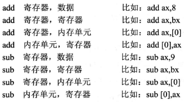
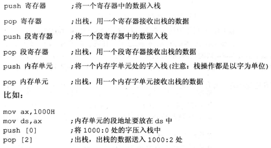
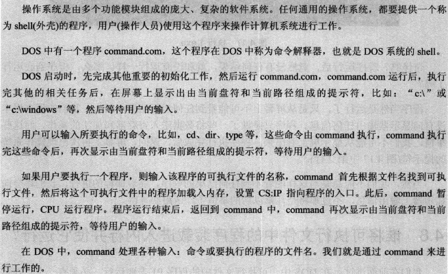

## 机器语言

机器语言是指令的集合。

## 汇编语言

汇编语言的主体是汇编指令。

## 存储器

- 随机存储器RAM，可读可写，必须带电存储，关机后存储的内容丢失
- 只读存储器ROM，只读，关机后其中的内容不丢失
- 装有 BIOS （基本输入输出设备）的ROM
- 接口卡上的RAM：显存
- 外存（storage，磁盘）和内存（memory，主存，高速缓存）

内存地址空间

存储单元：1个字节（byte）

总线

- 地址总线：CPU是通过地址总线来指定存储单元的。32位系统的地址总线是32根，寻址范围是0~232 = 4G
- 数据总线：CPU与内存或其它器件之间的数据传送是通过数据总线来进行的。数据总线的宽度决定了CPU和外界的数据传送速度
- 控制总线：CPU对外部器件的控制是通过控制总线来进行的。

物理地址

CPU通过地址总线送入存储器的，必须是一个内存单元的物理地址。

寻址方式

- 直接寻址
- 寄存器间接寻址
- 寄存器相对寻址
- 基址变址寻址
- 相对基址变址寻址

存储器的层次结构

## 寄存器

CPU是有运算器（算术运算，逻辑运算）、控制器、寄存器等器件组成的，这些器件靠内部总线相连。在CPU中：

- 运算器进行信息处理
- 寄存器进行信息存储
- 控制器控制各种器件进行工作
- 内部总线链接各种器件，在它们之间进行数据的传送

对于一个汇编程序员来说，CPU中的主要部件就是寄存器。寄存器是CPU中程序员可以用指令进行读写的部件。程序员通过改变各种寄存器中的内容来实现对CPU的控制

寄存器的分类

- 通用寄存器：AX、BX、CX、DX
- 段寄存器：CS、DS、SS、ES，存放段地址

字在寄存器中的存储

字节 byte，字 word = 2 字节

标记寄存器

## 代码段

一段地址连续的内存，存放代码

## 汇编指令

指令集，指令系统。指令由操作码和地址码两部分组成，操作码指出操作类型，地址码指出操作数的地址，由一串指令组成程序。

move指令

add指令

loop指令、and指令、or指令、div指令

## 数据段

在编程时，可以根据需要，将一组内存单元定义为一个段。可以将一组长度为N（N <= 64KB）、地址连续、起始地址为16的倍数的内存单元当作专门存储数据的内存空间，从而定义了一个数据段。

## 栈

push、pop指令

## 操作系统的外壳

