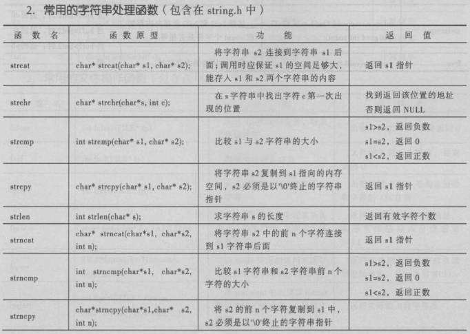
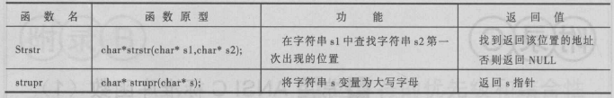
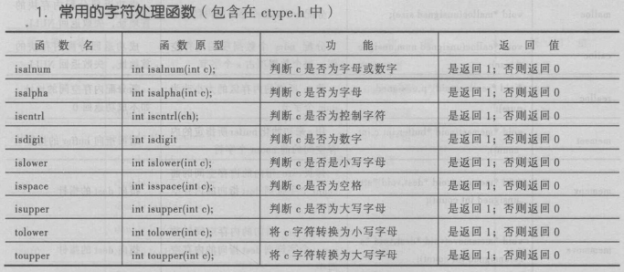

### 字符串常用函数

| 函数声明      | 功能描述                      |
| --------- | ------------------------- |
| strcpy()  | 拷贝字符串                     |
| strlen()  | 求字符串长度                    |
| strcat()  | 字符串连接                     |
| strncat() | 字符串连接，解决缓冲区溢出问题           |
| strcmp()  | 字符串比较                     |
| strncmp() | 比较两个字符串中前n字符是否完全一致        |
| strstr()  | 子串查找                      |
| strchr    | 字符查找（第一次出现的位置）            |
| strrchr   | 查找指定字符在指定的字符串中最后一次出现的位置   |
| strtok    | 字符串分割                     |
| atoi()    | 将一个数字字符串转换为十进制            |
| itoa()    | 将一个整数转换为不同进制下的字符串，VS提供的函数 |
| sprintf() | 字符串格式化命令，把格式化的数据写入某个字符串中  |

### 常用的字符处理函数

| 函数声明      | 功能描述     |
| --------- | -------- |
| isspace() | 是否为空格    |
| isalpha() | 是否是字母    |
| isalnum() | 是否是字母或数字 |
| iscntrl() | 是否是控制字符  |
| isdigit() | 是否是数字    |
| islower   | 是否是小写字母  |
| isupper() | 是否是大写字母  |
| tolower() | 转为小写字母   |
| toupper() | 转为大写字母   |

