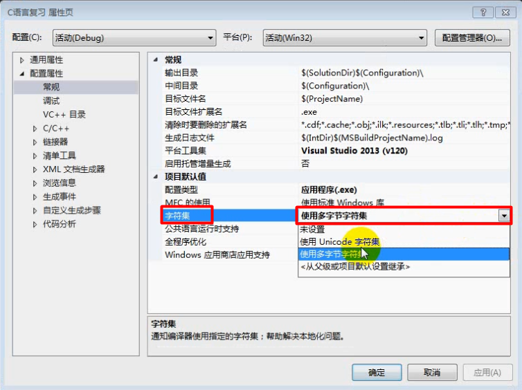
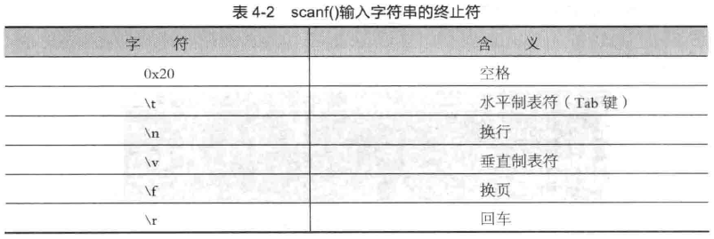
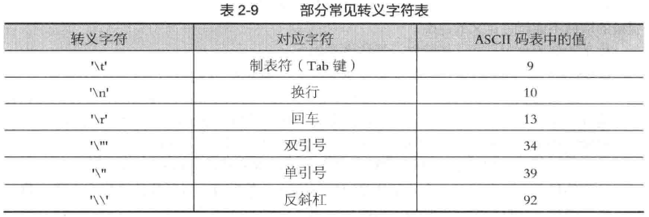
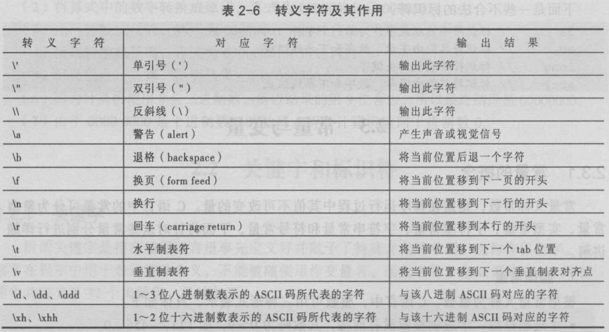

### 宽窄字符



```c
//#define  _CRT_SECURE_NO_WARNINGS
#include<stdio.h>
#include<stdlib.h>
#include<Windows.h>
#include<locale.h>//本地化

void main1()
{
	char str[10] = "我";
	printf("%c%c", str[0], str[1]);
	printf("%s", str);
  
	system("pause");
}

void main2()
{
	MessageBoxA(0, "A我的", "A我的", 0);//指定窄字符
	MessageBoxW(0, L"W我的", L"W我的", 0);//指定宽字符
	MessageBox(0, L"OK我", L"我哦撒",0);
	MessageBox(0, TEXT("OK我1"), TEXT("我哦撒"), 0);//兼容
}

void  main3()
{
	wchar_t ch = L'我';//汉字当作字符
	printf("%d\n", sizeof(ch));
	wchar_t *pch = L"锄禾日当午";
	setlocale(LC_ALL, "zh-CN");//设定中文
	putwchar(ch);
	_putws(pch);
	wprintf(L"%lc", ch);//lc打印宽字符
	wprintf(L"\n%ls", pch);//ls打印宽字符串
	//封装一个宽字符串，增删查改

	system("pause");
}

void main4()
{
	char str[100] = { 0 };
	//scanf("%s", str);//字符串的缓冲区
	printf("%s", str);

	getchar();
	getchar();
}

void   main5()
{
	printf("\n%c", *(stdin->_ptr));//取出缓冲区内容
	printf("\n%d", stdin->_cnt);//缓冲区还有多少个字符
	printf("\n");
   	char  ch=	getchar();
   printf("\n");
   printf("\n%c", *(stdin->_ptr));//取出缓冲区内容
   printf("\n%d", stdin->_cnt);//缓冲区还有多少个字符
   ch = getchar();
   printf("\n");
   printf("\n%c", *(stdin->_ptr));//取出缓冲区内容
   printf("\n%d", stdin->_cnt);//缓冲区还有多少个字符
   printf("\n");
   putchar(ch);
   //stdout stdin不需要刷新，会及时更新，非缓冲
   //file  fflush,刷新缓冲区
   system("pause");

   //char str[100] = "12345"; sizeof(str)=100.strlen(str)=5
}

int  add(int a, int b)
{
	//return 10.0+a+b;//
}

void main6()
{
	//printf("%d", add(10.0, 10));
	//double db = 10.9;
	//printf("%d", (int)db);//printf不会自动
	printf("%d", add(1, 2));
	getchar();
}

void main()
{
	int num = 10;
	printf("%d,%d", num, num++);
	//getchar();
	exit(0);
	system("pause");
}
```

```c
#include <stdio.h>
#include <stdlib.h>
#include <string.h>

//01.字符串(单)的存储形式详解:
//  1.分区块儿存储实质:
//      栈内存:
//          字符数组
//              原本应当以静态初始化(大括号)的方式进行初始化,但是针对于字符串比较特殊,可以直接赋予字符串
//              *静态初始化不用指明强制类型转换
//              *一旦存在数组的前置初始化,就一定存在数组的后置默认初始化!(区分初始化&赋值)
//          字符指针
//              *静态初始化必须指明强制类型转换
//      堆内存:
//          字符指针:
//              *不存在静态初始化
//  2.区分字符串和字符串数组的不同:
//  注:一定要注意字符串本身存储实质(栈内存+堆内存+代码区(常量池|符号表))
int main01(void)
{
  	//字符串的字符数组存储形式,栈内存存储实质,
  	//数组一旦存在前置初始化,就一定存在后置默认初始化!(堆内存数组除外!)
    char str[100] = "calc";
  
  	//字符串的栈内存存储形式,p1作为一个指针变量,是存储于栈内存当中的
    char * p1 = (char []) { 'm', 's', 'p', 'a', 'i', 'n', 't', '\0' };
  
  	//"notepad"这个常量字符串存储于代码区的常量池当中,
  	//p2作为一个指针变量,存储的是代码区常量池地址
    char * p2 = "notepad";
    printf("%s \n", str);
    printf("%s \n", p1);
    *str = 'A';
    printf("%s \n", str);
    *p1 = 'X';
    printf("%s \n", p1);
    *p2 = 'X';
    printf("%s \n", p2);

    system("pause");
}

//02.区分两种求取尺寸的不同特点:
//  sizeof:求取对象的实际占用内存尺寸
//  strlen:求取对象的有效字符个数!
//注:
//  1.区分静态初始化和非静态初始化
//  2.区分字符的解析方式(ASCII:0<->字符:NUT)
int main02(void)
{
    char str[100] = "calc";//对于字符数组而言:静态初始化可以采用字符串本身初始化方式进行替代
    printf("sizeof(str) = %d \n", sizeof(str));//sizeof:用于获取对象实际占用的内存尺寸!
    printf("strlen(str) = %d \n", strlen(str));//strlen:用于获取字符串的有效字符个数!
    for (int i = 0; i < 100; ++i)
    {
        //字符串存储结构(栈内存):这里以数字进行解析,会有0的出现;但是以字符进行解析,会将0解析为NUT(不可见字符)
        printf("%d---%c \n", str[i], str[i]);
    }

    system("pause");
}

//03.字符串的存储注意事项:
//  1.所有字符串的存储实质都是由赋值号的右边进行决定!
//  2.字符串的解析方式:
//      1.整体与局部:
//          整体:需要明确的'\0'结束标识符
//          局部:无需明确的'\0'结束标识符
//      2.局部解析特殊点:
//          数值:0
//          字符:NUT-->不可见字符
//          字符串:NULL
//  3.字符串的初始化特点:
//      栈内存:静态初始化+默认初始化
//          静态初始化+默认初始化:字符数组
//          静态初始化+类型转换:字符指针
//      堆内存:动态初始化
//          既不存在静态初始化也不存在默认初始化
int main03(void)
{
    char str1[5] = { 'a', 'b', 'c', 'd' };//数组的存储实质由右边儿进行决定!
    //字符串的整体解析需要有'\0'[栈内存默认静态初始化'\0'(存在前置初始化的情况),堆内存手动进行初始化'\0']
    printf("%s \n", str1);
    //printf("%s \n", str1[6]);//注意数组的整体管控范围!
    char str2[8] = { 'a', 'b', 'c', 'd', 'e' };//字符串的单个解析无论是存储栈内存还是堆内存,都可以不用明确'\0'
    for (int i = 0; i < 6; ++i)
    {
        putchar(str2[i]);
    }
    printf("%s \n", str2[6]);//注意数字0的两种解析方式(%c:NUT+%s:NULL)
    printf("%s \n", str2[7]);

    system("pause");
}

//04.堆内存当中的字符数组进行字符串的整体解析必须要有明确的字符串结尾字符'\0',否则会出现乱码
//  因为堆内存既不存在静态初始化也不存在默认初始化特点!-->所以切忌'\0'作为字符串结束标志!
int main04(void)
{
    char str[4] = { 'a', 'b', 'c', 'd' };
    printf("%s", str);

    system("pause");
}

//05.printf();函数的整体解析就是以'\0'作为整体解析结束标识!
//  指针变量所存储的指针决定从哪里开始进行解析!
//  字符'\0'决定字符串的解析结束标识!
int main05(void)
{
    char * p = "iloveyou";
    p = p + 5;//指针变量所存储的指针的位置表示从字符串的哪里开始进行解析!
    for (char * pBegin = p; '\0' != *pBegin; ++pBegin)
    {//指针遍历:指针接管方式
        putchar(*pBegin);
    }

    system("pause");
}

//06.切忌通过指针变量所存储的指针所操作的位置
int main06(void)
{
    char * p = "iloveyou";
    //改变指针变量所存储的指针位置相当于改变对字符串的解析起始位置!
    printf("%s", p + 1 + 4);
    //p[3] = 'X';//*(P + 3):属于代码区常量池不允许修改
    //*(p + 4) = 'Y';

    system("pause");
}
```

字符串初始化

```c
#include <stdio.h>
#include <stdlib.h>

//01.只要采用的是字符指针:
//  而且采用的是字符串的初始化方式,
//  那么,字符指针所存储的地址一定位于代码区!
//注:字符指针+字符串-->代码区
int main01(void)
{
    //char str[100] = { "calc" };
    //char str[100] = "calc";//str:字符常量指针
    //char * p = { "calc" };
    char * p = (char[]) { "calc" };
    printf("%p \n", p);

    system("pause");
}

//02.字符指针的静态初始化方式:
//  视编译器的版本决定(低版本+高版本)
//03.字符串集的两种存储方式:
//  字符数组:可以进行修改
//  字符指针:视情况而定
//      可修改:
//          栈内存:
//          堆内存:
//      代码区:
//          不可修改
int main02(void)
{
    //char strs[5][20] = { {"calc"}, {"notepad"}, {"mspaint"}, {"tasklist"}, {"pause"} };//字符串集的二维数组存储方式,将二维数组看做为一个一维数组,该一维数组当中的每个元素都是字符串,
    char strs[5][20] = { "calc", "notepad", "mspaint", "tasklist", "pause" };//由于该字符串存储于栈内存当中,因此可以进行修改
    char * p[5] = { "calc", "notepad", "mspaint", "tasklist", "pause" };//字符指针数组:每个数组元素的类型都是(char *)类型,存储的是代码区常量池的地址
    *strs[0] = 'X';
    for (int i = 0; i < 5; ++i)
    {
        printf("%s, %s \n", strs[i], p[i]);
    }

    system("pause");
}
```

字符串的两种风格区别

```c
#include <stdio.h>
#include <stdlib.h>

//01.区分数组名和字符指针:
//  数组名:绝对是常量指针,绝对不可以进行修改!
//  指针变量:可以修改指针变量的指针指向!
//注:采用字符串的方式操作字符指针实质上就是在
//  操作字符指针所指向的字符串(不区分所在内存空间!)
int main01(void)
{
    //char str[100] = "calc";
    char str[100];
    //str = "calc";//数组名:绝对是常量指针,绝对不可修改!
    char * p = "calc";
    p = "calc";//p作为一个指针变量,可以修改指针变量所存储的指针!
    printf("%d, %d \n", sizeof(p), sizeof("calc"));
    system(p);

    system("pause");
}

//02.scanf();函数的第二个参数实质需要的是
//  指针(也就是具备地址意义的有效数值!)
int main02(void)
{
    char * p = "1";//*p='0';代码区常量池-->不行
    char str[100];//str[3]='X';
    //str = "123";//数组名常量指针不行
    scanf("%p", &p);//修改指针变量所存储的数据
    scanf("%p", p);//修改指针变量所存储的指针所指向的代码区常量池内容!
    scanf("%p", str);//数组名:常量指针-->栈内存

    system("pause");
}

//03.关于字符数组和其他数组的特点:
//  字符数组的静态初始化:可以没有强制类型转换
//  其他数组的静态初始化:必须存在强制类型转换
int main03(void)
{
    char * p = "123";
    char str[100];
    p = str;//变量指针=常量指针(地址数值传递!)
    p = malloc(100);//calloc&alloca-->堆内存
    p = (char[100]) { 0 };//栈内存
    scanf("%s", p);//根据指针进行字符串的初始化,必须先开辟内存空间,该内存空间位于代码区不可以,该指针不初始化也不行
    int * p1 = (int[]) { 1, 2, 3, 4, 5 };

    system("pause");
}

//04.格式字符串既可以采用字符数组也可以采用字符指针!
//  存储形式按照字符串形式
int main04(void)
{
    //char str[100] = "calc";
    char str[100];//字符数组只能在声明的时候采用静态初始化!
    //str[] = "calc";//早期编译器支持!
    //char * p = "%s";
    //printf(str, "123");
    //printf(p, "123");

    system("pause");
}
```

### 字符数组

字符数组是存放字符数据的数组，其中每一个元素存放的值都是单个字符。

```c
char c[] = {'h','e','l','l','o'};
```

### 字符串

字符串是由数字、字母、下划线、空格等各种字符组成的一串字符，由一对英文半角状态下的双引号（""）括起来。字符串在末尾都默认有一个’\0’作为结束符。

在C语言中并没有提供“字符串”这个特定类型，通常用字符数组的形式来存储和处理字符串，这种字符数组必须以空字符’\0’（空字符）结尾。例如字符串"abcde"，在数组中的存放形式如图所示。


```c
char char_aray[] = {"hello"};
char char_aray[6] = {'h','e','l','l','o','\0'};
```

### 获取字符串长度

```c
sizeof("abc");
strlen("abc");
```
strlen()函数与sizeof()运算符在求字符串长度时是有所不同的

- sizeof()是运算符；strlen()是C语言标准库函数，包含在string.h头文件中；
- sizeof()运算符功能是获得所建立的对象的字节大小，计算的是类型所占内存的多少；strlen()函数是获得字符串所占内存的有效字节数；
- sizeof()运算符的参数可以是数组、指针、类型、对象和函数等；strlen()函数的参数必须是字符型指针，即它的参数必须以字符串为目标，且必须是以'\0'结尾；
- sizeof()运算符计算大小在编绎就完成，因此不能用来计算动态分配内存的大小；strlen()函数结果要在运行时才能计算出来；

### 字符串与指针

在C语言中，字符型指针用char*来定义，它不仅可以指向一个字符型数据，还可以指向一个字符串。

字符串由若干个字符组成，字符型变量作为C语言中一种基础的变量类型，与其它变量一样，都会占用存储空间。我们已经知道指针的本质就是地址，既然字符串中的字符占用存储空间，那么显然它也可以通过指针进行操作。

在C语言中，字符串一般存放在字符数组中。对字符串进行操作有两种方式：

（1）使用数组名加下标的方式获取字符串中的某个字符；使用数组名与格式控制符“%s”输出整个字符串。具体示例如下：

```c
char s[]="this is a string.";
printf("%c\n",s[3]);		
printf("%s\n",s);		
```
（2）声明一个字符型的指针，使该指针指向一个字符串常量，通过该指针引用字符串常量。具体示例如下：
```c
char *s="hello world!";
printf("%c\n",s[3]);
printf("%c\n",*(s+1));
printf("%s\n",s);
```

在将指针指向字符串常量时，指针接收的是字符串中第一个字符的地址，而非整个字符串变量。

虽然字符型的指针和字符数组名都能表示一个字符串，但是它们之间存在细微的差别：字符串的末尾会有一个隐式的结束标志‘\0‘，而数组中不会存储这个结束标志，只会显式地存储字符串中的可见字符。

### 字符数组与字符指针

```c
char str[6] = "hello"; // 字符数组自带内存空间，可以直接用来存放字符数据
char* p = "hello";
```


字符串常量存放在数据区中的字符串常量区，不可以修改

```c
char *getStr()
{
	char *tmp = NULL;
	tmp = "abcdefgf";
	return tmp;
}
void main()
{
	char *p = getStr();
	printf("p:%s \n", p);
	*(p+2) = 'r';  //经常出现的错误 保证指针所指向的内存空间 可以被修改
	system("pause");
	return ;
}
```

字符串1级指针的内存模型图

```c
void main61()
{
	char buf[20]= "aaaa"; //定义并且初始化
	char buf2[] = "bbbb";
	char *p1 = "111111";
	char *p2 = malloc(100);
	strcpy(p2, "3333");

	system("pause");
	return ;
}
```


### 字符串的输入输出

| 函数声明      | 功能描述                        |
| --------- | --------------------------- |
| gets()    | 从标准输入设备读入用户输入的字符串           |
| puts()    | 标准设备输出s字符串，在输出完成后自动输出一个'\n' |
| printf()  | 格式化输出一个字符串                  |
| putchar() | 输出一个字符                      |
| scanf()   | 通过%转义的方式可以得到用户通过标准输入设备输入的数据 |
| getchar() | 从标准输入设备读取一个字符               |
| sprintf() | 将一个整数转为一个字符串                |
| atoi()    | 将字符串转换为整数                   |
| itoa()    | 将整数转换为字符串                   |
| atof()    | 把一个小数形式的字符串转化为一个浮点数         |
| atol()    | 将一个字符串转化为long类型             |

### 常用printf()格式字符


| 格式字符 | 含义                     |
| ---- | ---------------------- |
| %p   | 是以地址形式输出（也就是16进制）      |
| %lu  | 输出unsigned long类型      |
| %llu | 输出unsigned long long类型 |

### 常用scanf()输入字符串的终止符



### 字符串作函数参数

字符串copy函数技术推演

```c
void main71()
{
	char a[] = "i am a student";
	char b[64];
	int  i = 0;

	for (i=0; *(a+i) != '\0'; i++)
	{
		*(b+i) = *(a+i);
	}

	//0没有copy到b的buf中.

	b[i] = '\0'; //重要
	printf("a:%s \n", a);
	printf("b:%s \n", b);

	system("pause");
	return ;
}

//字符串copy函数技术推演
//字符串copy函数

//form形参 形参to 的值 不停的在变化....
//不断的修改了from和to的指向
void copy_str21(char *from, char *to)
{
	for (; *from!='\0'; from++, to++)
	{
		 *to = *from;
	}
	*to = '\0';
	return ;
}

//*操作 和++的操作
//++ 优先级高
void copy_str22(char *from, char *to)
{
	for (; *from!='\0';)
	{
		*to++ = *from++;  //  先 *to = *from;  再from++, to++
	}
	*to = '\0';
	return ;
}

void copy_str23(char *from, char *to)
{
	while( (*to = *from) != '\0' )
	{
		from ++;
		to ++;
	}
}

void copy_str24(char *from , char *to)
{
	while ( (*to++ = *from++) != '\0')
	{
		;
	}
}

void copy_str25(char *from , char *to)
{
	//*(0) = 'a';
	while ( (*to++ = *from++) )
	{
		;
	}
}

void copy_str25_err(char *from , char *to)
{
	//*(0) = 'a';
	while ( (*to++ = *from++) )
	{
		;
	}
	printf("from:%s \n", from);
}

//不要轻易改变形参的值, 要引入一个辅助的指针变量. 把形参给接过来.....
int copy_str26_good(char *from , char *to)
{
	//*(0) = 'a';
	char *tmpfrom = from;
	char *tmpto = to;
	if ( from == NULL || to == NULL)
	{
		return -1;
	}

	while ( *tmpto++ = *tmpfrom++ ) ;  //空语句
	printf("from:%s \n", from);
}

int main111()
{
	int ret = 0;
	char *from = "abcd";
	char buf2[100];
	//copy_str21(from, buf2);
	//copy_str22(from,buf2);
	//copy_str23(from, buf2);
	//copy_str24(from, buf2);
	//copy_str25(from ,buf2);
	//printf("buf2:%s \n", buf2);

	{
		//错误案例
		char *myto = NULL;  //要分配内存
		//copy_str25(from,myto );
	}
	{
		char *myto = NULL;  //要分配内存

		ret = copy_str26_good(from, myto);
		if (ret != 0)
		{
			printf("func copy_str26_good() err:%d  ", ret);
			return ret;
		}
	}
	system("pause");
	return ret;
}

int main777()
{
	int ret = 0;
	char *from = "abcd";
	char buf2[100];

	printf("copy_str25_err begin\n");
	copy_str25_err(from, buf2);
	copy_str26_good(from, buf2);
	printf("copy_str25_err end\n");
	return 0;
}
```

### 项目开发字符串模型strstr_while

求字符串中子串出现的次数

```c
void main81()
{
	//strstr(str, str2)
	int ncount = 0;

	//初始化 让p指针达到查找的条件
	char *p = "11abcd111122abcd3333322abcd3333322qqq";  

	do
	{
		p = strstr(p, "abcd");
		if (p != NULL)
		{
			ncount++;
			p = p + strlen("abcd"); //指针达到下次查找的条件
		}
		else
		{
			break;
		}
	} while (*p != '\0');


	printf("ncount:%d \n", ncount);
	system("pause");
	return ;
}

void main88()
{
	int ncount = 0;

	//初始化 让p指针达到查找的条件
	char *p = "2abcd3333322qqqabcd";  
	while ( p = strstr(p, "abcd"))
	{
		ncount ++;
		p = p + strlen("abcd"); //让p指针达到查找的条件
		if (*p == '\0')
		{
			break;
		}
	}
	printf("ncount:%d \n", ncount);

	printf("hello...\n");
	system("pause");
}

int getCount(char *mystr /*in*/, char *sub /*in*/,int *ncount)
{
	int ret = 0;
	int tmpCount = 0;
	//初始化 让p指针达到查找的条件
	char *p = mystr; //不要轻易改变形参的值

	if (mystr==NULL || sub==NULL ||ncount==NULL)
	{
		ret = -1;
		printf("func getCount() err:%d (mystr==NULL || sub==NULL ||ncount==NULL) \n", ret);
		return ret;
	}

	do
	{
		p = strstr(p, sub);
		if (p != NULL)
		{
			tmpCount++;
			p = p + strlen(sub); //指针达到下次查找的条件
		}
		else
		{
			break;
		}
	} while (*p != '\0');

	*ncount = tmpCount; //间接赋值是指针存在的最大意义
	return ret;
}

int main()
{
	int ret = 0;
	char *p = "abcd111122abcd3333322abcd3333322qqq";
	int count = 0;
	char sub[] = "abcd";

	ret = getCount(p,sub,  &count);
	if (ret != 0)
	{
		printf("func getCount() err:%d \n", ret);
		return ret;
	}

	ret = getCount(p,NULL,  &count);
	if (ret != 0)
	{
		printf("func getCount() err:%d \n", ret);
		return ret;
	}
	printf("count:%d \n", count);
	system("pause");
}
```

### 去除字符串两端空格

```c
#define  _CRT_SECURE_NO_WARNINGS
#include <stdio.h>
#include <stdlib.h>
#include <string.h>
//去掉右边空格
void _mover(char* p)
{
	char* temp = p + strlen(p) - 1;
	while (*temp == ' ')
	{
		*temp = '\0';
		temp--;
	}
}
//去掉左边空格
void _movel(const char* p1, char* p2)
{
	char* temp = (char *)p1;
	while (*temp == ' ')
		temp++;
  	//可以调用strcpy()函数，根据代码，读者可以实现strcpy()函数
	while (*temp != '\0')
	{
		*p2 = *temp;
		p2++;
		temp++;
	}
	*p2 = '\0';
}
void main()
{
	char* p = "    chuan zhi bo ke is the best     ";
	char str[100] = { 0 };
	printf("去掉左边空格:\n");
	_movel(p,str);
	printf("p = %s\nstr = %s\n", p, str);
	printf("去掉右边空格:\n");
	_mover(str);
	printf("p = %s\nstr = %s", p, str);
	system("pause");
}
```
去除字符串中的空格

```c
void  trim(char *str)
{
	int i = 0;
	int j = 0;
  	// while (*(str+i) = *(str+j++))
	while (( *(str+i) = *(str+j++))!='\0')
	{
		if (*(str + i)!=' ')
		{
			i++;
		}
	}
	//两个下标轮替，往前移动，链表的算法一样，循环向前挖
}
```

### 转义字符及其作用



