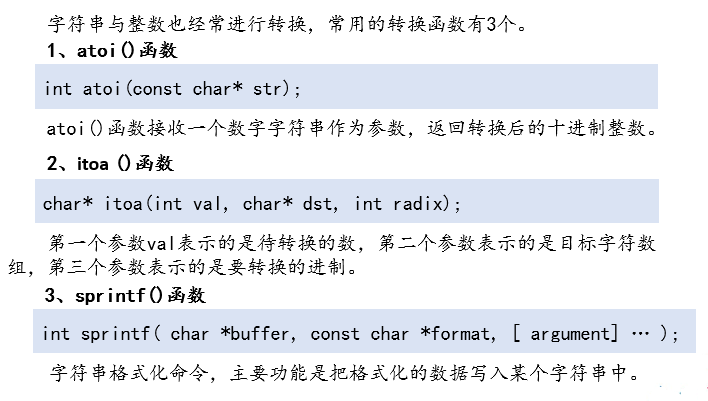

### 字符串常用函数



#### myitoa

```c
#include <stdio.h>  
#include <string.h>  
  
void resver(char *s)//反转字符串  
{  
    int len = strlen(s);  
    //printf("len=%d\n",len);  
    int i = 0;  
    char tmp = 0;  
    for (; i<len/2; i++)  
    {  
        tmp = s[i];  
        s[i] = s[len-1-i];  
        s[len-1-i] = tmp;  
    }  
}  
  
const char *myitoa(int n)  
{  
    static char buf[100];//必须为static,或者是全局变量  
    memset(buf, 0, sizeof(buf));  
    int FlagF = 0;    //1-f, 0-z  
    int i = 0;  
    if (n < 0)  
    {  
        FlagF = 1;  
        n = 0 - n;  
    }  
    while (n)  
    {  
        buf[i++] = n % 10 + '0';  
        n = n / 10;  
    }  
    if (FlagF == 1)  
    {  
        buf[i++] = '-';  
    }  
    buf[i] = '\0';  
    printf("before buf:%s\n", buf);  
    resver(buf);  
    printf("after buf:%s\n", buf);  
    return buf;  
}  
  
int main()  
{  
    printf("%s\n", myitoa(123));  
    printf("%s\n", myitoa(-123));  
    return 0;  
}  
```
#### myatoi

```c
#include <stdio.h>  
int mystrlen(const char *s)  
{  
    int i = 0;  
    while (*s++)  
    {  
        i++;  
    }  
    return i;  
}  
int power10(int n)  
{  
    if (n == 0)  
    {  
        return 1;  
    }  
    int val = 1;  
    int i = 0;  
    for (; i < n; i++)  
    {  
        val = val * 10;  
    }  
    return val;  
}  
int char2i(char c)  
{  
    if ((c >= '0') || (c <= '9'))  
    {  
        return (c - '0');  
    } else  
    {  
        return 0;  
    }  
}  
int myatoi(const char *str)  
{  
    int FlagF = 0; //1-f, 0-z  
    const char *p = str;  
    int i = 0;  
    int value = 0;  
    if (str[0] == '-')  
    {  
        FlagF = 1;
        p = ++str;  
    }  
    int len = mystrlen(p);  
    int lentmp = len;  
    for (; i < len; i++)  
    {  
        value += char2i(p[i]) * power10(lentmp - 1);  
        lentmp--;  
    }  
    if (FlagF == 1)  
    {  
        return (0 - value);  
    } else  
    {  
        return value;  
    }  
}  

int main()  
{  
    const char *s = "-123";  
    printf("%d\n", myatoi(s));  
    return 0;  
}  
```

| 函数声明                | 功能描述                          |
| ------------------- | ----------------------------- |
| strcpy()            | 拷贝字符串                         |
| strlen()            | 求字符串长度                        |
| strcat()            | 字符串连接                         |
| strncat()           | 字符串连接，解决缓冲区溢出问题               |
| strcmp()            | 字符串比较                         |
| strncmp()           | 比较两个字符串中前n字符是否完全一致            |
| strstr()            | 子串查找                          |
| strchr              | 字符查找（第一次出现的位置）                |
| strrchr             | 查找指定字符在指定的字符串中最后一次出现的位置       |
| strtok              | 字符串分割                         |
| atoi()              | 将一个数字字符串转换为十进制                |
| itoa()              | 将一个整数转换为不同进制下的字符串，VS提供的函数     |
| sprintf()           | 字符串格式化命令，把格式化的数据写入某个字符串中      |
| strcspn(str1, str2) | 在字符str1中查找，与str2中任意字符有公共交集的位置 |


### 常用的字符处理函数


| 函数声明      | 功能描述     |
| --------- | -------- |
| isspace() | 是否为空格    |
| isalpha() | 是否是字母    |
| isalnum() | 是否是字母或数字 |
| iscntrl() | 是否是控制字符  |
| isdigit() | 是否是数字    |
| islower   | 是否是小写字母  |
| isupper() | 是否是大写字母  |
| tolower() | 转为小写字母   |
| toupper() | 转为大写字母   |

