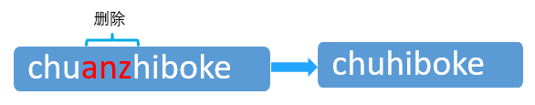
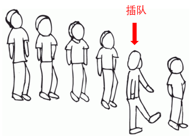
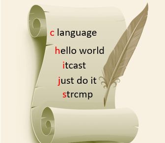
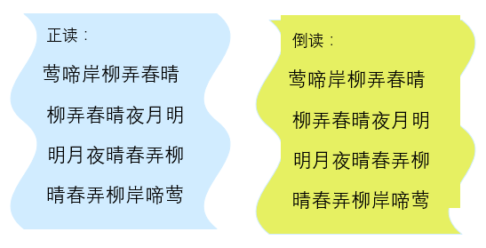

### 案例1

- 自定义一个具有字符串替换功能的函数
- 使用for循环从指定位置遍历字符串“Good morning”
- 用字符串“evening”中的字符逐一替换原串
- 主函数中调用字符串替换函数
- 最后将替换后的字符串输出到屏幕上

```c
#include <stdio.h>
char * MyReplace(char *s1, char *s2, int pos) //自定义的替换函数
{
	int i, j;
	i = 0;
	for (j = pos; s1[j] != '\0'; j++)  //从原字符串指定位置开始替换
	{
		if (s2[i] != '\0')                 //判断有没有遇到结束符
		{
			s1[j] = s2[i];              //将替换内容逐个放到原字符串中
			i++;
		}
		else
			break;
	}
	return s1;
}
int main()
{
	char str1[50] = "Good morning!";
	char str2[50] = "evening";
	int position;                            //定义整型变量储存要替换的位置
	printf("Before the replacement:\n%s\n", str1);  	//替换前的字符串
	printf("Please input the position you want to replace:\n");
	scanf("%d", &position);                  				//输入开始替换的位置
	MyReplace(str1, str2, position);      				//调用替换字符串的函数
	printf("After the replacement:\n%s\n", str1);   	//替换后的字符串
}
```

### 案例2

案例要求通过编程删除字符串中指定位置上指定长度的子串。从键盘输入一个字符串，输入要删除的字符串起始位置及长度，然后输出删除后的字符串。



```c
#include <stdio.h>
char * del(char s[], int pos, int len)    //自定义一个删除字符串的函数
{
	int i;
	for (i = pos + len - 1; s[i] != '\0'; i++, pos++)
		//i的初值为指定删除部分后面的第一个字符
		s[pos - 1] = s[i];
	s[pos - 1] = '\0';
	return s;
}
int main()
{
	char str[50];                              //定义一个字符数组
	int position;
	int length;
	printf("Please input the string:\n");
	gets(str);                                  //输入原字符串
	printf("Please input the position you want to delete:\n");
	scanf("%d", &position);                  //输入要删除的位置
	printf("Please input the length you want to delete:\n");
	scanf("%d", &length);                     //输入要删除的长度
	del(str, position, length);               //调用自定义的删除函数
	printf("After deleting:\n%s\n", str);   //输出新字符串
	return 0;
}
```

### 案例3

要求编程求出一句话中到底有多少单词。首先在屏幕上输入一句话，每个单词之间用一个空格隔开，要求第一个字符和最后一个字符都不能为空格；然后统计出这句话的单词数量，并把结果输出到屏幕上。

```c
#include <stdio.h>
int main()
{
	char str[50];			       //定义保存字符串的数组
	int i, count = 1;			       //count表示单词的个数
	char blank;			  	       //表示空格
	printf("Please input a sentence:\n");
	gets(str);				       //输入字符串
	if (str[0] == '\0')     	       //判断如果字符串为空的情况
		printf("No words!\n");
	else
	{
		for (i = 0; str[i] != '\0'; i++) //循环判断每一个字符
		{
			blank = str[i];	        //得到数组中的字符元素
			if (blank == ' ')		   //判断是不是空格
				count++;		   //如果是则加1
		}
		printf("There are %d words in this sentence.\n", count);
	}
	return 0;
}
```

### 案例4

案例要求输入一个字符串和一个要插入的字符，然后输入要插入的位置，在指定的位置插入指定的字符，并将新字符串输出到屏幕上。



```c
#include <stdio.h>
#include <string.h>
void insert(char s[], char t, int i)    //自定义一个插入函数
{
	char str[100];                         //定义一个字符数组
	strncpy(str, s, i);                   //将s数组中的前i个字符复制到str中
	str[i] = t;                             //把t放到str后面
	str[i + 1] = '\0';                    //用字符串结束符结束str
	strcat(str, (s + i));                //将s的剩余字符串连接到str
	strcpy(s, str);                       //将str复制到s中
}

int main()
{
	char str[100], c;
	int position;
	printf("Please input str:\n");
	gets(str);                             //使用gets()函数获得一个字符串 
	printf("Please input a char:\n");
	scanf("%c", &c);                      //获得一个字符
	printf("Please input position:\n");
	scanf("%d", &position);             //输入字符串插入的位置
	insert(str, c, position);           //调用自定义的插入函数
	puts(str);                             //输出最终得到的字符串
	return 0;
}
```

### 案例5

不使用strcpy()函数，把字符串1中的内容复制到字符串2中，并输出字符串2

```c
#include <stdio.h>
int main()
{
    char s1[50],s2[50];                       //声明字符数组
    int i=0;
    printf("Please input the string1:\n");
    gets(s1);                                   //获取字符串1
    while(s1[i]!='\0')
    {
        s2[i]=s1[i];                            //复制的过程
        i++;
    }
    s2[i]='\0';                                 //字符串结束符
    printf("The string2 is:\n");
    puts(s2);                                   //输出字符串2
    return 0;
}
```

### 案例6

要求对“c language”、“hello world"、“itcast”、“strcmp”和“just do it”这五个字符串按照首字母大小进行由小到大的排序，并将结果输出到屏幕上。



```c
#include <stdio.h>
#include <string.h>

//自定义的对字符串排序的函数
void sort(char *strings[], int n)
{
	char *temp;
	int i, j;
	//选择排序法
	for (i = 0; i < n - 1; i++)
	{
		for (j = i + 1; j < n; j++)
		{	//根据大小交换位置
			if (strcmp(strings[i], strings[j]) > 0)
			{
				temp = strings[i];
				strings[i] = strings[j];
				strings[j] = temp;
			}
		}
	}
}

int main()
{
	int n = 5;
	int i;
	char * strings[] = //用指针数组构造字符串数组
	{
		"c language",
		"hello world",
		"itcast",
		"strcmp",
		"just do it"
	};
	sort(strings, n); //调用排序函数
	for (i = 0; i < n; i++) //依次输出排序后的字符串
		printf("%s\n", strings[i]);
	return 0;
}
```

### 案例7

“你中有我，我中有你”本指两个人亲密无间。如今也有这样两个字符串：字符串1和字符串2，查找在字符串1中是否有字符串2。根据查找结果在屏幕上输出提示信息，案例要求通过编程实现此查找过程。

```c
#include <string.h>
#include <stdio.h>
int main()
{
    char str1[30], str2[30], *p;
    printf("Please input string1:");
    gets(str1);                     //从键盘中输入字符串1
    printf("Please input string2:");
    gets(str2);                     //从键盘中输入字符串2
    p = strstr(str1, str2);        //确定str1中是否包含str2
    if (p)
        printf("There is a str2 in the str1.\n");
    else
        printf("Can't find the str2 in str1.\n");
    return 0;
}
```

### 案例8

加密是一种用来保障信息安全的方式，它希望将可识别的信息转变为无法识别的信息。其应用十分广泛，在日常生活中随处可见。在加密时，通常会用到密码，此案例便是和密码密切相关的，要求设计一种算法，把电文明文加密之后变成密文，利用解密函数才能对密文解密，显示出明文内容。

电文是一个字符串，加密的方法有很多种，此处采用的方法为：将电文中的每个字符加上一个偏移值3。以字符串"itcast"为例，字符'i'对应的密文为'l'，'t'对应的密文为'w'。

```c
#include <stdio.h>
#include <string.h>
int main()
{
	int flag = 1;
	int i;
	int count = 0;
	char MingWen[128] = { '\0' };             //定义一个明文字符数组
	char MiWen[128] = { '\0' };               //定义一个密文字符数组
	while (1)
	{
		if (flag == 1)                          //如果是加密明文
		{
			printf("请输入要加密的明文：");
			scanf("%s", &MingWen);              //获取输入的明文
			count = strlen(MingWen);
			for (i = 0; i < count; i++)         //遍历明文
				MiWen[i] = MingWen[i] + 3;      //设置加密字符
			MiWen[i] = '\0';                    //设置字符串结束标记
			/*输出密文信息*/
			printf("加密后的密文：%s\n", MiWen);
		}
		else if (flag == 2)                      //如果是解密字符串
		{
			printf("请输入要解密的密文：");
			scanf("%s", &MiWen);                //获取输入的密文
			count = strlen(MiWen);
			for (i = 0; i < count; i++)         //遍历密文字符串
				MingWen[i] = MiWen[i] - 3;      //设置解密字符
			MingWen[i] = '\0';                 //设置字符串结束标记
			/*输出明文信息*/
			printf("解密后的明文：%s\n", MingWen);
		}
		else if (flag == 3)              //如果是退出程序
			break;
		else
			printf("命令错误，请重新输入！\n");
		printf("################\n");
		printf("# 1、加密明文  #\n");
		printf("# 2、解密密文  #\n");
		printf("# 3、退出程序  #\n");
		printf("################\n");
		scanf("%d", &flag);                 //获取输入的命令字符
	}
	return 0;
}
```

### 案例9

回文字符串就是正读反读都一样的字符串，比如，“level”和“noon”都是回文字符串。案例要求从键盘中输入字符串，并判断此字符串是否为回文字符串。



实现方法1

```c
#include <stdio.h>
#include <string.h>

//用来判断是否为回文字符串的函数
int fun(int low, int high, char *str, int length)
{
	if (length == 0 || length == 1)                 //当字符串长度为1或0时，返回1
		return 1;
	if (str[low] != str[high])                       //当首尾字符不相同，直接返回0
		return 0;
	return fun(low + 1, high - 1, str, length - 2);  //此处为递归调用
}

int main()
{
	int length = 0;
	char ch, str[50];
	printf("Please input a string:\n");
	while ((ch = getchar()) != '\n') //如果输入'\n'则终止输入
	{
		str[length] = ch;
		length++;                   //字符串长度用length累加
	}

	if (fun(0, length - 1, str, length) == 1)
		printf("YES!\n");
	else
		printf("NO!\n");
	return 0;
}
```

实现方法2

```c
#include <stdio.h>  
#include <string.h>

int fun(char *begin, char *end)
//begin指向字符串开头的字符，end指向字符串末尾的字符
{
	if (begin == NULL || end == NULL || begin > end)
	{
		return 0;
	}
	while (begin < end)
	{
		if (*begin != *end) //判断begin和end指向的字符是否相同
		{
			return 0;
		}
		begin++;
		end--;
	}
	return 1;
}

int main()
{
	int length = 0;
	char ch, str[50];
	char *begin = NULL;
	char *end = NULL;
	printf("Please input a string:\n");
	while ((ch = getchar()) != '\n')
	{
		str[length] = ch;
		length++;
	}

	begin = str;            //begin指向字符串开头的字符
	end = &str[length - 1]; //end指向字符串末尾的字符

	if (fun(begin, end) == 1) //如果返回值是1则输出YES
		printf("YES!\n");
	else                     //否则输出NO
		printf("NO!\n");
	return 0;
}
```
### 案例10

用%20替换字符串中的空格

```c
// length 为字符数组string的总容量
void ReplaceBlank(char string[], int length)
{
    if(string == NULL && length <= 0)
        return;

    // originalLength 为字符串string的实际长度
    int originalLength = 0;
    int numberOfBlank = 0;
    int i = 0;
    while(string[i] != '\0')
    {
        ++ originalLength;

        if(string[i] == ' ')
            ++ numberOfBlank;

        ++ i;
    }

    // newLength 为把空格替换成'%20'之后的长度
    int newLength = originalLength + numberOfBlank * 2;
    if(newLength > length)
        return;

    int indexOfOriginal = originalLength;
    int indexOfNew = newLength;
    while(indexOfOriginal >= 0 && indexOfNew > indexOfOriginal)
    {
        if(string[indexOfOriginal] == ' ')
        {
            string[indexOfNew --] = '0';
            string[indexOfNew --] = '2';
            string[indexOfNew --] = '%';
        }
        else
        {
            string[indexOfNew --] = string[indexOfOriginal];
        }

        -- indexOfOriginal;
    }
}
```