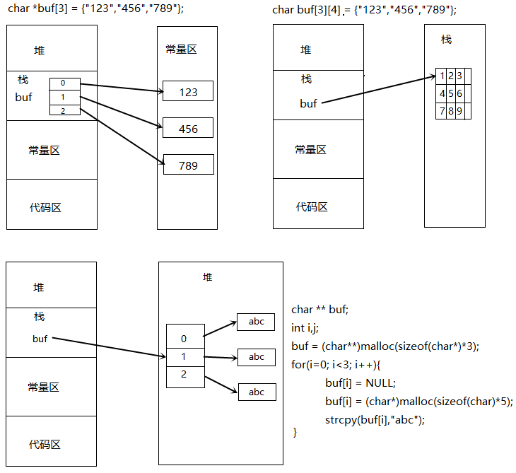
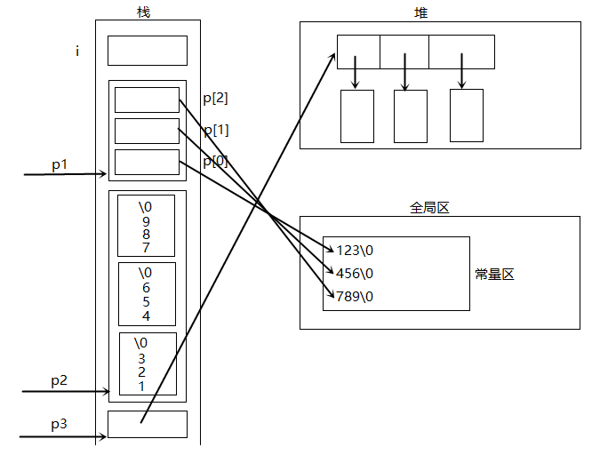

一个C 程序本质上都是由BSS(Block Started by Symbol) 段、Data 段、Text 段三个组成的。

BSS 段：在采用段式内存管理的架构中，BSS 段（Block Started by Symbol）通常是指用来存放程序中
未初始化的全局变量的一块内存区域。BSS 是英文Block Started by Symbol 的简称。BSS 段属于静态内存
分配，即程序一开始就将其清零了。比如，在C 语言之类的程序编译完成之后，已初始化的全局变量保存
在.data 段中，未初始化的全局变量保存在.bss 段中。

数据段：在采用段式内存管理的架构中，数据段（data segment）通常是指用来存放程序中已初始化的
全局变量的一块内存区域。数据段属于静态内存分配。

代码段：在采用段式内存管理的架构中，代码段（text segment）通常是指用来存放程序执行代码的一
块内存区域。这部分区域的大小在程序运行前就已经确定，并且内存区域属于只读。在代码段中，也有可
能包含一些只读的常数变量，例如字符串常量等。

text 和data 段都在可执行文件中（在嵌入式系统里一般是固化在镜像文件中），由系统从可执行文件中加载；而BSS 段不在可执行文件中，由系统初始化。

程序编译后生成的目标文件至少含有这三个段，这三个段的大致结构图如下所示：


其中data 段包含三个部分：heap(堆)、stack(栈)和静态数据区。

堆（heap）：堆是用于存放进程运行中被动态分配的内存段，它的大小并不固定，可动态扩张或缩减。当进程调用malloc 等函数分配内存时，新分配的内存就被动态添加到堆上（堆被扩张）；当利用free 等函数释放内存时，被释放的内存从堆中被剔除（堆被缩减）

栈(stack)：栈又称堆栈， 是用户存放程序临时创建的局部变量，也就是说我们函数括弧“{}”中定义的变量（但不包括static 声明的变量，static 意味着在数据段中存放变量）。除此以外，在函数被调用时，其参数也会被压入发起调用的进程栈中，并且待到调用结束后，函数的返回值也会被存放回栈中。由于栈的先进后出特点，所以栈特别方便用来保存/恢复调用现场。从这个意义上讲，我们可以把堆栈看成一个寄存、交换临时数据的内存区。

stack 段存放函数内部的变量、参数和返回地址，其在函数被调用时自动分配，访问方式就是标准栈中的LIFO 方式。（因为函数的局部变量存放在此，因此其访问方式应该是栈指针加偏移的方式）

- malloc():申请一个内存空间
- realloc():在已有空间基础上在增加部分内存空间
- free():释放空间

## 动态内存的申请与回收

静态内存是由系统分配的,是栈内存中的连续内存空间，其运行效率非常高，且可以被系统自动回收。但是在某些情况下我们需要动态的申请一些内存空间，比如，在创建数组的时候我们不知道数组的长度是多少，那么我们就需要创建动态数组

动态内存是程序员手动申请的在堆内存中开辟的空间不一定是连续,,运行效率略慢,容易产生碎片需要手动回收

## 内存模型

```c
void main()
{
	int i = 0;
	//指针数组
	char *   p1[] = {"123", "456", "789"};
	//二维数组
	char p2[3][4]  = {"123", "456", "789"};
	//手工二维内存
	char **p3 = (char **)malloc(3 * sizeof(char *)); //int array[3];
	for (i=0; i<3; i++)
	{
		p3[i] = (char *)malloc(10*sizeof(char)); //char buf[10]
		sprintf(p3[i], "%d%d%d", i, i, i);
	}
}
```



